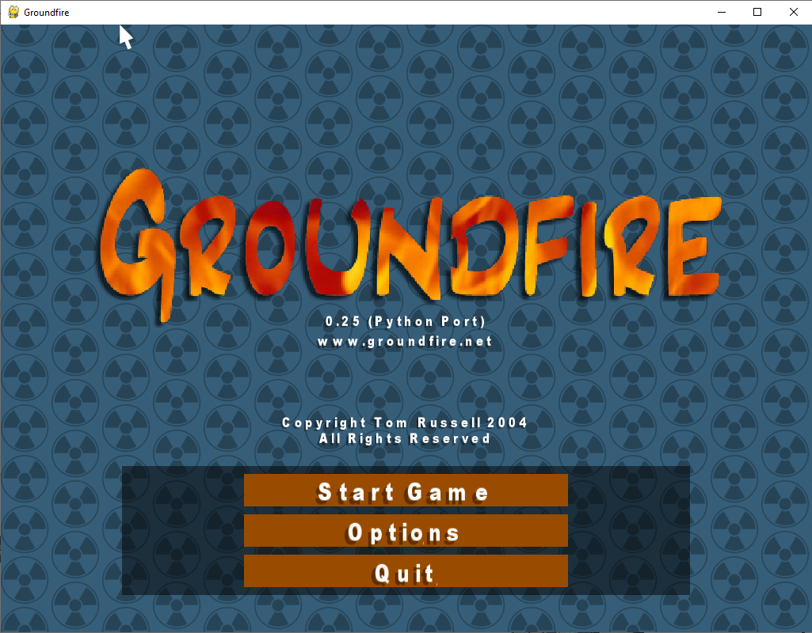

<p align="center">
  <strong>Idioma / Language:</strong>
  <a href="#portugues"><kbd>Português</kbd></a>
  <a href="#english"><kbd>English</kbd></a>
</p>

<p align="center">
  
</p>

<h1 align="center">Groundfire - Port Python</h1>

<p align="center">
  <strong>Idioma / Language:</strong>
  <a href="#portugues"><kbd>Português</kbd></a>
  <a href="#english"><kbd>English</kbd></a>
</p>

<p align="center">
  
  
  
  
  
  
</p>

<a id="portugues"></a>

<p align="center">
  <strong>Idioma / Language:</strong>
  <a href="#portugues"><kbd>Português</kbd></a>
  <a href="#english"><kbd>English</kbd></a>
</p>

## Português

<p align="center"><strong>Port em Python/Pygame do Groundfire v0.25, com foco em preservação, jogabilidade clássica e compatibilidade moderna.</strong></p>

<p align="center"><strong>Versão atual do pacote: 0.25.0</strong></p>

<p align="center"><em>Groundfire é um jogo clássico de artilharia entre tanques, com terreno destrutível, combate balístico, economia entre rodadas, armas especiais, IA adversária e suporte a execução local ou cliente/servidor.</em></p>

---

## Índice

- [O que é este projeto?](#o-que-e-este-projeto)
- [Capturas e arte do jogo](#capturas-e-arte-do-jogo)
- [Requisitos de hardware e software](#requisitos-de-hardware-e-software)
- [Instalação passo a passo](#instalacao-passo-a-passo)
- [Como iniciar o jogo](#como-iniciar-o-jogo)
- [Scripts de inicialização](#scripts-de-inicializacao)
- [Jogabilidade](#jogabilidade)
- [Controles padrão](#controles-padrao)
- [Configuração do jogo](#configuracao-do-jogo)
- [Modo local e modo online](#modo-local-e-modo-online)
- [Estrutura do repositório](#estrutura-do-repositorio)
- [Arquitetura de manutenção](#arquitetura-de-manutencao)
- [Documentação técnica incorporada](#documentacao-tecnica-incorporada)
- [Testes automatizados e QA](#testes-automatizados-e-qa)
- [Solução de problemas frequentes](#solucao-de-problemas-frequentes)
- [Créditos e preservação histórica](#creditos-e-preservacao-historica)
- [Licença](#licenca)

---

<a id="o-que-e-este-projeto"></a>

## O que é este projeto?

O **Groundfire - Port Python** é uma adaptação em Python/Pygame do jogo **Groundfire v0.25**, criado originalmente por **Tom Russell**. A proposta deste repositório é manter o espírito do jogo original vivo em uma base mais fácil de executar, estudar, testar e evoluir em ambientes Python atuais.

O jogo coloca tanques em um terreno deformável. Cada jogador controla ângulo, potência, movimento, escudo, combustível de salto e escolha de armas. Entre as rodadas, a economia permite comprar munição e melhorias.

### Objetivo

Oferecer uma versão moderna e verificável do Groundfire para:

- jogar partidas locais com apresentação clássica;
- preservar comportamento, ritmo e sensação do jogo original;
- portar sistemas gradualmente para Python sem transformar o projeto em um remake solto;
- manter cobertura automatizada para mecânicas, renderização, rede, terreno e fidelidade;
- facilitar estudo de arquitetura de jogos 2D com Pygame.

### Principais capacidades

- terreno destrutível com formação de crateras;
- combate de artilharia por ângulo, potência, gravidade e dano em área;
- tanques com movimentação, jump jets, escudo e ciclo de vida por rodada;
- armas como Shell, Missile, MIRV, Nuke e Machine Gun;
- oponentes controlados por IA;
- loja entre rodadas para compra de armas e upgrades;
- entrada local clássica e runtime moderno;
- servidor headless para experimentos de rede;
- testes de regressão e fidelidade para manter o port sob controle.

### Escopo atual

> [!IMPORTANT]
> Este projeto ainda está em desenvolvimento. O objetivo não é apenas fazer um jogo parecido rodar em Python; o objetivo é preservar a experiência do Groundfire com o máximo de fidelidade prática, enquanto a base é reorganizada para manutenção moderna.

| Área | Estado | Observação |
| --- | --- | --- |
| Jogo local | ativo | fluxo principal jogável pelo menu clássico |
| Runtime canônico | ativo | entrada moderna usada pelos wrappers `groundfire` |
| IA local | ativa | jogadores controlados pelo computador estão implementados |
| Terreno destrutível | ativo | crateras, queda de terreno e efeitos possuem testes dedicados |
| Loja entre rodadas | ativa | compra de armas e jump jets |
| Rede | em evolução | cliente, servidor headless, descoberta LAN e transporte seguro estão na base |
| Fidelidade histórica | em evolução | testes e registros ajudam a comparar comportamento |

---

<a id="capturas-e-arte-do-jogo"></a>

## Capturas e arte do jogo

As imagens abaixo foram geradas a partir de assets do próprio projeto e ajudam a visualizar a atmosfera do port.

| Visão | Imagem |
| --- | --- |
| Arte de abertura do Groundfire |  |
| Showcase visual de jogo e loja |  |

---

<a id="requisitos-de-hardware-e-software"></a>

## Requisitos de hardware e software

### Requisitos de software

| Item | Requisito |
| --- | --- |
| Python | 3.10, 3.11, 3.12 ou 3.13 |
| Interface gráfica | ambiente com suporte a janela Pygame |
| Dependências principais | `pygame`, `msgpack`, `mpgameserver` |
| Sistema operacional | Windows, Linux, macOS ou WSL com suporte gráfico |
| Licença | MIT |

### Dependências do ambiente atual

As dependências estão centralizadas em [`requirements.txt`](requirements.txt) e também declaradas em [`pyproject.toml`](pyproject.toml):

| Pacote | Versão | Uso |
| --- | --- | --- |
| `pygame` | `2.6.1` | janela, entrada, renderização 2D e áudio |
| `msgpack` | `1.1.2` | serialização de mensagens |
| `mpgameserver` | `0.2.4` | infraestrutura do modo cliente/servidor |
| `ruff` | `0.15.7` | lint e organização de imports em desenvolvimento |
| `mypy` | `1.19.1` | checagem estática opcional em desenvolvimento |

### Requisitos práticos de hardware

| Recurso | Mínimo prático | Recomendado | Observações |
| --- | --- | --- | --- |
| CPU | 2 núcleos | 4 núcleos ou mais | Pygame e simulação 2D rodam bem em máquinas comuns |
| RAM | 2 GB | 4 GB ou mais | suficiente para jogo local e testes |
| Armazenamento | 500 MB livres | 1 GB livre | inclui ambiente virtual, dependências e assets |
| GPU | não obrigatória | aceleração gráfica básica | depende do suporte local do SDL/Pygame |
| Tela | 1024 x 768 | 1280 x 720 ou superior | o default atual usa 1024 x 768 |

> [!NOTE]
> Em Linux, pode ser necessário instalar bibliotecas do sistema usadas pelo SDL/Pygame, especialmente em ambientes mínimos ou servidores com interface gráfica reduzida.

---

<a id="instalacao-passo-a-passo"></a>

## Instalação passo a passo

> [!NOTE]
> A forma mais simples de usar o projeto é executar um dos scripts `run_game.*`. Eles procuram uma versão compatível do Python, criam ou reparam `.venv`, atualizam o `pip`, instalam dependências e iniciam o jogo.

### 1. Clonar o repositório

```bash
git clone https://github.com/p19091985/port-groundfire-for-python.git
cd port-groundfire-for-python
```

### 2. Instalação automática recomendada

**Windows CMD**

```bat
run_game.bat
```

**Windows PowerShell**

```powershell
.\run_game.ps1
```

**Linux / macOS / WSL**

```bash
./run_game.sh
```

O fluxo automático executa, em ordem:

1. procura Python 3.10 a 3.13;
2. cria `.venv` quando necessário;
3. recria `.venv` se o Python for incompatível;
4. atualiza `pip`;
5. instala [`requirements.txt`](requirements.txt);
6. inicia o jogo pelo ponto de entrada local.

### 3. Instalação manual

#### 3.1 Criar ambiente virtual

```bash
python -m venv .venv
```

#### 3.2 Ativar o ambiente virtual

**Linux / macOS / WSL**

```bash
source .venv/bin/activate
```

**Windows CMD**

```bat
.venv\Scripts\activate.bat
```

**Windows PowerShell**

```powershell
.venv\Scripts\Activate.ps1
```

#### 3.3 Instalar o pacote

```bash
python -m pip install --upgrade pip
pip install -e .
```

#### 3.4 Iniciar após instalação manual

```bash
groundfire
```

Alternativas equivalentes:

```bash
python -m groundfire.client
python src/main.py
```

---

<a id="como-iniciar-o-jogo"></a>

## Como iniciar o jogo

### Início local recomendado

```bash
groundfire
```

### Forçar o fluxo clássico local

```bash
python -m groundfire.client --classic-local
```

### Forçar o runtime canônico local

```bash
python -m groundfire.client --canonical-local
```

### Abrir jogo local com nome de jogador e IAs

```bash
python -m groundfire.client --player-name Jogador --ai-players 2
```

### Executar apenas uma tentativa/frame para smoke test

```bash
python -m groundfire.client --once
```

---

<a id="scripts-de-inicializacao"></a>

## Scripts de inicialização

| Arquivo | Função | Quando usar |
| --- | --- | --- |
| [`run_game.sh`](run_game.sh) | prepara `.venv`, instala dependências e inicia o jogo em Linux/macOS/WSL | uso diário em sistemas Unix |
| [`run_game.bat`](run_game.bat) | prepara `.venv`, instala dependências e inicia o jogo no Windows CMD | uso diário pelo Prompt de Comando |
| [`run_game.ps1`](run_game.ps1) | prepara `.venv`, instala dependências e inicia o jogo no PowerShell | uso diário pelo PowerShell |
| [`scripts/run_quality_checks.py`](scripts/run_quality_checks.py) | executa verificações de compilação, testes, lint e tipagem quando disponíveis | validação antes de publicar mudanças |
| [`scripts/profile_round_simulation.py`](scripts/profile_round_simulation.py) | mede desempenho de simulação de rodada | diagnóstico de performance |
| [`scripts/generate_readme_art.py`](scripts/generate_readme_art.py) | gera arte usada no README | manutenção das imagens de documentação |
| [`scripts/convert_legacy_tga_assets.py`](scripts/convert_legacy_tga_assets.py) | auxilia conversão de assets históricos | manutenção de assets |

Resumo prático: use `run_game.*` para jogar, `scripts/run_quality_checks.py` para validar o projeto e os demais scripts quando estiver mantendo arte, assets ou desempenho.

---

<a id="jogabilidade"></a>

## Jogabilidade

### Mecânicas centrais

- mira de artilharia com ângulo e potência;
- gravidade influenciando trajetória dos projéteis;
- terreno destrutível com crateras e desabamentos;
- tanques com movimento horizontal e jump jets;
- dano em área, escudo, fumaça, rastro e efeitos de explosão;
- pontuação e economia entre rodadas;
- compra de armas e upgrades na loja;
- adversários controlados por IA.

### Armas disponíveis no port

| Arma | Papel |
| --- | --- |
| `Shell` | projétil explosivo padrão |
| `Machine Gun` | rajada rápida com dano baixo por disparo |
| `MIRV` | projétil que se divide em subprojéteis |
| `Missile` | projétil guiado |
| `Nuke` | explosão de grande raio e alto impacto |

### Fluxo recomendado de partida

1. iniciar pelo menu local clássico;
2. configurar jogadores humanos e IAs;
3. ajustar ângulo e potência;
4. disparar observando vento, terreno e distância;
5. usar movimento, jump jets e escudo para sobreviver;
6. comprar armas e upgrades entre rodadas;
7. repetir até definir o vencedor.

---

<a id="controles-padrao"></a>

## Controles padrão

Os controles podem ser ajustados em [`conf/controls.ini`](conf/controls.ini) ou pelos menus internos de controle.

| Ação | Tecla padrão do Jogador 1 |
| --- | --- |
| Atirar | `Space` |
| Aumentar ângulo do canhão | `W` |
| Diminuir ângulo do canhão | `S` |
| Girar canhão para a esquerda | `A` |
| Girar canhão para a direita | `D` |
| Mover tanque para a esquerda | `J` |
| Mover tanque para a direita | `L` |
| Jump jets | `I` |
| Escudo | `K` |
| Próxima arma | `O` |
| Arma anterior | `U` |

### Suporte a controles

O arquivo [`conf/controls.ini`](conf/controls.ini) também contém layouts de joystick para até oito jogadores. Os códigos seguem o mapeamento usado pelo Pygame/SDL no ambiente local.

---

<a id="configuracao-do-jogo"></a>

## Configuração do jogo

As configurações principais ficam em [`conf/options.ini`](conf/options.ini).

| Seção | O que controla |
| --- | --- |
| `[Graphics]` | largura, altura, profundidade de cor, FPS visível e tela cheia |
| `[Effects]` | fade de explosão, whiteout e rastro |
| `[Terrain]` | quantidade de fatias, largura e queda do terreno |
| `[Quake]` | duração, intervalo, amplitude e frequência de terremotos |
| `[Shell]`, `[Nuke]`, `[Missile]`, `[Mirv]`, `[MachineGun]` | dano, cooldown, raio, velocidade e parâmetros específicos de armas |
| `[Tank]` | velocidade, tamanho, ângulo, potência, gravidade, boost e consumo de combustível |
| `[Price]` | preços de armas e upgrades |
| `[Colours]` | cores dos tanques |
| `[Interface]` | modo do menu local, como `classic` ou runtime canônico |

> [!TIP]
> Para experimentar balanceamento, altere os valores em `conf/options.ini` e reinicie o jogo. Mantenha mudanças de gameplay acompanhadas por testes quando elas forem parte de uma contribuição.

---

<a id="modo-local-e-modo-online"></a>

## Modo local e modo online

### Jogo local

O modo local é o caminho principal de uso atual. Ele pode ser iniciado pelo comando:

```bash
groundfire
```

O valor `LocalMenuMode=classic` em [`conf/options.ini`](conf/options.ini) faz o jogo abrir com a apresentação clássica por padrão.

### Servidor headless

O projeto também inclui um servidor autoritativo sem interface gráfica:

```bash
groundfire-server --server-name "Groundfire Server"
```

Ou, sem console script:

```bash
python -m groundfire.server --host 0.0.0.0 --port 45000
```

### Cliente conectado

Para conectar em um servidor:

```bash
groundfire --connect 127.0.0.1:45000 --player-name Jogador
```

Se a porta for omitida, o cliente usa a porta padrão definida no protocolo de rede.

### Chaves do transporte seguro

O servidor usa caminhos padrão em `conf/network/` para chave privada e chave pública. Quando necessário, esses arquivos são criados pelo fluxo do servidor.

> [!IMPORTANT]
> O modo de rede existe para evolução e testes. Para jogar sem atrito, prefira o modo local até que a experiência online esteja completamente estabilizada.

---

<a id="estrutura-do-repositorio"></a>

## Estrutura do repositório

```text
port-groundfire-for-python/
|-- conf/                 opções do jogo, controles e mapeamento de assets
|-- data/                 imagens, sons, fonte e sprites do jogo
|-- media/                imagens e arte usada pelo README
|   `-- img/              capturas e imagens geradas
|-- groundfire/           wrappers públicos para execução como pacote
|-- scripts/              ferramentas de QA, arte, assets e perfilamento
|-- src/                  código principal do port Python
|-- src/groundfire/       runtime canônico organizado por domínio
|-- tests/                testes automatizados
|-- run_game.bat          inicializador Windows CMD
|-- run_game.ps1          inicializador Windows PowerShell
|-- run_game.sh           inicializador Linux/macOS/WSL
|-- pyproject.toml        metadados, scripts e configuração de ferramentas
`-- requirements.txt      dependências de runtime e desenvolvimento
```

### Conteúdo técnico incorporado

| Conteúdo | Onde está agora |
| --- | --- |
| [`cpp_output.txt`](cpp_output.txt) | registro de execução usado como material de comparação histórica |
| Análise arquitetural 2026 | seção [Documentação técnica incorporada](#analise-arquitetural-2026) |
| Roadmap de refatoração 2026 | seção [Documentação técnica incorporada](#roadmap-de-refatoracao-2026) |
| Modo online seguro | seção [Documentação técnica incorporada](#modo-online-seguro) |
| Playtest do controle clássico | seção [Documentação técnica incorporada](#playtest-do-controle-classico) |

---

<a id="arquitetura-de-manutencao"></a>

## Arquitetura de manutenção

O projeto mantém duas camadas importantes:

- uma camada de compatibilidade histórica em [`src/`](src), preservando nomes e organização próximos do port inicial;
- uma camada canônica em [`src/groundfire/`](src/groundfire), separando aplicação, simulação, rede, renderização, entrada e gameplay.

### Mapa de módulos principais

| Caminho | Responsabilidade |
| --- | --- |
| [`src/main.py`](src/main.py) | entrada local de compatibilidade |
| [`groundfire/client.py`](groundfire/client.py) | wrapper público do cliente |
| [`groundfire/server.py`](groundfire/server.py) | wrapper público do servidor |
| [`src/groundfire/client.py`](src/groundfire/client.py) | parser e orquestração do cliente canônico |
| [`src/groundfire/server.py`](src/groundfire/server.py) | parser e orquestração do servidor headless |
| [`src/groundfire/app/`](src/groundfire/app) | fluxos de aplicação local, cliente, servidor e frontend |
| [`src/groundfire/sim/`](src/groundfire/sim) | mundo, terreno, registro e partida simulada |
| [`src/groundfire/gameplay/`](src/groundfire/gameplay) | controlador de partida e constantes de gameplay |
| [`src/groundfire/network/`](src/groundfire/network) | mensagens, codec, LAN, estado do cliente e backend |
| [`src/groundfire/render/`](src/groundfire/render) | terreno, cena, HUD, primitivas e visual de entidades |
| [`src/groundfire/input/`](src/groundfire/input) | comandos e controles |
| [`src/game.py`](src/game.py) | loop e transições do fluxo clássico |
| [`src/tank.py`](src/tank.py) | movimentação, dano, disparo e ciclo de vida do tanque |
| [`src/aiplayer.py`](src/aiplayer.py) | mira, escolha de alvo e comportamento da IA |
| [`src/weapons_impl.py`](src/weapons_impl.py) | implementações concretas de armas |
| [`src/shopmenu.py`](src/shopmenu.py) | compra entre rodadas |

### Princípios de manutenção

- preservar nomes e comportamentos quando isso ajuda a comparar com o jogo original;
- mover regras compartilhadas para a camada `src/groundfire/` quando houver ganho claro;
- manter renderização, simulação, entrada e rede separadas;
- acompanhar mudanças de comportamento com testes automatizados;
- evitar refatorações grandes sem uma razão verificável.

---

<a id="documentacao-tecnica-incorporada"></a>

## Documentação técnica incorporada

> [!NOTE]
> Esta seção consolida o conteúdo dos arquivos Markdown técnicos que antes ficavam separados. Os arquivos originais foram incorporados aqui para manter o histórico técnico em um único documento.

<a id="analise-arquitetural-2026"></a>

### Groundfire Python Port: Análise Arquitetural 2026

> Status desta entrega
>
> Esta etapa contem analise, planejamento e preparacao.
> Nenhuma refatoracao estrutural do runtime principal foi iniciada.
> O unico artefato executavel novo desta etapa e um utilitario isolado de conversao de assets `.tga`.

#### Escopo e metodo

Base analisada:

- `src/`: 39 modulos Python, 6591 linhas.
- `tests/`: 5 arquivos Python, 1164 linhas.
- `data/`: 22 assets, sendo 12 `.tga` e 10 `.wav`.
- `scripts/`: 1 script auxiliar que tambem consome `.tga`.
- teste executado: `python -m unittest discover -s tests -p "test_*.py"` -> 22 testes OK.
- referencia C++ consultada via `git show` em `groundfire-0.25/src/game.cc`, `tank.cc`, `interface.cc` e `font.cc`.

Observacao: a arvore `groundfire-0.25/` esta removida no worktree atual. Para nao interferir nas mudancas locais do usuario, a comparacao com o legado foi feita apenas por leitura do `HEAD`, sem restaurar nada no disco.

#### 1. Visao geral do estado atual

##### Estrutura do projeto

```text
port-groundfire-for-python/
|- conf/        configuracao de graficos e controles
|- data/        texturas TGA e sons WAV
|- media/img/   imagens do README
|- scripts/     tooling auxiliar
|- src/         port Python/Pygame
|- tests/       testes de fidelidade e fluxo
|- cpp_output.txt
|- requirements.txt
`- run_game.(bat|ps1|sh)
```

##### Dependencias

Dependencia declarada:

- `pygame==2.6.1`

Ausencias relevantes para 2026:

- sem `pyproject.toml`;
- sem CI visivel;
- sem linter/formatter/type-check;
- sem empacotamento moderno;
- sem infraestrutura de rede;
- sem manifest de assets;
- sem ferramentas de profiling ou replay.

##### Ponto de entrada e fluxo principal

Ponto de entrada:

- `src/main.py`

Fluxo atual:

1. script de launch cria `.venv`, instala dependencias e executa `src/main.py`;
2. `src/main.py` ajusta `sys.path`, instancia `Game()` e chama `loop_once()` em loop;
3. `Game.__init__()` carrega configuracao, interface, texturas, controles, fonte, som, um `Landscape` inicial e `MainMenu`;
4. `Game.loop_once()` calcula `dt` por `time.time()`, atualiza menus ou round e desenha na mesma passagem.

##### Modulos principais

- `game.py`: bootstrap, maquina de estados, rounds, recursos e lista de entidades.
- `interface.py`: janela, input, texturas e conversao de coordenadas.
- `landscape.py`: geracao de terreno, explosoes e colisao.
- `tank.py`: movimento, aim, armas, dano e HUD.
- `weapon.py` + `weapons_impl.py`: armas e cooldown/ammo.
- `player.py`, `humanplayer.py`, `aiplayer.py`: ownership do tanque e origem do input.
- `shell.py`, `missile.py`, `mirv.py`, `machinegunround.py`: balistica.
- `menu.py` e menus derivados: UI e fluxo de partida.
- `font.py`: atlas de fonte via textura.
- `sounds.py` e `soundentity.py`: audio.

##### Componentes herdados do design em C++

O port preserva fortemente a estrutura original:

- `Game` replica `cGame` como orquestrador central.
- `Tank` replica `cTank` com regras, armas, input e HUD.
- `Landscape` preserva o modelo em slices/chunks.
- o fluxo de menus segue objetos com `update()`/`draw()`.
- a lista unica de entidades reproduz `list<cEntity *>`.
- texturas e sons sao acessados por IDs inteiros.
- varios comentarios e decisoes de API foram transpostos quase literalmente do C++.

##### Padroes inadequados para um jogo Python moderno

- codigo flat em `src/`, sem pacotes por dominio;
- forte acoplamento a `Game`;
- simulacao, render, input e UI misturados;
- assets hardcoded por caminho e ID magico;
- ausencia de tick fixo;
- ausencia de serializacao de estado;
- ausencia de fronteira entre cliente visual e servidor futuro.

#### 2. Diagnostico tecnico

##### Achados principais

1. `Game` e um god object.
   Ele centraliza bootstrap, recursos, estados, menus, landscape, players, entidades e explosoes.

2. A simulacao esta acoplada ao relogio real.
   `Game.loop_once()` usa `time.time()`, e os projetis usam `launch_time` absoluto + `game.get_time()`.

3. O port divergiu de partes importantes do C++.
   No C++, `cGame` chama `readSettings()` para armas, quake, trail, blast, mirv e missile; no Python esses metodos existem, mas nao sao chamados.

4. Ha configuracao parcialmente morta.
   `Graphics.ShowFPS` existe no INI e no C++, mas nao e respeitado no port atual.

5. O pipeline de render esta espalhado.
   Varios modulos chamam `pygame.draw.*`, `pygame.transform.*`, `pygame.Surface(...)` e acessam `._window` diretamente.

6. Tanques sao desenhados duas vezes.
   Eles estao em `self._players[i].get_tank()` e tambem em `self._entity_list`; `Game._draw_round()` desenha ambos.

7. Ha bugs fora da cobertura atual.
   `ShopMenu` e `WinnerMenu` chamam `get_command(...)` sem o segundo parametro exigido por `HumanPlayer`.

8. O bootstrap atual cria `Landscape` no construtor.
   No C++ o landscape so nasce ao iniciar o round; no port atual ele existe mesmo quando o jogo esta parado em menu.

9. `Font` recarrega `fonts.tga`.
   `Game` ja registra a textura 3 e `Font` carrega o mesmo arquivo outra vez, duplicando I/O e responsabilidades.

10. Ha risco visual em `ROUND_STARTING`.
    `loop_once()` chama `start_draw()` no inicio do frame e chama `start_draw()` outra vez antes do texto de "Get Ready", o que pode limpar a cena recem-desenhada.

##### Code smells

- classes grandes: `Game`, `Tank`, `Landscape`, `Font`, `PlayerMenu`, `ShopMenu`;
- comentarios de raciocinio incompleto e placeholders no codigo de producao;
- uso extensivo de atributos internos de outros objetos;
- destruidores `__del__` para recursos criticos (`Sound`, `Interface`, `Game`, `Quake`);
- parsers custom de configuracao e controles;
- `sys.path.append(...)` no entrypoint.

##### Acoplamento excessivo

Os acoplamentos mais perigosos sao:

- `Game` <-> todos os subsistemas;
- gameplay <-> renderer;
- input <-> simulacao;
- menus <-> dados internos de jogador, tanque, round e economia.

##### Duplicacao de codigo

Duplicacoes relevantes:

- `_draw_transparent_poly()` repetido em quase todos os menus e em `tank.py`;
- fluxo de projetil repetido entre shell, MIRV, missile e machine gun;
- tratamento visual de scale/rotate/blit repetido em efeitos, botoes e score menu;
- mapeamento de assets espalhado entre `Game`, `Font`, `Weapon`, `Menu` e scripts.

##### Responsabilidades mal distribuidas

- `Tank.draw()` desenha tanque e HUD.
- `Game.explosion()` mistura terreno, efeito visual, audio e dano.
- `ShopMenu` aplica compras diretamente.
- `Player.end_round()` calcula score e dinheiro sem um servico de regras.
- `Font` tambem age como loader de asset.

##### Riscos arquiteturais

- refatorar `Game`, `Tank` ou `Landscape` afeta boa parte do projeto;
- nao existe estado de mundo serializavel;
- nao existem IDs estaveis de entidades;
- nao existe event bus;
- o uso de tempo real inviabiliza rede robusta e replays confiaveis;
- o subsistema de recursos nao separa source asset, runtime asset e cache.

##### Limitacoes para multiplayer

Bloqueios atuais:

- sem tick fixo;
- sem command buffer;
- sem protocolo, sessao ou discovery;
- sem cliente/servidor separado;
- sem serializacao de estado;
- sem snapshots ou deltas;
- sem modo headless.

##### Limitacoes do pipeline grafico e de assets

O projeto usa 12 `.tga` em runtime e 2 deles tambem em script auxiliar de docs. O carregamento atual faz `pygame.image.load(...)` por caminho hardcoded e expoe superficies cruas por ID inteiro. Isso e suficiente para um port preservacionista, mas nao para um pipeline moderno reproduzivel.

Todos os `.tga` atuais sao TGA RLE (`image_type=10`) em 24 ou 32 bpp. O formato e historico e valido, mas pouco atraente para 2026 em Pygame por:

- toolchain mais estreita;
- menor ergonomia em conversores e validadores;
- potencial confusao de orientacao/origin;
- nenhuma vantagem operacional significativa frente a PNG nesta base.

#### 3. Avaliacao de prontidao para 2026

##### O que falta

- pacote modular por dominio;
- simulacao pura e deterministica;
- asset pipeline reproduzivel;
- layer de rede;
- modo headless;
- automacao de qualidade;
- observabilidade minima;
- infraestrutura de replays/profiling.

##### Praticas esperadas em 2026

- nucleo de simulacao separado de renderer;
- tick fixo com render interpolado;
- assets com manifest e validacao;
- cliente/servidor com protocolo versionado;
- testes em unidade, integracao, rede e regressao visual;
- build tooling e CI padronizados.

##### O que esta obsoleto

- `.tga` como formato primario de runtime;
- IDs inteiros de textura/som;
- relogio de parede como base da simulacao;
- render imediatista espalhado;
- acesso a `._window` e atributos internos como API informal.

##### O que deve ser refeito

- loop principal;
- subsistema de assets;
- camada de render;
- camada de input;
- fluxo de menus/UI;
- organizacao do codigo;
- serializacao de estado;
- arquitetura de rede.

##### O que pode ser aproveitado

- formulas balisticas;
- modelo de terreno destrutivel;
- regras de dano, score e economia;
- testes atuais como contrato de comportamento;
- estrutura conceitual de armas, tanques e rounds;
- referencia historica com o C++.

#### 4. Proposta de nova arquitetura

##### Organizacao modular sugerida

```text
src/groundfire/
|- app/
|- core/
|- sim/
|- gameplay/
|- render/
|- assets/
|- input/
|- audio/
|- ui/
|- network/
`- tools/
```

##### Separacao de responsabilidades

- `core`: config, IDs, clock, logging e eventos.
- `sim`: mundo, entidades, terreno, armas e sistemas.
- `gameplay`: round flow, scoring, economia e turn ownership.
- `render`: adaptador visual do estado.
- `assets`: manifest, loader, cache e validacao.
- `input`: mapeamento de hardware para comandos.
- `audio`: sound bank e consumo de eventos.
- `ui`: menus, HUD e presenters.
- `network`: discovery, sessao, protocolo, client, server e replication.

##### Modelo de execucao recomendado

- simulacao em tick fixo, por exemplo 60 Hz;
- render independente com interpolacao;
- input local convertido em `PlayerCommand`;
- mundo atualizado apenas por comandos e eventos;
- renderer e audio consumindo snapshots/eventos, nao chamando regras diretamente.

##### Arquitetura cliente/servidor proposta

- servidor dedicado autoritativo;
- cliente responsavel por render, UI, audio e input local;
- comandos do jogador enviados ao servidor;
- terreno, score, economia e round decididos apenas no servidor;
- entidades com IDs de rede e snapshots/eventos versionados.

##### Suporte LAN e servidores remotos

- descoberta LAN via UDP broadcast ou multicast;
- conexao direta por `host:port` para servidores dedicados;
- handshake com versao de protocolo, seed da partida e token de sessao.

##### Serializacao e sincronizacao de estado

- snapshots para tanques e estado de partida;
- eventos explicitos para spawn, explosao, compra e fim de round;
- seed inicial + deltas de terreno quando necessario;
- comandos pequenos para aim/fire e stream de controle para missile guiado.

#### 5. Plano especifico para rede

Modelo recomendado, inspirado no classico cliente/servidor de jogos como CS 1.6, mas adaptado ao genero do Groundfire:

- servidor autoritativo;
- cliente manda comandos, nao estado canonico;
- snapshots e eventos mantem a visao do cliente;
- predicao local limitada onde fizer sentido;
- reconciliacao leve para missiles guiados;
- turn-lock no servidor para impedir comandos fora da vez.

Pre-requisitos antes de implementar rede de fato:

- tick fixo;
- RNG controlado pela partida;
- mundo serializavel;
- IDs estaveis de entidades;
- event bus;
- modo headless.

#### 6. Plano de substituicao dos arquivos `.tga`

##### Onde `.tga` e usado

- `src/game.py`: mapa principal de texturas.
- `src/font.py`: `fonts.tga`.
- `scripts/generate_readme_art.py`: `menuback.tga` e `logo.tga`.

##### Formato alvo recomendado

Formato primario recomendado:

- `PNG` lossless como formato canonico de runtime e source asset.

Justificativa:

- excelente suporte em Pygame e Pillow;
- alpha channel nativo;
- toolchain muito mais ampla;
- melhor manutenibilidade do pipeline.

Formato futuro opcional:

- `KTX2/BasisU`, apenas se o renderer migrar para uma pilha realmente GPU-centric.

##### Estrategia de migracao

1. converter `.tga` para `.png` em arvore paralela;
2. validar dimensoes, alpha e orientacao;
3. gerar manifest origem -> destino;
4. trocar runtime para resolver assets por nome semantico;
5. eliminar IDs magicos e dupla carga da fonte;
6. so depois remover referencias a `.tga`.

##### Utilitario entregue

Foi entregue:

- `scripts/convert_legacy_tga_assets.py`

O script:

- nao altera os arquivos originais;
- gera `.png` em pasta separada;
- cria manifesto JSON;
- valida o resultado;
- usa `pygame` primeiro para preservar a mesma leitura de TGA do runtime atual.

#### 7. Conclusao tecnica

O projeto atual e um port funcional e valioso como preservacao, mas ainda nao e uma base adequada para expansao multiplayer, LAN, servidor dedicado e pipeline moderno de assets. A melhor estrategia nao e reescrever tudo de uma vez; e extrair um nucleo puro de simulacao, desacoplar render/input/audio, modernizar assets e so entao ligar a camada de rede.

Nesta etapa, a implementacao principal da nova arquitetura ainda nao comecou. O que foi produzido aqui foi o diagnostico tecnico, a arquitetura-alvo, o plano de rede e a ferramenta isolada de migracao de assets.

---

<a id="roadmap-de-refatoracao-2026"></a>

### Groundfire Python Port: Roadmap de Refatoração 2026

> Status desta entrega
>
> Este roadmap descreve a execucao sugerida da modernizacao.
> A refatoracao principal ainda nao foi iniciada nesta etapa.

#### Premissas

- preservar a jogabilidade protegida pelos testes existentes;
- nao quebrar o jogo atual sem trilha de migracao;
- priorizar isolamento de simulacao, assets e estado antes de rede;
- manter o runtime jogavel ao fim de cada fase.

#### Fase 0 - Auditoria e mapeamento do codigo

Objetivo:

- consolidar inventario de modulos, assets, estados, dependencias e hotspots.

Arquivos ou modulos afetados:

- `src/*`
- `tests/*`
- `conf/*`
- `data/*`

Riscos:

- subestimar acoplamentos escondidos;
- ignorar divergencias reais com o legado em C++.

Dependencias:

- nenhuma.

Criterios de sucesso:

- inventario fechado;
- mapa de riscos aprovado;
- baseline tecnica documentada.

Impacto esperado:

- elimina refatoracao cega;
- cria a base de decisao das fases seguintes.

#### Fase 1 - Hardening minimo antes da reorganizacao

Objetivo:

- corrigir desvios estruturais que atrapalham a extracao do nucleo.

Arquivos ou modulos afetados:

- `src/game.py`
- `src/shopmenu.py`
- `src/winnermenu.py`
- `src/font.py`
- `src/weapons_impl.py`
- `src/missile.py`
- `src/mirv.py`
- `src/quake.py`
- `src/blast.py`
- `src/trail.py`

Riscos:

- regressao de fidelidade se faltar cobertura de teste em UI e render.

Dependencias:

- Fase 0 concluida;
- ampliar testes para fluxo humano e bugs de tela.

Criterios de sucesso:

- `read_settings()` passa a ser chamado corretamente;
- input humano deixa de quebrar `ShopMenu` e `WinnerMenu`;
- duplicacao de desenho e ciclo de draw ficam saneados;
- bootstrap deixa de criar trabalho desnecessario fora do round.

Impacto esperado:

- reduz comportamento incidental;
- aproxima o port do contrato do C++ antes da modernizacao maior.

#### Fase 2 - Isolamento de modulos criticos

Objetivo:

- separar simulacao de infraestrutura.

Arquivos ou modulos afetados:

- `src/game.py`
- `src/tank.py`
- `src/player.py`
- `src/humanplayer.py`
- `src/aiplayer.py`
- `src/weapon.py`
- `src/weapons_impl.py`
- `src/shell.py`
- `src/missile.py`
- `src/mirv.py`
- `src/machinegunround.py`
- `src/landscape.py`

Riscos:

- circularidades temporarias;
- regressao na ordem de update.

Dependencias:

- Fase 1;
- testes de simulacao fortalecidos.

Criterios de sucesso:

- gameplay deixa de depender de `pygame` diretamente;
- input vira comando;
- entidades reduzem dependencia do objeto `Game`.

Impacto esperado:

- abre caminho para modo headless;
- prepara serializacao de estado.

#### Fase 3 - Reorganizacao arquitetural

Objetivo:

- mover o projeto para pacotes por dominio com interfaces claras.

Arquivos ou modulos afetados:

- praticamente todo `src/`.

Riscos:

- grande volume de mudancas de imports;
- conflitos se feito em um unico patch grande.

Dependencias:

- Fase 2;
- layout alvo aprovado.

Criterios de sucesso:

- pacote `groundfire/` ou equivalente estabelecido;
- imports limpos, sem `sys.path.append`;
- fronteiras claras entre `core`, `sim`, `render`, `ui`, `assets`, `input`, `audio` e `network`.

Impacto esperado:

- melhora manutencao e testabilidade;
- reduz blast radius das fases seguintes.

#### Fase 4 - Modernizacao do pipeline de assets

Objetivo:

- substituir `.tga`, introduzir manifest e separar source assets de runtime assets.

Arquivos ou modulos afetados:

- `data/*`
- `src/game.py`
- `src/font.py`
- `src/interface.py`
- `src/menu.py`
- `src/weapon.py`
- `scripts/generate_readme_art.py`
- novo subsistema `assets/`

Riscos:

- inversao visual por orientacao;
- perda de alpha;
- regressao em paths hardcoded.

Dependencias:

- utilitario de conversao validado;
- baseline visual estabelecida.

Criterios de sucesso:

- assets `.png` convertidos e validados;
- runtime resolve recursos por manifest ou aliases semanticos;
- `fonts` deixa de ser carregada duas vezes;
- `.tga` sai da trilha principal de build/runtime.

Impacto esperado:

- simplifica manutencao;
- prepara empacotamento e cache modernos.

#### Fase 5 - Refatoracao da logica do jogo para tick fixo

Objetivo:

- tornar a simulacao deterministica o suficiente para rede, replays e servidor dedicado.

Arquivos ou modulos afetados:

- `game.py`
- `landscape.py`
- `tank.py`
- `player.py`
- `aiplayer.py`
- projetis e armas

Riscos:

- maior chance de regressao de gameplay;
- possiveis mudancas em trajetorias e timings.

Dependencias:

- Fases 2, 3 e 4;
- testes de fidelidade ampliados.

Criterios de sucesso:

- loop de simulacao usa tick fixo;
- RNG da partida e explicito;
- projetis nao dependem de `time.time()` do processo;
- testes de balistica passam no novo clock.

Impacto esperado:

- habilita snapshots, replays, rollback leve e servidor headless.

#### Fase 6 - Preparacao para multiplayer

Objetivo:

- introduzir contratos internos de rede sem ainda ligar a stack completa.

Arquivos ou modulos afetados:

- novo `network/protocol`
- `core/events.py`
- `core/ids.py`
- `sim/world.py`
- `gameplay/player_commands.py`

Riscos:

- schema de mensagens ruim pode engessar a implementacao futura.

Dependencias:

- Fase 5 pronta.

Criterios de sucesso:

- entidades com IDs estaveis;
- comandos serializaveis;
- eventos de dominio definidos;
- snapshots e deltas de prototipo em memoria.

Impacto esperado:

- cria a fronteira entre cliente e servidor;
- diminui risco da primeira implementacao de rede.

#### Fase 7 - Prototipo LAN e servidor dedicado

Objetivo:

- provar a arquitetura de rede em ambiente controlado.

Arquivos ou modulos afetados:

- `network/discovery/*`
- `network/client/*`
- `network/server/*`
- `network/session/*`
- bootstrap local/headless

Riscos:

- sincronizacao de terreno e missiles guiados;
- bugs de sessao e reconnect;
- regressao de UX em menus.

Dependencias:

- Fase 6;
- modo headless funcional.

Criterios de sucesso:

- servidor sobe sem janela;
- cliente lista partidas LAN;
- handshake de sessao funciona;
- round simples roda entre dois clientes e um servidor.

Impacto esperado:

- primeira prova real de escalabilidade da nova arquitetura.

#### Fase 8 - Testes, profiling e hardening

Objetivo:

- estabilizar o sistema para evolucao continuada.

Arquivos ou modulos afetados:

- `tests/*`
- CI e configuracao do projeto
- benchmarks e ferramentas de profiling

Riscos:

- pular esta fase reduz drasticamente o valor das fases anteriores.

Dependencias:

- fases anteriores concluidas em versao funcional.

Criterios de sucesso:

- suite de testes por camada;
- testes de rede e integracao;
- benchmarks de simulacao e render;
- pipeline de CI funcionando;
- regressao visual e de assets validada.

Impacto esperado:

- base pronta para expansao segura.

#### Roadmap especifico de rede

##### Marco N1 - Contratos de comando e evento

Objetivo:

- padronizar `PlayerCommand`, `ServerEvent` e `SnapshotState`.

Entregas:

- schema versionado;
- IDs estaveis de jogador, entidade e sessao;
- eventos de round, disparo, dano, explosao e shop.

##### Marco N2 - Descoberta LAN e handshake

Objetivo:

- permitir listar partidas locais e entrar nelas.

Entregas:

- beacon UDP;
- browser LAN;
- handshake com versao de protocolo, seed da partida e token de sessao.

##### Marco N3 - Servidor autoritativo minimo

Objetivo:

- executar um round simples de forma remota e headless.

Entregas:

- servidor dedicado;
- replicacao basica de tanques, disparos e explosoes;
- sincronizacao de score, turnos e round.

##### Marco N4 - Latencia e reconciliacao

Objetivo:

- tornar a experiencia jogavel fora da LAN perfeita.

Entregas:

- interpolacao;
- predicao visual local;
- reconciliacao leve para missile guiado;
- metricas e logs de rede.

#### Prioridades executivas

##### Curto prazo

- Fase 1 e Fase 2.
- Corrigir bugs estruturais e extrair simulacao de `pygame`.

##### Medio prazo

- Fase 3, Fase 4 e Fase 5.
- Reorganizar o projeto, modernizar assets e introduzir tick fixo.

##### Longo prazo

- Fase 6, Fase 7 e Fase 8.
- Levantar rede, servidor dedicado e hardening final.

#### Proximos passos recomendados antes de implementacao pesada

1. Aprovar a arquitetura alvo e o escopo da Fase 1.
2. Decidir o layout final do pacote (`src/groundfire/...` ou equivalente).
3. Definir a politica de compatibilidade do port: fidelidade estrita ao C++ ou modernizacao seletiva.
4. Registrar baseline visual e de comportamento antes das primeiras correcoes.
5. Executar a migracao inicial de assets para `.png` em arvore paralela, sem trocar ainda o runtime principal.

---

<a id="modo-online-seguro"></a>

### Modo Online Seguro

The online client/server path now uses `mpgameserver` as the secure transport layer.
This keeps the existing Groundfire match logic and interface flow, but moves the network
transport to an authenticated and encrypted UDP connection.

#### Key Files

The secure server uses these default paths:

- `conf/network/server_root_private.pem`
- `conf/network/server_root_public.pem`

When the server starts, it creates the private/public key pair automatically if the files do not exist.

#### Start The Server

```powershell
python -m src.groundfire.server
```

Custom key paths are also supported:

```powershell
python -m src.groundfire.server --server-private-key custom/private.pem --server-public-key custom/public.pem
```

#### Connect A Client

The client must know the trusted server public key ahead of time.

```powershell
python -m src.groundfire.client --connect 127.0.0.1:27015 --server-public-key conf/network/server_root_public.pem
```

#### Security Notes

- The server private key stays on the server.
- The client uses the server public key to authenticate the secure handshake.
- If the trusted public key file is missing, the client refuses the secure connection instead of silently falling back to an insecure mode.

---

<a id="playtest-do-controle-classico"></a>

### Playtest do Controle Clássico

Use this checklist to validate the classic local menu flow on real hardware without changing the classic UI.

#### Launch

Run the modern local runtime through the classic menu flow:

```powershell
python -m src.groundfire.client --canonical-local --player-name "Controller Test"
```

#### Keyboard 2

1. Open `Start Game`.
2. Leave exactly one human player enabled.
3. Change the controller selector to `Keyboard2`.
4. Start a round.
5. Confirm the tank responds only to the `Keyboard2` bindings from `conf/controls.ini`.

#### Joysticks

1. Repeat the same setup with `Joystick1`.
2. Press `Fire` on an unassigned joystick from the player-select screen and confirm it auto-joins the next free player row.
3. Start a round and confirm movement, aiming, weapon switching, and fire all route through the selected joystick.
4. Repeat for any additional joystick layouts you want to certify.

#### Legacy Fallback

1. Enable two human players in `Start Game`.
2. Assign different controllers, for example `Keyboard1` and `Keyboard2` or `Keyboard1` and `Joystick1`.
3. Start the match.
4. Confirm the game hands off to the legacy local loop and begins the round with both players configured.

#### Regression Notes

If any step fails, capture:

- Which controller label was selected in the classic menu.
- Whether the player was added by click or by pressing `Fire`.
- Whether the failure happened before the round, during the round, or during the legacy fallback handoff.


---

<a id="testes-automatizados-e-qa"></a>

## Testes automatizados e QA

### Rodar a suite completa

```bash
python -m unittest discover -s tests -p "test_*.py"
```

### Rodar verificações de qualidade

```bash
python scripts/run_quality_checks.py
```

Esse script executa:

| Verificação | O que faz |
| --- | --- |
| `compileall` | valida sintaxe importável em `src`, `tests`, `scripts` e `groundfire` |
| `unittest` | roda a suite automatizada |
| `ruff` | roda lint quando a ferramenta está disponível |
| `mypy` | roda tipagem quando a ferramenta está disponível |

### Testes direcionados úteis

```bash
python -m unittest tests.test_port_fidelity
python -m unittest tests.test_fuzz_gameplay
python -m unittest tests.test_landscape_fidelity
python -m unittest tests.test_groundfire_entrypoints
python -m unittest tests.test_lan_discovery
```

### Áreas cobertas pela suite

| Área | Exemplos de testes |
| --- | --- |
| Fidelidade do port | `test_port_fidelity`, `test_replicated_scene` |
| Terreno e simulação | `test_landscape_fidelity`, `test_gamesimulation`, `test_fixedstep` |
| Fluxo de jogo | `test_gameflow`, `test_gamesession`, `test_match_controller` |
| Renderização e HUD | `test_gamerenderer`, `test_gamehudrenderer`, `test_gamegraphics` |
| Entrada e comandos | `test_commandintents`, `test_canonical_local_menu` |
| Rede | `test_networkprotocol`, `test_networkstate`, `test_groundfire_codec`, `test_lan_discovery` |
| Portabilidade | `test_portability`, `test_runtime_portability` |

---

<a id="solucao-de-problemas-frequentes"></a>

## Solução de problemas frequentes

### O Pygame não abre janela

- confirme que você está em uma sessão gráfica;
- em WSL, confirme que há suporte a WSLg ou servidor X configurado;
- em Linux mínimo, instale bibliotecas do SDL/Pygame pelo gerenciador do sistema.

### O script diz que o Python é incompatível

Use Python 3.10, 3.11, 3.12 ou 3.13. Os scripts procuram automaticamente por:

```text
python3.13, python3.12, python3.11, python3.10, python3, python
```

### A `.venv` ficou quebrada

Execute novamente o script do seu sistema:

```bash
./run_game.sh
```

No Windows, use `run_game.bat` ou `run_game.ps1`. O inicializador tenta reparar ou recriar o ambiente quando detecta incompatibilidade.

### O jogo abre em um modo local inesperado

Verifique a chave em [`conf/options.ini`](conf/options.ini):

```ini
[Interface]
LocalMenuMode=classic
```

Você também pode forçar pela linha de comando:

```bash
python -m groundfire.client --classic-local
python -m groundfire.client --canonical-local
```

### O servidor não conecta

- confirme host e porta usados no servidor;
- rode cliente e servidor na mesma máquina com `127.0.0.1` para isolar problema de rede;
- verifique firewall local;
- confira se o servidor terminou a criação das chaves em `conf/network/`.

---

<a id="creditos-e-preservacao-historica"></a>

## Créditos e preservação histórica

Esta seção é destacada porque o jogo original merece atribuição clara.

- Jogo original, design, programação e código C++: **Tom Russell**
- Projeto original: **Groundfire v0.25**
- Site histórico oficial: [groundfire.net](http://www.groundfire.net/)
- O site histórico descreve Groundfire como um jogo livre e open-source para Windows/Linux, criado por Tom Russell e inspirado em *Death Tank*, do Sega Saturn.
- Linha histórica registrada no site: `v0.25` publicada em `15 May 2004`, com atualização posterior em `20 Apr 2006`.
- Contato histórico listado no material original: `tom@groundfire.net`
- Port Python e trabalho de preservação neste repositório: [p19091985](https://github.com/p19091985)

<p align="center">
  <a href="http://www.groundfire.net/" title="Visitar o site histórico do Groundfire">
    
  </a>
  <br>
  <sub>Site histórico oficial do Groundfire, criado por Tom Russell.</sub>
</p>

Se você chegou até aqui porque gostava do Groundfire original, este repositório existe porque esse trabalho vale a preservação.

---

<a id="licenca"></a>

## Licença

Este repositório é distribuído sob a licença MIT. Consulte [`LICENSE`](LICENSE) para o texto completo.

---

<p align="center"><strong>Groundfire vive aqui como memória jogável: um clássico de artilharia preservado em Python.</strong></p>

---

<a id="english"></a>

## English

<p align="center">
  <strong>Idioma / Language:</strong>
  <a href="#portugues"><kbd>Português</kbd></a>
  <a href="#english"><kbd>English</kbd></a>
</p>

<p align="center"><strong>A Python/Pygame port of Groundfire v0.25, focused on preservation, classic gameplay, and modern compatibility.</strong></p>

<p align="center"><strong>Current package version: 0.25.0</strong></p>

<p align="center"><em>Groundfire is a classic artillery tank game with destructible terrain, ballistic combat, between-round economy, special weapons, AI opponents, and local or client/server execution.</em></p>

> [!NOTE]
> GitHub READMEs do not run JavaScript, so the language buttons above work as navigation buttons between the Portuguese and English sections.

---

## Table Of Contents

- [What Is This Project?](#what-is-this-project)
- [Game Art And Screenshots](#game-art-and-screenshots)
- [Hardware And Software Requirements](#hardware-and-software-requirements)
- [Step-By-Step Installation](#step-by-step-installation)
- [How To Start The Game](#how-to-start-the-game)
- [Launch Scripts](#launch-scripts)
- [Gameplay](#gameplay-en)
- [Default Controls](#default-controls)
- [Game Configuration](#game-configuration)
- [Local And Online Modes](#local-and-online-modes)
- [Repository Layout](#repository-layout)
- [Maintenance Architecture](#maintenance-architecture)
- [Incorporated Technical Documentation](#incorporated-technical-documentation)
- [Automated Tests And QA](#automated-tests-and-qa)
- [Troubleshooting](#troubleshooting)
- [Credits And Historical Preservation](#credits-and-historical-preservation)
- [License](#license-en)

---

<a id="what-is-this-project"></a>

## What Is This Project?

**Groundfire - Python Port** is a Python/Pygame adaptation of **Groundfire v0.25**, originally created by **Tom Russell**. This repository keeps the spirit of the original game alive in a codebase that is easier to run, inspect, test, and evolve on modern Python environments.

The game places tanks on deformable terrain. Each player controls angle, power, movement, shield, jump fuel, and weapon selection. Between rounds, the economy lets players buy ammunition and upgrades.

### Goal

Provide a modern, verifiable version of Groundfire for:

- playing local matches with the classic presentation;
- preserving the behavior, rhythm, and feel of the original game;
- porting systems gradually to Python instead of turning the game into a loose remake;
- keeping automated coverage for mechanics, rendering, network code, terrain, and fidelity;
- studying a 2D Pygame game architecture.

### Main Capabilities

- destructible terrain with crater formation;
- artillery combat driven by angle, power, gravity, and area damage;
- tanks with movement, jump jets, shield, and round lifecycle;
- Shell, Missile, MIRV, Nuke, and Machine Gun weapons;
- AI-controlled opponents;
- between-round shop for weapons and upgrades;
- classic local entry point and modern runtime;
- headless server for network experiments;
- regression and fidelity tests.

### Current Scope

> [!IMPORTANT]
> This project is still in development. The goal is not only to make a similar game run in Python; the goal is to preserve the Groundfire experience with as much practical fidelity as possible while reorganizing the codebase for modern maintenance.

| Area | Status | Notes |
| --- | --- | --- |
| Local game | active | main playable flow through the classic menu |
| Canonical runtime | active | modern entry point used by the `groundfire` wrappers |
| Local AI | active | computer-controlled players are implemented |
| Destructible terrain | active | craters, terrain falling, and effects have dedicated tests |
| Between-round shop | active | weapon and jump jet purchasing |
| Network | evolving | client, headless server, LAN discovery, and secure transport are present |
| Historical fidelity | evolving | tests and recorded output help compare behavior |

---

<a id="game-art-and-screenshots"></a>

## Game Art And Screenshots

The images below were generated from assets already stored in this repository.

| View | Image |
| --- | --- |
| Groundfire hero art |  |
| Game and shop visual showcase |  |

---

<a id="hardware-and-software-requirements"></a>

## Hardware And Software Requirements

### Software Requirements

| Item | Requirement |
| --- | --- |
| Python | 3.10, 3.11, 3.12, or 3.13 |
| Graphics | environment capable of opening a Pygame window |
| Main dependencies | `pygame`, `msgpack`, `mpgameserver` |
| Operating system | Windows, Linux, macOS, or WSL with graphics support |
| License | MIT |

### Current Dependencies

Dependencies are declared in [`requirements.txt`](requirements.txt) and [`pyproject.toml`](pyproject.toml):

| Package | Version | Purpose |
| --- | --- | --- |
| `pygame` | `2.6.1` | windowing, input, 2D rendering, and audio |
| `msgpack` | `1.1.2` | message serialization |
| `mpgameserver` | `0.2.4` | client/server transport infrastructure |
| `ruff` | `0.15.7` | linting and import organization during development |
| `mypy` | `1.19.1` | optional static typing checks during development |

### Practical Hardware Requirements

| Resource | Practical Minimum | Recommended | Notes |
| --- | --- | --- | --- |
| CPU | 2 cores | 4 cores or more | Pygame and 2D simulation run well on common machines |
| RAM | 2 GB | 4 GB or more | enough for local play and tests |
| Storage | 500 MB free | 1 GB free | includes virtual environment, dependencies, and assets |
| GPU | not required | basic graphics acceleration | depends on local SDL/Pygame support |
| Display | 1024 x 768 | 1280 x 720 or higher | the current default uses 1024 x 768 |

> [!NOTE]
> On Linux, minimal environments may need system SDL/Pygame libraries before the window can open.

---

<a id="step-by-step-installation"></a>

## Step-By-Step Installation

> [!NOTE]
> The easiest way to run the project is to use one of the `run_game.*` scripts. They search for a compatible Python version, create or repair `.venv`, upgrade `pip`, install dependencies, and start the game.

### 1. Clone The Repository

```bash
git clone https://github.com/p19091985/port-groundfire-for-python.git
cd port-groundfire-for-python
```

### 2. Recommended Automatic Setup

**Windows CMD**

```bat
run_game.bat
```

**Windows PowerShell**

```powershell
.\run_game.ps1
```

**Linux / macOS / WSL**

```bash
./run_game.sh
```

The automatic flow:

1. searches for Python 3.10 to 3.13;
2. creates `.venv` when needed;
3. recreates `.venv` if the Python version is incompatible;
4. upgrades `pip`;
5. installs [`requirements.txt`](requirements.txt);
6. starts the game through the local entry point.

### 3. Manual Setup

```bash
python -m venv .venv
```

Activate the environment:

```bash
# Linux / macOS / WSL
source .venv/bin/activate

# Windows CMD
.venv\Scripts\activate.bat

# Windows PowerShell
.venv\Scripts\Activate.ps1
```

Install the package:

```bash
python -m pip install --upgrade pip
pip install -e .
```

Start it:

```bash
groundfire
```

Equivalent options:

```bash
python -m groundfire.client
python src/main.py
```

---

<a id="how-to-start-the-game"></a>

## How To Start The Game

### Recommended Local Start

```bash
groundfire
```

### Force The Classic Local Flow

```bash
python -m groundfire.client --classic-local
```

### Force The Canonical Local Runtime

```bash
python -m groundfire.client --canonical-local
```

### Start Local Play With A Player Name And AI Players

```bash
python -m groundfire.client --player-name Player --ai-players 2
```

### Run A Single Attempt/Frame For Smoke Testing

```bash
python -m groundfire.client --once
```

---

<a id="launch-scripts"></a>

## Launch Scripts

| File | Purpose | When To Use |
| --- | --- | --- |
| [`run_game.sh`](run_game.sh) | prepares `.venv`, installs dependencies, and starts the game on Linux/macOS/WSL | daily use on Unix systems |
| [`run_game.bat`](run_game.bat) | prepares `.venv`, installs dependencies, and starts the game in Windows CMD | daily use through Command Prompt |
| [`run_game.ps1`](run_game.ps1) | prepares `.venv`, installs dependencies, and starts the game in PowerShell | daily use through PowerShell |
| [`scripts/run_quality_checks.py`](scripts/run_quality_checks.py) | runs compile, test, lint, and type checks when available | validation before publishing changes |
| [`scripts/profile_round_simulation.py`](scripts/profile_round_simulation.py) | profiles round simulation performance | performance diagnostics |
| [`scripts/generate_readme_art.py`](scripts/generate_readme_art.py) | generates README artwork into `media/img/` | documentation image maintenance |
| [`scripts/convert_legacy_tga_assets.py`](scripts/convert_legacy_tga_assets.py) | helps convert historical assets | asset maintenance |

---

<a id="gameplay-en"></a>

## Gameplay

### Core Mechanics

- artillery aiming with angle and power;
- gravity-influenced projectile trajectories;
- destructible terrain with craters and collapses;
- tank movement and jump jets;
- area damage, shield, smoke, trails, and explosion effects;
- score and economy across rounds;
- between-round weapon and upgrade purchasing;
- AI-controlled opponents.

### Available Weapons

| Weapon | Role |
| --- | --- |
| `Shell` | default explosive projectile |
| `Machine Gun` | rapid burst weapon with low per-shot damage |
| `MIRV` | projectile that splits into sub-projectiles |
| `Missile` | guided projectile |
| `Nuke` | large-radius, high-impact explosion |

### Recommended Match Flow

1. start through the classic local menu;
2. configure human players and AI opponents;
3. adjust angle and power;
4. fire while watching terrain, distance, and trajectory;
5. use movement, jump jets, and shields to survive;
6. buy weapons and upgrades between rounds;
7. repeat until a winner is decided.

---

<a id="default-controls"></a>

## Default Controls

Controls can be edited in [`conf/controls.ini`](conf/controls.ini) or through the in-game control menus.

| Action | Player 1 Default Key |
| --- | --- |
| Fire | `Space` |
| Gun up | `W` |
| Gun down | `S` |
| Gun left | `A` |
| Gun right | `D` |
| Move tank left | `J` |
| Move tank right | `L` |
| Jump jets | `I` |
| Shield | `K` |
| Next weapon | `O` |
| Previous weapon | `U` |

### Controller Support

[`conf/controls.ini`](conf/controls.ini) also contains joystick layouts for up to eight players. Codes follow the mapping used by Pygame/SDL on the local machine.

---

<a id="game-configuration"></a>

## Game Configuration

Main settings live in [`conf/options.ini`](conf/options.ini).

| Section | Controls |
| --- | --- |
| `[Graphics]` | width, height, color depth, visible FPS, and fullscreen |
| `[Effects]` | blast fade, whiteout, and trail fade |
| `[Terrain]` | terrain slices, width, and falling behavior |
| `[Quake]` | duration, interval, amplitude, and earthquake frequency |
| `[Shell]`, `[Nuke]`, `[Missile]`, `[Mirv]`, `[MachineGun]` | damage, cooldown, radius, speed, and weapon-specific values |
| `[Tank]` | speed, size, angle, power, gravity, boost, and fuel usage |
| `[Price]` | weapon and upgrade prices |
| `[Colours]` | tank colors |
| `[Interface]` | local menu mode, such as `classic` or the canonical runtime |

> [!TIP]
> To experiment with balance, edit `conf/options.ini` and restart the game. Gameplay changes that are meant to be contributed should be backed by tests.

---

<a id="local-and-online-modes"></a>

## Local And Online Modes

### Local Game

Local play is the main current usage path:

```bash
groundfire
```

`LocalMenuMode=classic` in [`conf/options.ini`](conf/options.ini) makes the game open with the classic presentation by default.

### Headless Server

The project also includes an authoritative headless server:

```bash
groundfire-server --server-name "Groundfire Server"
```

Or without console scripts:

```bash
python -m groundfire.server --host 0.0.0.0 --port 45000
```

### Connected Client

To connect to a server:

```bash
groundfire --connect 127.0.0.1:45000 --player-name Player
```

If the port is omitted, the client uses the default protocol port.

### Secure Transport Keys

The server uses default paths under `conf/network/` for private and public keys. When needed, those files are created by the server flow.

> [!IMPORTANT]
> Network mode exists for development and testing. For the smoothest gameplay, prefer local mode until the online experience is fully stabilized.

---

<a id="repository-layout"></a>

## Repository Layout

```text
port-groundfire-for-python/
|-- conf/                 game options, controls, and asset mapping
|-- data/                 game images, sounds, font, and sprites
|-- media/                README images and artwork
|   `-- img/              generated screenshots and images
|-- groundfire/           public wrappers for package execution
|-- scripts/              QA, artwork, asset, and profiling tools
|-- src/                  main Python port code
|-- src/groundfire/       canonical runtime organized by domain
|-- tests/                automated tests
|-- run_game.bat          Windows CMD launcher
|-- run_game.ps1          Windows PowerShell launcher
|-- run_game.sh           Linux/macOS/WSL launcher
|-- pyproject.toml        project metadata, scripts, and tool configuration
`-- requirements.txt      runtime and development dependencies
```

### Incorporated Technical Content

| Content | Where It Lives Now |
| --- | --- |
| [`cpp_output.txt`](cpp_output.txt) | execution log used as historical comparison material |
| Architecture assessment 2026 | [Incorporated Technical Documentation](#architecture-assessment-2026) |
| Refactoring roadmap 2026 | [Incorporated Technical Documentation](#refactoring-roadmap-2026) |
| Secure online mode | [Incorporated Technical Documentation](#secure-online-mode-en) |
| Classic controller playtest | [Incorporated Technical Documentation](#classic-controller-playtest-en) |

---

<a id="maintenance-architecture"></a>

## Maintenance Architecture

The project currently has two important layers:

- a historical compatibility layer in [`src/`](src), preserving names and organization close to the initial port;
- a canonical layer in [`src/groundfire/`](src/groundfire), separating application, simulation, network, rendering, input, and gameplay.

### Main Modules

| Path | Responsibility |
| --- | --- |
| [`src/main.py`](src/main.py) | compatibility local entry point |
| [`groundfire/client.py`](groundfire/client.py) | public client wrapper |
| [`groundfire/server.py`](groundfire/server.py) | public server wrapper |
| [`src/groundfire/client.py`](src/groundfire/client.py) | canonical client parser and orchestration |
| [`src/groundfire/server.py`](src/groundfire/server.py) | headless server parser and orchestration |
| [`src/groundfire/app/`](src/groundfire/app) | local, client, server, and frontend application flows |
| [`src/groundfire/sim/`](src/groundfire/sim) | world, terrain, registry, and simulated match |
| [`src/groundfire/gameplay/`](src/groundfire/gameplay) | match controller and gameplay constants |
| [`src/groundfire/network/`](src/groundfire/network) | messages, codec, LAN, client state, and backend |
| [`src/groundfire/render/`](src/groundfire/render) | terrain, scene, HUD, primitives, and entity visuals |
| [`src/groundfire/input/`](src/groundfire/input) | commands and controls |
| [`src/game.py`](src/game.py) | classic flow loop and state transitions |
| [`src/tank.py`](src/tank.py) | tank movement, damage, firing, and lifecycle |
| [`src/aiplayer.py`](src/aiplayer.py) | AI targeting and aiming behavior |
| [`src/weapons_impl.py`](src/weapons_impl.py) | concrete weapon implementations |
| [`src/shopmenu.py`](src/shopmenu.py) | between-round purchasing |

### Maintenance Principles

- preserve names and behavior when it helps comparison with the original game;
- move shared rules into `src/groundfire/` when there is a clear benefit;
- keep rendering, simulation, input, and networking separated;
- cover behavior changes with automated tests;
- avoid large refactors without a verifiable reason.

---

<a id="incorporated-technical-documentation"></a>

## Incorporated Technical Documentation

The Portuguese section above contains the complete original technical notes that were merged from the former Markdown files. This English section mirrors the operational README and provides an English version of the key technical content.

<a id="architecture-assessment-2026"></a>

### Architecture Assessment 2026

The assessment identifies the port as a functional and valuable preservation effort, but not yet a fully modern base for multiplayer, LAN play, dedicated servers, replay tooling, or a modern asset pipeline.

Key findings:

- `Game` acts as a god object and owns bootstrap, resources, state, menus, landscape, players, entities, and explosions.
- Simulation is still coupled to wall-clock time.
- Some configuration values and C++ parity hooks were not fully connected in the earlier port stage.
- Rendering, input, simulation, and UI responsibilities are mixed across modules.
- The project needs stable entity IDs, command buffers, serializable state, fixed ticks, and headless execution before robust multiplayer can be treated as complete.

Recommended architecture:

```text
src/groundfire/
|-- app/
|-- core/
|-- sim/
|-- gameplay/
|-- render/
|-- assets/
|-- input/
|-- audio/
|-- ui/
|-- network/
`-- tools/
```

Recommended execution model:

- fixed-tick simulation, for example 60 Hz;
- independent rendering with interpolation;
- local input converted to `PlayerCommand`;
- world updates driven only by commands and events;
- renderer and audio consuming snapshots/events instead of calling game rules directly.

Recommended network model:

- authoritative dedicated server;
- client responsible for rendering, UI, audio, and local input;
- player commands sent to the server;
- terrain, score, economy, and round ownership decided server-side;
- versioned network entity IDs, snapshots, and events.

Asset pipeline recommendation:

- migrate `.tga` runtime assets to lossless `.png`;
- validate dimensions, alpha, and orientation;
- introduce a manifest;
- replace magic numeric texture IDs with semantic resource names;
- keep conversion tooling isolated until runtime migration is safe.

<a id="refactoring-roadmap-2026"></a>

### Refactoring Roadmap 2026

The roadmap proposes gradual modernization while keeping the game playable after each phase.

| Phase | Goal |
| --- | --- |
| Phase 0 | audit modules, assets, states, dependencies, and hotspots |
| Phase 1 | harden structural issues before extracting the core |
| Phase 2 | isolate critical simulation modules from infrastructure |
| Phase 3 | reorganize the project into domain packages |
| Phase 4 | modernize the asset pipeline and move toward PNG/manifest-based resources |
| Phase 5 | move game logic to a fixed-tick simulation |
| Phase 6 | prepare network contracts for commands, events, snapshots, and IDs |
| Phase 7 | prototype LAN play and a dedicated server |
| Phase 8 | strengthen tests, profiling, CI, integration checks, and visual regressions |

Network milestones:

- define `PlayerCommand`, `ServerEvent`, and `SnapshotState`;
- implement LAN discovery and protocol handshake;
- build a minimal authoritative server;
- add interpolation, limited prediction, reconciliation, and network metrics.

Recommended next steps:

1. approve the target architecture and Phase 1 scope;
2. decide the final package layout;
3. define how strict compatibility with the C++ original should be;
4. record visual and behavior baselines before major fixes;
5. run the first `.png` asset migration in a parallel tree before switching runtime assets.

<a id="secure-online-mode-en"></a>

### Secure Online Mode

The online client/server path uses `mpgameserver` as the secure transport layer. It keeps the existing Groundfire match logic and interface flow while moving transport to an authenticated and encrypted UDP connection.

Default key files:

- `conf/network/server_root_private.pem`
- `conf/network/server_root_public.pem`

When the server starts, it creates the private/public key pair automatically if the files do not exist.

Start the server:

```powershell
python -m src.groundfire.server
```

Use custom key paths:

```powershell
python -m src.groundfire.server --server-private-key custom/private.pem --server-public-key custom/public.pem
```

Connect a client:

```powershell
python -m src.groundfire.client --connect 127.0.0.1:27015 --server-public-key conf/network/server_root_public.pem
```

Security notes:

- the server private key stays on the server;
- the client uses the server public key to authenticate the secure handshake;
- if the trusted public key file is missing, the client refuses the secure connection instead of silently falling back to an insecure mode.

<a id="classic-controller-playtest-en"></a>

### Classic Controller Playtest

Use this checklist to validate the classic local menu flow on real hardware without changing the classic UI.

Launch the modern local runtime through the classic menu flow:

```powershell
python -m src.groundfire.client --canonical-local --player-name "Controller Test"
```

Keyboard 2:

1. open `Start Game`;
2. leave exactly one human player enabled;
3. change the controller selector to `Keyboard2`;
4. start a round;
5. confirm the tank responds only to the `Keyboard2` bindings from `conf/controls.ini`.

Joysticks:

1. repeat the same setup with `Joystick1`;
2. press `Fire` on an unassigned joystick from the player-select screen and confirm it auto-joins the next free player row;
3. start a round and confirm movement, aiming, weapon switching, and fire all route through the selected joystick;
4. repeat for any additional joystick layouts you want to certify.

Legacy fallback:

1. enable two human players in `Start Game`;
2. assign different controllers, for example `Keyboard1` and `Keyboard2` or `Keyboard1` and `Joystick1`;
3. start the match;
4. confirm the game hands off to the legacy local loop and begins the round with both players configured.

If a step fails, capture:

- which controller label was selected in the classic menu;
- whether the player was added by click or by pressing `Fire`;
- whether the failure happened before the round, during the round, or during the legacy fallback handoff.

---

<a id="automated-tests-and-qa"></a>

## Automated Tests And QA

Run the full suite:

```bash
python -m unittest discover -s tests -p "test_*.py"
```

Run quality checks:

```bash
python scripts/run_quality_checks.py
```

The quality script runs:

| Check | Purpose |
| --- | --- |
| `compileall` | validates importable syntax in `src`, `tests`, `scripts`, and `groundfire` |
| `unittest` | runs the automated suite |
| `ruff` | runs linting when available |
| `mypy` | runs type checks when available |

Useful targeted tests:

```bash
python -m unittest tests.test_port_fidelity
python -m unittest tests.test_fuzz_gameplay
python -m unittest tests.test_landscape_fidelity
python -m unittest tests.test_groundfire_entrypoints
python -m unittest tests.test_lan_discovery
```

Covered areas:

| Area | Example Tests |
| --- | --- |
| Port fidelity | `test_port_fidelity`, `test_replicated_scene` |
| Terrain and simulation | `test_landscape_fidelity`, `test_gamesimulation`, `test_fixedstep` |
| Game flow | `test_gameflow`, `test_gamesession`, `test_match_controller` |
| Rendering and HUD | `test_gamerenderer`, `test_gamehudrenderer`, `test_gamegraphics` |
| Input and commands | `test_commandintents`, `test_canonical_local_menu` |
| Network | `test_networkprotocol`, `test_networkstate`, `test_groundfire_codec`, `test_lan_discovery` |
| Portability | `test_portability`, `test_runtime_portability` |

---

<a id="troubleshooting"></a>

## Troubleshooting

### Pygame Does Not Open A Window

- confirm you are running in a graphical session;
- on WSL, confirm WSLg or an X server is configured;
- on minimal Linux environments, install the SDL/Pygame system libraries.

### The Script Says Python Is Incompatible

Use Python 3.10, 3.11, 3.12, or 3.13. The scripts automatically search for:

```text
python3.13, python3.12, python3.11, python3.10, python3, python
```

### `.venv` Is Broken

Run the launcher again:

```bash
./run_game.sh
```

On Windows, use `run_game.bat` or `run_game.ps1`. The launcher attempts to repair or recreate the environment when it detects an incompatibility.

### The Game Opens In An Unexpected Local Mode

Check [`conf/options.ini`](conf/options.ini):

```ini
[Interface]
LocalMenuMode=classic
```

You can also force the mode from the command line:

```bash
python -m groundfire.client --classic-local
python -m groundfire.client --canonical-local
```

### The Server Does Not Connect

- confirm the host and port used by the server;
- run client and server on the same machine with `127.0.0.1` to isolate network issues;
- check the local firewall;
- confirm the server finished creating the keys under `conf/network/`.

---

<a id="credits-and-historical-preservation"></a>

## Credits And Historical Preservation

This section is prominent because the original game deserves clear attribution.

- Original game, design, programming, and C++ code: **Tom Russell**
- Original project: **Groundfire v0.25**
- Historical official website: [groundfire.net](http://www.groundfire.net/)
- The historical site describes Groundfire as a free and open-source Windows/Linux game created by Tom Russell and inspired by *Death Tank* for the Sega Saturn.
- Historical timeline recorded on the site: `v0.25` released on `15 May 2004`, with a later update on `20 Apr 2006`.
- Historical contact listed in the original material: `tom@groundfire.net`
- Python port and preservation work in this repository: [p19091985](https://github.com/p19091985)

<p align="center">
  <a href="http://www.groundfire.net/" title="Visit the historical Groundfire website">
    
  </a>
  <br>
  <sub>Historical official Groundfire website, created by Tom Russell.</sub>
</p>

If you are here because you loved the original Groundfire, this repository exists because that work is worth preserving.

---

<a id="license-en"></a>

## License

This repository is distributed under the MIT License. See [`LICENSE`](LICENSE) for the full text.

---

<p align="center"><strong>Groundfire lives here as playable memory: a classic artillery game preserved in Python.</strong></p>
