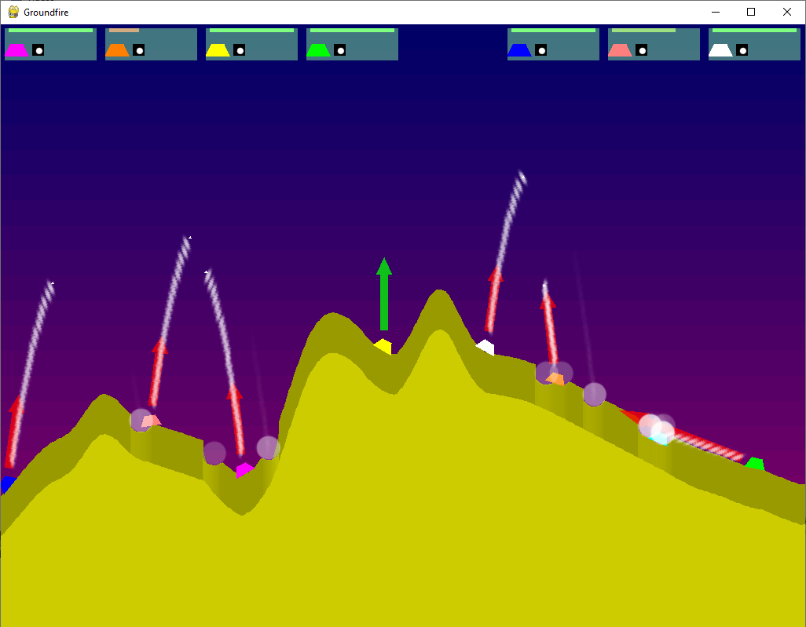
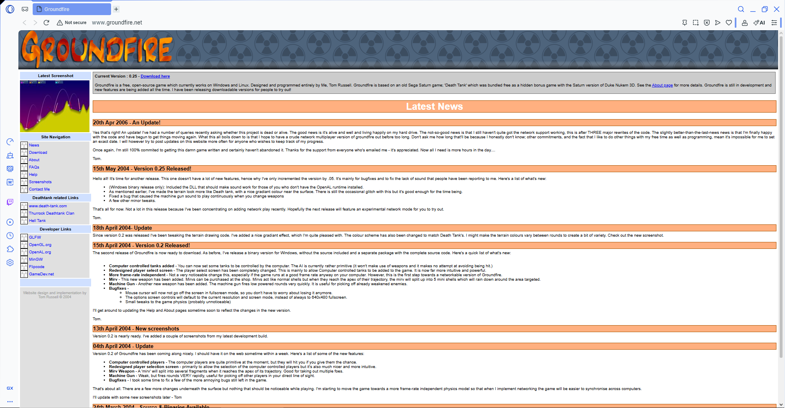

# Groundfire - Python Port

<div align="center">

<pre>
   ____                             _  __ _           
  / ___|_ __ ___  _   _ _ __   __ _| |/ _(_)_ __ ___ 
 | |  _| '__/ _ \| | | | '_ \ / _` | | |_| | '__/ _ \
 | |_| | | | (_) | |_| | | | | (_| | |  _| | | |  __/
  \____|_|  \___/ \__,_|_| |_|\__, |_|_| |_|_|  \___|
                              |___/                   
</pre>

**A preservation-focused Python/Pygame port of the original Groundfire v0.25**

[](https://www.python.org/)
[](https://www.pygame.org/)
[](#project-status)
[](LICENSE)

<br />
<br />


</div>

> Groundfire is a classic artillery tank game with destructible terrain, ballistic combat, weapon shopping between rounds, and computer-controlled opponents. This repository ports the original C++/OpenGL game to Python with Pygame while keeping the structure, behavior, and feel of the original as close as practical.

<div align="center">

**Original Groundfire created by Tom Russell. This port exists to preserve and modernize that work.**

</div>

<table>
  <tr>
    <td width="33%" valign="top">
      <strong>PLAY</strong><br />
      Ballistic tank duels, destructible terrain, splash damage, round economy, and fast restarts.
    </td>
    <td width="33%" valign="top">
      <strong>PRESERVE</strong><br />
      The original C++ source is included in the repo so the Python port can be compared against the real thing.
    </td>
    <td width="33%" valign="top">
      <strong>PORT</strong><br />
      Systems are migrated carefully with automated tests instead of being replaced by a loose remake.
    </td>
  </tr>
</table>

## Why This Project Exists

This port is both a technical exercise and a preservation effort.

- It keeps the original `groundfire-0.25/` source tree in the repository as a live reference.
- It ports gameplay systems one piece at a time instead of rewriting the game from scratch.
- It uses automated tests to protect behavior while the port continues to evolve.
- It aims to make the game easier to run, inspect, and extend on modern Python setups.

## Highlights

- Destructible terrain that changes the battlefield after every explosion
- Turn-based artillery combat with angle, power, gravity, and splash damage
- Multiple weapons including Shells, Missiles, MIRVs, Nukes, and Machine Gun
- AI players that choose targets, estimate aim, and adjust after each shot
- Between-round shop with ammo and jump jet upgrades
- Original C++ source included for side-by-side comparison and reference

## Visual Showcase

<div align="center">



</div>

## Quick Start

The launcher scripts are the easiest way to run the game. If the project is not installed yet, they will:

1. Find a compatible Python version
2. Create or repair `.venv`
3. Upgrade `pip`
4. Install dependencies
5. Start the game

<table>
  <tr>
    <td width="33%" valign="top">
      <strong>Windows CMD</strong>
      <pre lang="bat">run_game.bat</pre>
    </td>
    <td width="33%" valign="top">
      <strong>Windows PowerShell</strong>
      <pre lang="powershell">./run_game.ps1</pre>
    </td>
    <td width="33%" valign="top">
      <strong>Linux / macOS / WSL</strong>
      <pre lang="sh">./run_game.sh</pre>
    </td>
  </tr>
</table>

## Manual Setup

If you prefer to manage the environment yourself:

```bash
git clone https://github.com/p19091985/port-groundfire-for-python.git
cd port-groundfire-for-python
python -m venv .venv
```

### Activate the virtual environment

```bash
# Linux / macOS / WSL
source .venv/bin/activate

# Windows PowerShell
.venv\Scripts\Activate.ps1

# Windows CMD
.venv\Scripts\activate.bat
```

### Install and run

```bash
pip install -e .
groundfire

# Or, without console scripts:
python -m groundfire.client

# Start local play directly, skipping the launch menu:
python -m groundfire.client --classic-local

# Explicitly force the standard modern local runtime:
python -m groundfire.client --canonical-local

# Dedicated headless server entrypoint:
groundfire-server
```

The default local launch uses the modern runtime with the classic Groundfire presentation.
`--classic-local` is kept as a direct-start shortcut on that same classic frontend.

## Requirements

- Python 3.10, 3.11, 3.12, or 3.13
- `pygame==2.6.1`

## Gameplay Snapshot

### Core mechanics

- Artillery aiming with gun angle and shot power
- Destructible landscape with crater formation
- Tank movement, jump jets, and terrain interaction
- Scoring and economy across multiple rounds
- Shopping between rounds for stronger weapons and mobility

### Available weapons in the Python port

| Weapon | Role |
| --- | --- |
| Shell | Default explosive projectile |
| Machine Gun | Rapid-fire burst weapon |
| MIRV | Splits into multiple sub-projectiles |
| Missile | Guided projectile |
| Nuke | Large-radius high-impact explosion |

## Controls

Default keyboard controls for Player 1:

| Action | Key |
| --- | --- |
| Fire | `Space` |
| Gun up | `W` |
| Gun down | `S` |
| Gun left | `A` |
| Gun right | `D` |
| Move tank left | `J` |
| Move tank right | `L` |
| Jump jets | `I` |
| Shield | `K` |
| Next weapon | `O` |
| Previous weapon | `U` |

Controls can be adjusted in [conf/controls.ini](conf/controls.ini) or through the in-game control menus.

## Project Status

This is still an active port, not a final release.

- Core gameplay systems are already playable
- Fidelity to the original codebase remains a major goal
- Some subsystems are still being refined, corrected, or expanded
- The codebase includes test coverage for gameplay flow, fidelity checks, and terrain behavior

> The goal is not just to make Groundfire run in Python. The goal is to make it still feel like Groundfire.

## Repository Tour

```text
port-groundfire-for-python/
|-- src/                 Python port source code
|-- data/                Textures, sounds, and other assets
|-- conf/                Game options and control mappings
|-- tests/               Automated regression and fidelity tests
|-- groundfire-0.25/     Original C++ source used as reference
|-- run_game.bat         Windows CMD launcher with auto-install
|-- run_game.ps1         Windows PowerShell launcher with auto-install
|-- run_game.sh          Unix launcher with auto-install
`-- requirements.txt     Python dependencies
```

## Architecture at a Glance

```text
Game
|-- Landscape
|-- Entity List
|   |-- Projectiles
|   |-- Blast / Smoke / Trail / Quake
|   `-- Sound entities
`-- Players
    |-- HumanPlayer
    `-- AIPlayer
        `-- Tank
            `-- Weapons
```

Some key modules:

- [src/groundfire/client.py](src/groundfire/client.py): canonical client entry point
- [src/groundfire/server.py](src/groundfire/server.py): canonical server entry point
- [src/main.py](src/main.py): legacy compatibility entry point
- [src/game.py](src/game.py): game loop and state transitions
- [src/tank.py](src/tank.py): tank movement, damage, firing, and round lifecycle
- [src/aiplayer.py](src/aiplayer.py): AI targeting and aiming
- [src/shopmenu.py](src/shopmenu.py): between-round purchasing flow
- [src/weapons_impl.py](src/weapons_impl.py): concrete weapon implementations

## Running Tests

Run the full test suite with:

```bash
python -m unittest discover -s tests -p "test_*.py"
```

Useful targeted runs:

```bash
python -m unittest tests.test_port_fidelity
python -m unittest tests.test_fuzz_gameplay
python -m unittest tests.test_landscape_fidelity
```

## Configuration

- [conf/options.ini](conf/options.ini) controls graphics, terrain, tank tuning, and gameplay values
- [conf/controls.ini](conf/controls.ini) stores controller and keyboard mappings

## Preservation Notes

The original Groundfire C++ source is intentionally kept in this repository under [groundfire-0.25/](groundfire-0.25/). That directory is not just archival material; it is part of the workflow for verifying behavior and port fidelity.

## Credits

This section is intentionally prominent because the original game deserves clear attribution.

- Original game, design, programming, and C++ code: **Tom Russell**
- Official historical website: [groundfire.net](http://www.groundfire.net/)
- Original project: **Groundfire v0.25**
- The official Groundfire site describes the game as a free, open-source Windows/Linux project designed and programmed entirely by Tom Russell, based on Sega Saturn's *Death Tank*.
- The historical site also credits Tom Russell for the website design and implementation in 2004.
- Historical timeline visible on the official site: `v0.25` released on `15 May 2004`, with a later project update posted on `20 Apr 2006`.
- Original contact listed in the historic source: `tom@groundfire.net`
- Python port and ongoing preservation work: [p19091985](https://github.com/p19091985)

<div align="center">
  <a href="http://www.groundfire.net/" title="Visit the original Groundfire website">
    
  </a>
  <br />
  <sub>Historical official Groundfire website created by Tom Russell.</sub>
</div>

If you are here because you loved the original game, this repository exists because that work was worth preserving.

## License

This repository is distributed under the MIT License. See [LICENSE](LICENSE) for the full text.

---

<div align="center">

**Groundfire lives here in two forms: the original C++ game and a modern Python port, side by side.**

</div>
