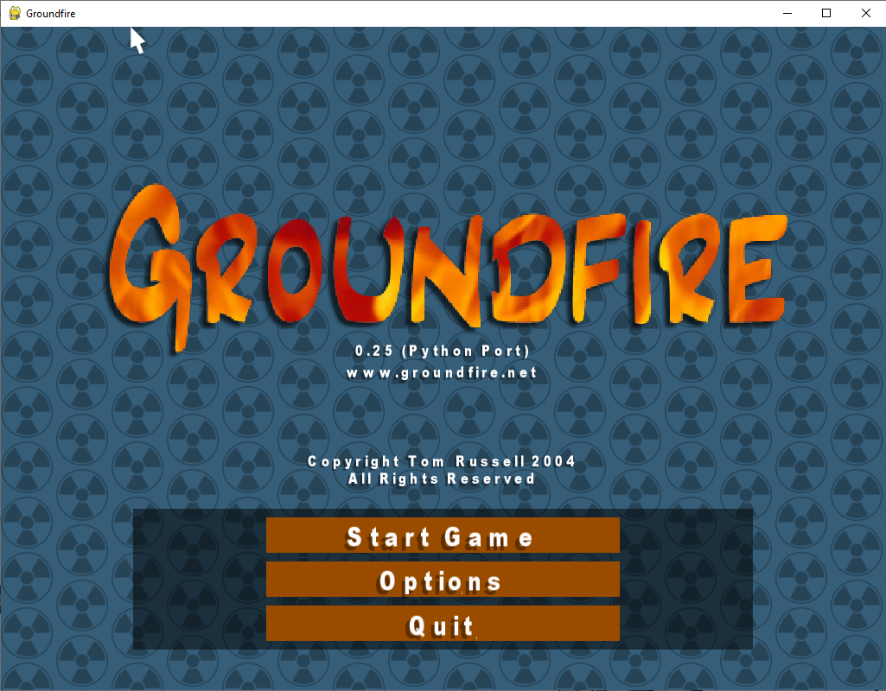
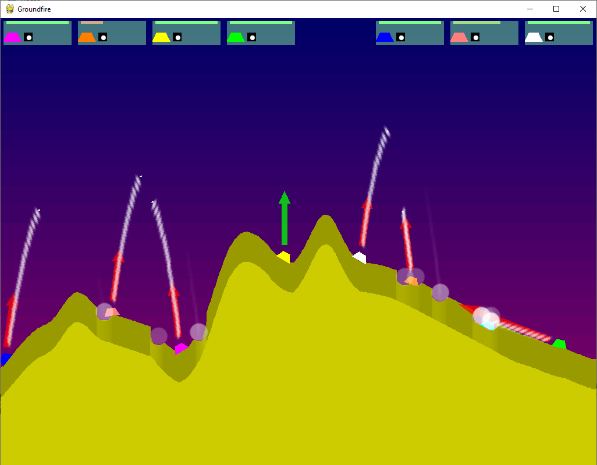
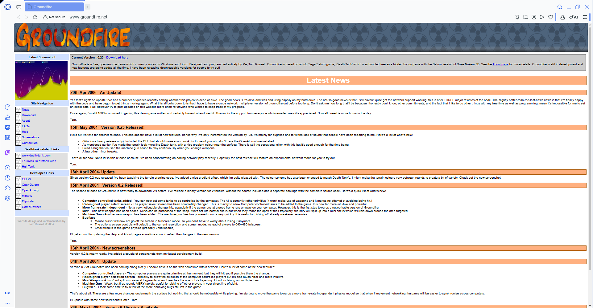

<p align="center">
  
</p>

<h1 align="center">🔥 Groundfire — Port Python</h1>

<p align="center">
  
  
  
</p>
<p align="center">
  
  
  
</p>

<p align="center">
  <kbd><a href="#portugues">🇧🇷 Português</a></kbd>&nbsp;&nbsp;
  <kbd><a href="#english">🇬🇧 English</a></kbd>
</p>

---

<a id="portugues"></a>

<h2 align="center">🇧🇷 Português</h2>

<p align="center"><strong>Port em Python/Pygame do Groundfire v0.25, com foco em preservação, jogabilidade clássica e compatibilidade moderna.</strong></p>

<p align="center"><code>Versão atual do pacote: 0.25.0</code></p>

<p align="center"><em>Groundfire é um jogo clássico de artilharia entre tanques, com terreno destrutível, combate balístico, economia entre rodadas, armas especiais, IA adversária e suporte a execução local ou cliente/servidor.</em></p>

---

### 📑 Índice

| | Seção | | Seção |
|---|---|---|---|
| 🎯 | [O que é este projeto?](#o-que-e-este-projeto) | 🎮 | [Jogabilidade](#jogabilidade) |
| 🖼️ | [Capturas e arte do jogo](#capturas-e-arte-do-jogo) | 🕹️ | [Controles padrão](#controles-padrao) |
| 💻 | [Requisitos de hardware e software](#requisitos-de-hardware-e-software) | ⚙️ | [Configuração do jogo](#configuracao-do-jogo) |
| 📦 | [Instalação passo a passo](#instalacao-passo-a-passo) | 🌐 | [Modo local e modo online](#modo-local-e-modo-online) |
| ▶️ | [Como iniciar o jogo](#como-iniciar-o-jogo) | 📂 | [Estrutura do repositório](#estrutura-do-repositorio) |
| 📜 | [Scripts de inicialização](#scripts-de-inicializacao) | 🏗️ | [Arquitetura de manutenção](#arquitetura-de-manutencao) |
| 📖 | [Documentação técnica incorporada](#documentacao-tecnica-incorporada) | 🧪 | [Testes automatizados e QA](#testes-automatizados-e-qa) |
| 🔧 | [Solução de problemas frequentes](#solucao-de-problemas-frequentes) | 🏆 | [Créditos e preservação histórica](#creditos-e-preservacao-historica) |
| 📄 | [Licença](#licenca) | | |

---

<a id="o-que-e-este-projeto"></a>

## 🎯 O que é este projeto?

O **Groundfire — Port Python** começou como uma adaptação em Python/Pygame do **Groundfire v0.25**, criado por **Tom Russell**. Hoje o repositório reúne a edição Python, uma migração jogável para Godot 4 e um serviço externo independente para salas e partidas gerenciadas. A edição Python é a referência de comportamento para a migração Godot; os dois clientes continuam utilizáveis durante o desenvolvimento.

O jogo coloca tanques em um terreno deformável. Cada jogador controla ângulo, potência, movimento, escudo, combustível de salto e escolha de armas. Entre as rodadas, a economia permite comprar munição e melhorias.

### Objetivo

Oferecer uma versão moderna e verificável do Groundfire para:

- 🎮 Jogar partidas locais com apresentação clássica
- 🔬 Preservar a experiência Python como referência verificável da migração Godot
- 🐍 Evoluir os dois clientes e o serviço independente com arquitetura testável
- ✅ Manter cobertura automatizada para mecânicas, renderização, rede, terreno e compatibilidade prática
- 📚 Facilitar estudo de arquitetura de jogos 2D com Pygame

### Principais capacidades

| Capacidade | Descrição |
|---|---|
| 💥 Terreno destrutível | Formação de crateras e desabamentos |
| 🎯 Combate de artilharia | Ângulo, potência, gravidade e dano em área |
| 🚀 Tanques completos | Movimentação, jump jets, escudo e ciclo de vida por rodada |
| 🔫 Arsenal variado | Shell, Missile, MIRV, Nuke e Machine Gun |
| 🤖 IA adversária | Oponentes controlados por computador |
| 🛒 Loja entre rodadas | Compra de armas e upgrades |
| 🖥️ Entrada clássica | Jogo local clássico + servidor headless |
| 🌐 Acesso on-line | Navegador de servidores, LAN, lobby, espectador e retomada de sessão |
| 🧩 Serviço independente | Contas, presença, grupos, convites, salas e reservas para partidas gerenciadas |
| 🧪 Testes de regressão | Compatibilidade e comportamento esperado sob controle |

### Escopo atual

> [!IMPORTANT]
> Este projeto ainda está em desenvolvimento. `versao-python/` e `versao-godot/` são as duas edições canônicas. A migração Godot deve reproduzir a experiência Python correspondente; mudanças deliberadas na experiência on-line devem ser implementadas nas duas edições. A homologação visual, sonora e de distribuição ainda não está completa.

| Área | Estado | Observação |
|:---|:---:|:---|
| Jogo local | 🟢 ativo | Fluxo principal jogável pelo menu clássico |
| Entrada local clássica | 🟢 ativo | Wrappers `groundfire` abrem somente o fluxo clássico antigo |
| IA local | 🟢 ativa | Jogadores controlados pelo computador estão implementados |
| Terreno destrutível | 🟢 ativo | Crateras, queda de terreno e efeitos possuem testes dedicados |
| Loja entre rodadas | 🟢 ativa | Compra de armas e jump jets |
| Rede LAN/direta | 🟢 implementada | Servidor autoritativo UDP, descoberta LAN, lobby, chat, espectador e retomada; testar firewall e endereço em cada ambiente |
| Serviço externo | 🟡 em validação | API, SQLite, contas, social, salas, reservas e worker de partidas existem em [`groundfire-online-service/`](groundfire-online-service/); implantação pública e UX completa ainda pendentes |
| Cliente Godot desktop/web | 🟡 em evolução | Cliente em [`versao-godot/godot/`](versao-godot/godot/) com recorte Linux/Web `0.25.0` empacotado anteriormente; isso não homologa o fluxo gerenciado atual |
| Fidelidade Python/Godot | 🟡 em execução | Combate/loja simultâneos, passo fixo, controles por participante, configuração clássica e UDP/LAN real implementados; comparação completa das cinco armas, visual e áudio ainda aberta |
| Pastas standalone | 🔴 portateis no Windows; Linux parcial | `versao-python/` e `versao-godot/` serão **duas pastas independentes**: copiar cada pasta inteira e executar seu launcher, sem a raiz ou a outra edição. Veja o [projeto ST00–ST08](docs/godot_migration_strategy.md#projeto-edicoes-standalone) |

### Migração desktop/web

O projeto migra gradualmente para **Godot 4 + GDScript**, mantendo Python/Pygame executável. O recorte Godot `0.25.0` já teve exportações Linux/Web verificadas em uma etapa anterior; a versão gerenciada atual precisa de novos ensaios de distribuição. Na web, recursos dependentes de UDP, descoberta LAN ou criação de processos locais ficam indisponíveis.

| Recurso | Desktop | Web |
|:---|:---:|:---:|
| Partida local contra IA | sim | sim |
| Navegador HTTP e conexão por WebSocket | sim | sim, quando o serviço/gateway está acessível por HTTPS/WSS |
| LAN discovery | sim | nao |
| UDP nativo | sim | nao |
| Ferramentas de servidor dedicado local | sim | nao |

O contrato de fidelidade, as pendências e os registros de validação ficam em [`docs/godot_migration_strategy.md`](docs/godot_migration_strategy.md).

**Projeto de equivalência (atualizado em 30/09/2026):** [projeto e estado de implementação Godot → Python](docs/godot_migration_strategy.md#projeto-equivalencia-2026-09-29). A comparação cobre 99 cenários de estado, ciclos das cinco armas até compra e rodada seguinte e uma partida de duas rodadas até o vencedor. Foram gerados 140 pares de capturas em sete resoluções, incluindo os diálogos clássicos e dois estados de erro do navegador. O índice mantém cada par pendente até sua revisão explícita. Entrada como IA foi confirmada no servidor Python real; eventos/assets de áudio e EXE Windows isolado também passaram. O Python permanece como referência inalterada. A equivalência completa ainda exige ampliar combinações de combate, concluir a revisão visual/sonora e homologar dispositivos, rede e plataformas. Recursos adicionais do Godot ficam na entrada optativa `-- --development-tools`.

**Continuidade em execução:** [pendências priorizadas, arquivos, comandos e resultados na seção 11.7](docs/godot_migration_strategy.md#continuidade-equivalencia-2026-09-30). Revalidação do rastro concluída; consulta de disponibilidade UDP, cancelamento e erros de senha/lotação testados. Escala e rotação da fumaça/propulsores corrigidas, com 475 estados comparados à geometria Python. A entrega atual passou em 39 verificações e 493 testes Python, com 140 pares de imagens indexados para revisão explícita. O aceite visual, sonoro, de rede e plataformas permanece incompleto.

**Avanço WebSocket (seção 11.8):** 91 verificações reais de conexão e navegação passaram. Corrigidos confirmação/Back, espera sem limite no handshake e encaminhamento da escolha IA pelo gateway incluído no Godot. Python preservado, 493 testes repetidos e EXE Windows reconstruído/testado isoladamente. O gate completo anterior permanece identificado pelo seu build; o objetivo global continua em execução.

**Avanço Web (seção 11.9):** export atual testado em Chrome e Edge no Windows, com persistência, erros de conexão e token assinado usando o nome escolhido. Cinco telas foram revistas ao lado do Python e passaram como referências de regressão Web, com diferenças documentadas. EXE Windows reconstruído e testado isoladamente; escuta, animações, dispositivos e demais plataformas seguem pendentes.

---

<a id="capturas-e-arte-do-jogo"></a>

## 🖼️ Capturas e arte do jogo

As imagens abaixo foram geradas a partir de assets do próprio projeto e ajudam a visualizar a atmosfera do port.

<table align="center">
  <tr>
    <td align="center">
      <br>
      <sub><b>Arte de abertura do Groundfire</b></sub>
    </td>
    <td align="center">
      <br>
      <sub><b>Showcase visual — jogo e loja</b></sub>
    </td>
  </tr>
</table>

---

<a id="requisitos-de-hardware-e-software"></a>

## 💻 Requisitos de hardware e software

### Requisitos de software

| Item | Requisito |
|:---|:---|
| 🐍 Python | 3.10, 3.11, 3.12, 3.13 ou 3.14 |
| 🖥️ Interface gráfica | Ambiente com suporte a janela Pygame |
| 📦 Dependências do cliente Python | `pygame`, `pygame_gui` e `pygame-menu`; consulte [`pyproject.toml`](pyproject.toml) |
| 🎮 Edição Godot | Godot 4; usar versão compatível com [`project.godot`](versao-godot/godot/project.godot) e templates correspondentes ao exportar |
| 🧩 Serviço externo | Python 3.10–3.14 e shell `sh`; dependências próprias em [`groundfire-online-service/pyproject.toml`](groundfire-online-service/pyproject.toml) |
| 🖧 Sistema operacional | Windows, Linux, macOS ou WSL com suporte gráfico |
| 📄 Licença | MIT |

### Dependências do ambiente atual

As dependências estão centralizadas em [`requirements.txt`](requirements.txt) e também declaradas em [`pyproject.toml`](pyproject.toml):

| Pacote | Versão | Uso |
|:---|:---:|:---|
| `pygame` | `2.6.1` | Janela, entrada, renderização 2D e áudio |
| `ruff` | `0.15.7` | Lint e organização de imports em desenvolvimento |
| `mypy` | `1.19.1` | Checagem estática opcional em desenvolvimento |

### Requisitos práticos de hardware

| Recurso | Mínimo prático | Recomendado | Observações |
|:---|:---:|:---:|:---|
| CPU | 2 núcleos | 4+ núcleos | Pygame e simulação 2D rodam bem em máquinas comuns |
| RAM | 2 GB | 4+ GB | Suficiente para jogo local e testes |
| Armazenamento | 500 MB livres | 1 GB livre | Inclui `.venv`, dependências e assets |
| GPU | Não obrigatória | Aceleração básica | Depende do suporte local do SDL/Pygame |
| Tela | 1024 × 768 | 1280 × 720+ | O default atual usa 1024 × 768 |

> [!NOTE]
> Em Linux, pode ser necessário instalar bibliotecas do sistema usadas pelo SDL/Pygame, especialmente em ambientes mínimos ou servidores com interface gráfica reduzida.

---

<a id="instalacao-passo-a-passo"></a>

## 📦 Instalação passo a passo

> [!NOTE]
> A forma mais simples de usar o projeto é executar um dos scripts `run_game.*`. Eles procuram uma versão compatível do Python, criam ou reparam `.venv`, atualizam o `pip`, instalam dependências e iniciam o jogo.

### 1️⃣ Clonar o repositório

```bash
git clone https://github.com/p19091985/port-groundfire-for-python.git
cd port-groundfire-for-python
```

### 2️⃣ Instalação automática (recomendada)

<table>
<tr>
<td><b>🪟 Windows CMD</b></td>
<td><b>🪟 Windows PowerShell</b></td>
<td><b>🐧 Linux / 🍎 macOS / WSL</b></td>
</tr>
<tr>
<td>

```bat
run_game.bat
```

</td>
<td>

```powershell
.\run_game.ps1
```

</td>
<td>

```bash
./run_game.sh
```

</td>
</tr>
</table>

O fluxo automático executa, em ordem:

1. Procura Python 3.10 a 3.14
2. Cria `.venv` quando necessário
3. Recria `.venv` se o Python for incompatível
4. Atualiza `pip`
5. Instala [`requirements.txt`](requirements.txt)
6. Inicia o jogo pelo ponto de entrada local

### 3️⃣ Instalação manual

<details>
<summary>🔽 Expandir instruções de instalação manual</summary>

#### 3.1 Criar ambiente virtual

```bash
python -m venv .venv
```

#### 3.2 Ativar o ambiente virtual

**Linux / macOS / WSL**

```bash
source .venv/bin/activate
```

**Windows CMD**

```bat
.venv\Scripts\activate.bat
```

**Windows PowerShell**

```powershell
.venv\Scripts\Activate.ps1
```

#### 3.3 Instalar o pacote

```bash
python -m pip install --upgrade pip
pip install -e .
```

#### 3.4 Iniciar após instalação manual

```bash
groundfire
```

Alternativas equivalentes:

```bash
python -m groundfire.client
python versao-python/src/main.py
```

</details>

### 4️⃣ Abrir a edição Godot

Abra [`versao-godot/godot/project.godot`](versao-godot/godot/project.godot) no editor Godot e execute o projeto. Pela linha de comando, a partir da raiz:

```bash
godot --path versao-godot/godot
```

Os launchers equivalentes são `versao-godot/run_game.bat` (CMD), `versao-godot/run_game.ps1` (PowerShell) e `bash versao-godot/run_game.sh` (Bash). Para subir servidor e duas janelas Godot já conectadas: `bash versao-godot/iniciar-all.sh -n 2`.

O executável pode se chamar `godot4` ou `Godot` conforme a instalação. No desktop, o menu oferece partida local e navegação LAN/on-line; no navegador, a edição exportada depende de endpoints HTTP(S)/WS(S) acessíveis.

### 5️⃣ Preparar o serviço externo (opcional para LAN)

```sh
sh groundfire-online-service/groundfire-online-service.sh check
sh groundfire-online-service/groundfire-online-service.sh
```

O launcher cria `groundfire-online-service/.venv` e instala dependências na primeira execução; precisa de acesso ao índice de pacotes nesse momento. No Windows, execute o comando em Git Bash ou WSL, que fornecem `sh`. O serviço escuta em `127.0.0.1:27880` por padrão. Configuração e operação: [`groundfire-online-service/README.md`](groundfire-online-service/README.md). A partida local e a conexão LAN direta não dependem dele.

---

<a id="como-iniciar-o-jogo"></a>

## ▶️ Como iniciar o jogo

| Modo | Comando |
|:---|:---|
| **Local recomendado** | `groundfire` |
| Com nome de jogador | `python -m groundfire.client --player-name Jogador` |
| Smoke test (um frame) | `python -m groundfire.client --once` |
| Godot desktop | `versao-godot/run_game.bat`, `.ps1` ou `bash versao-godot/run_game.sh` |
| Servidor LAN/direto | `groundfire-server --host 0.0.0.0 --port 45000` |
| Serviço externo | `sh groundfire-online-service/groundfire-online-service.sh` |

---

<a id="scripts-de-inicializacao"></a>

## 📜 Scripts de inicialização

| Arquivo | Função | Quando usar |
|:---|:---|:---|
| [`run_game.sh`](run_game.sh) | Prepara `.venv`, instala deps e inicia o jogo | 🐧 Linux / 🍎 macOS / WSL |
| [`run_game.bat`](run_game.bat) | Prepara `.venv`, instala deps e inicia o jogo | 🪟 Windows CMD |
| [`run_game.ps1`](run_game.ps1) | Prepara `.venv`, instala deps e inicia o jogo | 🪟 Windows PowerShell |
| [`versao-godot/run_game.sh`](versao-godot/run_game.sh) | Abre o projeto Godot; aceita argumentos da engine | Bash/Git Bash/WSL |
| [`versao-godot/run_game.bat`](versao-godot/run_game.bat) | Abre o projeto Godot | Windows CMD |
| [`versao-godot/run_game.ps1`](versao-godot/run_game.ps1) | Abre o projeto Godot | Windows PowerShell |
| [`versao-godot/iniciar-server.sh`](versao-godot/iniciar-server.sh) | Sobe em primeiro plano o servidor autoritativo Python usado pelo cliente Godot | Hospedar LAN sem janela Pygame |
| [`versao-godot/iniciar-clientes.sh`](versao-godot/iniciar-clientes.sh) | Abre 1–8 instâncias Godot já conectadas por UDP | Testar vários clientes |
| [`versao-godot/iniciar-all.sh`](versao-godot/iniciar-all.sh) | Sobe o servidor e os clientes Godot; encerra o servidor ao sair | Partida LAN local completa |
| [`iniciar-all.sh`](iniciar-all.sh) | Abre menu Ttk ou usa `-A` para iniciar 1 servidor LAN, 6 tanks IA e 6 janelas do jogo | Testes multiplayer automaticos com tela |
| [`iniciar-server.sh`](iniciar-server.sh) | Inicia servidor LAN por `-A`, com cliente visual local por default | Depuracao de servidor e smoke visual |
| [`iniciar-clientes.sh`](iniciar-clientes.sh) | Abre N clientes por `-n`; com `-a`, todos os IA ficam visiveis por default | Carga e testes LAN |
| [`groundfire-online-service/groundfire-online-service.sh`](groundfire-online-service/groundfire-online-service.sh) | Instala o pacote isolado e executa `start`, `check`, `status`, `stop`, `backup`, `restore` ou `test` | Salas e partidas gerenciadas |
| [`scripts/validate_godot.sh`](scripts/validate_godot.sh) | Executa contratos Godot headless | Verificar a migração |
| [`scripts/validate_godot_fidelity.sh`](scripts/validate_godot_fidelity.sh) | Executa verificações de fidelidade Godot/Python | Alterações de gameplay/menus |
| [`scripts/validate_godot_udp_integration.py`](scripts/validate_godot_udp_integration.py) | Exercita cliente Godot contra servidor Python real | Rede desktop/LAN |
| [`scripts/run_quality_checks.py`](scripts/run_quality_checks.py) | Compilação, testes, lint e tipagem | Validação antes de publicar |
| [`scripts/profile_round_simulation.py`](scripts/profile_round_simulation.py) | Mede desempenho de simulação | Diagnóstico de performance |
| [`scripts/generate_readme_art.py`](scripts/generate_readme_art.py) | Gera arte usada no README | Manutenção de imagens |
| [`scripts/convert_legacy_tga_assets.py`](scripts/convert_legacy_tga_assets.py) | Auxilia conversão de assets históricos | Manutenção de assets |

> [!TIP]
> Use `run_game.*` para jogar localmente, `./iniciar-all.sh -A` para subir uma partida LAN automatica de 20 rounds com uma janela por tank IA e `--sem-tela` quando o ambiente nao tiver display. Os launchers tambem aceitam chamada via `sh iniciar-all.sh`, pois reexecutam em Bash automaticamente.
> Presets rapidos: `./iniciar-all.sh -A --preset 8` e `./iniciar-clientes.sh --preset 4 -a`. Para validar a LAN antes de abrir janelas, use `./iniciar-clientes.sh --check-only --host 127.0.0.1 --port 27015`.
> Os launchers Python `iniciar-*.sh` aceitam `--menu` para abrir a interface grafica Ttk e `--cli` para o modo de comando de texto.

Os três launchers `iniciar-*.sh` de **`versao-godot/`** têm interface própria de linha de comando (`--help`) e não abrem os menus Ttk da edição Python. Exemplo: `sh versao-godot/iniciar-all.sh -n 2`; para apenas jogar, execute `versao-godot/run_game.bat` no CMD ou `bash versao-godot/run_game.sh` em Bash. Defina `GODOT_BIN` quando o executável Godot 4 não estiver no PATH. Em PowerShell com execução de scripts bloqueada, use `powershell -NoProfile -ExecutionPolicy Bypass -File .\versao-godot\run_game.ps1` para essa invocação.

---

<a id="jogabilidade"></a>

## 🎮 Jogabilidade

### Mecânicas centrais

- 🎯 Mira de artilharia com ângulo e potência
- 🌍 Gravidade influenciando trajetória dos projéteis
- 💥 Terreno destrutível com crateras e desabamentos
- 🚀 Tanques com movimento horizontal e jump jets
- 🛡️ Dano em área, escudo, fumaça, rastro e efeitos de explosão
- 💰 Pontuação e economia entre rodadas
- 🛒 Compra de armas e upgrades na loja
- 🤖 Adversários controlados por IA

### Armas disponíveis no port

| Arma | Ícone | Papel |
|:---|:---:|:---|
| `Shell` | 💣 | Projétil explosivo padrão |
| `Machine Gun` | 🔫 | Rajada rápida com dano baixo por disparo |
| `MIRV` | 🎆 | Projétil que se divide em subprojéteis |
| `Missile` | 🚀 | Projétil guiado |
| `Nuke` | ☢️ | Explosão de grande raio e alto impacto |

### Fluxo recomendado de partida

```
1. 🏁 Iniciar pelo menu local clássico
2. 👥 Configurar jogadores humanos e IAs
3. 🎯 Ajustar ângulo e potência
4. 💥 Disparar observando vento, terreno e distância
5. 🛡️ Usar movimento, jump jets e escudo para sobreviver
6. 🛒 Comprar armas e upgrades entre rodadas
7. 🏆 Repetir até definir o vencedor
```

---

<a id="controles-padrao"></a>

## 🕹️ Controles padrão

Os controles podem ser ajustados em [`versao-python/conf/controls.ini`](versao-python/conf/controls.ini) ou pelos menus internos de controle.

| Ação | Tecla (Jogador 1) |
|:---|:---:|
| 🔥 Atirar | `Space` |
| ⬆️ Aumentar ângulo do canhão | `W` |
| ⬇️ Diminuir ângulo do canhão | `S` |
| ⬅️ Girar canhão para a esquerda | `A` |
| ➡️ Girar canhão para a direita | `D` |
| ◀️ Mover tanque para a esquerda | `J` |
| ▶️ Mover tanque para a direita | `L` |
| 🚀 Jump jets | `I` |
| 🛡️ Escudo | `K` |
| 🔄 Próxima arma | `O` |
| 🔄 Arma anterior | `U` |

> O arquivo [`versao-python/conf/controls.ini`](versao-python/conf/controls.ini) também contém layouts de joystick para até **oito jogadores**. Os códigos seguem o mapeamento usado pelo Pygame/SDL no ambiente local.

No Godot, cada participante usa um slot/dispositivo próprio e os bindings persistidos pelo jogo. Confira o perfil ativo no menu de controles antes de uma partida com dois teclados ou controles físicos.

---

<a id="configuracao-do-jogo"></a>

## ⚙️ Configuração do jogo

As configurações principais ficam em [`versao-python/conf/options.ini`](versao-python/conf/options.ini).

| Seção | O que controla |
|:---|:---|
| `[Graphics]` | Largura, altura, profundidade de cor, FPS visível e tela cheia |
| `[Effects]` | Fade de explosão, whiteout e rastro |
| `[Terrain]` | Quantidade de fatias, largura e queda do terreno |
| `[Quake]` | Duração, intervalo, amplitude e frequência de terremotos |
| `[Shell]` `[Nuke]` `[Missile]` `[Mirv]` `[MachineGun]` | Dano, cooldown, raio, velocidade e parâmetros de armas |
| `[Tank]` | Velocidade, tamanho, ângulo, potência, gravidade, boost e combustível |
| `[Price]` | Preços de armas e upgrades |
| `[Colours]` | Cores dos tanques |
| `[AI]` | Liberação de compra e uso de armas especiais pela AI de rede |
| `[Interface]` | Mantido apenas para compatibilidade; o jogo local sempre usa o modo clássico |

> [!TIP]
> Para experimentar balanceamento, altere os valores em `versao-python/conf/options.ini` e reinicie o jogo. Mantenha mudanças de gameplay acompanhadas por testes quando elas forem parte de uma contribuição.
> Por padrão, `BuySpecialWeapons=0` e `UseSpecialWeapons=0`, então a AI de rede joga apenas com `shell` como no clássico.

A edição Godot mantém suas preferências em `user://groundfire_options.cfg` e usa os dados clássicos versionados em [`versao-godot/godot/data/classic/`](versao-godot/godot/data/classic/) para comparar regras com Python. Alterar o INI Python não modifica automaticamente uma instalação Godot. Para o serviço, `GF_SERVICE_CONFIG` aponta para um `config.toml` opcional; `bind`, `port`, `public_base_url`, `allowed_origins`, banco e limites têm valores padrão em [`config.py`](groundfire-online-service/src/gf_service/config.py). Os clientes usam `GROUNDFIRE_SERVICE_URL` (Python) e `application/config/service_base_url` em [`project.godot`](versao-godot/godot/project.godot).

---

<a id="modo-local-e-modo-online"></a>

## 🌐 Modo local e modo online

### 🖥️ Jogo local

O modo local dispensa rede e serviço externo:

```bash
groundfire
```

O menu clássico mantém **Find Servers** para alternar à lista de servidores. O Godot oferece partida local própria; a paridade das telas e dos sons ainda é um critério de aceite aberto.

### 🖧 Servidor headless

Para jogar em LAN ou por endereço direto, inicie o servidor autoritativo em uma máquina acessível pelos clientes:

```bash
groundfire-server --server-name "Groundfire Server"
```

Ou, sem console script:

```bash
python -m groundfire.server --host 0.0.0.0 --port 45000
```

### 🔗 Cliente conectado

Para conectar em um servidor:

```bash
groundfire --connect 127.0.0.1:45000 --player-name Jogador
```

Use no Godot desktop **Find Servers → LAN** ou conexão direta para entrar no mesmo servidor Python. Atualização, filtros, favoritos, histórico, senha, pronto, chat, espectador, retomada e revanche têm implementação; a disponibilidade exata depende do transporte e do servidor escolhido. Para descoberta via master, configure `GROUNDFIRE_MASTER_SERVERS`; a descoberta LAN usa broadcast UDP e pode exigir liberação no firewall.

### 🔑 Serviço gerenciado e segurança do transporte

O [`groundfire-online-service`](groundfire-online-service/README.md) é outra forma de entrar: ele gerencia contas/convidados, amigos e presença, grupos, convites com expiração, salas por código, fila e reserva de vagas, além de iniciar workers de partida. Consulte o [contrato da API](groundfire-online-service/CONTRATOS.md) e a documentação interativa em `http://127.0.0.1:27880/docs` com o serviço em execução. O cliente Python tem um adapter HTTP; o Godot tem cliente de serviço e hub on-line. As jornadas de UI completas e a distribuição pública seguem em validação.

O UDP direto do jogo **não cifra o tráfego**. `--server-private-key` e `--server-public-key` são opções antigas de compatibilidade e não geram arquivos nem ativam criptografia. A indicação “secure” no navegador é metadado legado, não prova de TLS. Ao publicar a API e o gateway fora da máquina local, configure HTTPS/WSS em um proxy reverso e exponha apenas os endereços públicos necessários; essa implantação ainda precisa de homologação real.

> [!IMPORTANT]
> Local e LAN direta funcionam sem conta externa. Salas, convites e reserva gerenciada exigem o serviço em execução. Antes de anunciar suporte web hospedado ou paridade on-line completa, execute os testes de implantação e de cliente descritos no plano de migração.

---

<a id="estrutura-do-repositorio"></a>

## 📂 Estrutura do repositório

```
port-groundfire-for-python/
├── 📁 versao-godot/
│   └── 📁 godot/           cliente Godot desktop/web, cenas, scripts e assets
├── 📁 versao-python/
│   ├── 📁 conf/            configurações do jogo, controles e mapeamento de assets
│   ├── 📁 data/            imagens, sons, fonte e sprites do jogo Python
│   ├── 📁 groundfire/      wrappers públicos para execução como pacote
│   └── 📁 src/             código principal do port Python
│       └── 📁 groundfire/  subsistemas de rede, renderização e servidor
├── 📁 media/
│   └── 📁 img/             capturas e imagens geradas para o README
├── 📁 groundfire-online-service/     API, rede canônica, banco e runtime headless
├── 📁 docs/               estratégia de migração e referências visuais
├── 📁 scripts/             ferramentas de QA, arte, assets e perfilamento
│   └── 📁 dev/             utilitários manuais de análise e scratch
├── 📁 tests/               testes automatizados
├── 🦇 run_game.bat         inicializador Windows CMD
├── ⚡ run_game.ps1         inicializador Windows PowerShell
├── 🐧 run_game.sh          inicializador Linux/macOS/WSL
├── 📋 pyproject.toml       metadados, scripts e configuração de ferramentas
└── 📋 requirements.txt     dependências de runtime e desenvolvimento
```

Utilitários avulsos de investigação ficam em [`scripts/dev/`](scripts/dev/) para manter a raiz reservada a arquivos comuns, launchers e configuração do projeto.

### Conteúdo técnico incorporado

| Conteúdo | Localização |
|:---|:---|
| [`cpp_output.txt`](cpp_output.txt) | Registro de execução histórica para comparação |
| Análise arquitetural 2026 | [Documentação Técnica ↓](#documentacao-tecnica-incorporada) |
| Roadmap de refatoração 2026 | [Documentação Técnica ↓](#documentacao-tecnica-incorporada) |
| Registro histórico do modo on-line | [Documentação Técnica ↓](#documentacao-tecnica-incorporada) |
| Estratégia Godot e aceite | [`docs/godot_migration_strategy.md`](docs/godot_migration_strategy.md) |
| Projeto das edições standalone | [ST00–ST08 no documento de migração](docs/godot_migration_strategy.md#projeto-edicoes-standalone) |
| Serviço externo: uso atual | [`groundfire-online-service/README.md`](groundfire-online-service/README.md) |
| Serviço: arquitetura alvo | [`groundfire-online-service/PROJETO.md`](groundfire-online-service/PROJETO.md) |
| Serviço: contrato alvo e lacunas | [`groundfire-online-service/CONTRATOS.md`](groundfire-online-service/CONTRATOS.md) |
| Serviço: lotes e testes de aceite | [`groundfire-online-service/IMPLEMENTACAO-E-TESTES.md`](groundfire-online-service/IMPLEMENTACAO-E-TESTES.md) |
| Utilitários manuais de desenvolvimento | [`scripts/dev/README.md`](scripts/dev/README.md) |
| Playtest do controle clássico | [Documentação Técnica ↓](#documentacao-tecnica-incorporada) |

---

<a id="arquitetura-de-manutencao"></a>

## 🏗️ Arquitetura de manutenção

O projeto mantém duas edições, ferramentas compartilhadas e um serviço distribuível à parte:

- **Versão Python/Pygame** em [`versao-python/`](versao-python/) — edição clássica jogável e runtime de servidor
- **Versão Godot** em [`versao-godot/godot/`](versao-godot/godot/) — cliente desktop/web em evolução
- **Rede compartilhada canônica** em [`groundfire-online-service/src/groundfire_net/`](groundfire-online-service/src/groundfire_net/) — protocolos, diretório, master UDP, descoberta e gateway
- **Serviço independente** em [`groundfire-online-service/`](groundfire-online-service/) — API FastAPI, SQLite, compatibilidade legada, supervisor e runtime headless; o pacote instalado não importa pastas irmãs

O arquivo `groundfire_net.py` na raiz é apenas um redirecionador para a cópia versionada da edição Python, mantendo comandos e imports históricos sem recriar a antiga pasta duplicada.

Arquivos `.ini` e `.json` ficam reservados a configuração, manifestos e contratos públicos, como `options.ini`, `controls.ini`, `assets.json` e `server_directory.json`. Dados mutáveis de runtime, como favoritos, histórico e listas descobertas de servidores, usam SQLite por padrão (`servers.sqlite3`) com importação automática do antigo `servers.json`.

### Mapa de módulos principais

| Caminho | Responsabilidade |
|:---|:---|
| [`versao-python/src/main.py`](versao-python/src/main.py) | Entrada local de compatibilidade |
| [`versao-python/groundfire/client.py`](versao-python/groundfire/client.py) | Wrapper público do cliente |
| [`versao-python/groundfire/server.py`](versao-python/groundfire/server.py) | Wrapper público do servidor |
| [`versao-python/src/groundfire/client.py`](versao-python/src/groundfire/client.py) | Parser e orquestração do cliente canônico |
| [`versao-python/src/groundfire/server.py`](versao-python/src/groundfire/server.py) | Parser e orquestração do servidor headless |
| [`versao-python/src/groundfire/app/`](versao-python/src/groundfire/app) | Fluxos de aplicação local, cliente, servidor e frontend |
| [`versao-python/src/groundfire/sim/`](versao-python/src/groundfire/sim) | Mundo, terreno, registro e partida simulada |
| [`versao-python/src/groundfire/gameplay/`](versao-python/src/groundfire/gameplay) | Controlador de partida e constantes de gameplay |
| [`versao-python/src/groundfire/network/`](versao-python/src/groundfire/network) | Mensagens, codec, LAN, estado do cliente e backend |
| [`versao-python/src/groundfire/service_client.py`](versao-python/src/groundfire/service_client.py) | Adapter HTTP para o serviço externo |
| [`versao-godot/godot/scripts/online/`](versao-godot/godot/scripts/online/) | Cliente do serviço e fluxo de salas Godot |
| [`groundfire-online-service/src/gf_service/`](groundfire-online-service/src/gf_service/) | API, domínio, persistência, segurança e supervisor |
| [`versao-python/src/groundfire/render/`](versao-python/src/groundfire/render) | Terreno, cena, HUD, primitivas e visual de entidades |
| [`versao-python/src/groundfire/input/`](versao-python/src/groundfire/input) | Comandos e controles |
| [`versao-python/src/game.py`](versao-python/src/game.py) | Loop e transições do fluxo clássico |
| [`versao-python/src/tank.py`](versao-python/src/tank.py) | Movimentação, dano, disparo e ciclo de vida do tanque |
| [`versao-python/src/aiplayer.py`](versao-python/src/aiplayer.py) | Mira, escolha de alvo e comportamento da IA |
| [`versao-python/src/weapons_impl.py`](versao-python/src/weapons_impl.py) | Implementações concretas de armas |
| [`versao-python/src/shopmenu.py`](versao-python/src/shopmenu.py) | Compra entre rodadas |

### Princípios de manutenção

- 🔒 Preservar nomes e comportamentos quando isso ajuda a comparar com o jogo original
- 📦 Mover regras compartilhadas para `versao-python/src/groundfire/` quando houver ganho claro
- 🧱 Manter renderização, simulação, entrada e rede separadas
- ✅ Acompanhar mudanças de comportamento com testes automatizados
- ⚠️ Evitar refatorações grandes sem uma razão verificável

---

<a id="documentacao-tecnica-incorporada"></a>

## 📖 Documentação técnica incorporada

> [!NOTE]
> Esta seção preserva análises e roteiros escritos em fases anteriores. Afirmações como “não existe servidor”, caminhos `src/` na raiz ou contagens antigas de testes descrevem **o momento em que foram redigidas**, não o estado atual. Para uso e status atuais, consulte as seções acima, a [estratégia Godot](docs/godot_migration_strategy.md) e o [README do serviço](groundfire-online-service/README.md). O histórico permanece expandível para explicar decisões e regressões.

---

<details>
<summary><h3>📐 Análise Arquitetural 2026</h3></summary>

<a id="analise-arquitetural-2026"></a>

> **Status desta entrega:** Esta etapa contem analise, planejamento e preparacao. Nenhuma refatoracao estrutural do runtime principal foi iniciada. O unico artefato executavel novo desta etapa e um utilitario isolado de conversao de assets `.tga`.

#### Escopo e metodo

Base analisada:

- `src/`: 39 modulos Python, 6591 linhas.
- `tests/`: 5 arquivos Python, 1164 linhas.
- `data/`: 22 assets, sendo 12 `.tga` e 10 `.wav`.
- `scripts/`: 1 script auxiliar que tambem consome `.tga`.
- teste executado: `python -m unittest discover -s tests -p "test_*.py"` -> 22 testes OK.
- referencia C++ consultada via `git show` em `groundfire-0.25/src/game.cc`, `tank.cc`, `interface.cc` e `font.cc`.

Observacao: a arvore `groundfire-0.25/` esta removida no worktree atual. Para nao interferir nas mudancas locais do usuario, a comparacao com o legado foi feita apenas por leitura do `HEAD`, sem restaurar nada no disco.

#### 1. Visao geral do estado atual

##### Estrutura do projeto

```text
port-groundfire-for-python/
|- conf/        configuracao de graficos e controles
|- data/        texturas TGA e sons WAV
|- media/img/   imagens do README
|- scripts/     tooling auxiliar
|- src/         port Python/Pygame
|- tests/       testes de fidelidade e fluxo
|- cpp_output.txt
|- requirements.txt
`- run_game.(bat|ps1|sh)
```

##### Dependencias

Dependencia declarada:

- `pygame==2.6.1`

Ausencias relevantes para 2026:

- sem `pyproject.toml`;
- sem CI visivel;
- sem linter/formatter/type-check;
- sem empacotamento moderno;
- sem infraestrutura de rede;
- sem manifest de assets;
- sem ferramentas de profiling ou replay.

##### Ponto de entrada e fluxo principal

Ponto de entrada:

- `src/main.py`

Fluxo atual:

1. script de launch cria `.venv`, instala dependencias e executa `src/main.py`;
2. `src/main.py` ajusta `sys.path`, instancia `Game()` e chama `loop_once()` em loop;
3. `Game.__init__()` carrega configuracao, interface, texturas, controles, fonte, som, um `Landscape` inicial e `MainMenu`;
4. `Game.loop_once()` calcula `dt` por `time.time()`, atualiza menus ou round e desenha na mesma passagem.

##### Modulos principais

- `game.py`: bootstrap, maquina de estados, rounds, recursos e lista de entidades.
- `interface.py`: janela, input, texturas e conversao de coordenadas.
- `landscape.py`: geracao de terreno, explosoes e colisao.
- `tank.py`: movimento, aim, armas, dano e HUD.
- `weapon.py` + `weapons_impl.py`: armas e cooldown/ammo.
- `player.py`, `humanplayer.py`, `aiplayer.py`: ownership do tanque e origem do input.
- `shell.py`, `missile.py`, `mirv.py`, `machinegunround.py`: balistica.
- `menu.py` e menus derivados: UI e fluxo de partida.
- `font.py`: atlas de fonte via textura.
- `sounds.py` e `soundentity.py`: audio.

##### Componentes herdados do design em C++

O port preserva fortemente a estrutura original:

- `Game` replica `cGame` como orquestrador central.
- `Tank` replica `cTank` com regras, armas, input e HUD.
- `Landscape` preserva o modelo em slices/chunks.
- o fluxo de menus segue objetos com `update()`/`draw()`.
- a lista unica de entidades reproduz `list<cEntity *>`.
- texturas e sons sao acessados por IDs inteiros.
- varios comentarios e decisoes de API foram transpostos quase literalmente do C++.

##### Padroes inadequados para um jogo Python moderno

- codigo flat em `src/`, sem pacotes por dominio;
- forte acoplamento a `Game`;
- simulacao, render, input e UI misturados;
- assets hardcoded por caminho e ID magico;
- ausencia de tick fixo;
- ausencia de serializacao de estado;
- ausencia de fronteira entre cliente visual e servidor futuro.

#### 2. Diagnostico tecnico

<details>
<summary>Expandir diagnóstico completo</summary>

##### Achados principais

1. `Game` e um god object. Ele centraliza bootstrap, recursos, estados, menus, landscape, players, entidades e explosoes.
2. A simulacao esta acoplada ao relogio real. `Game.loop_once()` usa `time.time()`, e os projetis usam `launch_time` absoluto + `game.get_time()`.
3. O port divergiu de partes importantes do C++. No C++, `cGame` chama `readSettings()` para armas, quake, trail, blast, mirv e missile; no Python esses metodos existem, mas nao sao chamados.
4. Ha configuracao parcialmente morta. `Graphics.ShowFPS` existe no INI e no C++, mas nao e respeitado no port atual.
5. O pipeline de render esta espalhado. Varios modulos chamam `pygame.draw.*`, `pygame.transform.*`, `pygame.Surface(...)` e acessam `._window` diretamente.
6. Tanques sao desenhados duas vezes. Eles estao em `self._players[i].get_tank()` e tambem em `self._entity_list`; `Game._draw_round()` desenha ambos.
7. Ha bugs fora da cobertura atual. `ShopMenu` e `WinnerMenu` chamam `get_command(...)` sem o segundo parametro exigido por `HumanPlayer`.
8. O bootstrap atual cria `Landscape` no construtor. No C++ o landscape so nasce ao iniciar o round; no port atual ele existe mesmo quando o jogo esta parado em menu.
9. `Font` recarrega `fonts.tga`. `Game` ja registra a textura 3 e `Font` carrega o mesmo arquivo outra vez, duplicando I/O e responsabilidades.
10. Ha risco visual em `ROUND_STARTING`. `loop_once()` chama `start_draw()` no inicio do frame e chama `start_draw()` outra vez antes do texto de "Get Ready", o que pode limpar a cena recem-desenhada.

##### Code smells

- classes grandes: `Game`, `Tank`, `Landscape`, `Font`, `PlayerMenu`, `ShopMenu`;
- comentarios de raciocinio incompleto e placeholders no codigo de producao;
- uso extensivo de atributos internos de outros objetos;
- destruidores `__del__` para recursos criticos (`Sound`, `Interface`, `Game`, `Quake`);
- parsers custom de configuracao e controles;
- `sys.path.append(...)` no entrypoint.

##### Acoplamento excessivo

Os acoplamentos mais perigosos sao:

- `Game` <-> todos os subsistemas;
- gameplay <-> renderer;
- input <-> simulacao;
- menus <-> dados internos de jogador, tanque, round e economia.

##### Duplicacao de codigo

Duplicacoes relevantes:

- `_draw_transparent_poly()` repetido em quase todos os menus e em `tank.py`;
- fluxo de projetil repetido entre shell, MIRV, missile e machine gun;
- tratamento visual de scale/rotate/blit repetido em efeitos, botoes e score menu;
- mapeamento de assets espalhado entre `Game`, `Font`, `Weapon`, `Menu` e scripts.

##### Responsabilidades mal distribuidas

- `Tank.draw()` desenha tanque e HUD.
- `Game.explosion()` mistura terreno, efeito visual, audio e dano.
- `ShopMenu` aplica compras diretamente.
- `Player.end_round()` calcula score e dinheiro sem um servico de regras.
- `Font` tambem age como loader de asset.

##### Riscos arquiteturais

- refatorar `Game`, `Tank` ou `Landscape` afeta boa parte do projeto;
- nao existe estado de mundo serializavel;
- nao existem IDs estaveis de entidades;
- nao existe event bus;
- o uso de tempo real inviabiliza rede robusta e replays confiaveis;
- o subsistema de recursos nao separa source asset, runtime asset e cache.

##### Limitacoes para multiplayer

Bloqueios atuais:

- sem tick fixo;
- sem command buffer;
- sem protocolo, sessao ou discovery;
- sem cliente/servidor separado;
- sem serializacao de estado;
- sem snapshots ou deltas;
- sem modo headless.

##### Limitacoes do pipeline grafico e de assets

O projeto usa 12 `.tga` em runtime e 2 deles tambem em script auxiliar de docs. O carregamento atual faz `pygame.image.load(...)` por caminho hardcoded e expoe superficies cruas por ID inteiro. Isso e suficiente para um port preservacionista, mas nao para um pipeline moderno reproduzivel.

Todos os `.tga` atuais sao TGA RLE (`image_type=10`) em 24 ou 32 bpp. O formato e historico e valido, mas pouco atraente para 2026 em Pygame por:

- toolchain mais estreita;
- menor ergonomia em conversores e validadores;
- potencial confusao de orientacao/origin;
- nenhuma vantagem operacional significativa frente a PNG nesta base.

</details>

#### 3. Avaliacao de prontidao para 2026

<details>
<summary>Expandir avaliação completa</summary>

##### O que falta

- pacote modular por dominio;
- simulacao pura e deterministica;
- asset pipeline reproduzivel;
- layer de rede;
- modo headless;
- automacao de qualidade;
- observabilidade minima;
- infraestrutura de replays/profiling.

##### Praticas esperadas em 2026

- nucleo de simulacao separado de renderer;
- tick fixo com render interpolado;
- assets com manifest e validacao;
- cliente/servidor com protocolo versionado;
- testes em unidade, integracao, rede e regressao visual;
- build tooling e CI padronizados.

##### O que esta obsoleto

- `.tga` como formato primario de runtime;
- IDs inteiros de textura/som;
- relogio de parede como base da simulacao;
- render imediatista espalhado;
- acesso a `._window` e atributos internos como API informal.

##### O que deve ser refeito

- loop principal;
- subsistema de assets;
- camada de render;
- camada de input;
- fluxo de menus/UI;
- organizacao do codigo;
- serializacao de estado;
- arquitetura de rede.

##### O que pode ser aproveitado

- formulas balisticas;
- modelo de terreno destrutivel;
- regras de dano, score e economia;
- testes atuais como contrato de comportamento;
- estrutura conceitual de armas, tanques e rounds;
- referencia historica com o C++.

</details>

#### 4. Proposta de nova arquitetura

##### Organizacao modular sugerida

```text
src/groundfire/
|- app/
|- core/
|- sim/
|- gameplay/
|- render/
|- assets/
|- input/
|- audio/
|- ui/
|- network/
`- tools/
```

##### Separacao de responsabilidades

| Módulo | Responsabilidade |
|:---|:---|
| `core` | Config, IDs, clock, logging e eventos |
| `sim` | Mundo, entidades, terreno, armas e sistemas |
| `gameplay` | Round flow, scoring, economia e turn ownership |
| `render` | Adaptador visual do estado |
| `assets` | Manifest, loader, cache e validacao |
| `input` | Mapeamento de hardware para comandos |
| `audio` | Sound bank e consumo de eventos |
| `ui` | Menus, HUD e presenters |
| `network` | Discovery, sessao, protocolo, client, server e replication |

##### Modelo de execucao recomendado

- Simulacao em tick fixo, por exemplo 60 Hz
- Render independente com interpolacao
- Input local convertido em `PlayerCommand`
- Mundo atualizado apenas por comandos e eventos
- Renderer e audio consumindo snapshots/eventos, nao chamando regras diretamente

##### Arquitetura cliente/servidor proposta

- Servidor dedicado autoritativo
- Cliente responsavel por render, UI, audio e input local
- Comandos do jogador enviados ao servidor
- Terreno, score, economia e round decididos apenas no servidor
- Entidades com IDs de rede e snapshots/eventos versionados

#### 5. Plano especifico para rede

<details>
<summary>Expandir plano de rede</summary>

Modelo recomendado, inspirado no classico cliente/servidor de jogos como CS 1.6, mas adaptado ao genero do Groundfire:

- servidor autoritativo;
- cliente manda comandos, nao estado canonico;
- snapshots e eventos mantem a visao do cliente;
- predicao local limitada onde fizer sentido;
- reconciliacao leve para missiles guiados;
- turn-lock no servidor para impedir comandos fora da vez.

Pre-requisitos antes de implementar rede de fato:

- tick fixo;
- RNG controlado pela partida;
- mundo serializavel;
- IDs estaveis de entidades;
- event bus;
- modo headless.

##### Suporte LAN e servidores remotos

- descoberta LAN via UDP broadcast ou multicast;
- conexao direta por `host:port` para servidores dedicados;
- handshake com versao de protocolo, seed da partida e token de sessao.

##### Serializacao e sincronizacao de estado

- snapshots para tanques e estado de partida;
- eventos explicitos para spawn, explosao, compra e fim de round;
- seed inicial + deltas de terreno quando necessario;
- comandos pequenos para aim/fire e stream de controle para missile guiado.

</details>

#### 6. Plano de substituicao dos arquivos `.tga`

<details>
<summary>Expandir plano de migração de assets</summary>

##### Onde `.tga` e usado

- `src/game.py`: mapa principal de texturas.
- `src/font.py`: `fonts.tga`.
- `scripts/generate_readme_art.py`: `menuback.tga` e `logo.tga`.

##### Formato alvo recomendado

- **`PNG`** lossless como formato canonico de runtime e source asset.
- Futuro opcional: `KTX2/BasisU`, apenas se o renderer migrar para uma pilha realmente GPU-centric.

##### Estrategia de migracao

1. Converter `.tga` para `.png` em arvore paralela
2. Validar dimensoes, alpha e orientacao
3. Gerar manifest origem → destino
4. Trocar runtime para resolver assets por nome semantico
5. Eliminar IDs magicos e dupla carga da fonte
6. So depois remover referencias a `.tga`

##### Utilitario entregue

`scripts/convert_legacy_tga_assets.py` — não altera originais, gera `.png` em pasta separada, cria manifesto JSON e valida o resultado.

</details>

#### 7. Conclusao tecnica

O projeto atual e um port funcional e valioso como preservacao, mas ainda nao e uma base adequada para expansao multiplayer, LAN, servidor dedicado e pipeline moderno de assets. A melhor estrategia nao e reescrever tudo de uma vez; e extrair um nucleo puro de simulacao, desacoplar render/input/audio, modernizar assets e so entao ligar a camada de rede.

</details>

---

<details>
<summary><h3>🗺️ Roadmap de Refatoração 2026</h3></summary>

<a id="roadmap-de-refatoracao-2026"></a>

> **Status desta entrega:** Este roadmap descreve a execucao sugerida da modernizacao. A refatoracao principal ainda nao foi iniciada nesta etapa.

#### Premissas

- Preservar a jogabilidade protegida pelos testes existentes
- Nao quebrar o jogo atual sem trilha de migracao
- Priorizar isolamento de simulacao, assets e estado antes de rede
- Manter o runtime jogavel ao fim de cada fase

#### Fases do Roadmap

| Fase | Objetivo | Dependências |
|:---:|:---|:---|
| **0** | Auditoria e mapeamento do codigo | Nenhuma |
| **1** | Hardening mínimo antes da reorganização | Fase 0 |
| **2** | Isolamento de módulos críticos | Fase 1 |
| **3** | Reorganização arquitetural | Fase 2 |
| **4** | Modernização do pipeline de assets | Utilitário de conversão validado |
| **5** | Refatoração para tick fixo | Fases 2, 3 e 4 |
| **6** | Preparação para multiplayer | Fase 5 |
| **7** | Protótipo LAN e servidor dedicado | Fase 6 |
| **8** | Testes, profiling e hardening | Fases anteriores |

<details>
<summary>Expandir detalhes de cada fase</summary>

##### Fase 0 — Auditoria e mapeamento do codigo

- **Objetivo:** consolidar inventario de modulos, assets, estados, dependencias e hotspots.
- **Afetados:** `src/*`, `tests/*`, `conf/*`, `data/*`
- **Riscos:** subestimar acoplamentos escondidos; ignorar divergencias com o C++.
- **Critérios:** inventario fechado; mapa de riscos aprovado; baseline documentada.

##### Fase 1 — Hardening minimo

- **Objetivo:** corrigir desvios estruturais que atrapalham a extracao do nucleo.
- **Afetados:** `game.py`, `shopmenu.py`, `winnermenu.py`, `font.py`, `weapons_impl.py`, `missile.py`, `mirv.py`, `quake.py`, `blast.py`, `trail.py`
- **Riscos:** regressao de fidelidade se faltar cobertura em UI e render.
- **Critérios:** `read_settings()` corretamente chamado; input humano sem quebras; duplicacao de desenho saneada.

##### Fase 2 — Isolamento de modulos criticos

- **Objetivo:** separar simulacao de infraestrutura.
- **Afetados:** `game.py`, `tank.py`, `player.py`, `humanplayer.py`, `aiplayer.py`, `weapon.py`, `weapons_impl.py`, `shell.py`, `missile.py`, `mirv.py`, `machinegunround.py`, `landscape.py`
- **Riscos:** circularidades temporarias; regressao na ordem de update.
- **Critérios:** gameplay sem depender de `pygame` diretamente; input vira comando; entidades reduzem dependencia de `Game`.

##### Fase 3 — Reorganizacao arquitetural

- **Objetivo:** mover o projeto para pacotes por dominio com interfaces claras.
- **Riscos:** grande volume de mudancas de imports; conflitos se feito em patch grande.
- **Critérios:** pacote `groundfire/` estabelecido; imports limpos; fronteiras claras entre módulos.

##### Fase 4 — Modernizacao do pipeline de assets

- **Objetivo:** substituir `.tga`, introduzir manifest e separar source/runtime assets.
- **Riscos:** inversao visual por orientacao; perda de alpha; regressao em paths hardcoded.
- **Critérios:** assets `.png` convertidos e validados; runtime resolve por manifest; `.tga` sai da trilha principal.

##### Fase 5 — Tick fixo

- **Objetivo:** tornar a simulacao deterministica para rede, replays e servidor dedicado.
- **Riscos:** maior chance de regressao de gameplay; mudancas em trajetorias.
- **Critérios:** loop usa tick fixo; RNG explicito; projetis sem `time.time()`; testes de balistica passam.

##### Fase 6 — Preparacao para multiplayer

- **Objetivo:** introduzir contratos internos de rede sem ligar a stack completa.
- **Riscos:** schema de mensagens ruim pode engessar implementacao futura.
- **Critérios:** entidades com IDs estaveis; comandos serializaveis; eventos de dominio definidos.

##### Fase 7 — Prototipo LAN e servidor dedicado

- **Objetivo:** provar a arquitetura de rede em ambiente controlado.
- **Riscos:** sincronizacao de terreno e missiles guiados; bugs de sessao.
- **Critérios:** servidor headless funcional; cliente lista partidas LAN; round simples entre dois clientes.

##### Fase 8 — Testes, profiling e hardening

- **Objetivo:** estabilizar o sistema para evolucao continuada.
- **Critérios:** suite por camada; testes de rede; benchmarks; CI funcionando.

</details>

#### Roadmap de rede

| Marco | Objetivo | Entregas-chave |
|:---:|:---|:---|
| **N1** | Contratos de comando e evento | Schema versionado, IDs estáveis, eventos de round/disparo/dano |
| **N2** | Descoberta LAN e handshake | Beacon UDP, browser LAN, handshake com versão/seed/token |
| **N3** | Servidor autoritativo mínimo | Servidor dedicado, replicação básica, sync de score/turnos |
| **N4** | Latência e reconciliação | Interpolação, predição local, métricas de rede |

#### Prioridades executivas

| Prazo | Fases | Foco |
|:---|:---:|:---|
| 🔴 Curto prazo | 1 — 2 | Corrigir bugs estruturais e extrair simulação |
| 🟡 Médio prazo | 3 — 5 | Reorganizar projeto, assets e tick fixo |
| 🟢 Longo prazo | 6 — 8 | Rede, servidor dedicado e hardening |

</details>

---

<details>
<summary><h3>🌐 Modo Online Nativo</h3></summary>

<a id="modo-online-nativo"></a>

O modo online usa somente biblioteca padrão do Python no transporte: `socket`, `selectors`, `json` e dataclasses. O pacote canônico [`groundfire_net`](groundfire-online-service/src/groundfire_net/) concentra codec, UDP, descoberta LAN, master server, lista de servidores, favoritos/histórico em SQLite e loop de servidor. As edições independentes recebem cópias versionadas por meio dos scripts de vendorização.

#### Key Files

| Arquivo | Propósito |
|:---|:---|
| [`groundfire-online-service/src/groundfire_net/`](groundfire-online-service/src/groundfire_net/) | Fonte canônica do módulo de rede nativo e reaproveitável |
| [`versao-python/src/groundfire/network/`](versao-python/src/groundfire/network/) | Adaptadores do Groundfire para mensagens, descoberta e browser |
| [`versao-python/src/groundfire/app/server.py`](versao-python/src/groundfire/app/server.py) | Servidor autoritativo headless |
| [`versao-python/src/groundfire/master.py`](versao-python/src/groundfire/master.py) | Master server nativo para a aba Internet |

O cliente de rede usa descoberta LAN e consulta ao master server para localizar servidores Groundfire. No menu clássico, **Find Servers** abre a lista de servidores com filtros de texto, senha, servidor cheio/vazio, região, secure, latência, favoritos, histórico, adição manual por `host:port`, refresh rápido/geral, connect e ping nativo por UDP. O fluxo inspirado no navegador do Counter-Strike 1.6 também oferece **Random Server**, a aba **Spectate**, espectador autenticado sem ocupar vaga, chat, retomada de sessão e **Join when a slot opens**.

Logs de rede e servidor podem ser emitidos como texto humano ou JSON Lines por `--log-format text|json`; `--log-file` grava o mesmo fluxo em arquivo e mantém `--log-events` para stdout.

#### Start The Master Server

```powershell
python -m src.groundfire.master
```

Para publicar um servidor no master server:

```powershell
python -m src.groundfire.server --master-server 127.0.0.1:27017 --server-name "Meu Groundfire"
```

Servidor protegido por senha:

```powershell
python -m src.groundfire.server --password segredo --master-server 127.0.0.1:27017
python -m src.groundfire.client --connect 127.0.0.1:27015 --password segredo
```

#### Start The Server

```powershell
python -m src.groundfire.server
```

Custom ports are also supported:

```powershell
python -m src.groundfire.server --host 0.0.0.0 --port 27015 --discovery-port 27016
```

#### Connect A Client

```powershell
python -m src.groundfire.client --connect 127.0.0.1:27015
```

Para assistir sem ocupar uma vaga ou aguardar automaticamente uma vaga de jogador:

```powershell
python -m src.groundfire.client --connect 127.0.0.1:27015 --spectate
python -m src.groundfire.client --connect 127.0.0.1:27015 --auto-retry
```

#### Notes

- O transporte online nao usa bibliotecas externas.
- O protocolo usa envelopes JSON nativos para facilitar depuracao e portabilidade.
- `--server-public-key` e `--server-private-key` permanecem aceitos apenas como compatibilidade de CLI.

</details>

---

<details>
<summary><h3>🎮 Playtest do Controle Clássico</h3></summary>

<a id="playtest-do-controle-classico"></a>

Use this checklist to validate the classic local menu flow on real hardware without changing the classic UI.

#### Launch

```powershell
python -m src.groundfire.client --player-name "Controller Test"
```

#### Keyboard 2

1. Open `Start Game`.
2. Leave exactly one human player enabled.
3. Change the controller selector to `Keyboard2`.
4. Start a round.
5. Confirm the tank responds only to the `Keyboard2` bindings from `conf/controls.ini`.

#### Joysticks

1. Repeat the same setup with `Joystick1`.
2. Press `Fire` on an unassigned joystick from the player-select screen and confirm it auto-joins the next free player row.
3. Start a round and confirm movement, aiming, weapon switching, and fire all route through the selected joystick.
4. Repeat for any additional joystick layouts you want to certify.

#### Legacy Fallback

1. Enable two human players in `Start Game`.
2. Assign different controllers, for example `Keyboard1` and `Keyboard2` or `Keyboard1` and `Joystick1`.
3. Start the match.
4. Confirm the game hands off to the legacy local loop and begins the round with both players configured.

#### Regression Notes

If any step fails, capture:

- Which controller label was selected in the classic menu
- Whether the player was added by click or by pressing `Fire`
- Whether the failure happened before the round, during the round, or during the legacy fallback handoff

</details>

---

<a id="testes-automatizados-e-qa"></a>

## 🧪 Testes automatizados e QA

### Rodar a suite completa

```bash
python -m unittest discover -s tests -p "test_*.py"
```

Para incluir os testes `pytest` e o pacote independente (em ambientes com as dependências instaladas):

```bash
python -m pytest -q
sh groundfire-online-service/groundfire-online-service.sh test
```

Os testes do serviço ficam em `groundfire-online-service/tests/` e usam seu próprio ambiente. Uma suíte verde confirma os cenários cobertos; não substitui comparação visual/sonora pareada nem teste hospedado HTTPS/WSS.

### Rodar verificações de qualidade

```bash
python scripts/run_quality_checks.py
```

Esse script executa:

| Verificação | O que faz |
|:---|:---|
| `compileall` | Valida a sintaxe dos caminhos Python configurados no script |
| `unittest` | Roda a suite automatizada |
| `ruff` | Roda lint quando a ferramenta está disponível |
| `mypy` | Roda tipagem quando a ferramenta está disponível |

<details>
<summary>🔽 Testes direcionados e áreas cobertas</summary>

### Testes direcionados úteis

```bash
python -m unittest tests.test_port_fidelity
python -m unittest tests.test_fuzz_gameplay
python -m unittest tests.test_landscape_fidelity
python -m unittest tests.test_groundfire_entrypoints
python -m unittest tests.test_lan_discovery
python -m pytest -q tests/test_online_match_simulation.py tests/test_external_service_client_contract.py
python scripts/validate_godot_udp_integration.py
bash scripts/validate_godot_fidelity.sh
```

### Áreas cobertas pela suite

| Área | Exemplos de testes |
|:---|:---|
| Fidelidade do port | `test_port_fidelity`, `test_replicated_scene` |
| Terreno e simulação | `test_landscape_fidelity`, `test_gamesimulation`, `test_fixedstep` |
| Fluxo de jogo | `test_gameflow`, `test_gamesession`, `test_match_controller` |
| Renderização e HUD | `test_gamerenderer`, `test_gamehudrenderer`, `test_gamegraphics` |
| Entrada e comandos | `test_commandintents`, `test_client_server_apps` |
| Rede | `test_networkprotocol`, `test_networkstate`, `test_groundfire_codec`, `test_lan_discovery` |
| Jornada on-line | `test_online_match_simulation`, `test_server_browser_real_network_paths` e `groundfire-online-service/tests/` |
| Migração Godot | contratos headless, replays clássicos, comparação visual e integração UDP real |
| Portabilidade | `test_portability`, `test_runtime_portability` |

</details>

---

<a id="solucao-de-problemas-frequentes"></a>

## 🔧 Solução de problemas frequentes

<details>
<summary><b>🖥️ O Pygame não abre janela</b></summary>

- Confirme que você está em uma sessão gráfica
- Em WSL, confirme que há suporte a WSLg ou servidor X configurado
- Em Linux mínimo, instale bibliotecas do SDL/Pygame pelo gerenciador do sistema

</details>

<details>
<summary><b>🐍 O script diz que o Python é incompatível</b></summary>

Use Python 3.10, 3.11, 3.12, 3.13 ou 3.14. Os scripts procuram automaticamente por:

```text
python3.14, python3.13, python3.12, python3.11, python3.10, python3, python
```

</details>

<details>
<summary><b>📁 A .venv ficou quebrada</b></summary>

Execute novamente o script do seu sistema:

```bash
./run_game.sh        # Linux / macOS / WSL
run_game.bat         # Windows CMD
.\run_game.ps1       # Windows PowerShell
```

O inicializador tenta reparar ou recriar o ambiente quando detecta incompatibilidade.

</details>

<details>
<summary><b>⚙️ O jogo local deve abrir somente no modo clássico</b></summary>

O entrypoint local ignora seleção de modo e abre o fluxo clássico antigo. A chave abaixo pode permanecer no arquivo apenas por compatibilidade:

```ini
[Interface]
LocalMenuMode=classic
```

</details>

<details>
<summary><b>🌐 O servidor não conecta</b></summary>

- Confirme host e porta usados no servidor
- Rode cliente e servidor na mesma máquina com `127.0.0.1` para isolar problema de rede
- Verifique firewall local
- Para LAN, confirme que o cliente alcança o IP da máquina servidora e que as portas UDP estão liberadas
- Para salas gerenciadas, execute `sh groundfire-online-service/groundfire-online-service.sh status` e verifique `http://127.0.0.1:27880/readyz`

</details>

<details>
<summary><b>🧩 O hub on-line não encontra o serviço</b></summary>

- Confirme `GROUNDFIRE_SERVICE_URL` no Python ou `application/config/service_base_url` no Godot
- O padrão `127.0.0.1` aponta para a máquina de **cada cliente**; use o endereço do host do serviço quando eles estiverem separados
- Para uma página web em HTTPS, use endpoints HTTPS/WSS acessíveis pelo navegador e uma origem autorizada no serviço

</details>

---

<a id="creditos-e-preservacao-historica"></a>

## 🏆 Créditos e preservação histórica

> Esta seção é destacada porque o jogo original merece atribuição clara.

| | Crédito |
|:---|:---|
| 🎮 Jogo original, design, programação e código C++ | **Tom Russell** |
| 📦 Projeto original | **Groundfire v0.25** |
| 🌐 Site histórico oficial | [groundfire.net](http://www.groundfire.net/) |
| 📅 Timeline histórica | `v0.25` publicada em `15 May 2004`, atualizada em `20 Apr 2006` |
| 📧 Contato histórico | `tom@groundfire.net` |
| 🐍 Port Python e preservação | [p19091985](https://github.com/p19091985) |

> O site histórico descreve Groundfire como um jogo livre e open-source para Windows/Linux, criado por Tom Russell e inspirado em *Death Tank*, do Sega Saturn.

<p align="center">
  <a href="http://www.groundfire.net/" title="Visitar o site histórico do Groundfire">
    
  </a>
  <br>
  <sub>Site histórico oficial do Groundfire, criado por Tom Russell.</sub>
</p>

<p align="center"><em>Se você chegou até aqui porque gostava do Groundfire original, este repositório existe porque esse trabalho vale a preservação.</em></p>

---

<a id="licenca"></a>

## 📄 Licença

Este repositório é distribuído sob a licença **MIT**. Consulte [`LICENSE`](LICENSE) para o texto completo.

---

<p align="center">
  <strong>🔥 Groundfire vive aqui como memória jogável: um clássico de artilharia em Python e Godot. 🔥</strong>
</p>

---

<br>

<h1 align="center">
<p align="center">
  <kbd><a href="#portugues">🇧🇷 Português</a></kbd>&nbsp;&nbsp;
  <kbd><a href="#english">🇬🇧 English</a></kbd>
</p>
</h1>

<a id="english"></a>

<h2 align="center">🇬🇧 English</h2>

<p align="center"><strong>A Python/Pygame port of Groundfire v0.25, focused on preservation, classic gameplay, and modern compatibility.</strong></p>

<p align="center"><code>Current package version: 0.25.0</code></p>

<p align="center"><em>Groundfire is a classic artillery tank game with destructible terrain, ballistic combat, between-round economy, special weapons, AI opponents, and local or client/server execution.</em></p>

> [!NOTE]
> GitHub READMEs do not run JavaScript, so the language buttons above work as navigation anchors between the Portuguese and English sections.

---

### 📑 Table Of Contents

| | Section | | Section |
|---|---|---|---|
| 🎯 | [What Is This Project?](#what-is-this-project) | 🎮 | [Gameplay](#gameplay-en) |
| 🖼️ | [Game Art And Screenshots](#game-art-and-screenshots) | 🕹️ | [Default Controls](#default-controls) |
| 💻 | [Hardware And Software Requirements](#hardware-and-software-requirements) | ⚙️ | [Game Configuration](#game-configuration) |
| 📦 | [Step-By-Step Installation](#step-by-step-installation) | 🌐 | [Local And Online Modes](#local-and-online-modes) |
| ▶️ | [How To Start The Game](#how-to-start-the-game) | 📂 | [Repository Layout](#repository-layout) |
| 📜 | [Launch Scripts](#launch-scripts) | 🏗️ | [Maintenance Architecture](#maintenance-architecture) |
| 📖 | [Incorporated Technical Documentation](#incorporated-technical-documentation-en) | 🧪 | [Automated Tests And QA](#automated-tests-and-qa) |
| 🔧 | [Troubleshooting](#troubleshooting) | 🏆 | [Credits And Historical Preservation](#credits-and-historical-preservation) |
| 📄 | [License](#license-en) | | |

---

<a id="what-is-this-project"></a>

## 🎯 What Is This Project?

**Groundfire — Python Port** began as a Python/Pygame adaptation of **Groundfire v0.25**, created by **Tom Russell**. This repository now contains the Python edition, a playable Godot 4 migration, and an independent external service for managed rooms and matches. Python is the behavioral reference for Godot migration; both clients remain usable while development continues.

The game places tanks on deformable terrain. Each player controls angle, power, movement, shield, jump fuel, and weapon selection. Between rounds, the economy lets players buy ammunition and upgrades.

### Goal

Provide a modern, verifiable version of Groundfire for:

- 🎮 Playing local matches with the classic presentation
- 🔬 Preserving the Python experience as the verifiable Godot migration reference
- 🐍 Evolving both clients and the independent service with testable architecture
- ✅ Keeping automated coverage for mechanics, rendering, network code, terrain, and practical compatibility
- 📚 Studying a 2D Pygame game architecture

### Main Capabilities

| Capability | Description |
|---|---|
| 💥 Destructible terrain | Crater formation and collapses |
| 🎯 Artillery combat | Angle, power, gravity, and area damage |
| 🚀 Full-featured tanks | Movement, jump jets, shield, and round lifecycle |
| 🔫 Varied arsenal | Shell, Missile, MIRV, Nuke, and Machine Gun |
| 🤖 AI opponents | Computer-controlled players |
| 🛒 Between-round shop | Weapon and upgrade purchasing |
| 🖥️ Classic entry point | Classic local game + headless server |
| 🌐 Online access | Server browser, LAN, lobby, spectator, and session resume |
| 🧩 Independent service | Accounts, presence, parties, invites, rooms, and managed reservations |
| 🧪 Regression tests | Compatibility and expected behavior checks |

### Current Scope

> [!IMPORTANT]
> This project is still in development. `versao-python/` and `versao-godot/` are the canonical editions. Godot should reproduce the corresponding Python experience; deliberate online UX changes should reach both editions. Full visual, audio, and distribution acceptance remains open.

| Area | Status | Notes |
|:---|:---:|:---|
| Local game | 🟢 active | Main playable flow through the classic menu |
| Classic local entry point | 🟢 active | `groundfire` wrappers open only the old classic flow |
| Local AI | 🟢 active | Computer-controlled players are implemented |
| Destructible terrain | 🟢 active | Craters, terrain falling, and effects have dedicated tests |
| Between-round shop | 🟢 active | Weapon and jump jet purchasing |
| LAN/direct network | 🟢 implemented | Authoritative UDP server, LAN discovery, lobby, chat, spectators, and resume; test address and firewall per environment |
| External service | 🟡 under validation | API, SQLite, accounts, social features, rooms, reservations, and match workers in [`groundfire-online-service/`](groundfire-online-service/); public deployment and full UX remain open |
| Godot desktop/web client | 🟡 evolving | Client under [`versao-godot/godot/`](versao-godot/godot/) had a prior packaged Linux/Web `0.25.0` slice; this does not certify the current managed flow |
| Python/Godot fidelity | 🟡 in progress | Simultaneous play/shop, fixed step, per-player controls, classic configuration, and real UDP/LAN implemented; five-weapon, visual, and audio comparisons remain open |
| Standalone edition folders | 🔴 planned | `versao-python/` and `versao-godot/` will be **two independent folders**: copy either entire folder and run its launcher without the repository root or other edition. See the [ST00–ST08 project](docs/godot_migration_strategy.md#projeto-edicoes-standalone) |

### Desktop/Web Migration

The project is gradually migrating to **Godot 4 + GDScript** while keeping Python/Pygame runnable. A prior Godot `0.25.0` slice was exported for Linux/Web; the current managed version needs new distribution tests. Web cannot offer native UDP, LAN broadcast discovery, or local process creation.

| Feature | Desktop | Web |
|:---|:---:|:---:|
| Local match against AI | yes | yes |
| HTTP browser and WebSocket connection | yes | yes, when reachable over HTTPS/WSS |
| LAN discovery and native UDP | yes | no |
| Start a local dedicated server | yes | no |

The migration plan, remaining work, agent handoff, and Godot release verification and packaging walkthrough are tracked in [`docs/godot_migration_strategy.md`](docs/godot_migration_strategy.md).

**Current technical project (updated 2026-09-26):** [Python/Godot fidelity and shared online UX evolution](docs/godot_migration_strategy.md#projeto-2026-09). The gameplay, browser, lobby, rematch, chat, session-resume, and native Godot UDP/LAN slices are implemented and validated. The document keeps the remaining differential weapon, visual/audio, room/invite/matchmaking, hosted, and distribution acceptance work explicit.

---

<a id="game-art-and-screenshots"></a>

## 🖼️ Game Art And Screenshots

The images below were generated from assets already stored in this repository.

<table align="center">
  <tr>
    <td align="center">
      <br>
      <sub><b>Groundfire hero art</b></sub>
    </td>
    <td align="center">
      <br>
      <sub><b>Game and shop visual showcase</b></sub>
    </td>
  </tr>
</table>

---

<a id="hardware-and-software-requirements"></a>

## 💻 Hardware And Software Requirements

### Software Requirements

| Item | Requirement |
|:---|:---|
| 🐍 Python | 3.10, 3.11, 3.12, 3.13, or 3.14 |
| 🖥️ Graphics | Environment capable of opening a Pygame window |
| 📦 Python client dependencies | `pygame`, `pygame_gui`, and `pygame-menu`; see [`pyproject.toml`](pyproject.toml) |
| 🎮 Godot edition | Godot 4 compatible with [`project.godot`](versao-godot/godot/project.godot); matching export templates for packaging |
| 🧩 External service | Python 3.10–3.14 and `sh`; own dependencies in [`groundfire-online-service/pyproject.toml`](groundfire-online-service/pyproject.toml) |
| 🖧 Operating system | Windows, Linux, macOS, or WSL with graphics support |
| 📄 License | MIT |

### Current Dependencies

Dependencies are declared in [`requirements.txt`](requirements.txt) and [`pyproject.toml`](pyproject.toml):

| Package | Version | Purpose |
|:---|:---:|:---|
| `pygame` | `2.6.1` | Windowing, input, 2D rendering, and audio |
| `ruff` | `0.15.7` | Linting and import organization during development |
| `mypy` | `1.19.1` | Optional static typing checks during development |

### Practical Hardware Requirements

| Resource | Practical Minimum | Recommended | Notes |
|:---|:---:|:---:|:---|
| CPU | 2 cores | 4+ cores | Pygame and 2D simulation run well on common machines |
| RAM | 2 GB | 4+ GB | Enough for local play and tests |
| Storage | 500 MB free | 1 GB free | Includes `.venv`, dependencies, and assets |
| GPU | Not required | Basic acceleration | Depends on local SDL/Pygame support |
| Display | 1024 × 768 | 1280 × 720+ | The current default uses 1024 × 768 |

> [!NOTE]
> On Linux, minimal environments may need system SDL/Pygame libraries before the window can open.

---

<a id="step-by-step-installation"></a>

## 📦 Step-By-Step Installation

> [!NOTE]
> The easiest way to run the project is to use one of the `run_game.*` scripts. They search for a compatible Python version, create or repair `.venv`, upgrade `pip`, install dependencies, and start the game.

### 1️⃣ Clone The Repository

```bash
git clone https://github.com/p19091985/port-groundfire-for-python.git
cd port-groundfire-for-python
```

### 2️⃣ Recommended Automatic Setup

<table>
<tr>
<td><b>🪟 Windows CMD</b></td>
<td><b>🪟 Windows PowerShell</b></td>
<td><b>🐧 Linux / 🍎 macOS / WSL</b></td>
</tr>
<tr>
<td>

```bat
run_game.bat
```

</td>
<td>

```powershell
.\run_game.ps1
```

</td>
<td>

```bash
./run_game.sh
```

</td>
</tr>
</table>

The automatic flow:

1. Searches for Python 3.10 to 3.14
2. Creates `.venv` when needed
3. Recreates `.venv` if the Python version is incompatible
4. Upgrades `pip`
5. Installs [`requirements.txt`](requirements.txt)
6. Starts the game through the local entry point

### 3️⃣ Manual Setup

<details>
<summary>🔽 Expand manual installation instructions</summary>

#### Create virtual environment

```bash
python -m venv .venv
```

#### Activate the environment

```bash
# Linux / macOS / WSL
source .venv/bin/activate

# Windows CMD
.venv\Scripts\activate.bat

# Windows PowerShell
.venv\Scripts\Activate.ps1
```

#### Install the package

```bash
python -m pip install --upgrade pip
pip install -e .
```

#### Start it

```bash
groundfire
```

Equivalent options:

```bash
python -m groundfire.client
python versao-python/src/main.py
```

</details>

### 4️⃣ Open the Godot edition

Open [`versao-godot/godot/project.godot`](versao-godot/godot/project.godot) in the Godot editor and run it, or use this command from the repository root:

```bash
godot --path versao-godot/godot
```

The equivalent launchers are `versao-godot/run_game.bat` (CMD), `versao-godot/run_game.ps1` (PowerShell), and `bash versao-godot/run_game.sh` (Bash). To start a server plus two connected Godot windows, run `bash versao-godot/iniciar-all.sh -n 2`.

The executable may be named `godot4` or `Godot`. Desktop includes local play and LAN/online browsing; a web export needs browser-reachable HTTP(S)/WS(S) endpoints.

### 5️⃣ Prepare the external service (optional for LAN)

```sh
sh groundfire-online-service/groundfire-online-service.sh check
sh groundfire-online-service/groundfire-online-service.sh
```

The launcher creates `groundfire-online-service/.venv` and installs dependencies on first use, which requires package-index access at that point. On Windows, run it from Git Bash or WSL, which provide `sh`. Its default address is `127.0.0.1:27880`. See the [service guide](groundfire-online-service/README.md). Local play and direct LAN connections work without it.

---

<a id="how-to-start-the-game"></a>

## ▶️ How To Start The Game

| Mode | Command |
|:---|:---|
| **Recommended local start** | `groundfire` |
| With player name | `python -m groundfire.client --player-name Player` |
| Smoke test (single frame) | `python -m groundfire.client --once` |
| Godot desktop | `versao-godot/run_game.bat`, `.ps1`, or `bash versao-godot/run_game.sh` |
| LAN/direct server | `groundfire-server --host 0.0.0.0 --port 45000` |
| External service | `sh groundfire-online-service/groundfire-online-service.sh` |

---

<a id="launch-scripts"></a>

## 📜 Launch Scripts

| File | Purpose | When To Use |
|:---|:---|:---|
| [`run_game.sh`](run_game.sh) | Prepares `.venv`, installs deps, and starts the game | 🐧 Linux / 🍎 macOS / WSL |
| [`run_game.bat`](run_game.bat) | Prepares `.venv`, installs deps, and starts the game | 🪟 Windows CMD |
| [`run_game.ps1`](run_game.ps1) | Prepares `.venv`, installs deps, and starts the game | 🪟 Windows PowerShell |
| [`versao-godot/run_game.sh`](versao-godot/run_game.sh) | Opens the Godot project and forwards engine arguments | Bash/Git Bash/WSL |
| [`versao-godot/run_game.bat`](versao-godot/run_game.bat) | Opens the Godot project | Windows CMD |
| [`versao-godot/run_game.ps1`](versao-godot/run_game.ps1) | Opens the Godot project | Windows PowerShell |
| [`versao-godot/iniciar-server.sh`](versao-godot/iniciar-server.sh) | Runs the shared Python authoritative server in the foreground | Host LAN without a Pygame window |
| [`versao-godot/iniciar-clientes.sh`](versao-godot/iniciar-clientes.sh) | Opens 1–8 Godot clients connected over UDP | Multi-client tests |
| [`versao-godot/iniciar-all.sh`](versao-godot/iniciar-all.sh) | Starts server and Godot clients, then stops the server on exit | Complete local LAN match |
| [`iniciar-all.sh`](iniciar-all.sh) | Opens a Ttk menu or uses `-A` to start 1 LAN server, 6 AI tanks, and 6 visible game windows | Automated multiplayer tests with screens |
| [`iniciar-server.sh`](iniciar-server.sh) | Starts a LAN server via `-A`, with a visible local client by default | Server debugging and visual smoke tests |
| [`iniciar-clientes.sh`](iniciar-clientes.sh) | Opens N clients with `-n`; with `-a`, every AI client is visible by default | LAN load testing |
| [`groundfire-online-service/groundfire-online-service.sh`](groundfire-online-service/groundfire-online-service.sh) | Installs isolated package; runs `start`, `check`, `status`, `stop`, `backup`, `restore`, or `test` | Managed rooms and matches |
| [`scripts/validate_godot.sh`](scripts/validate_godot.sh) | Runs headless Godot contracts | Migration checks |
| [`scripts/validate_godot_fidelity.sh`](scripts/validate_godot_fidelity.sh) | Checks Python/Godot fidelity | Gameplay and menu changes |
| [`scripts/validate_godot_udp_integration.py`](scripts/validate_godot_udp_integration.py) | Runs a real Godot client against the Python server | Desktop/LAN networking |
| [`scripts/run_quality_checks.py`](scripts/run_quality_checks.py) | Compile, test, lint, and type checks | Validation before publishing |
| [`scripts/profile_round_simulation.py`](scripts/profile_round_simulation.py) | Profiles round simulation performance | Performance diagnostics |
| [`scripts/generate_readme_art.py`](scripts/generate_readme_art.py) | Generates README artwork into `media/img/` | Documentation image maintenance |
| [`scripts/convert_legacy_tga_assets.py`](scripts/convert_legacy_tga_assets.py) | Helps convert historical assets | Asset maintenance |

> The launchers also tolerate `sh iniciar-all.sh` style calls by re-executing themselves with Bash before using Bash-only options.
> Quick presets are available with `./iniciar-all.sh -A --preset 8` and `./iniciar-clientes.sh --preset 4 -a`; `./iniciar-all.sh -A` uses 20 rounds by default, and `--rounds` can override it. Use `./iniciar-clientes.sh --check-only --host 127.0.0.1 --port 27015` to validate UDP reachability first.
> The Python `iniciar-*.sh` launchers accept `--menu` for the graphical Ttk interface and `--cli` for text-command mode.

The **`versao-godot/`** `iniciar-*.sh` launchers have their own command-line options (`--help`) and do not open the Python edition's Ttk menus. For example, run `bash versao-godot/iniciar-all.sh -n 2`; for the game alone use `versao-godot/run_game.bat` in CMD or `bash versao-godot/run_game.sh` in Bash. Set `GODOT_BIN` if Godot 4 is not on PATH. If PowerShell blocks scripts, invoke `powershell -NoProfile -ExecutionPolicy Bypass -File .\versao-godot\run_game.ps1` for that run.

---

<a id="gameplay-en"></a>

## 🎮 Gameplay

### Core Mechanics

- 🎯 Artillery aiming with angle and power
- 🌍 Gravity-influenced projectile trajectories
- 💥 Destructible terrain with craters and collapses
- 🚀 Tank movement and jump jets
- 🛡️ Area damage, shield, smoke, trails, and explosion effects
- 💰 Score and economy across rounds
- 🛒 Between-round weapon and upgrade purchasing
- 🤖 AI-controlled opponents

### Available Weapons

| Weapon | Icon | Role |
|:---|:---:|:---|
| `Shell` | 💣 | Default explosive projectile |
| `Machine Gun` | 🔫 | Rapid burst weapon with low per-shot damage |
| `MIRV` | 🎆 | Projectile that splits into sub-projectiles |
| `Missile` | 🚀 | Guided projectile |
| `Nuke` | ☢️ | Large-radius, high-impact explosion |

### Recommended Match Flow

```
1. 🏁 Start through the classic local menu
2. 👥 Configure human players and AI opponents
3. 🎯 Adjust angle and power
4. 💥 Fire while watching terrain, distance, and trajectory
5. 🛡️ Use movement, jump jets, and shields to survive
6. 🛒 Buy weapons and upgrades between rounds
7. 🏆 Repeat until a winner is decided
```

---

<a id="default-controls"></a>

## 🕹️ Default Controls

Controls can be edited in [`versao-python/conf/controls.ini`](versao-python/conf/controls.ini) or through the in-game control menus.

| Action | Player 1 Default Key |
|:---|:---:|
| 🔥 Fire | `Space` |
| ⬆️ Gun up | `W` |
| ⬇️ Gun down | `S` |
| ⬅️ Gun left | `A` |
| ➡️ Gun right | `D` |
| ◀️ Move tank left | `J` |
| ▶️ Move tank right | `L` |
| 🚀 Jump jets | `I` |
| 🛡️ Shield | `K` |
| 🔄 Next weapon | `O` |
| 🔄 Previous weapon | `U` |

> [`versao-python/conf/controls.ini`](versao-python/conf/controls.ini) also contains joystick layouts for up to **eight players**. Codes follow the mapping used by Pygame/SDL on the local machine.

Godot assigns a separate input slot/device to each participant and persists its bindings. Check the selected profiles in the controls menu before playing with two keyboards or physical controllers.

---

<a id="game-configuration"></a>

## ⚙️ Game Configuration

Main settings live in [`versao-python/conf/options.ini`](versao-python/conf/options.ini).

| Section | Controls |
|:---|:---|
| `[Graphics]` | Width, height, color depth, visible FPS, and fullscreen |
| `[Effects]` | Blast fade, whiteout, and trail fade |
| `[Terrain]` | Terrain slices, width, and falling behavior |
| `[Quake]` | Duration, interval, amplitude, and earthquake frequency |
| `[Shell]` `[Nuke]` `[Missile]` `[Mirv]` `[MachineGun]` | Damage, cooldown, radius, speed, and weapon-specific values |
| `[Tank]` | Speed, size, angle, power, gravity, boost, and fuel usage |
| `[Price]` | Weapon and upgrade prices |
| `[Colours]` | Tank colors |
| `[AI]` | Network AI permission to buy and use special weapons |
| `[Interface]` | Compatibility only; local play always uses the classic flow |

> [!TIP]
> To experiment with balance, edit `versao-python/conf/options.ini` and restart the game. Gameplay changes that are meant to be contributed should be backed by tests.
> By default, `BuySpecialWeapons=0` and `UseSpecialWeapons=0`, so network AI plays with `shell` only like the classic game.

Godot keeps user preferences in `user://groundfire_options.cfg` and uses versioned [classic data](versao-godot/godot/data/classic/) to compare its rules with Python. Editing the Python INI does not automatically change a Godot installation. The external service accepts an optional `config.toml` via `GF_SERVICE_CONFIG`; default bind, port, public URL, origins, database, and limits are in its [`config.py`](groundfire-online-service/src/gf_service/config.py). Clients use `GROUNDFIRE_SERVICE_URL` (Python) and `application/config/service_base_url` in Godot's [`project.godot`](versao-godot/godot/project.godot).

---

<a id="local-and-online-modes"></a>

## 🌐 Local And Online Modes

### 🖥️ Local Game

Local play does not require networking or the external service:

```bash
groundfire
```

The classic menu retains **Find Servers** for the server list. Godot has its own local mode; complete visual and audio parity remains an open acceptance criterion.

### 🖧 Headless Server

For LAN or direct address play, start the authoritative server on a machine reachable by the clients:

```bash
groundfire-server --server-name "Groundfire Server"
```

Or without console scripts:

```bash
python -m groundfire.server --host 0.0.0.0 --port 45000
```

### 🔗 Connected Client

To connect to a server:

```bash
groundfire --connect 127.0.0.1:45000 --player-name Player
```

In Godot desktop, use **Find Servers → LAN** or direct connection to join the same Python server. Refresh, filters, favorites, history, password, ready state, chat, spectators, resume, and rematch have implementations; precise availability depends on the server and transport. `GROUNDFIRE_MASTER_SERVERS` sets the master directory address. LAN discovery uses UDP broadcast and may need firewall rules.

### 🔑 Managed Service And Transport Security

The [external service](groundfire-online-service/README.md) offers another route: accounts/guests, friends and presence, parties, expiring invites, code-based rooms, queues and slot reservations, and hosted match workers. See the [target API contract](groundfire-online-service/CONTRATOS.md) and the live API documentation at `http://127.0.0.1:27880/docs` when it is running. Python has an HTTP adapter; Godot has a service client and online hub. Complete UI journeys and public distribution still need acceptance testing.

Direct game UDP is **not encrypted**. `--server-private-key` and `--server-public-key` are deprecated compatibility arguments; they neither create keys nor enable encryption. The browser's legacy “secure” label is metadata, not a TLS guarantee. For public use, configure HTTPS/WSS at a reverse proxy and expose only the required public endpoints; real hosted deployment is not yet certified.

> [!IMPORTANT]
> Local and direct LAN play work without an external account. Managed rooms, invites, and reservations require a running service. Complete the migration plan's hosted and client tests before claiming full web or online parity.

---

<a id="repository-layout"></a>

## 📂 Repository Layout

```
port-groundfire-for-python/
├── 📁 versao-godot/
│   └── 📁 godot/           Godot desktop/web client, scenes, scripts, and assets
├── 📁 versao-python/
│   ├── 📁 conf/            game options, controls, and asset mapping
│   ├── 📁 data/            Python game images, sounds, font, and sprites
│   ├── 📁 groundfire/      public wrappers for package execution
│   └── 📁 src/             main Python port code
│       └── 📁 groundfire/  game, network, rendering, and server subsystems
├── 📁 media/
│   └── 📁 img/             generated screenshots and images
├── 📁 groundfire-online-service/     canonical networking, API, database, and headless runtime
├── 📁 docs/               Godot strategy and visual references
├── 📁 scripts/             QA, artwork, asset, and profiling tools
│   └── 📁 dev/             manual analysis and scratch utilities
├── 📁 tests/               automated tests
├── 🦇 run_game.bat         Windows CMD launcher
├── ⚡ run_game.ps1         Windows PowerShell launcher
├── 🐧 run_game.sh          Linux/macOS/WSL launcher
├── 📋 pyproject.toml       project metadata, scripts, and tool config
└── 📋 requirements.txt     runtime and development dependencies
```

One-off investigation utilities live in [`scripts/dev/`](scripts/dev/) so the repository root stays focused on shared files, launchers, and project configuration.

### Incorporated Technical Content

| Content | Where It Lives Now |
|:---|:---|
| [`cpp_output.txt`](cpp_output.txt) | Execution log used as historical comparison material |
| Architecture assessment 2026 | [Technical Documentation ↓](#incorporated-technical-documentation-en) |
| Refactoring roadmap 2026 | [Technical Documentation ↓](#incorporated-technical-documentation-en) |
| Historical online-mode record | [Technical Documentation ↓](#incorporated-technical-documentation-en) |
| Godot strategy and acceptance | [`docs/godot_migration_strategy.md`](docs/godot_migration_strategy.md) |
| Standalone editions project | [ST00–ST08 in the migration document](docs/godot_migration_strategy.md#projeto-edicoes-standalone) |
| External service: current use | [`groundfire-online-service/README.md`](groundfire-online-service/README.md) |
| External service: target architecture | [`groundfire-online-service/PROJETO.md`](groundfire-online-service/PROJETO.md) |
| External service: target API and gaps | [`groundfire-online-service/CONTRATOS.md`](groundfire-online-service/CONTRATOS.md) |
| External service: phases and tests | [`groundfire-online-service/IMPLEMENTACAO-E-TESTES.md`](groundfire-online-service/IMPLEMENTACAO-E-TESTES.md) |
| Manual development utilities | [`scripts/dev/README.md`](scripts/dev/README.md) |
| Classic controller playtest | [Technical Documentation ↓](#incorporated-technical-documentation-en) |

---

<a id="maintenance-architecture"></a>

## 🏗️ Maintenance Architecture

The project has two editions, shared tooling, and a separately distributable service:

- **Python/Pygame version** in [`versao-python/`](versao-python/) — preserves the playable classic port
- **Godot version** in [`versao-godot/godot/`](versao-godot/godot/) — preservation-focused desktop/web migration client
- **Canonical shared networking** in [`groundfire-online-service/src/groundfire_net/`](groundfire-online-service/src/groundfire_net/) — protocols, directory, UDP master, discovery, and gateway
- **Independent service** in [`groundfire-online-service/`](groundfire-online-service/) — FastAPI, SQLite, legacy compatibility, supervisor, and the headless runtime; an installed package does not import sibling folders

The root `groundfire_net.py` file is only a redirect to the Python edition's versioned copy, preserving historical commands and imports without recreating the former duplicate directory.

### Main Modules

| Path | Responsibility |
|:---|:---|
| [`versao-python/src/main.py`](versao-python/src/main.py) | Compatibility local entry point |
| [`versao-python/groundfire/client.py`](versao-python/groundfire/client.py) | Public client wrapper |
| [`versao-python/groundfire/server.py`](versao-python/groundfire/server.py) | Public server wrapper |
| [`versao-python/src/groundfire/client.py`](versao-python/src/groundfire/client.py) | Canonical client parser and orchestration |
| [`versao-python/src/groundfire/server.py`](versao-python/src/groundfire/server.py) | Headless server parser and orchestration |
| [`versao-python/src/groundfire/app/`](versao-python/src/groundfire/app) | Local, client, server, and frontend application flows |
| [`versao-python/src/groundfire/sim/`](versao-python/src/groundfire/sim) | World, terrain, registry, and simulated match |
| [`versao-python/src/groundfire/gameplay/`](versao-python/src/groundfire/gameplay) | Match controller and gameplay constants |
| [`versao-python/src/groundfire/network/`](versao-python/src/groundfire/network) | Messages, codec, LAN, client state, and backend |
| [`versao-python/src/groundfire/service_client.py`](versao-python/src/groundfire/service_client.py) | External service HTTP adapter |
| [`versao-godot/godot/scripts/online/`](versao-godot/godot/scripts/online/) | Godot service client and room flow |
| [`groundfire-online-service/src/gf_service/`](groundfire-online-service/src/gf_service/) | API, domain, storage, security, and supervisor |
| [`versao-python/src/groundfire/render/`](versao-python/src/groundfire/render) | Terrain, scene, HUD, primitives, and entity visuals |
| [`versao-python/src/groundfire/input/`](versao-python/src/groundfire/input) | Commands and controls |
| [`versao-python/src/game.py`](versao-python/src/game.py) | Classic flow loop and state transitions |
| [`versao-python/src/tank.py`](versao-python/src/tank.py) | Tank movement, damage, firing, and lifecycle |
| [`versao-python/src/aiplayer.py`](versao-python/src/aiplayer.py) | AI targeting and aiming behavior |
| [`versao-python/src/weapons_impl.py`](versao-python/src/weapons_impl.py) | Concrete weapon implementations |
| [`versao-python/src/shopmenu.py`](versao-python/src/shopmenu.py) | Between-round purchasing |

### Maintenance Principles

- 🔒 Preserve names and behavior when it helps comparison with the original game
- 📦 Move shared rules into `versao-python/src/groundfire/` when there is a clear benefit
- 🧱 Keep rendering, simulation, input, and networking separated
- ✅ Cover behavior changes with automated tests
- ⚠️ Avoid large refactors without a verifiable reason

---

<a id="incorporated-technical-documentation-en"></a>

## 📖 Incorporated Technical Documentation

> [!NOTE]
> These expandable notes preserve earlier assessments and roadmaps. Claims such as “there is no server,” root-level `src/` paths, and old test counts describe **their original point in time**, not the current code. Use the sections above, the [Godot migration strategy](docs/godot_migration_strategy.md), and the [service guide](groundfire-online-service/README.md) for current status. The Portuguese section contains the complete historical notes; the English section summarizes them.

---

<details>
<summary><h3>📐 Architecture Assessment 2026</h3></summary>

<a id="architecture-assessment-2026"></a>

The assessment identifies the port as a functional and valuable preservation effort, but not yet a fully modern base for multiplayer, LAN play, dedicated servers, replay tooling, or a modern asset pipeline.

**Key findings:**

- `Game` acts as a god object and owns bootstrap, resources, state, menus, landscape, players, entities, and explosions.
- Simulation is still coupled to wall-clock time.
- Some configuration values and C++ parity hooks were not fully connected in the earlier port stage.
- Rendering, input, simulation, and UI responsibilities are mixed across modules.
- The project needs stable entity IDs, command buffers, serializable state, fixed ticks, and headless execution before robust multiplayer can be treated as complete.

**Recommended architecture:**

```text
src/groundfire/
|-- app/
|-- core/
|-- sim/
|-- gameplay/
|-- render/
|-- assets/
|-- input/
|-- audio/
|-- ui/
|-- network/
`-- tools/
```

**Recommended execution model:**

- Fixed-tick simulation, for example 60 Hz
- Independent rendering with interpolation
- Local input converted to `PlayerCommand`
- World updates driven only by commands and events
- Renderer and audio consuming snapshots/events instead of calling game rules directly

**Recommended network model:**

- Authoritative dedicated server
- Client responsible for rendering, UI, audio, and local input
- Player commands sent to the server
- Terrain, score, economy, and round ownership decided server-side
- Versioned network entity IDs, snapshots, and events

**Asset pipeline recommendation:**

- Migrate `.tga` runtime assets to lossless `.png`
- Validate dimensions, alpha, and orientation
- Introduce a manifest
- Replace magic numeric texture IDs with semantic resource names
- Keep conversion tooling isolated until runtime migration is safe

</details>

---

<details>
<summary><h3>🗺️ Refactoring Roadmap 2026</h3></summary>

<a id="refactoring-roadmap-2026"></a>

The roadmap proposes gradual modernization while keeping the game playable after each phase.

| Phase | Goal |
|:---:|:---|
| **0** | Audit modules, assets, states, dependencies, and hotspots |
| **1** | Harden structural issues before extracting the core |
| **2** | Isolate critical simulation modules from infrastructure |
| **3** | Reorganize the project into domain packages |
| **4** | Modernize the asset pipeline and move toward PNG/manifest-based resources |
| **5** | Move game logic to a fixed-tick simulation |
| **6** | Prepare network contracts for commands, events, snapshots, and IDs |
| **7** | Prototype LAN play and a dedicated server |
| **8** | Strengthen tests, profiling, CI, integration checks, and visual regressions |

**Network milestones:**

| Milestone | Goal | Key Deliverables |
|:---:|:---|:---|
| **N1** | Command and event contracts | Versioned schema, stable IDs, round/fire/damage events |
| **N2** | LAN discovery and handshake | UDP beacon, LAN browser, protocol/seed/token handshake |
| **N3** | Minimal authoritative server | Dedicated server, basic replication, score/turn sync |
| **N4** | Latency and reconciliation | Interpolation, local prediction, network metrics |

**Priorities:**

| Timeframe | Phases | Focus |
|:---|:---:|:---|
| 🔴 Short term | 1 — 2 | Fix structural bugs and extract simulation |
| 🟡 Medium term | 3 — 5 | Reorganize project, assets, and fixed tick |
| 🟢 Long term | 6 — 8 | Network, dedicated server, and hardening |

**Recommended next steps:**

1. Approve the target architecture and Phase 1 scope
2. Decide the final package layout
3. Define how strict compatibility with the C++ original should be
4. Record visual and behavior baselines before major fixes
5. Run the first `.png` asset migration in a parallel tree before switching runtime assets

</details>

---

<details>
<summary><h3>🌐 Native Online Mode</h3></summary>

<a id="native-online-mode-en"></a>

The online client/server path uses only Python's standard library for transport: `socket`, `selectors`, `json`, and dataclasses. The canonical [`groundfire_net`](groundfire-online-service/src/groundfire_net/) package contains the codec, UDP endpoint, LAN discovery, master server, server list, SQLite-backed favorites/history, and server loop. Standalone editions receive versioned copies through the vendoring scripts.

Network and server logs can be emitted as human text or JSON Lines with `--log-format text|json`; `--log-file` writes the same event stream to disk while `--log-events` keeps stdout behavior.

| File | Purpose |
|:---|:---|
| [`groundfire-online-service/src/groundfire_net/`](groundfire-online-service/src/groundfire_net/) | Canonical reusable native networking module |
| [`versao-python/src/groundfire/network/`](versao-python/src/groundfire/network/) | Groundfire-specific message, discovery, and browser adapters |
| [`versao-python/src/groundfire/app/server.py`](versao-python/src/groundfire/app/server.py) | Authoritative headless server |
| [`versao-python/src/groundfire/master.py`](versao-python/src/groundfire/master.py) | Native master server for server registration and lookup |

Server lookup is available from the classic **Find Servers** menu through native LAN discovery and master-server helpers. The Counter-Strike 1.6-inspired flow includes **Random Server**, a **Spectate** tab, authenticated spectators that do not consume player slots, chat, session resume, and **Join when a slot opens**.

**Start the master server:**

```powershell
python -m src.groundfire.master
```

**Publish a server to the master server:**

```powershell
python -m src.groundfire.server --master-server 127.0.0.1:27017 --server-name "My Groundfire"
```

**Use a password-protected server:**

```powershell
python -m src.groundfire.server --password secret --master-server 127.0.0.1:27017
python -m src.groundfire.client --connect 127.0.0.1:27015 --password secret
```

**Start the server:**

```powershell
python -m src.groundfire.server
```

**Use custom ports:**

```powershell
python -m src.groundfire.server --host 0.0.0.0 --port 27015 --discovery-port 27016
```

**Connect a client:**

```powershell
python -m src.groundfire.client --connect 127.0.0.1:27015
```

**Spectate or wait automatically for a player slot:**

```powershell
python -m src.groundfire.client --connect 127.0.0.1:27015 --spectate
python -m src.groundfire.client --connect 127.0.0.1:27015 --auto-retry
```

**Notes:**

- The online transport does not use external networking libraries
- The protocol uses native JSON envelopes for easier debugging and portability
- `--server-public-key` and `--server-private-key` are still accepted only for CLI compatibility

</details>

---

<details>
<summary><h3>🎮 Classic Controller Playtest</h3></summary>

<a id="classic-controller-playtest-en"></a>

Use this checklist to validate the classic local menu flow on real hardware without changing the classic UI.

**Launch:**

```powershell
python -m src.groundfire.client --player-name "Controller Test"
```

**Keyboard 2:**

1. Open `Start Game`
2. Leave exactly one human player enabled
3. Change the controller selector to `Keyboard2`
4. Start a round
5. Confirm the tank responds only to the `Keyboard2` bindings from `conf/controls.ini`

**Joysticks:**

1. Repeat the same setup with `Joystick1`
2. Press `Fire` on an unassigned joystick from the player-select screen and confirm it auto-joins the next free player row
3. Start a round and confirm movement, aiming, weapon switching, and fire all route through the selected joystick
4. Repeat for any additional joystick layouts you want to certify

**Legacy fallback:**

1. Enable two human players in `Start Game`
2. Assign different controllers, for example `Keyboard1` and `Keyboard2` or `Keyboard1` and `Joystick1`
3. Start the match
4. Confirm the game hands off to the legacy local loop and begins the round with both players configured

**If a step fails, capture:**

- Which controller label was selected in the classic menu
- Whether the player was added by click or by pressing `Fire`
- Whether the failure happened before the round, during the round, or during the legacy fallback handoff

</details>

---

<a id="automated-tests-and-qa"></a>

## 🧪 Automated Tests And QA

### Run the full suite

```bash
python -m unittest discover -s tests -p "test_*.py"
```

To include pytest cases and the separately packaged service, once dependencies are installed:

```bash
python -m pytest -q
sh groundfire-online-service/groundfire-online-service.sh test
```

The service tests live in `groundfire-online-service/tests/` and use their own environment. Passing tests cover specific scenarios; they do not replace paired visual/audio review or hosted HTTPS/WSS testing.

### Run quality checks

```bash
python scripts/run_quality_checks.py
```

The quality script runs:

| Check | Purpose |
|:---|:---|
| `compileall` | Validates syntax in the Python paths configured by the script |
| `unittest` | Runs the automated suite |
| `ruff` | Runs linting when available |
| `mypy` | Runs type checks when available |

<details>
<summary>🔽 Targeted tests and covered areas</summary>

### Useful targeted tests

```bash
python -m unittest tests.test_port_fidelity
python -m unittest tests.test_fuzz_gameplay
python -m unittest tests.test_landscape_fidelity
python -m unittest tests.test_groundfire_entrypoints
python -m unittest tests.test_lan_discovery
python -m pytest -q tests/test_online_match_simulation.py tests/test_external_service_client_contract.py
python scripts/validate_godot_udp_integration.py
bash scripts/validate_godot_fidelity.sh
```

### Covered areas

| Area | Example Tests |
|:---|:---|
| Port fidelity | `test_port_fidelity`, `test_replicated_scene` |
| Terrain and simulation | `test_landscape_fidelity`, `test_gamesimulation`, `test_fixedstep` |
| Game flow | `test_gameflow`, `test_gamesession`, `test_match_controller` |
| Rendering and HUD | `test_gamerenderer`, `test_gamehudrenderer`, `test_gamegraphics` |
| Input and commands | `test_commandintents`, `test_client_server_apps` |
| Network | `test_networkprotocol`, `test_networkstate`, `test_groundfire_codec`, `test_lan_discovery` |
| Online journeys | `test_online_match_simulation`, `test_server_browser_real_network_paths`, and `groundfire-online-service/tests/` |
| Godot migration | Headless contracts, classic replays, visual comparison, and real UDP integration |
| Portability | `test_portability`, `test_runtime_portability` |

</details>

---

<a id="troubleshooting"></a>

## 🔧 Troubleshooting

<details>
<summary><b>🖥️ Pygame does not open a window</b></summary>

- Confirm you are running in a graphical session
- On WSL, confirm WSLg or an X server is configured
- On minimal Linux environments, install the SDL/Pygame system libraries

</details>

<details>
<summary><b>🐍 The script says Python is incompatible</b></summary>

Use Python 3.10, 3.11, 3.12, 3.13, or 3.14. The scripts automatically search for:

```text
python3.14, python3.13, python3.12, python3.11, python3.10, python3, python
```

</details>

<details>
<summary><b>📁 `.venv` is broken</b></summary>

Run the launcher again:

```bash
./run_game.sh        # Linux / macOS / WSL
run_game.bat         # Windows CMD
.\run_game.ps1       # Windows PowerShell
```

The launcher attempts to repair or recreate the environment when it detects an incompatibility.

</details>

<details>
<summary><b>⚙️ Local play should open only in classic mode</b></summary>

The local entrypoint ignores mode selection and opens the old classic flow. This setting can remain only for compatibility:

```ini
[Interface]
LocalMenuMode=classic
```

</details>

<details>
<summary><b>🌐 The server does not connect</b></summary>

- Confirm the host and port used by the server
- Run client and server on the same machine with `127.0.0.1` to isolate network issues
- Check the local firewall
- For LAN, confirm that the client can reach the server machine's IP and that the UDP ports are allowed
- For managed rooms, run `sh groundfire-online-service/groundfire-online-service.sh status` and check `http://127.0.0.1:27880/readyz`

</details>

<details>
<summary><b>🧩 The online hub cannot reach the service</b></summary>

- Check `GROUNDFIRE_SERVICE_URL` in Python or `application/config/service_base_url` in Godot
- The default `127.0.0.1` points to **each client's own machine**; set the service host address for remote clients
- A web page served over HTTPS needs browser-reachable HTTPS/WSS endpoints and an allowed origin

</details>

---

<a id="credits-and-historical-preservation"></a>

## 🏆 Credits And Historical Preservation

> This section is prominent because the original game deserves clear attribution.

| | Credit |
|:---|:---|
| 🎮 Original game, design, programming, and C++ code | **Tom Russell** |
| 📦 Original project | **Groundfire v0.25** |
| 🌐 Historical official website | [groundfire.net](http://www.groundfire.net/) |
| 📅 Historical timeline | `v0.25` released on `15 May 2004`, updated on `20 Apr 2006` |
| 📧 Historical contact | `tom@groundfire.net` |
| 🐍 Python port and preservation | [p19091985](https://github.com/p19091985) |

> The historical site describes Groundfire as a free and open-source Windows/Linux game created by Tom Russell and inspired by *Death Tank* for the Sega Saturn.

<p align="center">
  <a href="http://www.groundfire.net/" title="Visit the historical Groundfire website">
    
  </a>
  <br>
  <sub>Historical official Groundfire website, created by Tom Russell.</sub>
</p>

<p align="center"><em>If you are here because you loved the original Groundfire, this repository exists because that work is worth preserving.</em></p>

---

<a id="license-en"></a>

## 📄 License

This repository is distributed under the **MIT License**. See [`LICENSE`](LICENSE) for the full text.

---

<p align="center">
  <strong>🔥 Groundfire lives here as playable memory: a classic artillery game in Python and Godot. 🔥</strong>
</p>
