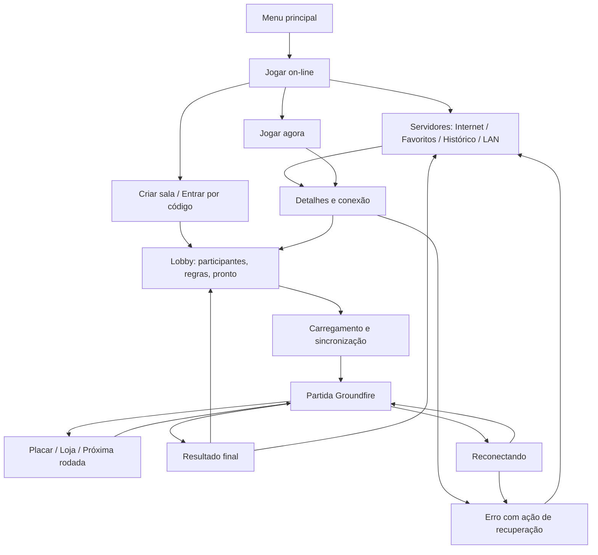

# Groundfire Godot Migration Strategy

This migration keeps the current Python/Pygame version alive while a Godot client is built in parallel.
The repository now keeps both implementations side by side: the Godot client lives under `versao-godot/godot/`, the Python/Pygame version lives under `versao-python/`, and root-level files are shared tooling, docs, CI, network services, and release artifacts.

This is the single Markdown source of truth for the Godot migration. Keep strategy, current status, validation, build/runtime notes, release walkthroughs, WebSocket protocol details, and server-directory schema updates here instead of creating new migration Markdown files under `docs/`. The image folders under `docs/references/` are fidelity assets used by tests and review, not separate narrative migration documents.

**Mapa de leitura:** o [projeto completo de equivalência da experiência](#projeto-equivalencia-2026-09-29) é o plano vigente para tornar Godot equivalente ao Python; o [projeto de fidelidade e experiência on-line](#projeto-2026-09) preserva os requisitos F/O anteriores; o [plano P00–P08](#projeto-encerramento-pendencias) registra as entregas anteriores; o [registro de implementação](#registro-implementacao-2026-09-26) contém evidências históricas, sem certificar mudanças posteriores; o [projeto de autonomia das edições](#projeto-edicoes-standalone) especifica como copiar e executar cada pasta sem o restante do repositório. Para instalar e operar o serviço, use o [README próprio](../servico-externo/README.md).

**Para o próximo agente:** começar pelo [plano operacional das pendências e passagem de trabalho](#continuidade-equivalencia-2026-09-30). Ele registra o estado após a correção do rastro, a primeira tarefa, os arquivos e os critérios de conclusão.

<a id="projeto-equivalencia-2026-09-29"></a>

## Projeto completo — experiência Godot equivalente à Python

**Data:** 2026-09-29; atualização de implementação em 2026-09-30. **Estado:** implementação em execução; menus, controles, comparações de projéteis/estados, combate com IA, ciclo de rodada, capturas e verificação de pacote implementados nesta árvore. **Referência Python congelada:** `0c4b5ee33f743c080fddfaf535e92142c2305413`, com hashes em `tests/fixtures/experience_parity/baseline.json`. O Python permanece inalterado. A execução Windows aprovou os testes descritos na seção 10, incluindo cinco ciclos por arma e uma partida de duas rodadas até o vencedor. O projeto completo ainda não está homologado: combinações adicionais de combate e a matriz visual, sonora, de rede, dispositivos e plataformas permanecem abertas.

### 1. Objetivo, referência e limites

O jogador que conhece a edição Python deve conseguir abrir a edição Godot, configurar participantes e controles, jogar, comprar, consultar resultados e participar de partidas conectadas usando as mesmas ações, informações e regras, sem precisar reaprender o jogo. A aparência, o áudio e o tempo das respostas também fazem parte do resultado.

Este plano detalha o fechamento da fidelidade solicitada em 29/09. Quando houver conflito de prioridade com lotes antigos, concluir os lotes EQ primeiro. Os requisitos F01–F16 continuam válidos; sua implementação parcial será reaproveitada e revalidada, não refeita sem evidência. Os lotes O/P de expansão social e salas gerenciadas permanecem como evolução posterior. Não mudar o Python para disfarçar uma diferença do Godot.

| Dentro deste projeto | Fora deste projeto |
|---|---|
| Experiência desktop correspondente ao Python: inicialização, menus, partida local, opções, controles, LAN/on-line já acessível no cliente Python, resultados e saída. | Criar novas armas, regras, mapas, ranking, voz, integração Steam ou redesenhar a identidade visual. |
| Equivalência de textos, navegação, configurações padrão, geometria, HUD, efeitos, sons e ritmo. | Expandir a interface Python para alcançar funcionalidades exclusivas ou experimentais do Godot. |
| Corrigir divergências Godot, criar provas comparativas e validar pacotes independentes. | Reescrever o motor inteiro, substituir o servidor Python ou remover uma das edições. |
| Compatibilidade web no subconjunto suportado, com limitações identificadas. | Declarar equivalência web de UDP, descoberta LAN ou criação de processos locais; publicar infraestrutura como condição de equivalência local. |

**Duas referências separadas:** para modo local, usar `versao-python/src/game.py`, `gamesimulation.py`, entidades, menus e `conf/`; para modo conectado, usar o fluxo Python efetivamente acessível, `versao-python/src/groundfire/app/`, `gameplay/match_controller.py`, `render/`, `ui/` e servidor correspondente. A existência de um adapter ou endpoint não prova que há uma jornada utilizável na interface. Regras locais e de servidor não devem ser misturadas.

**Política para recursos extras:** o caminho padrão Godot deve reproduzir o Python. Ferramentas exclusivas existentes serão preservadas em uma entrada de desenvolvimento optativa, fora da navegação clássica e desativada no primeiro uso. Isso inclui servidor dedicado exclusivo do menu Godot, opções técnicas extras e hub gerenciado que ainda não tenha equivalente Python. Não acrescentar um botão “Avançado” ao menu clássico apenas para acomodar extras. A seleção da entrada optativa poderá ser feita por configuração ou launcher de desenvolvimento; EQ-01 documentará o mecanismo antes da alteração. Recursos que já tenham equivalente Python devem ser mantidos no local correspondente, mesmo que pertençam ao navegador e não ao menu principal.

### 2. Diagnóstico inicial e classificação das evidências

| Área | Evidência inspecionada | Decisão de projeto |
|---|---|---|
| Menu principal | `src/mainmenu.py` contém quatro ações; `_show_main_menu` em `godot/scripts/main.gd` acrescenta `Dedicated Server` no desktop e altera espaçamentos. | Diferença confirmada no código. Restaurar composição e quatro ações no caminho clássico. |
| Opções | `src/optionmenu.py` oferece resolução, modo de tela, controles, aplicar e voltar; `_show_options` Godot combina essas funções com seções roláveis de vídeo, áudio, gameplay e on-line. | Diferença confirmada. Reproduzir tela e sequência Python, incluindo quando mudanças são aplicadas e salvas. |
| Núcleo local | Há roteador por participante, passo fixo, testes de combate/loja simultâneos, terreno e IA no Godot. | Base existente, não ausência de implementação. Revalidar contra o mesmo estado Python antes de corrigir. |
| Comparador | `compare_classic_replay.py` compara JSON recursivamente, com tolerância numérica global; `export_classic_replay.py` executa projéteis reais, mas seu cenário usa terreno sem colisão e lista vazia de jogadores. | Insuficiente para certificar uma partida completa. Ampliar cenário, esquema e comparação por campo; criar executor Godot equivalente. |
| Visual e áudio | Existem referências PNG e testes Godot, mas o registro anterior mantém captura pareada completa, escuta e dispositivos pendentes. | Não transformar aprovação de regressão Godot em prova de igualdade com Python. |
| On-line gerenciado | Hub Godot e adapters estão presentes; o registro P04/P07 aponta interface gerenciada Python pendente. | Não usar a expansão gerenciada como referência para modificar o Python neste projeto. Validar primeiro a jornada comum existente. |
| Pacotes e plataformas | Pastas standalone e launchers existem; evidências antigas pertencem a builds e ambientes específicos. | Revalidar a distribuição produzida ao final, sem herdar aprovação de outro commit. |

Estados de acompanhamento: `planejado`, `em execução`, `implementado sem aceite`, `em validação`, `aceito` e `bloqueado por dependência identificada`. Toda divergência recebe ID, modalidade, cenário, referência Python, comportamento Godot, severidade e evidência. Ausência de teste significa não certificado; não significa automaticamente defeito.

Severidades: **P0** impede jogar, troca o jogador controlado, muda resultado/regra ou perde dados; **P1** quebra uma jornada ou produz diferença perceptível de informação, comando, visual ou áudio; **P2** é diferença cosmética menor ou documental. Diferença conhecida não pode ser renomeada como adaptação de plataforma.

### 3. Contrato de experiência e inventário de jornadas

Em EQ-00, registrar para cada tela todos os estados realmente alcançáveis: inicial, foco, mouse sobre o item, pressionado, desabilitado, vazio, preenchido, modal, erro e retorno. Marcar como não aplicável quando o Python não apresentar determinado estado; não inventar estados apenas para preencher a matriz. Preservar os textos e o idioma da referência, inclusive nomes das armas.

| Jornada / cenário | Referência Python | Resultado exigido no Godot |
|---|---|---|
| UX-01: abrir offline → menu → confirmar/cancelar saída | `mainmenu.py`, `quitmenu.py`, launchers | Mesmas ações, ordem, composição, foco inicial e confirmação; sem exigir serviço externo. |
| UX-02: configurar → iniciar → voltar | `playermenu.py`, `player.py` | Mesmos limites de participantes/rodadas, nomes, cores, humano/IA, controladores, valores iniciais e estado ao retornar. |
| UX-03: opções → controles → aplicar/cancelar/voltar | `optionmenu.py`, `controllermenu.py`, `setcontrolsmenu.py`, `controlsfile.py` | Mesmas transições, mapeamento e momento de aplicação; reinício preserva as preferências que o Python preserva. |
| UX-04: rodada com dois humanos e bots | `gamesimulation.py`, `humanplayer.py`, `tank.py`, `aiplayer.py` | Ações simultâneas, comando por participante, câmera/HUD corretos e mesmo efeito das entradas. |
| UX-05: eliminar tanques → placar → loja → nova rodada | `scoremenu.py`, `shopmenu.py`, simulação | Mesmos pontos, dinheiro, catálogo, preços, quantidades, compra simultânea, confirmação e tempos de transição. |
| UX-06: última rodada → vencedor/empate → retorno | `winnermenu.py`, `game.py` | Mesmo vencedor e desempate, informações, comandos e destino de retorno. |
| UX-07: interromper partida → opções/retorno/saída | `game.py` e estados de menu alcançáveis | Pausa, foco, confirmação, áudio e avanço da simulação seguem a modalidade Python correspondente. |
| UX-08: procurar servidor → filtrar/ordenar → favorito/histórico → conectar | `serverbrowsermenu.py`, `groundfire/ui/menus.py`, `groundfire_net/browser.py` | Mesmas abas aplicáveis, filtros, dados, endereço manual, seleção, mensagens e retorno com contexto preservado. |
| UX-09: lobby → pronto → jogo → loja → resultado → revanche | `groundfire/app/`, `gameplay/match_controller.py`, `render/`, `ui/` | Identidade atribuída pelo servidor; mesmas ações por fase e apresentação equivalente do estado autoritativo. |
| UX-10: servidor cheio/senha incorreta/timeout → cancelar/repetir; queda → retomada | navegador, sessão e protocolos Python | Mensagem acionável equivalente, UI responsiva, cancelamento definitivo e retomada sem duplicar comandos/sons. |
| UX-11: espectador e chat | fluxo conectado Python | Espectador recebe informações permitidas, sem controlar tanque; chat/foco não dispara comandos de combate. |
| UX-12: fechar → reabrir → mover pasta inteira | configuração, armazenamento e launchers standalone | Preferências/favoritos/histórico mantidos conforme contrato de cada edição; pacote Godot funciona sem acessar a pasta Python. |

**Contrato visual:** comparar mesmo roster, valores, seed/estado inicial, fase, tick e tamanho de viewport. Congelar animação e dados variáveis na captura. Cor, fonte, atlas, escala, posição, alinhamento, camadas, transparência e área clicável fazem parte do contrato. O alvo primário é 1024×768; verificar também 640×480, 800×600, 1280×960, 1280×1024, 1600×1200 e 1920×1080. Resoluções adicionais de teste não devem aparecer como nova opção no menu se o Python não as oferece. Em proporções sem referência equivalente, registrar a adaptação de viewport, preservando geometria do mundo e conteúdo legível.

**Contrato de resposta:** medir entrada → tick de aplicação → primeiro quadro visível, repetição de seleção, cooldown, transições, tremor e câmera. Não basta chegar ao mesmo resultado após um atraso diferente. A política de pausa e perda de foco será observada na referência, sem presumir que partida conectada possa pausar o servidor.

### 4. Organização técnica da solução

Manter o núcleo e os componentes existentes. Separar responsabilidades apenas onde uma diferença comprovada exigir isso; não condicionar fidelidade a uma grande refatoração.

| Superfície | Arquivos principais | Direção da implementação |
|---|---|---|
| Telas clássicas | `main.gd`, `classic_button.gd`, `classic_selector.gd`, `classic_label.gd`, `classic_font.gd`, `groundfire_theme.gd` | Centralizar medidas e estilo da referência; máquina de estados explícita para navegação; aplicar preferências no mesmo momento que Python. |
| Entrada e configuração | `player_input_router.gd`, `control_settings.gd`, `classic_config.gd`, `data/classic/` | Perfil por participante, prioridade entre comandos, dispositivo, deadzone/repetição e defaults derivados da referência. |
| Simulação local | `local_match.gd`, `classic_fixed_step.gd`, `terrain_model.gd`, entidades existentes | Atualização fixa e observável; estado de replay independente da resolução/renderização; RNG compatível ou sequência de amostras explícita. |
| Apresentação | `local_match_hud.gd`, `local_match_shop.gd`, `online_match.gd` | Componentes compartilháveis recebem estado da modalidade correta; não recalculam regras do servidor. |
| Rede | `network_adapter.gd`, `lan_discovery.gd`, `server_directory.gd`, `browser_store.gd` | Preservar protocolos e servidor autoritativo; identificar jogador, geração de pedido e evento para cancelar/deduplicar corretamente. |
| Provas de equivalência | exportador/comparador em `scripts/`, `tests/fixtures/`, testes Godot | Executar os dois runtimes reais; produzir estados normalizados, eventos, imagens e relatório da primeira divergência. |
| Entrega | launchers, `runtime/`, manifests e scripts de cada edição | Testar o artefato que será distribuído em pasta isolada; não depender de caminhos do computador de desenvolvimento. |

Arquivos implementados: `tests/fixtures/experience_parity/scenarios.json` inventaria UX-01–12 e as lacunas de aceite; `projectiles.json` descreve os disparos e cadências; `versao-godot/godot/tests/classic_replay_export.gd` executa o atualizador Godot de produção; `scripts/compare_projectile_runtimes.py` executa as entidades Python e compara ambos. `states.json`, `classic_state_export.gd` e `compare_state_runtimes.py` cobrem terreno, tanques, recarga, IA, economia, fases e combates integrados. `scripts/validate_experience_parity.py` produz logs, cobertura por jornada e relatório JSON/HTML. Os exportadores usam classes de produção; os ensaios isolados e os combates integrados são identificados separadamente. Há ciclos das cinco armas e uma partida completa de duas rodadas; isso não certifica todas as combinações de armas e participantes.

### 5. Plano de execução e entregas

A tabela abaixo preserva o escopo exigido. O estado de execução de cada lote está na seção 10. “Implementado” em um registro F/P anterior não equivale a “aceito” no lote EQ. Cada lote deve fechar cenários contra a referência congelada e atualizar este documento.

| Lote / prioridade | Trabalho e entrega concreta | Dependências | Aceite para encerrar |
|---|---|---|---|
| EQ-00 / P0 — congelar a referência | Inventariar UX-01–12; registrar commit, versões, hashes de assets/config, defaults, telas e perfis; capturar execução Python; abrir lista de diferenças e manifesto de cenários. | Nenhuma. | Cada ação alcançável tem referência, cenário, modalidade e evidência; lacunas explicitamente listadas. |
| EQ-01 / P1 — entrada, menus e opções | Restaurar menu de quatro ações, geometria, confirmação, Options e telas de controles; isolar extras optativos; preservar navegação/estado de retorno e semântica de aplicar/salvar. | EQ-00. | UX-01–03 passam em estados normais, cancelamento, teclado/mouse e reinício, com pares visuais. |
| EQ-02 / P0 — controles e ritmo | Auditar dois perfis de teclado, joysticks por slot, prioridade de teclas opostas, rebinding, repetição, perda de foco e desconexão; confirmar passo fixo e política de frames lentos. | EQ-00. | Dois humanos independentes em combate/loja; comparação de entrada por tick passa em 30/60/144 FPS; dispositivos físicos ensaiados. |
| EQ-03 / P0 — prova diferencial completa | Exportar estado real Python/Godot; ampliar colisão, terreno, tanques, eventos, RNG, compra/fases; adaptar comparador por tipo/campo; gerar relatório de primeira divergência. | EQ-00. | Teste negativo detecta tick, evento e estado adulterados; mesmo cenário é executado nas duas engines; cobertura faltante falha no aceite completo. |
| EQ-04 / P0 — mundo, tanques e IA | Corrigir apenas divergências de terreno/camada/queda, movimento, combustível, escudo, dano, morte, escolha de alvo e memória de IA; preservar ordem de atualização. | EQ-02 e EQ-03. | Mesmos estados e decisões nos cenários de borda, terreno suspenso, redimensionamento, eliminação simultânea e bots. |
| EQ-05 / P0 — cinco armas e efeitos | Auditar Shell, Missile, MIRV, Nuke e Machine Gun: lançamento, controle, divisão, munição, dano, colisão, explosão, cooldown e entidades derivadas. | EQ-03 e EQ-04. | Todas as armas passam em trajetória livre, terreno, tanque, dano em área, limite do mundo, tiro simultâneo e última munição. |
| EQ-06 / P0 — ciclo e economia | Fechar placar, bônus, autoderrota, empate, loja simultânea, compra insuficiente, item indisponível, conclusão individual, próxima rodada e vencedor. | EQ-04 e EQ-05. | Partida completa produz os mesmos saldos, inventários, fases e resultado; UX-05–07 passam. |
| EQ-07 / P1 — visual completo | Parear setup, controles, arena, HUD, placar, loja, vencedor, pausa, opções, modais e navegador; corrigir fontes, cores, escala, efeitos, câmera e áreas clicáveis. | EQ-01 e EQ-06; telas de rede fechadas após EQ-09. | Todas as telas/estados aplicáveis têm pares revisados nas resoluções previstas; sem informação faltante ou recorte. |
| EQ-08 / P1 — áudio | Inventariar assets e disparos/loops; medir início, volume, duração, sobreposição, interrupção e saída; revisar conversões existentes. | EQ-05 e EQ-06. | Traços de eventos e escuta A/B passam em disparos concorrentes, morte, pausa e retorno; sem sons duplicados ou loops órfãos. |
| EQ-09 / P0 — jornada conectada equivalente | Fechar navegador, filtros, favorito/histórico, lobby, identidade, HUD/fases, loja, resultado, revanche, chat, espectador e recuperação de falhas contra Python conectado. | EQ-00, EQ-02, EQ-03 e EQ-06. | UX-08–11 passam com Python/Godot mistos, slots 2/8, UDP real, servidor separado e transporte WS quando aplicável. |
| EQ-10 / P1 — persistência e pacotes | Validar configurações existentes, armazenamento, inicialização offline, cópia isolada, Windows/Linux e subconjunto web; tratar dados inválidos sem perder preferências válidas. | EQ-01–09 aceitos para a plataforma. | UX-12 e smoke de partida completa passam no pacote exportado; web tem matriz de exceções própria; ausência de ambiente fica como não certificado. |
| EQ-11 / P1 — homologação e encerramento | Executar jornadas contínuas, revisão comparativa de UX e matriz final; anexar manifesto/relatórios; documentar defeitos resolvidos, adaptações e plataformas aceitas. | EQ-00–10. | Critérios da seção 9 cumpridos; nenhum lote fechado só por inspeção de código ou quantidade de testes. |

**Sequência de entrega:** EQ-00 → EQ-01/02/03 → EQ-04/05/06 → EQ-07/08/09 → EQ-10 → EQ-11. As barras indicam frentes compatíveis, não obrigação de execução simultânea. Cada dependência da tabela prevalece; acabamento de rede em EQ-07 depende de EQ-09. A implementação pode avançar por fatias de jornada, preservando as dependências e um jogo utilizável a cada entrega.

**Correspondência histórica:** EQ-02–06 fecham F01–F06/F12/F13 e P00/P01; EQ-01/07/08 fecham F14–F16 e P02; EQ-09 fecha F07–F11 e os recursos O já presentes na referência; EQ-10/11 reutilizam o aceite de distribuição P08/ST aplicável. P03–P07 de funcionalidades gerenciadas novas não se tornam dependência artificial da fidelidade clássica.

**Responsabilidades:** implementação Godot responde pelas correções; testes/fidelidade responde por cenários e relatório independente da implementação; revisão de UX responde pelas capturas, escuta e jornadas; empacotamento responde pelos artefatos e execução isolada. São papéis, não uma equipe já alocada, e podem ser exercidos sequencialmente pela mesma pessoa. Registrar o responsável real ao iniciar cada lote. A revisão final apresenta evidências ao mantenedor; não exige interrupções para aprovar cada correção rotineira.

**Planejamento de prazo:** não há data de entrega prometida nem equipe alocada. Ao concluir EQ-00, estimar esforço por lote a partir do número de divergências reproduzíveis, disponibilidade dos dispositivos e ambientes. Atualizar previsão ao fechar EQ-03 e EQ-09, que concentram a incerteza de comparação e rede. Priorizar P0, depois jornadas P1 e acabamento P2; não cortar cenários para cumprir uma previsão.

### 6. Protocolo de comparação e critérios mensuráveis

Cada cenário terá `id`, modalidade, referência Python, versão do esquema, seed/estado de RNG, configuração, participantes/dispositivos, estado inicial, comandos indexados por tick, duração, resultados esperados, resoluções/FPS e plataformas aplicáveis. Registrar separadamente metadata de execução: commit, engine, Python, SO, renderer, display/DPI, dispositivo de áudio e hashes. Metadata diferente entre engines não é estado de gameplay a comparar.

Exportar por tick: fase/rodada, relógio de simulação, jogadores, posição/velocidade/ângulo, HP/escudo/combustível, arma/munição/cooldown, projéteis e filhos, terreno/camadas, memória da IA, saldo/placar, estado de loja e eventos com ordem e identidade. Evitar comparar IDs internos de memória: criar correspondência determinística por entidade, preservando ordem quando ela afeta o jogo.

| Dimensão | Critério de aceite |
|---|---|
| Valores discretos | Igualdade exata de fase, tick de evento, identidade, munição, saldo, vencedor, comandos, contagens e ordem relevante. |
| Valores físicos contínuos | Tolerância absoluta inicial de `1e-5` nas unidades normalizadas Python; documentar campos e conversão. Diferença que altera colisão, dano, decisão ou tick de evento reprova mesmo dentro da tolerância numérica. |
| RNG e mundo inicial | Mesmas amostras/estado e geometria; a mesma seed em geradores diferentes não é prova suficiente. |
| Tempo de entrada/simulação | Mesmo tick de aplicação para replay; em dispositivo real, diferença observada de resposta no p95 de no máximo um quadro a 60 Hz no mesmo equipamento, com pelo menos 100 ações por perfil e logs de medição. Não mascarar atraso por média. |
| Imagens | Layout e áreas interativas iguais no viewport de referência; alvo de desvio geométrico máximo de 1 pixel por arredondamento, sem deslocamento cumulativo. Textos, valores e cores intencionais devem corresponder. |
| Diferença de rasterização | Produzir diff e métricas por região. Máscaras só para conteúdo realmente variável e identificado. Revisão humana deve confirmar que diferenças residuais são de rasterização, sem aceitar fonte/escala/layout errado por média global baixa. |
| Áudio | Mesmo evento/tick na simulação, loop/interrupção e duração; para áudio reamostrado, diferença de duração de no máximo um tick. Medir onset e loudness em condições iguais, investigar variação superior a um quadro/1 dB e exigir escuta A/B para aceite. |
| Rede | Mesmo estado autoritativo e ações disponíveis; apresentar snapshot equivalente no mesmo instante lógico, sem comparar cegamente frames de chegadas diferentes. Cancelamento e reconexão não duplicam ação/efeito. |
| Responsividade | Em hardware/renderer registrados, sessão de 30 min com perfil de 8 participantes, sem travar menus/rede; p95 de frame dentro de 16,7 ms para alvo de 60 FPS. Se a máquina não sustentar a referência, registrar ambiente inadequado ao alvo, sem declarar aprovação. |

Esses limites são metas de aceite deste projeto, não medições já obtidas. Ajuste de tolerância exige justificativa por campo/plataforma e evidência de que a experiência permanece equivalente; não ampliar limite global para fazer um teste passar. O comparador atual precisa distinguir números discretos de contínuos antes do aceite EQ-03.

### 7. Matriz mínima de ensaios

| Eixo | Casos obrigatórios |
|---|---|
| Participantes | Um humano com bot, dois humanos, humanos+IA e oito participantes; somente bots onde a referência permitir; slots extremos e reuso de slot. |
| Dispositivos | Dois perfis de teclado simultâneos, mouse, dois controles físicos simultâneos; rebinding, desconectar/reconectar, perder foco, chat aberto e comando oposto. |
| Armas | As cinco armas, extremos válidos de ângulo/potência, disparos concorrentes, última munição, troca durante recarga, teleguiado enquanto outro atira. |
| Terreno e dano | Bordas, camadas suspensas, crateras sobrepostas, queda/apoio, dano zero, morte exata, autoderrota e eliminação simultânea. |
| Economia/fases | Saldo insuficiente, pacote de munição, compra simultânea, Done individual, empate, bônus, última rodada, saída e retorno. |
| Render/tempo | 30/60/144 FPS, frame lento e redimensionamento; todas as resoluções da seção 3, janela/tela cheia e DPI 100%/150% no Windows. |
| Rede real | Python+Python, Godot+Godot e Python+Godot; um espectador; servidor em processo separado e outra máquina LAN; cheio, senha incorreta, incompatibilidade, cancelamento e retomada. |
| Rede degradada | Perfis controlados de RTT 50/150/300 ms, perda 1%/5%, jitter 30 ms e interrupção de 5 s; registrar a injeção utilizada e recuperação observada, sem tratar simulação em memória como socket real. |
| Persistência | Primeiro uso, preferências anteriores, reinício, mover pasta com espaço/acento, arquivo inválido e diretório sem escrita; nenhuma dependência da outra edição. |
| Plataformas | Windows e Linux desktop em pacotes exportados; web em navegadores/versões registrados, com subconjunto explícito. macOS fica não certificado até ter ambiente e build ensaiados. |

Não é necessário produto cartesiano de todos os eixos: usar cobertura por pares para ambiente/dispositivo/resolução, mas executar todas as armas e bordas críticas contra ambas as engines e todas as jornadas em cada plataforma declarada aceita. Um teste headless não substitui dispositivo físico, áudio, GPU ou pacote final.

### 8. Ferramentas, automação e evidências

Reaproveitar `scripts/validate_godot_fidelity.sh`, `scripts/validate_godot_visuals.sh`, `scripts/capture_pygame_references.py`, `scripts/validate_godot_udp_integration.py`, os testes Python e `versao-godot/godot/tests/`. O capturador existente não cobre sozinho todo o inventário UX; EQ-00/EQ-07 devem ampliá-lo com estados reproduzíveis. Fixtures e goldens existentes não serão sobrescritos automaticamente para acomodar uma mudança Godot.

Comandos existentes de verificação, a partir da raiz e com dependências instaladas:

```powershell
python scripts/validate_godot_migration_contract.py
python scripts/export_classic_reference_fixture.py --check
python scripts/export_classic_replay.py --check
python -m pytest -q tests/test_classic_replay_comparator.py tests/test_port_fidelity.py tests/test_landscape_fidelity.py
python scripts/validate_godot_udp_integration.py --godot-bin "C:\caminho\para\Godot.exe"
git diff --check
```

O caminho Godot acima é um parâmetro a substituir, não uma instalação presumida. Os gates `.sh` exigem Bash; a orquestração Python proposta deverá permitir rodar a matriz desktop sem acrescentar essa dependência ao jogador. Usar versões compatíveis com os manifests atuais: `versao-python/pyproject.toml` inspecionado declara `>=3.10,<3.15`, diferente de trechos históricos deste documento. Registrar versão exata da engine e templates correspondentes no build, sem inferir suporte pela disponibilidade de um executável.

Artefatos por execução em `.tmp/experience-parity/<run_id>/` (ou `--output`): `manifest.json`, `journey-coverage.json`, `report.json`/`report.html`, replays Python/Godot, primeira divergência, capturas, logs e identificação dos pacotes. O gate atual gera esses artefatos; eventos/escuta de áudio e demais evidências manuais continuam pendentes. Versionar apenas cenários e referências pequenas revisadas; anexar artefatos grandes ao resultado da execução. Relatórios não devem conter senhas/tokens de teste.

**CI por alteração relevante:** validar contrato, fixtures, testes unitários focados, contratos headless e comparação diferencial curta. **CI periódica e candidata a release:** matriz mais ampla, rede real, capturas e exports nos ambientes disponíveis. **Aceite manual registrado:** controles físicos, escuta, revisão visual e pacote em máquina limpa. Falta de cenário obrigatório deve retornar estado incompleto no relatório; um skip não pode produzir selo de equivalência.

Para cada lote, preencher: `Reference material:`, `User-visible contract:`, `Allowed adaptation:` e `Required validation:`; registrar commit, responsável, cenários aprovados/reprovados, primeira divergência, correção e links das evidências. Esses campos continuam obrigatórios pelo Migration Compatibility Contract.

### 9. Riscos, adaptações e definição de pronto

| Risco | Tratamento e prova exigida |
|---|---|
| Referência Python muda durante a execução | Congelar commit/config/fixtures; atualização consciente da base exige reexecutar cenários afetados e registrar o motivo. |
| Testes repetem a lógica Godot e concordam com o mesmo erro | Executar classes reais de cada runtime e comparar resultados; usar cenários negativos para provar capacidade de detectar diferenças. |
| Aparência semelhante esconde física diferente | Aceite separado de replay e visual; os dois são obrigatórios. |
| Arredondamento ou RNG diverge em casos limites | Unidades normalizadas, ordem/eventos e primeiras divergências por tick; corrigir causa antes de mudar tolerância. |
| Extras alteram defaults/foco ou reativam comportamento diferente | Testar perfil limpo e perfil existente; entrada optativa isolada do caminho clássico e sem alterar configurações dele. |
| Dispositivo, Linux ou GPU indisponível | Registrar cenário e ambiente pendentes; concluir outros lotes, mas não certificar essa cobertura. |
| Export funciona apenas na máquina de desenvolvimento | Executar pacote em pasta isolada/máquina limpa, sem raiz/Python irmão; conferir manifests e localização dos dados. |
| Escopo cresce para social/serviço público | Manter expansão O/P separada; servidor de teste controlado basta para validar comportamento conectado, sem alegar homologação pública. |

Adaptações permitidas são somente limitações explícitas de plataforma e diferenças internas invisíveis. Para web: sem UDP/LAN ou criação de processos, áudio sujeito à interação exigida pelo navegador, armazenamento conforme navegador e perda de foco tratada explicitamente. Cada exceção recebe recurso, motivo, alternativa, efeito perceptível e teste; não usar “web” como exceção genérica de gameplay ou visual.

**O projeto estará concluído somente quando:**

1. UX-01–12 e todos os cenários obrigatórios aplicáveis estiverem aceitos, com rastreabilidade EQ → cenário → referência → evidência.
2. Não houver divergência P0/P1/P2 aberta no escopo declarado equivalente. Uma limitação ainda aberta impede a declaração global; aceitações parciais devem nomear precisamente modalidade/plataforma coberta.
3. Replays completos comprovarem regras, armas, terreno, IA, economia, ciclo e controles; screenshots isoladas e quantidade de testes não substituírem essa prova.
4. Capturas pareadas, escuta A/B e controles físicos estiverem revisados; diferença residual permitida tiver causa e limite documentados.
5. Partidas locais e mistas conectadas completas passarem no pacote exportado, com persistência, cancelamento, retomada e saída verificados.
6. O Python continuar preservado como referência e ambas as pastas permanecerem independentes e executáveis.
7. Relatório final listar versões, cenários, plataforma, adaptações e evidências, distinguindo claramente equivalência desktop, subconjunto web e infraestrutura pública não ensaiada.

**Entrega revisável ao final:** código Godot corrigido, cenários/fixtures e comparador completos, cobertura automatizada, referências visuais/sonoras revisadas, pacotes testados e atualização deste documento. Não publicar, criar tag ou anunciar fidelidade total apenas porque um gate antigo passou.

### 10. Primeiro lote executável e estado desta entrega

Implementação e verificação realizadas por Codex no Windows, Python 3.14.7 / pygame-ce 2.5.8 e Godot 4.6.2. O caminho padrão apresenta as quatro ações Python; `Find Servers` abre diretamente o navegador. Ferramentas anteriores continuam acessíveis ao iniciar Godot com `-- --development-tools`, sem acrescentar uma ação ao menu clássico. Options mantém alterações de vídeo em rascunho até Apply; Back descarta o rascunho. A configuração começa sem participantes, permite entrada pelo disparo e mantém controladores distintos. Os oito layouts de joystick, a seleção por dispositivo, a edição dos dois teclados e o roteamento de mísseis usam o perfil do participante.

| Lote | Estado desta execução | Evidência e limite |
|---|---|---|
| EQ-00 | em execução | Baseline com hashes e inventário UX-01–12 versionados; ainda faltam estados completos de combate/rede e dispositivos. |
| EQ-01 | em validação | Menu, saída, setup, Options, Controllers e edição de layout implementados; teste funcional e 42 pares de imagens em sete resoluções. Revisão visual completa e todos os estados de foco/erro ainda pendentes. |
| EQ-02 | em execução | Teclados separados, layouts/atribuições persistentes, importação de bindings antigos, eixos vinculados e slots estáveis após desconexão simulada. Passo fixo comparado em 30/60/144 FPS e frames lentos; não é medição de latência nem ensaio físico. |
| EQ-03 | em execução | Dois runtimes reais, comparação por campo, tipos discretos exatos e testes negativos. 99 cenários de estado: os 82 anteriores, dez combinações entre armas, quatro confrontos adicionais humano/bot e três ensaios de propulsores/terremoto. Mantidos os cinco ciclos por arma e a partida de duas rodadas até o vencedor. |
| EQ-04 | em execução | Escala única, enquadramento fixo, terreno/RNG/posições iniciais pareados; movimento e apoio comparados por tick; crateras, camadas suspensas e terremotos comparados nas 500 fatias. IA usa comandos graduais, memória de impactos e decisão de alvo da referência; combate com 2/4/8 bots comparado. As cinco armas têm combate integrado; combinações adicionais entre armas e participantes ainda pendentes. |
| EQ-05 | em execução | 33 cenários isolados das cinco armas e nove de recarga/munição/seleção, combate integrado, quatro disparos simultâneos e as dez combinações de duas armas diferentes. Quatro casos adicionais confrontam humano com arma especial e bot com Shell. Isso ainda não cobre todas as sementes, ordens de disparo, loadouts e bordas. |
| EQ-06 | em validação parcial | Cinco ciclos reais arma → eliminação → placar → compra → rodada seguinte e uma partida de duas rodadas até WinnerMenu. Comparam posição, dano, munição, arma, recarga, dinheiro, pontuação, seleção e Done por tick. Saldo inicial explícito garante compra efetiva; mortes não são injetadas nesses seis casos. |
| EQ-07 | em execução | Dezoito estados capturáveis nas sete resoluções, incluindo navegador, filtros, endereço e conexão com/sem senha. `classic_server_browser.gd` usa a composição e os controles da referência sobre o backend existente. Os 28 novos pares de diálogos receberam revisão de composição; rasterização, efeitos e revisão integral dos demais estados permanecem pendentes. |
| EQ-08 | em validação parcial | Eventos de disparo/impacto e quantidade de fontes dos quatro loops comparados por tick. Mísseis, metralhadoras e propulsores possuem reprodução independente por fonte; teste de reprodução confirma concorrência, soltura sem reiniciar o outro som, pausa e limpeza. Limites dos quatro loops WAV corrigidos. Dez assets medidos; escuta A/B e mistura/loudness no dispositivo ainda pendentes. |
| EQ-09 | em validação parcial | Navegador direto, persistência, protocolo, recuperação e UDP misto em processos separados passam. A escolha Human/AI/Spectator chega aos transportes; entrada como IA confirmada no snapshot do servidor Python real. Ainda faltam a verificação prévia de disponibilidade no fluxo clássico, outra máquina LAN e a matriz de rede degradada. |
| EQ-10 | em validação parcial | Export Windows com INIs incluídos, cópia somente do EXE para pasta temporária com espaço/acento, percurso headless e reload aprovados; não certifica máquina limpa, Linux, navegador nem partida interativa completa. |
| EQ-11 | em execução | Gate integrado ao CI, relatório e inventário de lacunas; aceite final e sessão de 30 minutos pendentes. |

**Diferenças corrigidas e como reproduzir:**

| ID / severidade | Cenário / referência | Correção Godot / evidência |
|---|---|---|
| EQ-D01 / P1 | UX-01/08; `mainmenu.py` | Quatro ações; navegador direto; extras optativos. `experience_menu_check.gd`. |
| EQ-D02 / P1 | UX-03; `optionmenu.py` | Apply/Back e retorno dos controles preservam o rascunho; gravação verificada. |
| EQ-D03 / P1 | UX-02; `playermenu.py` | Setup vazio, entrada por Fire, perfis únicos, nomes/cores e rounds clássicos. |
| EQ-D04 / P0 | UX-04; `humanplayer.py`, `missile.py` | Míssil consulta o controlador do dono, inclusive Keyboard2; input de joystick não deve acionar o participante de teclado. |
| EQ-D05 / P0 | `missile.py`, `mirv.py`, `shell.py` | Velocidade de míssil usa a conversão da gravidade; combustível preservado ao sair do mundo/atingir solo; MIRV divide no ápice real, sem atraso mínimo artificial; posição balística usa estado de lançamento e míssil conserva coordenadas escalares entre ticks. Replay das entidades reais. |
| EQ-D06 / P1 | UX-01–03; `font.py`, `selector.py`, `menu.py` | Geometria clássica, tamanho de glyph derivado da largura, sombras, áreas de clique, setas e tiles em pixels nativos após resize. Capturas pareadas. |
| EQ-D07 / P0, parcialmente corrigido | EQ-03/04/06; mundo e partida completa | `classic_world.gd` centraliza 104 px/unidade para tanques, projéteis, explosões, gravidade e terreno; câmera clássica fixa. Cinco mundos com seed/roster, seis percursos de movimento e cinco sequências de terreno passam. Os 20 combates incluem humanos, bots, cinco ciclos por arma com compra e uma partida de duas rodadas até o vencedor. Permanecem combinações adicionais e a homologação das jornadas fora desses cenários. |
| EQ-D08 / P0 | UX-04/05; `tank.py`, `gamesession.py`, `gamesimulation.py` | Combustível/reserva começam em zero. Última eliminação inicia cinco segundos de simulação antes do score; morte tardia pode gerar empate. Contagem inicial respeita `< 0`. `states.json` e percurso do pacote. |
| EQ-D09 / P1 | UX-05/06; `scoremenu.py`, `winnermenu.py`, `shopmenu.py` | Fire de qualquer participante e Fire mantido durante a espera avançam placar/resultado. Autoavanço mantém liderança anterior. Done de todos só muda a fase no próximo tick; menus não continuam simulando o mundo. 29 cenários diferenciais. |
| EQ-D10 / P0 | UX-12; `classic_config.gd`, export presets | Confirmada ausência dos INIs no EXE anterior; incluídos em todos os presets. Verificador do release percorre menu → setup → combate → pausa → score → loja → próxima rodada → opções e verifica persistência após reinício. |
| EQ-D11 / P0 | UX-04; `tank.py`, `landscape.py` | Corrigidos sinal da inclinação, encaixe prematuro no solo, salto com movimento e combustível vazio, queda/bordas e deslizamento de tanque morto. Integração escalar em double e soma compensada do terreno preservam as decisões do Python 3.12+; desenho continua usando Vector2. Seis cenários por tick. |
| EQ-D12 / P0 | UX-04/05; `gamesession.py`, `landscape.py` | Explosão inclui o raio de impacto do tanque no dano radial; não reposiciona o tanque antecipadamente. Crateras preservam camadas finas; terremoto não limita artificialmente a base; espera negativa da queda é preservada. Três cenários de dano real e cinco de deformação/queda. |
| EQ-D13 / P0 | UX-04; `weapons_impl.py`, `tank.py`, `gamesimulation.py` | Removido desconto duplicado da recarga inicial, recarga rearma após disparar, Fire mantido exige liberação como no Python, troca mantida repete com o mesmo atraso, metralhadora preserva recarga/munição e seleção ao esgotar. Projéteis novos começam a atualizar no tick seguinte. Nove cenários de arma e seis combates reais. |
| EQ-D14 / P0 | UX-04/05; `aiplayer.py`, `tank.py`, `shopmenu.py` | `classic_ai.gd` reproduz escolha de alvo, mira gradual, espera por tiro, memória de impacto, alvo deslocado/morto e comandos por fase. Usa a mesma aplicação de comandos dos humanos, em ordem de participante. Bots passam pela loja com os atrasos de 0,4/0,2 s; não compram. IA anterior de mira instantânea/armas especiais permanece optativa em `--development-tools`. Dois ensaios de decisão, quatro combates com bots e duas lojas. |
| EQ-D15 / P0 | UX-04; `common.py`, `shell.py`, `landscape.py` | Preservados o PI decimal da referência para mira/lançamento, timestamps de lançamento, coordenadas escalares de Shell/Nuke, interseção por fatia e dano radial em double. Cratera integrada é calculada nas unidades Python; alturas e folgas de pouso não passam por Vector2 float32. Corrigido desvio de dano e de apoio sobre camada suspensa descoberto no combate com quatro bots. Inclinação volta à tolerância normal `1e-5`. |
| EQ-D16 / P0 | UX-04/05; `mirv.py`, `missile.py`, `machinegunround.py` | Fragmentos nascem com timestamp do ápice; míssil conserva posição/velocidade escalar; balas de metralhadora usam atraso de lançamento correto, deixam de nascer após morte e conservam recarga. Nuke simultâneo revelou corte de camada superior abaixo do piso `-7`; clamp passa a valer também nessa camada. Casos individuais, simultâneos e regressão isolada de terreno. |
| EQ-D17 / P1 | UX-05/06; `scoremenu.py`, `shopmenu.py`, `winnermenu.py` | Telas completas com fundo clássico, tipografia do atlas, posições, estoque, seleção por jogador e resultado com até oito vencedores. Removidas rodas desenhadas apenas no Godot e corrigida altura do corpo do tanque. Capturas de estados idênticos, separadas da prova de combate. |
| EQ-D18 / P1 | EQ-08; `sounds.py` | Segundo efeito não interrompe o primeiro; até 32 vozes por efeito pontual via `AudioStreamPlayer.max_polyphony`. Loop de metralhadora cessa no tick da morte, sem interromper outro atirador vivo. Corrigidos tamanho RIFF/padding de cinco WAVs Godot, preservando PCM; exportação sem os erros de leitura anteriores. Nove PCM idênticos; Nuke convertido com mesma duração e diferença RMS de aproximadamente 0,0094 dB. RMS de arquivo não equivale a loudness medido no dispositivo. |
| EQ-D19 / P1 | UX-07; `gamesimulation.py`, `quitmenu.py` | Escape no combate clássico abre QuitMenu; No retorna a MainMenu, como no Python. Menu de pausa anterior continua optativo em `--development-tools`. Percurso verificado no teste de menu e no EXE isolado. |
| EQ-D20 / P1 | EQ-08; `tank.py`, `missile.py`, `weapons_impl.py`, `quake.py` | Reprodução independente por fonte dos loops. Jogador sem salto não interrompe o propulsor de outro; morte/soltura/combustível esgotado encerram a fonte correspondente. `loop_end` abrange o WAV completo; sair interrompe inclusive metralhadora com gatilho mantido. Comparação agora preserva multiplicidade e inclui jet/quake. |
| EQ-D21 / P0 | EQ-04/08; terremoto integrado | A conversão repetida entre pixels e unidades clássicas alterava uma decisão de apoio do tanque no tick 160. `drop_terrain` conserva alturas clássicas em double, aplicando a mesma subtração da referência e atualizando apenas a representação gráfica. O ensaio de 500 ticks passa sem ampliar tolerâncias. |
| EQ-D22 / P1, parcialmente corrigido | UX-08; `serverbrowsermenu.py` | Navegador clássico usa coordenadas, atlas, colunas, cores, rodapé e 24 linhas da referência. Diálogos de filtros, endereço e conexão implementados com entrada de texto, Enter/Escape, senha mascarada, Human/AI/Spectator e espera por vaga. Roda percorre uma linha e PageUp/PageDown movem a seleção em 24 linhas. Estados de rede indisponível e aceite visual completo permanecem abertos. |
| EQ-D23 / P1 | UX-08; `serverbrowsermenu.py` | Add a Server salva nos favoritos e permanece na lista, sem conectar automaticamente. Endereço vazio/porta inválida mantêm o diálogo com erro; hostname usa porta 27015. Add Favorite repetido não remove o favorito. Testes de menu e percurso do EXE. |
| EQ-D24 / P1 | UX-08/09; JoinRequest | Escolha AI era perdida pelo cliente Godot. `is_computer` agora atravessa Online Match, UDP e WebSocket; Spectator exclui AI. Teste de protocolo e entrada real no servidor Python verificam o campo no snapshot; cancelamento limpa credenciais. |
| EQ-D25 / P1 | UX-04; `trail.py`, `smoke.py` e desenho de efeitos | Rastro existia na simulação, mas UVs em pixels faziam a textura amostrar quase somente a borda transparente. UVs normalizadas corrigem rastro, fumaça, propulsor, explosão e cursor. `experience_effects_check.gd` usa renderização real e verifica pixels dos cinco efeitos, um disparo Shell no cenário e desaparecimento do rastro. O teste reproduziu a falha antes da correção (zero pixels de rastro) e passou depois (1587 pixels no disparo em 1024×768). Entra no gate com `--capture` ou `--capture-matrix`; testes headless anteriores não comprovavam visibilidade. |

**Validação atual:** 36 verificações aprovadas em `.tmp/experience-parity/dialog-report`, incluindo 491 testes Python (34 ignorados e 11 subtestes), 13 contratos Godot, 99 cenários de estado, 33 projéteis e quatro cadências, dez assets de áudio, integração UDP incluindo IA, percurso do código-fonte e EXE Windows isolado no primeiro uso/reinício. O percurso do pacote tem 22 verificações, agora incluindo filtros, adição sem conexão, escolha de IA/senha e cancelamento. A suíte Python e os dois percursos foram repetidos após atualizar a asserção de protocolo e o ensaio do pacote; `report-before-rerun.json` preserva o resultado inicial. Os hashes Python da baseline permanecem intactos. As execuções anteriores permanecem em `expanded-report` (99 cenários/98 pares) e `final` (82 cenários/488 testes).

**Correção posterior EQ-D25:** `.tmp/trail-fix/report.json` registra reprodução visual da falha e aprovação após a correção, contrato de fidelidade local, 491 testes Python (34 ignorados/11 subtestes) e novo EXE isolado aprovado no primeiro uso/reinício. `before/shot-with-trail.png` e `after/shot-with-trail.png` mostram o mesmo disparo; `after/effects.png` verifica os cinco efeitos texturizados. O EXE no caminho de entrega foi reconstruído; seu hash atualizado está em `trail-fix/package/report.json`. Os 99 cenários e os 126 pares do relatório anterior não foram repetidos nesta correção de desenho. A próxima execução com capturas inclui também `rendered-effects`.

Capturas pareadas: Main Menu, Options, Controllers, Keyboard Layout, Quit, Setup, arena/HUD, início de rodada, placar, loja inicial, loja com seleções/estoque, vencedor único, empate entre oito, navegador com dois servidores e quatro estados de diálogo (filtros, adicionar, conectar sem senha, conectar com senha), nas sete resoluções do plano. Total gerado: 126 pares. A composição da lista e dos quatro diálogos foi inspecionada nas sete resoluções; campos e ações acompanham a referência, mas há diferenças de rasterização e pequenos deslocamentos de texto. A revisão anterior de arena, placar, loja e resultados em 1024×768 continua parcial, inclusive nas letras giratórias. Capturar um par não significa aprová-lo. O capturador fixa também a ordenação por latência, impedindo que preferências salvas por outros testes mudem o estado comparado. Assets de áudio têm relatório próprio `audio-assets.json`; eventos discretos e multiplicidade dos efeitos e loops são comparados por tick, sem afirmar igualdade da mistura acústica no dispositivo.

Tolerância dos projéteis: `1e-5` por padrão; somente vetores `position` e `back_position` aceitam `1.5e-5` unidades Python. Vector2 float32 tem ULP de `0.0009765625` pixel na maior coordenada do ensaio isolado (próxima de 11544 px); dividido por 104 px/unidade, cabe nesse limite. A largura artificial de 100 unidades pertence somente ao cenário sem terreno do exportador Python; o jogo usa o limite real de 11 unidades para cada lado. Cinco novos casos exercitam esse limite real.

O replay de estados usa tolerância `1e-5`, sem exceção para campos discretos. A tolerância anterior de `0.001` grau para inclinação após cratera foi removida: com cálculo escalar, a maior diferença observada nos seis combates foi `1.21e-12` grau. Vida, mira, decisões da IA e transições continuam sob os limites originais; um teste negativo verifica os campos. Os ensaios novos calculam o passo por `1.0 / 60.0` em ambos os runtimes, evitando arredondamento diferente ao ler essa fração em JSON.

Executa `Tank`, `Player`, `AIPlayer`, `Landscape`, armas, `ShopMenu`, `ScoreMenu`, `WinnerMenu`, `GameSessionController` e `GameSimulationController` Python, e métodos de produção Godot. Os cenários isolados de fases injetam mortes para verificar contagem/recompensas; os 20 cenários `combat-*` usam disparos, colisão e dano reais. Incluem os seis ensaios anteriores, quatro armas adicionais, quatro disparos simultâneos e seis ciclos. Cada ciclo de arma exige compra real de 50 balas e entrada na segunda rodada; o sexto prossegue até o vencedor da partida de duas rodadas. Os testes negativos rejeitam truncamento, ausência de loja/compra e áudio ausente, duplicado ou atrasado. Os dois cenários `ai-*` injetam eventos para isolar a memória de decisão; os cenários `weapons-*` isolam a recarga do voo. Esta cobertura ainda não prova todas as combinações de armas, IA, dispositivos e plataformas.

As 27 checagens adicionais de compilação e abertura de cenas de `validate_godot.sh` também passaram, assim como Ruff nos scripts/testes alterados e `git diff --check`. O Ruff global mantém o problema anterior `I001` em `versao-python/src/groundfire/assets/__init__.py:1`; esse arquivo faz parte da referência congelada e não foi alterado para limpar o lint.

A verificação do EXE usa checagens explícitas, ativas mesmo com assertions desativadas no template release; a cópia temporária é mantida para inspeção. Uso direto: `Groundfire.exe --headless -- --verify-package C:/caminho/relatorio.json`. Os testes de movimento usam o comportamento numérico de Python 3.12+; a matriz anterior 3.10/3.11 não recebe aceite diferencial por essa execução.

Reproduzir a execução e abrir o relatório:

```powershell
.venv/Scripts/python.exe scripts/validate_experience_parity.py --godot-bin tools/godot/Godot_v4.6.2-stable_win64_console.exe --output .tmp/experience-parity/dialog-report --capture-matrix --package .tmp/experience-parity/windows/Groundfire.exe
# Aceite estrito: retorna 2 enquanto houver lacunas; falha de teste retorna 1.
.venv/Scripts/python.exe scripts/validate_experience_parity.py --godot-bin tools/godot/Godot_v4.6.2-stable_win64_console.exe --require-complete
```

Artefatos locais atuais: `.tmp/experience-parity/dialog-report/report.html`, `report.json`, `manifest.json`, `journey-coverage.json`, `projectiles/comparison.json`, `states/comparison.json`, `audio-assets.json`, `package/report.json`, replays, logs e `captures/`. O EXE fica em `.tmp/experience-parity/windows/Groundfire.exe`; o relatório registra SHA-256 e caminho da cópia isolada. As 36 verificações passaram; o estado permanece **incomplete** pelas lacunas declaradas. O CI produz e anexa o mesmo relatório; a execução remota do workflow ainda não foi observada nesta sessão. Nenhuma plataforma nem lote EQ é declarado integralmente aceito apenas por essas contagens.

<a id="continuidade-equivalencia-2026-09-30"></a>

### 11. Projeto de continuidade — pendências para o próximo agente

**Atualizado em 30/09/2026, execução iniciada após EQ-D25.** Este é o ponto de entrada operacional; complementa os contratos e critérios das seções 1–9. O usuário autorizou executar a continuidade. A seção 11.7 registra os resultados novos; a seção 11.2 preserva o estado recebido. Os lotes permanecem pendentes salvo as evidências explicitamente identificadas. Não estimar porcentagem a partir da quantidade de testes.

#### 11.1. Objetivo e regras de trabalho

Concluir a experiência Godot equivalente ao Python congelado, começando pelas pendências automatizáveis e depois registrando a homologação nos ambientes reais. Continuar o código existente; não reiniciar a migração.

- Repositório nesta máquina: `C:\Users\ratel\Documents\GitHub\port-groundfire-for-python`. Os comandos abaixo partem dessa raiz. Engine: Godot 4.6.2; Python usado na última validação: 3.14.7, pygame-ce 2.5.8.
- Preservar `versao-python/src/`, `conf/`, `data/` e `tests/fixtures/experience_parity/baseline.json`. Referência congelada: `0c4b5ee33f743c080fddfaf535e92142c2305413`. Corrigir Godot, não a referência para fazê-la concordar.
- Há muitas alterações locais e arquivos novos ainda não versionados. Ler `git status --short` e os diffs relevantes antes de editar. Não limpar a árvore, restaurar arquivos em massa ou sobrescrever trabalho anterior. `.tmp/` contém evidências locais que podem não existir em outro checkout.
- Preservar defaults clássicos e a entrada optativa `-- --development-tools`. Não introduzir botões, armas ou regras extras no fluxo clássico.
- A referência do modo conectado é o cliente/servidor Python conectado; a do modo local é a simulação local. Não assumir que as duas modalidades têm regras idênticas.
- Toda correção deve partir de uma reprodução e terminar com evidência verificável. Não ampliar tolerâncias globais, atualizar goldens automaticamente ou remover lacunas para obter verde.
- Não publicar release, fazer deploy, criar tag nem alterar infraestrutura pública como parte desta continuidade. Testes locais e correções rotineiras podem avançar sem confirmação a cada arquivo.
- Manter o plano neste documento, que é a fonte única da migração. Artefatos grandes ficam no diretório da execução; cenários pequenos e testes ficam na árvore de código.

#### 11.2. Estado real recebido — o que não precisa ser refeito

| Área | Já implementado/observado | Limite da evidência |
|---|---|---|
| Combate local | 99 cenários de estado; 33 de projéteis e quatro cadências; ciclos das cinco armas com compra e rodada seguinte; partida de duas rodadas até vencedor; combinações de armas e bots. | Não cobre todas as bordas/ordens/loadouts. Os 99 não foram repetidos após EQ-D25, que altera desenho. |
| Menus e navegador | Quatro ações clássicas, opções/controles, lista e quatro estados de diálogo; Add Server sem conexão automática, favorito idempotente, escolha Human/AI/Spectator. | Disponibilidade antes do diálogo e matriz completa de erros/rede ainda pendentes. |
| Rede automatizada | Servidor Python e clientes Godot em processos separados; UDP, espectador, recuperação e entrada como IA confirmada por snapshot. | Não é ensaio em outra máquina nem aceite de uma partida conectada completa pela interface. |
| Áudio | Eventos, multiplicidade, assets e reprodução concorrente dos loops; propulsores, morte, pausa e encerramento corrigidos. | Escuta e medição da saída de áudio permanecem abertas. |
| Visual | 126 pares gerados: 18 estados × sete resoluções. Lista do navegador e 28 pares dos quatro diálogos inspecionados quanto à composição. | Não há aceite integral dos 126 pares. Arena/placar/loja/vencedor tiveram revisão parcial; animações e efeitos precisam de estados dinâmicos. |
| Rastro e efeitos — EQ-D25 | UVs normalizadas corrigem rastro, fumaça, propulsor, explosão e cursor. Teste com GPU falhou antes e passou depois; disparo Shell real passou de zero para 1587 pixels de rastro no ensaio. | Contagem demonstra visibilidade, não igualdade visual completa de todos os efeitos com Python. |
| Windows | EXE com recursos incluídos; primeiro uso/reinício em cópia isolada, 22 verificações por percurso. Launcher `.bat` encontra a engine em `tools/godot` no checkout. | Headless isolado não certifica partida interativa, máquina limpa nem autonomia completa das duas edições. |

Evidências para ler, nesta ordem:

1. `.tmp/experience-parity/dialog-report/report.json` e `report.html`: 36 verificações aprovadas, 491 testes Python, 34 ignorados, 11 subtestes; estado **incomplete**. Inclui 99 cenários e 126 pares, anteriores a EQ-D25.
2. `.tmp/trail-fix/report.json`, `before/shot-with-trail.png`, `after/shot-with-trail.png` e `after/effects.png`: validação direcionada da correção mais recente. Também passaram novamente 491 testes Python e o contrato local.
3. `.tmp/trail-fix/package/report.json`: hash e prova isolada do EXE reconstruído após EQ-D25. SHA-256 observado: `12251ff53a2a7ec04f4a597f7a699974e54227988c5f2fd6f22dce7004fc92b4`. O hash do relatório `dialog-report` pertence ao executável anterior.
4. `tests/fixtures/experience_parity/scenarios.json`, `states.json`, `projectiles.json`: inventário e entradas dos ensaios. Todos os UX ainda têm aceite pendente.

Artefato entregue mais recente: `.tmp/experience-parity/windows/Groundfire.exe`. Se os relatórios locais estiverem ausentes, reproduzi-los; não presumir aprovação por esta descrição. No estado inspecionado, `versao-godot/runtime/windows/` contém apenas `.gitkeep`: não confundir o EXE de teste acima com uma pasta standalone já homologada.

#### 11.3. Ordem de execução e tarefas fechadas por evidência

Executar CT-00 primeiro. A primeira correção funcional seguinte é CT-01. CT-02/03/04 podem avançar sem outra máquina ou controles físicos. Preparar automações de CT-05/06/07 enquanto os ambientes reais não estiverem disponíveis. CT-08 consolida a evidência; não substitui os demais lotes.

| ID / prioridade | Entrega concreta | Dependência | Critério de conclusão |
|---|---|---|---|
| CT-00 / P0 | Revalidar a árvore após o rastro e registrar nova linha de base operacional. | Nenhuma | Hashes Python intactos; export atual testado; gate completo com imagens e `rendered-effects` aprovado ou falhas reproduzíveis registradas. |
| CT-01 / P1 | Fechar disponibilidade, erros e cancelamento do navegador. | CT-00 | Casos N01–N06 abaixo passam contra servidor real, com captura das mensagens e retorno. |
| CT-02 / P1 | Concluir revisão visual e acrescentar efeitos em movimento. | CT-00; estados de rede após CT-01 | Inventário por imagem/região revisado, diferenças corrigidas ou justificadas pelos critérios da seção 6; teste gráfico ligado ao CI. |
| CT-03 / P0 | Fechar bordas de combate e ciclo misto ainda não comprovadas. | CT-00 | Matriz explícita C01–C05 com pares reais de runtimes; primeira divergência e testes negativos disponíveis. |
| CT-04 / P1 | Medir e ouvir a saída de áudio. | CT-00; correções de combate relevantes | Eventos por tick, gravações pareadas, onset/loudness e escuta com resultado registrado. |
| CT-05 / P0 | Partida conectada completa e rede degradada. | CT-01 | Matriz de modalidades, fases e falhas passa; ensaio LAN em duas máquinas identificado separadamente. |
| CT-06 / P1 | Controles físicos, foco e latência. | CT-00 | Dois dispositivos reais e dois teclados independentes, reconexão e 100 ações por perfil medidas. |
| CT-07 / P1 | Pacotes Windows/Linux/Web e persistência. | Correções aplicáveis prontas | Executar o artefato final em cada alvo; registrar dependências e exceções, sem herdar aceite de build antigo. |
| CT-08 / P1 | Relatório de aceite baseado em evidências e sessão de 30 minutos. | CT-01–07 para o escopo aceito | UX-01–12 rastreáveis; lacunas não desaparecem por edição manual de uma lista; nenhuma declaração global com pendência aberta. |

**CT-00 — retomar sem perder trabalho.** Conferir status/diffs e hashes; executar os comandos de 11.5 com um diretório novo. O gate com a mesma seleção anterior terá uma verificação adicional, `rendered-effects` (37 em vez de 36, se a matriz não mudar). Isso é expectativa do código, não resultado já observado. Não é necessário repetir continuamente o gate inteiro durante cada ajuste: depois da linha de base, executar testes afetados e repetir o conjunto ao fechar uma entrega. Falha gráfica deve produzir evidência de erro, não ser ignorada porque a física passou.

**CT-01 — próxima implementação funcional.** Referências: `versao-python/src/serverbrowsermenu.py::_verified_selected_entry`, `_connect_selected`, `groundfire_net/browser.py` e fluxo conectado Python. Alterar principalmente `classic_server_browser.gd`, `server_browser.gd`, `lan_discovery.gd`, `udp_client.gd` e, conforme o erro, `online_match.gd`/`websocket_client.gd`. Caminhos Godot são relativos a `versao-godot/godot/scripts/`.

- N01: servidor selecionado desligado. Python faz uma consulta de até 0,08 s, atualiza a entrada e permanece na lista com mensagem quando não há resposta. Godot atualmente abre o diálogo sem essa consulta. Implementar verificação assíncrona equivalente para UDP, com prazo e identidade da solicitação; não bloquear a interface nem exigir UDP para endpoints WS.
- N02: servidor disponível e senha correta/incorreta/vazia. Atualizar informação do servidor antes da entrada; testar mensagem e destino de retorno observados no Python. Não registrar senha em logs, screenshots ou manifesto.
- N03: lotação, opção de esperar vaga, vaga liberada e cancelamento durante espera. Não deixar uma tentativa antiga conectar depois de Cancel/Back ou da escolha de outro servidor.
- N04: timeout, endereço inválido, falha de resolução de nome e incompatibilidade de protocolo. Preservar abas/filtros/seleção e oferecer as ações que a referência permite.
- N05: alternar rapidamente seleção, atualizar lista ou fechar a tela enquanto há consulta. Resposta atrasada não abre o servidor errado nem reabre uma tela fechada.
- N06: favoritos/histórico após sucesso e falha, reentrada como Human/AI/Spectator e limpeza das credenciais. Conferir quando Python registra histórico; não presumir que tentar conectar significa conexão concluída.

Ampliar `experience_menu_check.gd`, `online_reliability_check.gd` e o executor `scripts/validate_godot_udp_integration.py`; criar ensaio de erro com servidor real/porta fechada controlada quando o existente não cobrir. Testar UDP local e protocolo WS aplicável, separando teste de adapter da jornada de tela. Capturar erro/retorno e atualizar UX-08/10. Aceite: nenhuma transição tardia, nenhuma tentativa órfã, textos/ações/contexto equivalentes à referência em todos os casos aplicáveis.

**CT-02 — visual e efeitos.** Arquivos: `scripts/capture_pygame_references.py`, `tests/experience_capture.gd`, `tests/experience_effects_check.gd`, `classic_font.gd`, controles clássicos, `local_match.gd`, `local_match_hud.gd`, `classic_round_menu.gd` e `online_match.gd`. Os caminhos de testes Godot são relativos a `versao-godot/godot/`.

1. Criar um índice de revisão no diretório da execução (proposta: `visual-review.json`) com tela, estado, resolução, caminhos Python/Godot/diff, regiões examinadas, resultado, divergência EQ-Dxx, responsável e data. Ausência de revisão permanece pendente; não converter automaticamente 126 arquivos em 126 aprovações.
2. Revisar os 18 estados atuais nas sete resoluções, começando por arena/HUD, placar, loja e vencedor. Comparar texto, atlas, cores, posições, recorte, foco/hover e área clicável. Separar variação de rasterização de erro de geometria; alvo de 1 pixel conforme seção 6.
3. Acrescentar estados no mesmo tick para Shell em voo, míssil propulsado/sem combustível, MIRV antes/depois da divisão, Nuke, tracer da metralhadora, explosão, fumaça de tanque morto, propulsores e desaparecimento dos efeitos. Metralhadora não deve ganhar um rastro de Shell se a referência usa apenas tracer. Verificar tamanho, orientação, alpha, sobreposição com tanque/terreno e persistência após impacto.
4. Acrescentar estados de erro/modal de CT-01 e frames fixos de animações do vencedor. Usar código real Python; não desenhar uma referência artificial a partir das medidas Godot.
5. Corrigir o CI: `.github/workflows/ci.yml` chama hoje o gate sem `--capture`, portanto **não executa `rendered-effects`**. Adicionar etapa com renderer real disponível (por exemplo, ambiente Linux gráfico virtual com OpenGL), anexar imagens e logs e provar que uma regressão de UV invisível falha. Não colocar esse teste no grupo `--headless` com renderer dummy.

O teste EQ-D25 já prova regressão antes/depois e visibilidade. Não enfraquecê-lo para acomodar imagem vazia. A revisão completa deve também medir geometria e comparar a aparência Python, que a contagem de pixels isolada não certifica.

**CT-03 — combate e bordas.** Usar `tests/fixtures/experience_parity/states.json`, `scripts/compare_state_runtimes.py`, `scripts/compare_projectile_runtimes.py`, `tests/test_classic_replay_comparator.py` e os exportadores Godot `classic_state_export.gd`/`classic_replay_export.gd`. Antes de criar casos, mapear quais dos 99 já cobrem cada requisito; reaproveitar os equivalentes.

| Família | Lacuna a fechar ou demonstrar já coberta | Evidência exigida |
|---|---|---|
| C01 | Extremos válidos de potência/ângulo; bordas dos dois lados; tiro em apoio/camada suspensa; últimas munições. | Cada arma aplicável com trajetória, colisão, inventário e tick comparados. |
| C02 | Inverter ordem/atraso dos disparos das combinações existentes; míssil guiado enquanto outro jogador atira; troca durante recarga. | Entradas por participante/tick; não apenas mesmo resultado final. |
| C03 | MIRV/Nuke/terremoto com crateras sobrepostas, morte durante disparo contínuo e apoio alterado durante voo. | Filhos, dano, terreno, combustível, áudio e fase sem ampliar tolerância. |
| C04 | Humanos+IA com slots extremos, oito participantes e diferentes sementes, atravessando loja e rodada seguinte. | Decisões e inventário por participante; bots usando a semântica Python. |
| C05 | Compra insuficiente, esgotamento, Done individual/simultâneo, empate final e tiro tardio. | Ciclo completo quando a lacuna envolve integração; mortes injetadas só em ensaio isolado identificado. |

Manter igualdade exata de campos discretos, `1e-5` para estados e a exceção documentada dos vetores de projéteis. Testes negativos devem rejeitar perda de evento, tick alterado e término prematuro do ciclo. Não buscar infinitas combinações: fechar a matriz obrigatória da seção 7 e justificar cobertura por pares onde permitida.

**CT-04 — áudio real.** Referências: `versao-python/src/sound.py`, `sounds.py`, entidades e configurações, conforme o caminho efetivamente usado. Instrumentação existente: `scripts/compare_audio_assets.py`, eventos do comparador de estados e `tests/experience_audio_check.gd`; reprodução Godot em `local_match.gd`.

Preparar sessões determinísticas e gravações de saída das duas edições no mesmo dispositivo, taxa e volume. Cobrir cinco armas, impacto, dois mísseis/MGs simultâneos, dois propulsores, combustível esgotado, morte, terremoto, pausa e saída. Medir onset, duração, sobreposição e nível; investigar diferença superior a um quadro/1 dB nos termos da seção 6. Registrar dispositivo, método de captura, níveis e escuta A/B humana. PCM idêntico não prova mistura igual; teste de eventos não prova áudio audível. Sem dispositivo/escuta, concluir preparação/automação e manter o aceite sonoro pendente.

**CT-05 — conectado e rede degradada.** Reaproveitar testes `udp_python_integration_check.gd`, `udp_spectator_integration_check.gd`, `udp_ai_integration_check.gd`, `network_adapter_protocol_check.gd`, `online_reliability_check.gd` e ferramentas locais de servidor/gateway. Não refazer um protocolo nem mudar o servidor de referência para facilitar o cliente.

Executar Python+Python, Godot+Godot e Python+Godot, com dois e oito slots quando aplicável, IA e espectador. Percorrer lobby/pronto → combate → placar/loja → rodada/resultado → revanche/saída pelo fluxo acessível. Verificar identidade, chat/foco, comandos duplicados, sons duplicados, queda/retomada e liberação de sockets. Aplicar RTT 50/150/300 ms, perda 1%/5%, jitter 30 ms e interrupção de 5 s por proxy/injeção controlada sobre sockets reais; registrar parâmetros e limite de recuperação observado. Usar processos separados como etapa automática e duas máquinas LAN como etapa adicional obrigatória. Escutar somente interfaces necessárias ao ensaio; não alterar firewall global nem publicar servidor. Evidência por cenário: versão dos dois clientes/servidor, transporte, máquinas, perfil de rede, eventos/fases e resultado.

**CT-06 — dispositivos e foco.** Arquivos: `classic_control_profiles.gd`, `player_input_router.gd`, `control_settings.gd`, `classic_options.gd` e teste de menu/controles existente. Ensaiar dois teclados e dois controles físicos, eixos/botões remapeados, desconexão do primeiro preservando o segundo, reconexão, janela sem foco, menus, loja, míssil guiado e chat. Medir entrada → aplicação → quadro visível com pelo menos 100 ações por perfil, p95 comparativo de no máximo um quadro a 60 Hz. Registrar modelo/dispositivo, SO, renderer, FPS e método. Injeção sintética é regressão útil, mas não preenche a coluna de dispositivo físico.

**CT-07 — pacotes e plataformas.** Reaproveitar `scripts/validate_godot_package.py`, `scripts/export_godot.sh`, `scripts/qa_godot_web.sh`, `scripts/package_godot_release.sh`, presets, launchers e `versao-godot/scripts/build_portable.sh`/manifestos. Conciliar com o projeto ST neste documento; não alterar a edição Python congelada durante EQ. Se uma dependência ST exigir mudar a referência, registrar o conflito de escopo e a evidência em vez de aplicar silenciosamente.

- Windows: EXE final em pasta isolada, partida com janela/áudio, opções, favoritos/histórico, reinício, mudança de caminho com espaço/acento, perfil inválido e pasta sem escrita; DPI 100%/150%, janela/tela cheia. Confirmar qual binário `run_game.bat` realmente inicia: um `runtime/windows/Groundfire.exe` antigo tem prioridade sobre a engine do checkout, salvo `GODOT_BIN` explícito.
- Linux: exportar e **executar** em Linux com GPU/áudio e dependências registradas; percorrer partida e rede. Gerar um binário Linux no Windows não é homologação Linux; WSL/headless não substitui automaticamente desktop real.
- Web: servir export por HTTP, testar versões registradas de Chromium e Firefox, interação para áudio, foco/redimensionamento, persistência e WS. UDP/LAN/processos locais ficam indisponíveis com comportamento explícito. Antes de usar `qa_godot_web.sh`, alinhar caminhos: o script ainda usa `$BUILD_DIR/godot-web`, enquanto o preset exporta em `versao-godot/runtime/web/index.html`. Confirmar fixtures/hospedagem para não testar build antigo. `scripts/export_godot.sh` aceita `linux`, `web` ou `all`; não tem alvo Windows.
- Empacotar dentro da edição conforme ST; manter artefatos intermediários de evidência separados. Atualizar manifesto/hash e testar a cópia exata a entregar. Execuções antigas do plano ST são históricas, não certificado do código atual.

**CT-08 — encerramento e evidência.** `scripts/validate_experience_parity.py` ainda contém `MISSING_EVIDENCE` estático. Projetar leitura de registros de aceite por cenário/plataforma, com ID, responsável, data, versões/hash, método, resultado e artefatos existentes. Ausência, reprovação ou hash incompatível deve preservar `incomplete`/`failed`; não liberar `accepted` simplesmente removendo strings. Criar testes negativos para evidência ausente, desatualizada e cenário obrigatório ignorado. A inspeção/escuta humana continua sendo evidência humana, não resultado inventado pelo programa.

Executar sessão de 30 minutos com oito participantes e perfil registrado, medindo p95 de frame, memória/entidades/vozes e responsividade. Meta p95 de 16,7 ms a 60 FPS em equipamento adequado. Consolidar CT → EQ → UX → cenário → evidência e defeitos restantes. Publicar no relatório local o escopo aceito (por exemplo, desktop Windows local) e os alvos pendentes; equivalência global só quando todos os critérios aplicáveis da seção 9 estiverem cumpridos.

#### 11.4. Dependências externas e como não interromper o restante

| Evidência | Recurso necessário | Trabalho possível antes dele |
|---|---|---|
| Controle real/latência | Dois controles e equipamento de medição apropriado | Casos de eventos, perfis, slots, logs e roteiro. |
| Escuta A/B | Saída de áudio, captura e pessoa que registre a comparação | Sessões sincronizadas, eventos e medição de arquivos. |
| LAN em duas máquinas | Segunda máquina autorizada na LAN | Servidor/clientes em processos separados e injeção controlada de falhas. |
| Linux desktop | Ambiente Linux com renderer/áudio apropriados | Export, testes de dados e preparação da matriz. |
| Web | Navegadores e servidor HTTP/gateway de teste | Corrigir caminhos do QA, fixtures e testes de protocolo. |

Verificar primeiro o que está disponível; ausência de informação neste plano não prova ausência do recurso. Registrar indisponibilidade concreta com tarefa, equipamento e prova faltante, e continuar as tarefas independentes. Não marcar a pendência como concluída com um skip e não parar toda a implementação por uma única homologação externa.

#### 11.5. Comandos de retomada e validação

PowerShell, na raiz do repositório. Não executar em uma pasta com artefatos de outra rodada: usar um identificador novo.

```powershell
git status --short
$taskRoot = (Get-Location).Path
$taskPython = Join-Path $taskRoot '.venv/Scripts/python.exe'
$taskGodot = Join-Path $taskRoot 'tools/godot/Godot_v4.6.2-stable_win64_console.exe'
$taskRun = Join-Path $taskRoot ('.tmp/experience-parity/resume-' + (Get-Date -Format 'yyyyMMdd-HHmmss'))
New-Item -ItemType Directory -Path $taskRun -Force | Out-Null
& $taskPython --version
& $taskGodot --version
$env:PYTHONPATH = "$taskRoot/versao-python;$taskRoot"
$env:GROUNDFIRE_USERDATA_DIR = Join-Path $taskRun 'python-userdata'
$env:APPDATA = Join-Path $taskRun 'godot-userdata'
$env:EXPERIENCE_EFFECTS_DIR = Join-Path $taskRun 'effects'

# Verificar os hashes ANTES de atualizar qualquer fixture.
& $taskPython -c "import json; from scripts.validate_experience_parity import FIXTURES, source_hashes; assert source_hashes() == json.loads((FIXTURES/'baseline.json').read_text())['source_hashes']; print('Frozen Python reference: OK')"

# Testes direcionados para a última alteração. Efeitos precisam de renderer real.
& $taskGodot --path versao-godot/godot --rendering-method gl_compatibility --script res://tests/experience_effects_check.gd
& $taskGodot --headless --path versao-godot/godot --script res://tests/local_match_fidelity_check.gd
& $taskPython scripts/validate_godot_udp_integration.py --godot-bin $taskGodot
```

Para o export Windows nesta máquina, o template já utilizado está em `.tmp/godot-export-userdata/Godot/export_templates/4.6.2.stable/windows_release_x86_64.exe`. Confirmar sua existência; em outro ambiente usar templates correspondentes à engine. A troca de `APPDATA` abaixo é apenas no processo PowerShell, com restauração ao final.

```powershell
$taskPackage = Join-Path $taskRun 'Groundfire.exe'
$taskPreviousAppData = $env:APPDATA
try {
    $env:APPDATA = Join-Path $taskRoot '.tmp/godot-export-userdata'
    & $taskGodot --headless --path versao-godot/godot --export-release 'Windows Desktop' $taskPackage
    if ($LASTEXITCODE -ne 0) { throw 'Export Windows falhou; consultar log.' }
} finally {
    $env:APPDATA = $taskPreviousAppData
}

# Gate completo: já inclui pytest, contratos, diferencial, UDP, efeitos, capturas e pacote.
& $taskPython scripts/validate_experience_parity.py --godot-bin $taskGodot --output $taskRun --capture-matrix --package $taskPackage
# Para repetir somente a verificação do pacote após um novo export:
& $taskPython scripts/validate_godot_package.py --package $taskPackage --output (Join-Path $taskRun 'package-recheck')
git diff --check
```

Ler `report.json`, logs e `journey-coverage.json`, não apenas o código de saída da engine. O gate detecta `ERROR:`/`SCRIPT ERROR:` mesmo quando Godot termina com código zero. Exit 0 significa verificações solicitadas aprovadas; **não** equivalência completa. `--require-complete` retorna 2 enquanto faltarem evidências. Falha efetiva retorna 1. A captura de tela e a versão do renderer devem constar no resultado do teste gráfico.

Não disparar os scripts `.sh` como se fossem PowerShell; exigem Bash e dependências do ambiente. No Linux, adaptar separador de `PYTHONPATH`, caminho do Python/engine e armazenamento de userdata. Não usar a versão Python 3.10/3.11 como substituição silenciosa: os ensaios numéricos atuais foram ajustados ao comportamento de Python 3.12+.

#### 11.6. Entrega de cada lote e texto pronto para iniciar outro agente

Para cada CT, atualizar este documento com `Reference material:`, `User-visible contract:`, `Allowed adaptation:` e `Required validation:`, além de resultado, defeitos, arquivos, execução/hash e próximo passo. Os critérios já estão descritos acima; preencher com a evidência real, não repetir apenas o plano. Manter responsável e situação do lote. Não declarar CT aceito se falta sua prova obrigatória.

Texto de entrada para o próximo agente:

> Continue o projeto Godot → Python na seção “11. Projeto de continuidade” de `docs/godot_migration_strategy.md`, âncora `continuidade-equivalencia-2026-09-30`. Preserve a referência Python e todas as alterações locais. Leia primeiro 11.7: CT-00 já passou; disponibilidade UDP, cancelamento e parte dos erros de entrada já têm implementação e testes. Complete os casos CT-01 ainda abertos, incluindo retorno/contexto pela interface e erros WebSocket; avance também na revisão visual e nos efeitos dinâmicos de CT-02. Prossiga pelas tarefas independentes do plano, sem refazer o que já tem evidência. Corrija divergências reproduzidas, execute os testes afetados, reconstrua os artefatos quando necessário e atualize a rastreabilidade. Não confunda capturas geradas com revisadas nem teste headless com áudio/dispositivo/plataforma homologados. Não publique release. Ao encerrar uma entrega, informe o que mudou, a evidência real, as dependências ainda abertas e a próxima tarefa concreta.

#### 11.7. Execução da continuidade — 30/09/2026

Responsável: Codex. **CT-00 concluído; CT-01 e CT-02 parcialmente implementados, sem aceite integral.** Os demais lotes mantêm suas pendências. Python de referência e baseline permanecem preservados.

**CT-00 — revalidação após o rastro.** `Reference material:` baseline congelado e EQ-D25. `User-visible contract:` efeitos visíveis sem alterar simulação, menus ou distribuição. `Allowed adaptation:` teste gráfico com renderer real; métricas de pixels não substituem comparação de aparência. `Required validation:` gate, hashes, capturas e pacote isolado. A execução `.tmp/experience-parity/ct00/` passou em 37 verificações, incluindo `rendered-effects`, 99 cenários de estado e 126 pares de imagens. O pacote final foi novamente reconstruído e testado no fechamento abaixo.

**CT-01 — consulta e encerramento das tentativas.** `Reference material:` `_verified_selected_entry`/`_connect_selected` do navegador Python e fluxo conectado Python. `User-visible contract:` consultar disponibilidade antes de abrir a entrada; servidor indisponível mantém o usuário na lista; cancelar não permite conexão tardia; espera por vaga e modo IA seguem a referência. `Allowed adaptation:` DNS e Ping/Pong assíncronos, sem bloquear a interface; endpoints WebSocket não exigem UDP. `Required validation:` respostas reais, timeout, respostas antigas/inválidas, senha, lotação, cancelamento e histórico.

- **EQ-D26:** `server_probe.gd` consulta UDP com nonce e prazo de 80 ms, incluindo resolução assíncrona de hostname. O navegador atualiza a latência e abre o diálogo somente após resposta válida. Seleção, atualização da lista, filtros e saída cancelam a consulta. Respostas atrasadas, nonce incorreto e protocolo incompatível não abrem diálogos.
- **EQ-D27:** sair da partida conectada encerra transporte, requisição HTTP e tentativas pendentes; callbacks posteriores não reativam a sessão. A espera por vaga passou de três para um segundo, conforme Python. Entrada como IA deixa de enviar comandos humanos.
- `browser_probe_check.gd` cobre disponibilidade, porta inválida, timeout, DNS, troca de seleção, fechamento e respostas fora de ordem. `online_join_errors_check.gd` cobre senha vazia/incorreta/correta, servidor cheio, espera/cancelamento, vaga liberada e histórico de sucesso/falha contra servidor Python real. Ambos integram `validate_godot_udp_integration.py`, junto com jogador, espectador e IA.
- **Ainda aberto para CT-01:** mensagens e retorno/contexto completos pela interface, matriz equivalente de erros WebSocket, reentrada e limpeza de credenciais em todas as jornadas N01–N06. Testar `_stop_session` e callbacks não constitui sozinho homologação do botão Back em cada tela.

**CT-02 — inventário visual verificável.** `Reference material:` telas reais Python nos mesmos estados. `User-visible contract:` composição, mensagens e efeitos correspondentes. `Allowed adaptation:` diferenças de rasterização devem ser registradas e examinadas, não aceitas automaticamente. `Required validation:` pares por resolução, diff, revisão explícita por região e teste gráfico em CI.

- Dois estados novos, servidor indisponível e endereço inválido, ampliaram a matriz para **140 pares: 20 estados × sete resoluções**. Os dois estados em 1024×768 foram examinados: composição/mensagens correspondem, mas rasterização e pequenos deslocamentos de texto continuam registrados em EQ-D22.
- Também foram examinados arena/HUD, placar, loja e vencedor em 1024×768: composição correspondente, com diferenças residuais de contornos e texto. São seis revisões explícitas nesta execução, todas `reviewed-with-differences`, sem aceite integral e sem herdar revisão para outras resoluções ou frames de animação.
- `scripts/build_visual_review.py` gera `visual-review.json`, diffs e métricas; cada par começa pendente. A revisão só é preservada quando os hashes das duas imagens continuam iguais. Dois testes verificam preservação/invalidação e captura ausente. As métricas não concedem aceite.
- O gate inclui `visual-review-index` após a matriz. CI foi configurado com Xvfb/OpenGL por software e `--capture`, incluindo `rendered-effects`. **A execução remota dessa configuração ainda não foi observada.** A revisão dos demais pares e as capturas de efeitos em movimento permanecem abertas.

**EQ-D28 — escala e rotação da fumaça/propulsores.** A inspeção subsequente de CT-02 encontrou largura quatro vezes menor que a referência: no nascimento, Godot desenhava 0,125 unidade e `Smoke.get_render_state()` Python fornece 0,5. Corrigida a conversão para `World.SCALE`. A rotação também usava radianos e sinal incompatíveis com os graus passados ao Pygame; agora converte graus para o sentido correspondente na tela. `compare_effect_geometry.py` usa a classe `Smoke` real e compara largura, rotação, centro e desaparecimento com os pontos desenhados pelo Godot em 475 estados de dois efeitos em evolução. O ensaio falhou na largura antes da correção, falhou na rotação após corrigir somente a escala e passou após ambas. Não é uma nova contagem de cenários de combate nem aceite de aparência por pixels. Evidências: `.tmp/smoke-geometry/{before,scale-only,after}/` e `rendered/`. O teste gráfico passou novamente: rastro de disparo real com 1587 pixels; fumaça e propulsor visíveis com a escala corrigida. `effect-geometry` agora integra o gate e UX-04.

**Fechamento de CT-01, anterior a EQ-D28.** `.tmp/experience-parity/ct01/report.html` e `report.json`: **38 verificações aprovadas**, **493 testes Python aprovados**, 34 ignorados e 11 subtestes; 99 cenários diferenciais de estado; 140 pares indexados. O status permanece **incomplete**, sem remoção de lacunas. A primeira execução encontrou uma asserção textual antiga do scaffold após a extração de `_stop_session`; ela foi atualizada, a suíte Python inteira e os testes afetados foram repetidos. O relatório anterior foi preservado em `report-before-rerun.json`; o relatório final registra a razão da repetição.

O EXE de CT-01 passou novamente pelo primeiro uso/reinício em pasta isolada. SHA-256 histórico: `23050fd1f843a8670b6ffd194358b2e4088c4087fba3531ae8fceb1a884fc5a9`, registrado em `ct01/package/report.json`. Isso valida o percurso automatizado Windows, não escuta, dispositivos físicos ou outra plataforma. A exportação posterior a EQ-D28 substitui esse arquivo em `.tmp/experience-parity/windows/Groundfire.exe` e exige sua própria validação.

**Fechamento atual, após EQ-D28:** `.tmp/experience-parity/ct02/report.html` e `report.json`, execução completa nova com **39 verificações aprovadas**, 493 testes Python, 34 ignorados, 11 subtestes, 99 cenários de estado e 140 pares de capturas. Inclui os 475 estados de geometria de fumaça, o teste gráfico e o pacote isolado reconstruído. As seis revisões visuais foram transferidas de CT-01 somente após igualdade dos hashes de ambas as imagens. O SHA-256 do EXE atual é `c43e8de213e555dc556ce4bc3c873c0bd13e486f73b5f2f31f5dc4b0d3a6e07d`, conferido com `ct02/package/report.json`. O estado global continua **incomplete**; Ruff nos scripts/testes alterados e `git diff --check` também passaram. A referência Python continua intacta.

Próximos passos concretos: fechar retorno/contexto e erros WebSocket de CT-01; revisar arena/HUD e efeitos dinâmicos de CT-02; completar C01–C05 sem duplicar os 99 casos existentes. Escuta, dispositivos físicos, rede em duas máquinas e execução Linux/Web continuam sem homologação. A consulta local a WSL não encontrou ambiente Linux utilizável; não se instalou nem alterou o sistema para simular esse aceite.

#### 11.8. Continuidade do objetivo completo — WebSocket e navegação

Responsável: Codex, 30/09/2026. Objetivo permanece ativo, incluindo visual/áudio, combate e dispositivos/plataformas. **Este lote não encerra CT-01 nem o aceite global.** `Reference material:` navegador Python, `_run_connected_from_classic_menu` e `_return_legacy_to_main_menu` em `src/groundfire/app/client.py`, protocolo do gateway e `JoinRequest`. `User-visible contract:` entrar a partir do navegador, informar falhas, limitar espera por conexão, cancelar e retornar ao menu; escolha Human/AI/Spectator deve chegar ao servidor. `Allowed adaptation:` deadline para handshake WebSocket e adaptação explícita do gateway distribuído com Godot, sem modificar a edição Python. `Required validation:` sockets reais, percurso de confirmação/Back na hierarquia real de telas, servidor Python e manifesto do companion.

- **EQ-D29 — navegação quebrada:** `server_browser.gd` e `online_match.gd` chamavam métodos de `Main` por `get_parent().get_parent()`, mas esse ancestral era `MarginContainer`. O teste de Back reproduziu erro de runtime. Foram introduzidos sinais de navegação ligados por `main.gd`, cobrindo início de partida UDP/WS, Back da partida e Back do navegador. O destino de retorno é o menu principal, conforme o fluxo Python conectado; preservar a seleção de uma lista após encerrar o modo conectado não é presumido como requisito contrário à referência.
- **EQ-D30 — handshake TCP/HTTP sem prazo:** enquanto WebSocket não abria, `_handshake_age` não avançava. Um peer local que aceitava TCP sem responder HTTP deixou a tela esperando. `_connection_pending` e prazo de cinco segundos agora encerram a tentativa e usam o mecanismo limitado de reconexão existente. Os ensaios separam HTTP incompleto de WebSocket aberto sem `hello`; Back cancela ambos.
- **EQ-D31 — IA perdida no gateway:** o cliente enviava `is_computer`, mas o gateway omitira o campo em `JoinRequest`. A adaptação em `versao-godot/scripts/vendor_headless.py::_source_bytes` acrescenta o encaminhamento e valida o tipo booleano; o companion gerado inclui a correção. O fechamento de socket também tolera reset durante `wait_closed`. As transformações exigem correspondência única do trecho de origem e falham se a fonte mudar; `--check` compara com a fonte transformada e com o manifesto. Nenhum arquivo de `versao-python/` foi alterado. O ensaio usa esse gateway da edição Godot contra o servidor Python intacto; não afirma que gateways antigos externos adquiriram a correção.

`scripts/validate_godot_websocket.py` + `tests/websocket_errors_check.gd` passaram em **91 verificações**: senha vazia/incorreta/correta, autenticação rejeitada, servidor fechado, banimento, incompatibilidade de protocolo, dois tipos de timeout, lotação com/sem espera, cancelamento, vaga liberada, histórico, credenciais limpas, campo IA inválido, entrada Human/AI/Spectator e confirmação pelo navegador também via UDP. As ações de confirmação e Back percorrem métodos/sinais da interface real; ainda não representam aceite visual de cada mensagem nem rede entre máquinas.

Evidências: `.tmp/experience-parity/ws-complete/report.json`, `checks.json`, `godot.log` e `package/report.json`; falhas anteriores em `ws-before`, `ws-journey` e `ws-companion`. Regressões Python: **493 aprovadas**, 34 ignoradas e 11 subtestes (`.tmp/ws-python-tests.log`). `online_reliability_check`, Ruff, baseline congelado, integridade do companion e `git diff --check` passaram. O gate agora inclui `mixed-websocket`, vinculado a UX-08/10; o gate completo de 39 verificações de CT-02 continua sendo histórico do build anterior, não foi declarado uma nova execução de 40.

EXE Windows reconstruído e testado isoladamente após EQ-D29/30: `.tmp/experience-parity/windows/Groundfire.exe`, SHA-256 `28f2cfd48590e112656c804a843a3b0b5fbc5f71e9723baa50eda23c669943f1`. O código-fonte do companion e seu manifesto foram atualizados; o teste do EXE do jogo não substitui reconstrução e prova dos binários standalone do gateway em CT-07.

Ambiente levantado: Chrome `154.0.8037.59` e Edge `154.0.4258.37` instalados. Firefox não foi encontrado no caminho padrão consultado; isso não prova ausência em todos os locais. O inventário HID inclui teclados, mas não identifica de forma suficiente dois gamepads físicos homologáveis. Foi solicitada informação sobre controles, segunda máquina LAN e Linux, mantendo o restante do trabalho em andamento. Próximas ações: corrigir o caminho do QA Web e executar o export atual no navegador disponível; continuar capturas dinâmicas, áudio e matriz C01–C05. TLS/WSS, fluxo de token de sessão e revisão visual dos erros permanecem a verificar.

#### 11.9. Export Web atual — navegadores e token por nome

Responsável: Codex, 30/09/2026. CT-02/07 avançaram no Windows; o aceite global permanece pendente. `Reference material:` capturas Python do gate `ct02`, protocolo de token assinado e scripts de export/QA existentes. `User-visible contract:` export abrir, preservar dados após reinício, informar erros de entrada e autenticar o nome escolhido. `Allowed adaptation:` navegador controla resolução; UDP/LAN não é oferecido na Web. `Required validation:` export real em navegador isolado, servidor/gateway reais, comparação de capturas e EXE isolado.

- **EQ-D32 — caminhos de export/QA divergentes:** o preset gravava em `versao-godot/runtime/web`, enquanto QA/empacotamento procuravam `build/godot-web`. `repo_paths.sh`, export, QA e empacotamento agora usam `GODOT_WEB_DIR`/`GODOT_LINUX_DIR`, com defaults dentro da edição. O diretório HTTP fictício de QA fica temporário, fora do export. O teste não publica serviços externos.
- **EQ-D33 — resolução vazia na Web:** o seletor desabilitado ocultava o valor. A opção Web agora mostra `Browser size` desabilitado; seletores inativos de jogadores continuam ocultando os valores como antes. O ensaio confirma texto e estado.
- **EQ-D34 — token emitido para outro nome:** `_request_session_token` solicitava credencial para `Player` apesar de `_player_name` configurado. Caso real `QA Pilot + Silva` reproduziu rejeição de autenticação; após usar `_player_name`, o servidor confirmou exatamente esse nome. Espaços e `+` atravessam a codificação da URL. A referência Python permanece intacta.
- **Capturas Web determinísticas:** `?qa=visual` congela animação do menu e estado inicial da arena (seed 1401, dois humanos). Não altera o percurso normal. As cinco imagens antigas eram de outra composição; as novas foram examinadas ao lado do Python antes de substituir o baseline de regressão. `docs/references/godot_browser_visual/review.json` registra hashes anteriores/novos/Python, diferenças de rasterização EQ-D22 e adaptações Web. Todos os casos têm `reviewed-with-differences`; isso não aprova animação, áudio, outras resoluções ou equivalência total.
- **Diagnóstico do ensaio de pausa:** antes de abrir Edge, ocorreu falha intermitente em `local_match_fidelity_check.gd`. Impactos anteriores deixavam vozes polifônicas já encerradas; o getter de pausa consulta a primeira voz. Isolar o som com `stop()` antes do novo impacto elimina essa interferência, preservando a asserção e o teste separado de sobreposição. Dez execuções consecutivas passaram. Referência: [AudioStreamPlayerInternal em Godot 4.6.2](https://github.com/godotengine/godot/blob/4.6.2-stable/scene/audio/audio_stream_player_internal.cpp). Evidências `.tmp/audio-pause-repeat-*`, `.tmp/audio-pause-fixed-*` e `.tmp/web-qa-edge-preflight-failure.log`. Não é aceite sonoro.

**Resultados observados:** Chrome `154.0.8037.59` e Edge `154.0.4258.37`, ambos headless/SwiftShader em perfis isolados, passaram: HTTP 200/304 com cache/ETag, filtro de transporte Web, favoritos/histórico após reiniciar o navegador, senha errada, autenticação rejeitada, banimento, servidor fechado/cheio, token assinado e entrada com nome personalizado. Cada navegador reproduziu as cinco imagens com diferença zero contra o baseline Web revisado. Evidências em `.tmp/experience-parity/web-chrome/` e `web-edge/`, arquivos `runtime-seed.json`, `runtime-verify.json`, `visual-report.json` e `qa.log`. `scripts/qa_godot_web.sh --check` agora grava resultados estruturados com versão e hashes. Os 19 testes direcionados de scaffold/gate, a sintaxe dos scripts shell e os hashes congelados Python passaram.

EXE Windows reconstruído após EQ-D34 e testado em cópia isolada, incluindo menu, combate, pausa, placar, compra, nova rodada e persistência após reinício. Relatório `.tmp/experience-parity/web-windows/package/report.json`, com hash do artefato `.tmp/experience-parity/windows/Groundfire.exe`. É ensaio headless com mortes de preparação injetadas, não aceite interativo. Este lote não reconstruiu binários standalone do gateway.

Template Web 4.6.2 extraído do pacote oficial por leitura parcial de ZIP, com CRC verificado. Proveniência em `.tmp/web-template-provenance.json`; SHA-256 do template extraído `7d91986ea27d901b37963ace014a88ab6ba8e4bfe830031043bcf89ebac307dc`. O digest do pacote completo não foi verificado, pois ele não foi integralmente baixado.

**Reprodução no Windows:** definir `PYTHON_BIN` para `.venv/Scripts/python.exe`, `GODOT_BIN` para a engine do checkout e `CHROMIUM_BIN` para o executável Chrome ou Edge (caminhos absolutos com `/`). Neste ambiente os templates estão em `.tmp/godot-export-userdata/Godot/export_templates/4.6.2.stable`; definir `APPDATA` para `.tmp/godot-export-userdata` e `GODOT_TEMPLATE_DIR` para a pasta dos templates. Usar `GODOT_QA_KEEP_TEMP=1` para preservar logs e executar `bash scripts/qa_godot_web.sh --check` pelo Git Bash. Os executáveis do jogo exportado não exigem Git Bash; este comando é uma ferramenta de desenvolvimento.

**Limites:** ensaio HTTP/WS local; HTTPS/WSS hospedado, Firefox, Linux desktop, escuta A/B, controles físicos, duas máquinas LAN, animações e sessão de 30 minutos continuam pendentes. Pygame enumerou zero joysticks neste ambiente. A inspeção interativa pelo conector não abriu por erro de política de cabeçalhos; o QA usa o executor isolado já existente no repositório. O gate completo `ct02` (39 verificações/493 testes/140 pares) continua vinculado àquele build; não foi reclassificado como execução completa deste lote. Próxima etapa: CT-03/C01–C05 e capturas dinâmicas de CT-02, mantendo as validações físicas separadas.

#### 11.10. Bordas de combate e revisão visual em andamento

**CT-03, 30/09/2026.** O inventário diferencial foi ampliado de 99 para 160 cenários. C02 inclui ordem invertida, atrasos de 1 e 17 ticks, orientação do míssil durante outro disparo e troca após recarga; C01 percorre as duas bordas, potência 1/20, tiro para dentro/fora e última munição das cinco armas; C03 adiciona crateras/terremoto com pares MIRV/Nuke, metralhadora/Nuke e míssil/MIRV; C04 percorre combate, placar, compra e nova rodada com humanos e bots, inclusive oito slots e duas sementes; C05 acrescenta saldo 49/50 e conclusão da loja em momentos diferentes. Cada cenário de combate novo declara os projéteis obrigatórios, impedindo aprovação sem disparo. A comparação registra posição de simulação, mira, potência, combustível e, nos casos C03, terreno em ticks definidos. A metralhadora no primeiro slot agora entra na lista de projéteis antes do disparo do segundo, seguindo a ordem de atualização dos tanques Python.

O ensaio completo dividido em dez exportações Godot preservou a ordem e terminou com **158 aprovados e dois reprovados**, em `.tmp/experience-parity/ct03-all-batched/comparison.json`. `combat-edge-shell-in-min` diverge no ângulo do segundo tanque no tick 1081 (`79.73098280989223` Python, `77.3603566599531` Godot); `combat-edge-mirv-in-min` no tick 1105 (`77.52715134534894` versus `74.136603786407`). As posições de simulação coincidem até esses instantes e o terreno salvo difere menos que `1e-5`, mas uma decisão de apoio em camada/cratera altera a inclinação. A instrumentação pontual dos três apoios de Shell mostrou a comparação decisiva a `+1,24×10⁻¹⁴` no Python e `−1,24×10⁻¹⁴` no Godot (`.tmp/support-debug-python.log`, `.tmp/support-debug-godot.log`); a instrumentação foi removida. Uma regra fixa de desempate já reprovou outro tick da encosta, portanto não foi adotada. Os dois casos **também falhavam no lote isolado**; a leitura anterior de 20 aprovações apenas pelo fim do log estava errada. Uma terceira falha de arredondamento em encosta, `known-slope-rounding-1401`, continua reproduzível em `known_divergences.json`. Nenhuma das três recebeu tolerância ampliada ou aceite. O comparador processa lotes de até 20 mil ticks para evitar o timeout anterior; o gate concede até 900 segundos ao ensaio completo. Os testes do particionamento e do comparador passaram (30 testes direcionados).

**CT-02.** A abertura da rodada deixou de usar painel e mensagem técnica: agora desenha `Round N` e `Get Ready` com atlas, posição, sombra e escala da referência. Capturas pareadas em 1024×768 e 1280×720 confirmam a composição. Em proporções fora de 4:3, o capturador Godot usava pixels da janela como se fossem coordenadas lógicas do viewport; isso deixou faixas cinzas e deslocou o terreno. O capturador agora dimensiona a arena pelo viewport lógico após anexá-la à árvore. Esta correção é do ensaio; a partida iniciada pelo menu já usa contêiner de largura total. Capturas de menus, placar, loja, vencedor e estados de erro em 1024×768 foram examinadas lado a lado, com pequenas diferenças de rasterização; efeitos dinâmicos e demais resoluções ainda requerem revisão explícita.

A referência congelada `conf/controls.ini` usa códigos ASCII maiúsculos (`O=79`, por exemplo), para os quais `pygame.key.name(79)` devolve string vazia. Por isso a captura Python deixa dez valores da tela de teclado em branco, enquanto o Godot exibe os nomes das teclas funcionais. A divergência está registrada para decisão de compatibilidade; ocultar o nome no Godot sem corrigir o controle prejudicaria o usuário. `versao-python/src`, `conf` e `data` não foram alterados. **CT-03 e o aceite global continuam abertos**, assim como saída sonora ouvida, dispositivos reais, duas máquinas LAN e Linux.

O gate `.tmp/experience-parity/ct03-full-gate/report.json` terminou com **38/39 verificações aprovadas**; `state-differential` é a única reprovada pelos mesmos dois casos, sem timeout. A suíte Python passou com **497 testes**, 34 ignorados e 11 subtestes; as 140 capturas pareadas e o teste gráfico foram gerados/aprovados como execução. Após inspecionar os arquivos atuais lado a lado, 20 pares estáticos em 1024×768 foram marcados `reviewed-with-differences` no `visual-review.json` desse lote, vinculados aos hashes das imagens. As capturas em 1280×720 adicionais estão em `.tmp/ct03-round-python-1280/` e `.tmp/ct03-round-visual-1280-fixed/`.

Depois do gate, a revisão em 640×480 encontrou outro erro real: os ladrilhos da tela de placar/loja eram escalados pelo viewport, ficando com 40 pixels, enquanto o Python os mantém com 64. `classic_round_menu.gd` agora compensa a escala do viewport, como o menu principal já fazia. Capturas direcionadas em 640×480 e 1920×1080 confirmam os ladrilhos de 64 pixels; o erro médio RGB contra a captura Python do placar caiu de 24,15 para 1,02 em 640×480 e de 19,55 para 1,14 em 1920×1080. Na loja, caiu de 22,18 para 1,21 e de 16,60 para 1,41, respectivamente. A métrica confirma esta correção de fundo, não concede aceite visual ao restante. As sete resoluções Godot foram capturadas novamente no diretório `ct03-full-gate`, sem erros, e o índice foi recalculado preservando as 20 revisões de 1024×768 apenas porque seus hashes não mudaram. Mais cinco pares atuais, em 640×480 e 1920×1080, foram inspecionados: **25 revisados com diferenças, 115 pendentes**. Efeitos em movimento não fazem parte desses pares. As verificações não visuais de `report.json` foram executadas antes desta última correção de desenho; não as apresentamos como novo gate integral.

O executável Windows **final deste lote** foi exportado em `.tmp/experience-parity/ct03-windows/Groundfire.exe`, SHA-256 `5508f2fb1460c9e53ec707625e7aef252776501202a9afcde1af0225b0e88746`. A prova `ct03-windows/package-final/report.json` passou primeiro uso e reinício em pasta isolada com espaço/acento. Esse percurso automatizado não certifica equivalência de combate nos dois cenários reprovados nem sessão interativa, áudio ouvido ou gamepads físicos.

<a id="projeto-2026-09"></a>

## Projeto de alteração — fidelidade Python/Godot e evolução on-line

**Data:** 2026-09-26. **Base auditada:** commit `2add50e`, seguido pela implementação registrada nesta árvore de trabalho. **Entrega desta etapa:** o projeto técnico abaixo entrou em execução. Os primeiros lotes de fidelidade local, conexão desktop e fluxo on-line já estão implementados e cobertos por testes; os itens ainda abertos permanecem declarados neste documento.

**Diretriz vigente:** primeiro tornar a edição Godot fiel à experiência existente da edição Python; depois evoluir a experiência on-line nas duas edições, preservando a identidade visual Groundfire. Este projeto e o `Migration Compatibility Contract` atualizado prevalecem sobre recomendações anteriores deste documento que autorizavam divergência de gameplay ou classificavam a migração completa como simples polimento. Os registros de testes e releases anteriores continuam sendo evidência histórica apenas do recorte que testaram.

**Estado após a implementação de 2026-09-26:** as diferenças estruturais de combate por turnos, entrada global, loja sequencial, RNG/quantidade de fatias do terreno, identidade fixa do jogador on-line e conexão UDP apenas simulada foram removidas. O Godot agora executa combate e loja simultâneos por participante, passo fixo de 60 Hz, configuração clássica, memória de IA, identidade on-line atribuída pelo servidor, transporte UDP e descoberta LAN reais. A interface conectada ganhou fases, HUD, pronto/liderança, revanche, chat e navegador ampliado. O protocolo WebSocket 2, compatível com o protocolo 1, acrescenta comandos idempotentes e retomada real de sessão com snapshot completo. A auditoria direta da instalação local do Counter-Strike 1.6 acrescentou espectador real, `Random Server`, entrada automática quando surgir vaga e ensaios multicliente completos, inclusive Godot↔Python. Ainda não há evidência suficiente para declarar fidelidade total: a auditoria diferencial completa das cinco armas, a comparação visual/sonora pareada, convite/grupo, criação/alocação de salas, reserva atômica para grupos e os ensaios de distribuição continuam abertos.

Navegação: [escopo e referências](#projeto-escopo) · [diagnóstico e tarefas de fidelidade](#projeto-fidelidade) · [projeto on-line](#projeto-online) · [arquitetura e contratos](#projeto-arquitetura) · [etapas](#projeto-etapas) · [aceite e validação](#projeto-aceite) · [projeto de encerramento das pendências](#projeto-encerramento-pendencias).

<a id="projeto-escopo"></a>

### Escopo, precedência e referência de produto

1. A referência de **partida local** é o caminho clássico realmente executado em `versao-python/src/`: `game.py`, `gamesimulation.py`, `tank.py`, `aiplayer.py`, entidades, menus e `conf/options.ini`. Congelar esse comportamento antes de alterar o Godot; não modificar o Python para fazer a comparação passar.
2. A referência de **partida conectada** é o cliente Python e seu servidor: `src/groundfire/app/`, `gameplay/match_controller.py`, `render/scene.py` e `ui/menus.py`. O servidor atual tem regras diferentes do modo local; por exemplo, Shell usa dano de explosão `90` em `gameplay/constants.py`, enquanto a configuração local define `40`. Comparar cada modo com seu correspondente, sem misturar essas bases. Unificação futura de regras exige uma alteração explícita nas duas edições, fora da simples troca de menus.
3. No ponto 1, nomes, fluxos, cores, controles, sons, ritmos, regras e informações visíveis devem corresponder ao Python. Reorganização interna é permitida quando não altera o resultado percebido pelo jogador. Funcionalidades experimentais exclusivas do Godot não podem alterar o modo fiel por padrão.
4. No ponto 2, a evolução dos menus on-line torna-se uma alteração deliberada e compartilhada de produto. As telas novas devem oferecer os mesmos recursos e estados nas duas edições. A referência anterior continua preservada pelos testes do ponto 1 e pelo histórico de código.
5. **Counter-Strike adotado como referência de trabalho:** a instalação realmente auditada está em `D:\Games\Counter-Strike 1.6` e usa os recursos clássicos GoldSrc/VGUI descritos abaixo. O núcleo implementável é descoberta → seleção → conexão/espectador → lobby → partida → resultado → jogar novamente. A extensão social fica em uma etapa própria porque a aba Friends depende de identidade e presença, serviços que não existem nessa instalação isolada nem no backend Groundfire atual.
6. **Plataformas:** Godot desktop deve alcançar a cobertura funcional desktop do Python, inclusive descoberta LAN e conexão nativa. Web deve reproduzir a experiência compatível por HTTP/WebSocket; descoberta UDP e criação de processos não se tornam possíveis por desenhar seus botões. Essas limitações devem constar na matriz de aceite, e a edição web não pode ser anunciada como equivalente às ferramentas nativas.
7. Não incluir armas, combate FPS, regras 5v5, skins, ranking competitivo, integração Steam ou voz apenas pela referência a Counter-Strike. O projeto solicitado trata da experiência de acesso e organização do jogo on-line Groundfire.

**Requisitos antigos revistos:** a antiga prioridade `evolution-first` e a permissão de tratar fidelidade apenas como material comparativo contrariavam este pedido. Foram substituídas no contrato e no validador. Continuam válidas as regras de coexistência das pastas, preservação dos launchers, contratos de rede versionados, restrições web e centralização documental. Nenhum outro requisito precisa ser ignorado nesta etapa.

### Método e limites da auditoria

- Inspeção dos caminhos de execução e contratos nas duas edições e em `groundfire_net/`, incluindo testes existentes. Módulos de compatibilidade em `src/groundfire/` não devem ser confundidos com funcionalidades novas apenas por haver arquivos duplicados ou reexportações.
- Revisão visual das oito capturas já versionadas: Main Menu, Options, Server Browser e Local Match, em Python e Godot. Não são capturas novas desta execução. As partidas não foram capturadas com o mesmo estado/instante; diferenças de posição, combustível e cor nessas imagens isoladamente não provam um defeito.
- Comparação SHA256 dos 22 arquivos de `versao-python/data/` com os correspondentes em Godot: **20 idênticos**, `damage.png` ausente, `nuke.wav` convertido. O WAV Python é mono, 8 bits/11025 Hz/41547 amostras; o Godot é mono, 16 bits/22050 Hz/83094 amostras. A duração é igual; a diferença de hash não prova diferença audível.
- Inspeção estática confirma os deltas F01–F16 abaixo. As tarefas também incluem verificações que ainda precisam de execução e comparação: nenhum registro de teste local substitui essa validação.
- Ambiente desta auditoria: Windows/PowerShell, Python `3.14.6` em ambiente isolado (o pacote declara `>=3.10,<3.14`) e Godot `4.6.2`. A suíte Python, os contratos headless Godot, a integração UDP Godot↔Python e a comparação visual OpenGL foram executados localmente. Exportação de distribuição e ensaio hospedado continuam etapas próprias de aceite.

<a id="projeto-fidelidade"></a>

### Ponto 1 — diagnóstico e projeto de fidelidade

Legenda: **P0** muda regras, comando do jogador ou viabilidade de jogar; **P1** impede a experiência completa; **P2** afeta acabamento e consistência. A matriz continua sendo o contrato de aceite, mesmo quando um primeiro lote já foi implementado. Os caminhos Godot abreviados como `scripts/` nesta seção pertencem a `versao-godot/godot/`; os caminhos Python abreviados como `src/` pertencem a `versao-python/`.

**Situação executável em 2026-09-26:**

- Implementados e cobertos por contratos headless: F01, F02, F03, F06, F07 e o caminho desktop real de F10.
- Implementados em primeiro lote, com auditoria adicional ainda necessária para aceite total: F04, F05, F08, F09, F11, F12, F13, F15 e F16.
- F14 continua aberto para comparação visual pareada completa nas resoluções da matriz.
- No lote on-line, O02/O03/O05/O06/O10/O11/O13 receberam implementação funcional. O01/O04/O08/O09/O12 são parciais. O07/O14 continuam dependentes dos serviços e ensaios de distribuição descritos adiante.

| ID / prioridade | Evidência Python → Godot | Alteração necessária | Critério de aceite observável |
|---|---|---|---|
| F01 / P0 — combate simultâneo | `src/gamesimulation.py::update_round` atualiza todas as entidades; `src/tank.py::update` consulta seu jogador. `scripts/local_match.gd::_process`, `_fire_player` e `_start_next_turn_or_round` usam `_turn_index`, `PHASE_AIM` e bloqueio por projéteis ativos. | Substituir o ciclo de turnos por rodada contínua com todos os participantes ativos. Cooldown, arma e comando pertencem a cada jogador. Manter fases de início/fim, score, loja e vencedor. | Dois humanos movem e disparam no mesmo tick, inclusive com tiros já em voo; IA continua ativa durante ações humanas. Nenhum texto ou bloqueio de “sua vez” no modo fiel. |
| F02 / P0 — controles por participante | `src/humanplayer.py` usa `_controller`; `src/playermenu.py` oferece Keyboard1/2 e Joystick1–8. Godot guarda `controller` no roster, mas `_handle_player_input` lê as ações globais `gf_*` para o tanque do turno. | Criar roteamento de comandos por slot/dispositivo, com perfis de dois teclados e joysticks independentes; usar o mesmo roteamento em combate e loja. | Jogador 2 não controla jogador 1; dois teclados e dois controles físicos funcionam simultaneamente, inclusive após rebinding e desconexão/reconexão do dispositivo. |
| F03 / P0 — passo de simulação | `src/game.py` usa `ROUND_FIXED_STEP=1/60`, máximo de oito subpassos, em `FixedStepRunner`. Godot integra tanque, projétil, terreno e cooldown diretamente no `_process(delta)`. | Extrair passo fixo de simulação, reproduzir ordem de atualização e política de acúmulo da referência; renderizar separadamente. | Um roteiro de comandos em 30, 60 e 144 FPS produz a mesma sequência de eventos, compras e resultado; valores físicos respeitam tolerâncias explícitas, incluindo frames lentos. |
| F04 / P0 — mundo e terreno | `src/landscape.py` usa 500 fatias, largura 11, `FallPause=0.2` por INI e gerador Python. `scripts/terrain_model.gd` deriva fatias da largura da tela (`_step=10`), usa outro RNG, intervalos aleatórios diferentes e `_fall_pause=0.10`. | Separar unidades de mundo de pixels; portar parâmetros e algoritmo, incluindo intervalos exclusivos/inclusivos e queda. Reproduzir a sequência aleatória Python ou consumir amostras equivalentes, sem depender de RNG Godot com a mesma seed. | Mesmo estado inicial serializado gera as mesmas camadas, colisões, crateras e quedas. Redimensionar a janela não altera a geometria física nem a dificuldade. |
| F05 / P0 — física e vento | `src/shell.py::update` usa `x=x0+vx*t`, `y=y0+vy*t-5*t²`; o Godot aplica `_wind_acceleration` aos projéteis e usa `PROJECTILE_GRAVITY=190` em pixels. | Remover o vento extra do modo fiel e derivar gravidade, velocidades, tamanho e raio de explosão por uma conversão única das unidades Python. Auditar as cinco armas com trajetória e colisão completas. | Para cada arma: trajetória, instante de impacto, ordem terreno/tanque, dano direto/área, custo, munição, cooldown e efeitos iguais sob os mesmos dados; comparar grandezas normalizadas, não números em unidades diferentes. |
| F06 / P0 — loja simultânea | `src/shopmenu.py::update` mantém seleção, delay e conclusão para oito jogadores ao mesmo tempo. Godot usa `_shop_participant_cursor` e `_advance_shop_participant`; `local_match_shop.gd` mostra um comprador principal. | Portar a loja compartilhada com seletores e conclusão independentes; preservar catálogo, itens inativos, pacotes e economia. | Dois humanos navegam/compram simultaneamente sem bloquear o outro; “Done!” encerra só sua participação; a rodada seguinte começa quando todos terminam, respeitando o passo de transição Python. |
| F07 / P0 — identidade local on-line | O cliente Python passa `local_player_number` a `render/scene.py`. Em `scripts/online_match.gd::_apply_local_prediction` e `_ingest_replicated_entities`, o tanque local é identificado por `owner_player == 1`. | Usar a identidade atribuída no join/snapshot em previsão, reconciliação, HUD, câmera e controles. Limpar estado ao trocar sessão. | Clientes nos slots 2 e 8 predizem somente seus tanques; ordem de entrada e reuso de slot não alteram a identidade. |
| F08 / P1 — apresentação on-line | `src/groundfire/render/scene.py` e `ui/menus.py` desenham HUD, lobby, score, shop e winner. `online_match.gd::_draw` sempre exibe cabeçalho e painel de snapshots; mundo e tanques são simplificados. | Criar apresentação de partida compartilhada entre local e on-line Godot, alimentada por estado; reproduzir as telas correspondentes do Python conectado. Levar diagnóstico de protocolo/ticks/ack para painel opcional de depuração. | O jogador vê arena, sua arma/munição/HP/fuel e telas da fase correta; consegue comprar, ver resultado e continuar sem interpretar campos de snapshot. |
| F09 / P1 — entidades e efeitos on-line | `gameplay/constants.py` publica tipos `shell`, `missile`, `machinegun`, `mirv`, `nuke`. Godot trata somente `tank` e `projectile` especificamente; outros tipos viram círculos genéricos. `_ingest_events` trata somente `terrain_explosion`. | Mapear todos os tipos efetivamente emitidos e os efeitos/sounds disponíveis. Acrescentar eventos faltantes ao contrato quando necessários, com IDs/sequência para deduplicação. | Cada arma é reconhecível e mostra seus efeitos corretos; áudio não repete por snapshot/reconexão; tipo desconhecido é diagnosticado sem quebrar a partida. |
| F10 / P1 — LAN e conexão desktop | Python tem `GroundfireServerScanner`, discovery e conexão real. Godot anuncia LAN/UDP em `platform_capabilities.gd`, mas `_stage_connect` só abre partida para WebSocket; UDP apenas produz “Connect target staged”. | Implementar descoberta e transporte desktop compatíveis com o protocolo UDP Python existente, ou ponte local transparente que cubra exatamente esse fluxo. Testar o caminho real. | Um servidor Python em outra máquina da LAN aparece, pode ser atualizado e recebe um cliente Godot jogável. Um texto de conexão preparada não conta como conexão. Web mantém apenas capacidades implementáveis. |
| F11 / P1 — recursos do navegador | `src/serverbrowsermenu.py` oferece Unique, adicionar endereço, Quick refresh, filtros de região, ping máximo, vazios, cheios, senha e transporte seguro; ordena por cabeçalho. Godot tem texto, sem senha, vagas, seletor de ordenação e favoritos/histórico, sem equivalência de todos esses fluxos. | Completar a matriz funcional Python no Godot antes do redesenho comum O01–O05; implementar semântica real da aba Unique e filtro por origem LAN. | Mesmo conjunto de servidores produz os mesmos subconjuntos/ordem, aceita conexão direta e atualiza só a seleção; filtro ativo nunca desaparece ao voltar de uma tentativa. |
| F12 / P1 — IA | `src/aiplayer.py` guarda resultado dos disparos e ajusta mira; no Godot `_choose_ai_shot` pesquisa trajetórias, escolhe dificuldade e opera no turno. | Portar a decisão e memória da IA clássica por participante, seus tempos de ação e comportamento de loja. Dificuldades extras não substituem a referência. | Mesmas entradas aleatórias e histórico de tiros geram decisões equivalentes; bots agem ao mesmo tempo que humanos e respeitam a configuração da modalidade. |
| F13 / P1 — câmera, escala e resize | Godot implementa zoom, acompanhamento de projéteis, shake extra e `_rebuild_terrain_if_needed`, que reconstrói terreno e reseta tanques ao mudar o tamanho. Python usa projeção e offset clássicos, com tremor de quake. | Portar enquadramento e escala da referência; tornar resize uma operação de apresentação, preservando a partida. Remover alterações de câmera exclusivas do caminho fiel. | Alternar resolução durante voo ou após dano preserva terreno, HP, munição, posições e fase. HUD, corpo e seta têm as proporções Python. |
| F14 / P1 — menus e fluxo visual | Capturas versionadas mostram diferenças de posição do logo, espaçamento/fonte, navegador e Options; Godot mistura blocos clássicos com seções extras. Setup, controles, score/shop/winner precisam de pares completos de referência. | Reproduzir composição e navegação das telas clássicas em 1024×768; separar opções técnicas adicionais em tela secundária. Capturar estados normais, foco, desabilitado, modal e retorno. | Todos os caminhos do menu Python têm equivalência funcional e visual, sem recortes em 640×480, 1024×768 e 1920×1080; exceções web descritas individualmente. |
| F15 / P1 — configuração | Python lê gameplay e cores de `conf/options.ini` e controles de `controls.ini`. Godot replica várias constantes e lê opções próprias em `user://groundfire_options.cfg`. | Definir importação/mapeamento dos parâmetros e valores padrão; extrair catálogo verificável das configurações Python. Não sobrescrever a configuração original. | Alterar preço, duração do quake, gravidade/combustível, cor ou binding na configuração de referência tem equivalente documentado e testado em Godot. Salvar/carregar não muda valores. |
| F16 / P2 — integridade dos assets e áudio | Vinte assets são idênticos; `damage.png` está no manifesto Python e ausente no Godot; `nuke.wav` foi reamostrado. A referência Python ainda tem comentário de placeholder para textura de dano em `tank.py`. | Completar inventário e uso por tela/efeito, incluir o asset necessário e verificar equivalência audível do WAV convertido; não inventar efeito que o Python não exibe. Conferir canais e limpeza de sons por jogador. | Manifesto distingue arquivo preservado, convertido e sem uso; sons mantêm duração, volume percebido, disparo/loop/interrupção e simultaneidade. |

**O que já existe e deve ser reaproveitado:** tema com cores Groundfire, atlas de fonte e ícones, menus básicos, roster de oito participantes, cinco armas principais, estoque/munição, score/shop/winner iniciais, terreno em camadas com numerosos casos de clipping, efeitos e sons locais, bindings persistidos, favoritos/histórico, diretório HTTP/ETag, gateway WS↔UDP, tratamento de falha/retry e scripts de QA/exportação. A presença desses componentes evita começar do zero, mas não fecha os deltas acima.

**Auditorias adicionais obrigatórias, sem presumir falha:** dano exatamente zero e morte; autoderrota e bônus de líder; empate final; eliminação simultânea; dinheiro entre rodadas; reserva de combustível; seleção da última munição; prioridades de comandos opostos; teleguiado enquanto outro jogador atira; áudio concorrente; pausa/saída; oito jogadores e somente bots; clipping em camadas suspensas. Os testes atuais de `test_port_fidelity.py` e `test_landscape_fidelity.py` são a base, e precisam ser ligados ao comportamento Godot correspondente.

**Anotações do lote de fidelidade:**

- `Reference material:` caminhos e funções da matriz F01–F16; configuração Python e capturas em `references/pygame_visual/`.
- `User-visible contract:` mesmas ações, regras, resultados, ritmo, informações e apresentação da modalidade Python correspondente.
- `Allowed adaptation:` organização interna; persistência adequada à plataforma; transformações de renderização sem alteração do mundo; indisponibilidades nativas no navegador explicitamente registradas. Mudança de gameplay não é adaptação de engine.
- `Required validation:` cenários diferenciais por tick e por fase, revisão visual Python↔Godot, entradas simultâneas e sessão multicliente real, conforme a matriz de aceite adiante.

<a id="projeto-online"></a>

### Ponto 2 — projeto da experiência on-line nas duas edições

**Objetivo de uso:** entrar em uma partida, encontrar um servidor conhecido, jogar com convidados e voltar a jogar sem terminal nem entendimento de protocolos. A interface deve deixar claros seleção, disponibilidade, progresso, motivo de falha e ação seguinte. As mudanças devem ser entregues como uma mesma especificação e duas implementações de UI.

**Referências externas consultadas em 2026-09-25:** o [FAQ de lobbies da Valve](https://blog.counter-strike.net/nearby-lobby-faq/) descreve líder, escolha de modalidade/mapas e entrada em grupo; as [notas oficiais de 21/09/2021](https://blog.counter-strike.net/2021/09/35436/) documentam convites por código de fila privada. A documentação de [Steam Matchmaking & Lobbies](https://partner.steamgames.com/doc/features/multiplayer/matchmaking) e [ISteamMatchmakingServers](https://partner.steamgames.com/doc/api/ISteamMatchmakingServers) serve de referência conceitual para sala, descoberta, favoritos, histórico e atualização. São referências de interação da família Counter-Strike/Steam, não uma inspeção pixel a pixel do CS2 atual nem uma decisão de integrar o Steamworks.

#### Auditoria direta do Counter-Strike 1.6 instalado

Auditoria feita em 2026-09-26, sem copiar assets ou código do jogo. Os arquivos locais usados como evidência foram `cstrike/resource/GameMenu.res`, `platform/servers/DialogServerBrowser.res`, `InternetGamesPage.res`, `InternetGamesPage_Filters.res`, `DialogGameInfo.res`, `DialogAddServer.res`, `cstrike/resource/CreateMultiplayerGameServerPage.res`, `CreateMultiplayerGameGameplayPage.res`, `CreateMultiplayerGameBotPage.res` e `platform/config/ServerBrowser.vdf`.

| Experiência observada no CS 1.6 | Estado Groundfire depois desta etapa |
|---|---|
| Menu com Resume Game, Disconnect, Player List, New Game, Find Servers e Options | Continuar/sair/opções e roster já existem durante a partida; navegador e criação dedicada estão acessíveis no desktop. |
| Abas Internet, Favorites, Spectate, LAN, Friends e History | Internet, Favoritos, Espectador, Histórico e LAN são funcionais nas duas edições aplicáveis; `Unique` foi preservada por compatibilidade Python. Friends continua dependente do serviço de identidade/presença O12. |
| Lista com servidor, jogo, jogadores, mapa e latência; ordenação e duplo clique | Implementado em Python e Godot, mantendo cores Groundfire. |
| Filtros de jogo/mapa/localização/ping/segurança, servidor não cheio, com jogadores e sem senha | Busca, mapa/nome/endereço, região, ping máximo, segurança, cheio, vazio e senha estão implementados e persistidos. |
| Add Server, Add Current Server, Quick refresh, Refresh all, Connect e senha | Conexão direta, favoritos, histórico, atualização rápida/geral, validação do endpoint e senha estão implementados. |
| Game Info com jogadores, mapa, ping, segurança, Join Game e Auto-Retry/Join when slot opens | A seleção mostra endpoint/mapa/ocupação/ping/segurança; o roster aparece na partida. “Join when a slot opens” agora repete a tentativa uma vez por segundo no Python e a cada três segundos no Godot sem congelar a interface. |
| Random Server | `Random Server` funciona nas duas edições: ignora servidores cheios, protegidos ou sem latência conhecida; escolhe menor ping e, no empate, maior ocupação; depois abre a confirmação normal de conexão. |
| Aba Spectate e menus de câmera do espectador | O novo papel `spectator` é autenticado, não ocupa vaga, recebe snapshots completos/deltas, placar e chat, rejeita input/pronto/revanche e funciona em UDP e WebSocket. |
| Create Multiplayer Game com mapa, bots/dificuldade e opções da partida | O Groundfire mantém suas próprias regras/armas. O Python oferece nome, mapa/seed, rede, capacidade, região, senha, rodadas, segurança e administração; o Godot desktop mantém as ferramentas de gateway. A criação/alocação unificada da sala permanece O07. |

Não foram transplantadas mecânicas FPS, times terrorista/contraterrorista, armas do CS, VAC ou regras 5v5. A referência é o fluxo on-line; regras, cores e identidade continuam sendo do Groundfire.

**Prova automatizada nova:** `tests/test_online_match_simulation.py` abre sockets UDP reais para dois jogadores, um espectador e um cliente excedente; valida lotação, chat do espectador, leitura sem controle, lobby/pronto, duas rodadas, score/loja/resultado, queda após cinco segundos simulados, retomada com snapshot completo e revanche. `tests/test_server_browser_real_network_paths.py` libera uma vaga e comprova a entrada automática. `scripts/validate_godot_udp_integration.py` executa Godot real contra o servidor Python e cobre jogador, descoberta LAN, delta, queda/retomada, espectador e chat. O ensaio revelou e corrigiu `WinError 10054`: no Windows, o ICMP de um cliente UDP encerrado agora descarta somente o datagrama e não derruba o servidor compartilhado.

**Validação local desta entrega:** `python -m pytest -q` concluiu com **452 aprovados, 33 ignorados e 7 subtestes aprovados**. Os 11 contratos Godot headless passaram; `scripts/validate_godot_udp_integration.py` passou nos cenários de jogador/retomada/descoberta e espectador/chat; `visual_golden_check.gd` passou com OpenGL em 1024×768. A inspeção da captura do navegador revelou botões inferiores cortados, corrigidos com grade responsiva e protegidos por asserções de limites no smoke test.

#### Fluxo proposto e telas



O primeiro acesso mantém o caminho familiar “Find Servers”; no lote on-line, ele passa a abrir a área “Jogar on-line”, com Servidores acessível em uma ação. Não alterar silenciosamente os menus locais por causa dessa evolução.

| Tela | Organização e comportamento final | Estados obrigatórios |
|---|---|---|
| Jogar on-line | Servidores, Jogar agora, Criar sala e Entrar por código; apelido e região preferida; última sessão recuperável quando houver. Só mostrar ações suportadas pelo serviço. | Sem conexão, serviço disponível, sessão recuperável, atualização necessária. |
| Servidores | Abas Internet/Favoritos/Espectador/Histórico/LAN no desktop; preservar Unique enquanto existir sua semântica Python. Colunas: favorito, senha, nome, modalidade, mapa, jogadores/capacidade e ping. Ordenação por cabeçalho, seleção estável por ID e duplo clique. | Carregando, lista, vazia, sem resultado do filtro, cache antigo, erro recuperável e servidor indisponível. |
| Filtros | Texto, modalidade, mapa, região, ping máximo; esconder cheios/vazios/com senha; indicador de quantos filtros ativos e “Limpar filtros”. Conservar filtro de transporte seguro nativo quando existir metadado verificável. | Aplicados, padrão, sem resultado, valor inválido. “Seguro” não significa anticheat. |
| Detalhes/conectar | Nome e regras, participantes, mapa/seed quando pública, região, ping, vagas, favorito, endereço copiável e senha se exigida. Conectar é a ação principal. | Verificando disponibilidade, solicitando senha, conectando, autenticando, sincronizando, cancelado, erro. |
| Criar sala | Nome, pública/privada, capacidade de 2–8, rodadas 5–50, cenário/seed, bots permitidos e senha opcional. Desktop pode usar host local; web depende de capacidade hospedada. | Editando, criando, capacidade indisponível, sala pronta, erro com edição preservada. |
| Lobby | Cabeçalho da sala/regras; lista de jogadores com cor, estado, ping e líder; vagas; convite; chat de texto; botão “Pronto”. Líder escolhe regras e inicia quando válidas. | Aguardando jogadores, pronto, regras alteradas, jogador reconectando, líder saiu, contagem regressiva, sala encerrada. |
| Carregamento | Fases reais “Conectando”, “Recebendo partida”, “Preparando terreno”; dica de controle e cancelar. | Progresso indeterminado quando não mensurável, timeout, incompatibilidade e sucesso. Não inventar porcentagens. |
| Durante a partida | HUD Groundfire; placar sobreposto por Tab/ação configurável; menu de pausa on-line com continuar, opções e sair. Chat não dispara armas enquanto recebe texto. | Rodada ativa, eliminado/espectando, score, loja, perda de conexão. Pausar a UI não pausa o servidor. |
| Resultado e retorno | Resultado, placar, rodada final e ações Jogar novamente, Voltar ao lobby e Servidores. Favoritos, filtro, seleção e rolagem são preservados. | Aguardando demais jogadores, nova partida iniciada, servidor encerrou, retorno voluntário. |

Esboço estrutural do navegador — cores e assets continuam sendo os do Groundfire:

```text
[Groundfire]  Jogar on-line                          [Apelido] [Voltar]
[Internet] [Favoritos] [Histórico] [LAN*] [Unique*]
[Pesquisar servidores........................] [Filtros: 2] [Limpar]
 ☆  🔒  Nome                 Modalidade  Mapa       Jogadores  Ping ↓
 ★      Sala Brasil          Clássico    Colinas        3/8     32 ms
    🔒  Amigos               Clássico    Mesa           2/8     48 ms
[Detalhes da seleção: regras, região, participantes e disponibilidade]
[Adicionar endereço] [Favoritar] [Atualizar seleção] [Atualizar] [Conectar]
Status: 2 servidores encontrados                    * conforme plataforma
```

#### Preservação da identidade visual

| Elemento | Referência a preservar |
|---|---|
| Fundo e marca | `menuback.png`, `logo.png`, fundo `#365e79` e tint `#66b3e6` definidos em `groundfire_theme.gd`. |
| Painéis e controles | Preto translúcido; marrom/laranja `#994c00`; realce `#be5f00`. Conservar alfa por estado, não apenas RGB. |
| Texto e informação | Branco `#ffffff`, ciano `#00ffff`, amarelo `#ffff00`; desabilitado `#4c4c4c`. Usar rótulos/ícones além de cor. |
| Jogadores | Cores do roster/servidor, nunca duas cores fixas para todos os jogadores. Para paridade local exata, respeitar `int(canal*255)` do Python: `0.5` produz `127`, não `128`. |
| Tipografia | Atlas clássico nas telas de fidelidade. Nas telas novas, mesma hierarquia nas duas edições, com fallback legível e medido para nomes/acento; preservar a marca e os destaques clássicos. |
| Comportamento | Foco visível; Enter/duplo clique conecta; Esc fecha o modal antes de sair da tela; Tab navega; gamepad alcança todas as ações habilitadas. |

**Backlog compartilhado on-line:**

| ID | Entrega nas duas edições | Backend/contrato e dependências | Aceite |
|---|---|---|---|
| O01 | Área Jogar on-line e modelo de navegação | Modelo de estado de UI independente da renderização; depende de F11/F14 estabilizados. | Mesmas telas e ações em Python/Godot; voltar preserva contexto. |
| O02 | Navegador, filtros e ordenação completos | Normalizar diretório HTTP e descoberta UDP; ID estável de servidor; valores numéricos de ocupação/latência. | Fixture comum produz mesmos resultados e ordenação nas duas edições. |
| O03 | Detalhes, conexão direta e favorito | Resolver endereço conforme plataforma; validação assíncrona da seleção. | Adicionar servidor fora da lista, testar disponibilidade e conectar realmente; mensagens claras para endereço inválido. |
| O04 | Atualização geral e individual, cancelar e retorno | Pedidos canceláveis; descartar resposta obsoleta por geração da requisição; cache com origem/idade. | Lista continua utilizável enquanto atualiza; seleção não muda para outro servidor; cancelamento tardio não abre partida. |
| O05 | Fluxo de conexão e erros | Estado único de tentativa, handshake, credenciais, timeout e disconnect. | Senha incorreta mantém servidor selecionado; cheio/incompatível oferecem ação apropriada; histórico registra entrada confirmada, não tentativa. |
| O06 | Lobby real com regras, líder e pronto | Estado autoritativo de sala e comandos de lobby; depende de F07–F09 e contrato v2. | Dois clientes de edições diferentes veem o mesmo roster/regras; início validado pelo servidor; mudar regras limpa prontidão. |
| O07 | Criar sala e convite por código/link | Registro de salas e alocação de instância, capacidade publicada; código limitado à sala e com expiração. | Convite abre a sala correta; link inválido/expirado explica a falha; web não tenta iniciar processo local. |
| O08 | Jogar agora e busca cancelável | Seleção de sala compatível por região/ping e vagas; reserva autoritativa quando necessária. | Nunca entra em servidor cheio/incompatível ou exige senha inesperada; não divide o grupo; falta de sala oferece criar/voltar. |
| O09 | HUD/placar/chat/menu durante partida | Estados de fase do servidor, comandos com permissões e eventos deduplicados. | Chat recebe texto sem gameplay involuntário; placar mostra os jogadores reais; loja e resultado respeitam o servidor. |
| O10 | Retomar sessão e recuperação | Identidade de sessão e token de retomada, janela de reserva, full snapshot após retomada. | Queda curta mantém slot, score e dinheiro; sessão expirada informa retorno; nenhum jogador duplicado. Reabrir socket sozinho não comprova retomada. |
| O11 | Pós-partida e revanche | Reset autoritativo de partida mantendo sala; confirmação/regras consistentes. | Resultado igual para todos; revanche não duplica créditos nem mantém projéteis da sessão anterior. |
| O12 | Chat de lobby, convite e grupo | Sessões identificadas pelo serviço; presença efêmera, líder, limite de mensagens, mute local. | Convite/grupo funciona entre Python e Godot; liderança é transferida se o líder sair; não confundir apelido com identidade. |
| O13 | Persistência e opções equivalentes | Migradores para favoritos/histórico/filtros/apelido e contratos de versão. | Reiniciar cada cliente preserva preferências; senhas e tokens não aparecem em listas públicas nem no histórico. |
| O14 | Validação integrada e distribuição | Testes mistos UDP/WS, desktop/web, empacotamento Windows/Linux/Web e ensaio hospedado. | Fluxo inteiro jogável nas plataformas anunciadas; pacote instalado funciona fora do diretório do desenvolvedor. |

O12 entrega convite e grupo por sessão; lista de amizades persistente entre dispositivos exige identidade de conta e serviço adicional. Isso deve ser planejado como extensão explícita após o núcleo, sem mostrar amigos fictícios ou depender de contas Steam inexistentes. Ranking, voz e equipes de FPS não são requisitos implícitos deste projeto.

<a id="projeto-arquitetura"></a>

### Arquitetura proposta e mapa de alterações

**Decisão:** manter o servidor Python autoritativo compartilhado; ambos os clientes consomem os mesmos contratos de sessão, sala e partida. Godot não executa outra simulação autoritativa para o on-line. A simulação local Godot deve ser fiel à local Python e continuar executável sem servidor. UI, simulação, transporte e renderização devem ter limites claros, evitando ampliar ainda mais `main.gd` e `local_match.gd`.

| Área | Arquivos existentes a alterar | Separação proposta, ainda não criada |
|---|---|---|
| Regras/configuração | `versao-python/conf/options.ini`, `versao-python/src/groundfire/gameplay/constants.py`, `versao-godot/godot/scripts/weapon_inventory.gd`, `tank_state.gd`, `terrain_model.gd` | Contratos versionados em `contracts/`: regras locais e regras conectadas explicitamente identificadas; snapshots e fixtures comuns. Python local continua sendo a referência inicial. |
| Simulação Godot | `versao-godot/godot/scripts/local_match.gd` | `scripts/simulation/classic_match.gd`, `classic_ai.gd`, `classic_rules.gd`: passo fixo, entidades/participantes, transições e IA. Migrar por comportamento testado. |
| Entrada Godot | `control_settings.gd`, `main.gd`, `local_match.gd`, `online_match.gd` sob `versao-godot/godot/scripts/` | `scripts/input/player_input_router.gd`: ações por jogador; um adaptador produz comandos de rede para a identidade local. |
| Apresentação Godot | `local_match_hud.gd`, `local_match_shop.gd`, `online_match.gd`, `groundfire_theme.gd` | `scripts/presentation/`: arena, HUD, score, shop e winner recebem estado somente de leitura; layout clássico reaproveitado entre local/on-line quando o contrato da modalidade permitir. |
| UI Python | `versao-python/src/serverbrowsermenu.py`, `mainmenu.py`, `groundfire/app/front.py`, `groundfire/ui/menus.py` | `groundfire/ui/online/`: estado, browser, detalhes, lobby e pós-partida; manter adapters para chamadas atuais. |
| UI Godot | `versao-godot/godot/scripts/server_browser.gd`, `main.gd`, cenas existentes | `scripts/online/` e cenas específicas de hub, detalhes/lobby e conexão; tema comum, sem regras do servidor embutidas em widgets. |
| Descoberta/persistência | `groundfire_net/browser.py`, `discovery.py`, `master.py`, `directory_service.py`; `versao-python/src/groundfire/network/browser.py`; Godot `browser_store.gd`, `server_directory.gd` | Modelo normalizado de servidor, adaptação para formato legado, store versionado e testes com a mesma fixture. |
| Transporte e sessão | `groundfire_net/websocket_gateway.py`; Python `groundfire/network/messages.py`, `app/client.py`, `app/server.py`; Godot `network_adapter.gd`, `websocket_client.gd` | Transporte UDP Godot e serviços compartilhados de lobby/sessão; ponte traduz envelopes, sem decidir regras de compra/prontidão. |
| Autoridade de partida | `versao-python/src/groundfire/gameplay/match_controller.py`, `sim/match.py`, `sim/world.py` | Estado de lobby e sessão fora da física; comandos de sala validados antes de chamar início/retomada/revanche. |
| Qualidade e entrega | `tests/`, `versao-godot/godot/tests/`, `scripts/validate_godot*.sh`, `capture_pygame_references.py`, `qa_godot_web.sh`, export presets/CI | Harness diferencial, fixtures por modalidade, captures pareadas e matriz de integração Python+Godot. |

Os nomes propostos podem ser refinados na implementação; nenhum módulo novo acima deve ser descrito como existente. Não mover `groundfire_net/` para dentro de uma edição nem remover os launchers de compatibilidade.

#### Contratos on-line a especificar antes da UI dependente

**Servidor normalizado:** `server_id`, nome, modalidade, mapa, região, `players_current`, `players_max`, `latency_ms` anulável, `password_required`, versão/ruleset, capacidades, `last_seen_at`, endpoints nomeados por transporte. Manter `schema=1` e campos de exibição atuais durante a transição; acrescentar campos opcionais via adaptador ou publicar schema 2 se os tipos existentes forem substituídos. Ping não medido aparece como “—”, nunca como 0; latência de cache não é medição atual. Favoritos sobrevivem à indisponibilidade.

**Sala:** `lobby_id`, revisão monotônica, líder, visibilidade, capacidade, regras, membros `{member_id, player_number, name, colour, ready, connection_state}`, estado e partida associada. Líder só controla regras/permissões de sala; não passa a ser autoridade da física. Em saída do líder, transferir liderança ao membro conectado há mais tempo; sala vazia expira. Alteração de regras ou ingresso de jogador durante a preparação invalida prontidão/contagem regressiva conforme política publicada.

**Mensagens do protocolo 2 implementadas:** `lobby_set_ready`, `chat_send`, `chat_event`, `session_resume`, `session_resumed`, `match_rematch` e `command_result`. Elas usam identidade/token de sessão e `request_id`; o servidor deduplica comandos mutáveis. O protocolo 1 permanece aceito para `hello`, `join`, `input`, `ping` e `disconnect`. `lobby_create`, `lobby_join`, `lobby_leave`, `lobby_snapshot`, `lobby_update_rules`, `lobby_start` e os serviços de convite/grupo continuam planejados e não devem ser anunciados como disponíveis.

**Compatibilidade:** anunciar versões/capacidades no hello; manter protocolo 1 para o caminho legado enquanto clientes 2 são introduzidos. Não enviar comandos de lobby a servidores 1 nem mudar silenciosamente o significado de `input`. Alterações obrigatórias em snapshots/eventos têm seu próprio schema. Python UDP e Godot WS devem alcançar a mesma máquina de estados por adapters; a sintaxe do envelope UDP não precisa virar JSON WS.

**Validações de autoridade:** prontidão pertence ao autor autenticado; líder não pode comprar por outro jogador; preço/saldo e capacidade são verificados no servidor. `request_id` repetido não duplica compra, início ou revanche. Sessão retomada recebe snapshot completo e sequências coerentes; o cliente descarta comandos anteriores ao contexto restaurado. Tokens de acesso/retomada têm escopo e validade, não são inferidos pelo nome do jogador.

**Jogar agora:** começa como seleção automática de uma sala disponível, não como ranking competitivo. Filtrar versão, capacidade, modalidade e região; ordenar por ping conhecido e ocupação; reservar vagas de todo o grupo atomicamente. Busca pode ser cancelada e tem timeout; se o serviço não oferecer reserva, não anunciar entrada em grupo como garantida.

**Operação mínima:** diretório com TTL e heartbeat real, remoção/marcação de servidor vencido, gateway e backend associados ao mesmo servidor anunciado, endpoints HTTPS/WSS na web publicada e logs de correlação sem credenciais. Deploy, DNS e serviços externos só contam como concluídos após ensaio no endereço real; URLs já presentes no código não comprovam disponibilidade.

#### Máquina de estados de conexão

| Estado | Sucesso | Falha/cancelamento |
|---|---|---|
| `browsing` | Seleção → `checking` | Lista indisponível mantém cache marcado e ação Atualizar. |
| `checking` | Compatível → `credentials` ou `connecting` | Cheio/versão inválida → seleção preservada. |
| `credentials` | Enviar → `connecting` | Cancelar → detalhes; senha nunca armazenada no histórico. |
| `connecting` | Socket/hello aceito → `joining` | Timeout/cancelar → detalhes; invalidar callbacks da tentativa anterior. |
| `joining` | Identidade aceita → `lobby`/`syncing` | Senha rejeitada → credenciais; ban/fechado → erro sem loop automático. |
| `lobby` | Servidor autoriza início → `syncing` | Sair remove só o membro; encerramento volta a detalhes. |
| `syncing` | Estado completo pronto → `playing` | Snapshot inválido pede ressincronização limitada ou falha explicada. |
| `playing` | Fim → `results`; queda → `reconnecting` | Saída voluntária invalida retry pendente. |
| `reconnecting` | Retomada aceita + snapshot → fase atual | Expiração → resultado de desconexão e retorno ao navegador. |
| `results` | Revanche → `lobby`; sair → `browsing` | Servidor fechado mantém resultado local já recebido. |

**Anotações do lote on-line:**

- `Reference material:` browser e cliente conectado Python existentes, gateway/diretório, referências de interação Valve citadas e matrizes O01–O14.
- `User-visible contract:` mesmos recursos, disponibilidade, regras de interação e recuperação nas duas edições; cores e assets Groundfire preservados.
- `Allowed adaptation:` nova organização de menus on-line autorizada pelo pedido; layout responsivo; protocolos adequados a cada plataforma. Não alterar regras de combate implicitamente.
- `Required validation:` fixture compartilhada de UI, testes de máquina de estados/contratos, sessão mista Python/Godot e jornada completa incluindo falhas, loja, resultado e revanche.

<a id="projeto-etapas"></a>

### Etapas de execução, dependências e marcos

Ordem obrigatória: concluir a fidelidade do ponto 1 antes de substituir a experiência on-line pelo ponto 2. É possível preparar contratos/cenários do ponto 2 antes, mas isso não encerra nem reduz as lacunas de fidelidade.

| Marco | Trabalho | Dependência | Saída verificável |
|---|---|---|---|
| M0 — referência congelada | Exportar cenários locais/conectados, comandos por tick, regras e estados; ampliar capturas para setup/controles/loja/score/winner. | Auditoria presente. | Fixtures reproduzíveis, manifesto de assets e catálogo completo de fluxos; falhas existentes identificadas. |
| M1 — núcleo fiel | F01–F05: simulação contínua, input por participante, passo fixo, mundo e armas. | M0. | Dois humanos e bots atuam simultaneamente; resize não muda a física; replay diferencial aprovado. |
| M2 — partida local completa | F06, F12–F16 e auditorias de economia/fim de rodada. | M1. | Partidas de 5 e 50 rodadas, 2–8 participantes, loja simultânea, IA e apresentação clássica aprovadas. |
| M3 — paridade conectada | F07–F11: identidade, render/fases, entidades, browser e LAN/transporte. | M0 e componentes visuais de M2. | Python e Godot no mesmo servidor, slots variados, lobby→rodada→loja→resultado; desktop LAN real. |
| M4 — aceite do ponto 1 | Comparador, revisão visual e sonora, controles físicos, exportação e regressões. | M2 e M3. | Todos os F fechados com evidência; limitações web registradas; nenhuma declaração de 100% com item aberto. |
| M5 — entrada on-line comum | O01–O05, O13: navegação, browser completo, detalhes/conexão, estados de erro e persistência. | M4. | Duas UIs equivalentes com mesma fixture; validação de usabilidade de busca/entrada/retorno. |
| M6 — salas e sessão | O06, O07, O10, O12; contrato 2, lobby, convite, chat, retomada e liderança. | M5 e backend correspondente. | Sala mista funcional, convite real e retomada de identidade; cliente legado continua compatível. |
| M7 — jogar e repetir | O08, O09, O11: jogar agora, placar/chat em jogo, resultado e revanche. | M6. | Jornada sem terminal: encontrar/criar→jogar→comprar→terminar→jogar novamente. |
| M8 — aceite do ponto 2 | O14: sessões prolongadas, falhas de rede, acessibilidade/foco e pacotes suportados. | M7. | Evidência por plataforma e edição; ensaio hospedado separado da certificação local. |

**Tamanho relativo:** M1 e M3 são grandes por envolverem semântica de jogo e transporte; M2 e M6 também exigem vários lotes. M0, M5 e M7 são médios; M4/M8 dependem da quantidade de defeitos encontrada. Estimativa de calendário deve ser feita após M0 e um primeiro lote de M1, com equipe e ritmo conhecidos; não tratar todo o projeto como ajuste cosmético de poucos dias.

**Primeiros lotes concretos de implementação:**

1. M0: cenário de dois humanos com comandos simultâneos, usando `GameSimulationController`/`Tank` como referência; outro cenário de duas seleções de loja; snapshot on-line com jogador local no slot 2. Guardar entradas e saídas esperadas.
2. M1: extrair entrada e atualização por participante de `local_match.gd`; substituir bloqueios de turno; migrar os testes que hoje pressupõem turnos para o contrato clássico. Manter os cenários antigos apenas se houver modo alternativo explicitamente separado.
3. M1: separar relógio/mundo do tamanho da janela, introduzir passo fixo e medir trajetórias normalizadas; só então ajustar câmera/terreno/arte.
4. M3: corrigir identificação local e tipos de entidades do cliente conectado; exercitar dois clientes mistos antes de expandir lobby.

**Riscos concretos e tratamento:** testes Godot atuais podem validar o comportamento de turnos que será removido (trocar a expectativa com evidência Python); duplicação local/servidor pode misturar balanceamentos (ruleset explícito); RNG/floats diferentes podem esconder divergência (fixtures em unidades canônicas); callbacks tardios podem conectar após cancelamento (ID da tentativa); recursos sociais podem virar só botões (entregar backend e UI no mesmo marco); scripts Linux e binários no PATH não comprovam pacote Windows (ensaio instalado na plataforma alvo).

**Entrega e reversão:** cada lote registra referência, alteração, cenários e resultado; tags internas separam M4 de M8. Alterações de contrato entram de forma aditiva/versionada antes de remover compatibilidade. Migração de preferências mantém cópia do formato anterior. Reverter uma UI nova não pode requerer apagar favoritos nem invalidar clientes legados. Não atualizar goldens para esconder um desvio conhecido.

<a id="projeto-aceite"></a>

### Critérios de aceite e estratégia de prova

“100% fiel” significa concluir o inventário de requisitos da edição Python de referência e comprovar cada contrato aplicável. Não significa estimar porcentagem por linhas de código ou exigir hashes iguais de renderizadores diferentes. **Nenhum F01–F16 nem cenário obrigatório pode permanecer aberto no aceite do ponto 1.** Deltas de plataforma ficam registrados explicitamente; bugs conhecidos não são reclassificados como adaptações para declarar conclusão.

| Grupo de cenários | Execução mínima | Evidência esperada |
|---|---|---|
| Entrada e combate | 2 humanos; humano+IA; 8 participantes; somente IA; teclados distintos e dois controles; tiro/movimento/boost simultâneos. | Comandos por jogador, ticks, resultado e observação de dispositivo real. |
| Física/terreno | Cinco armas; todas as bordas; terreno suspenso; queda/quake; morte simultânea; trajetórias em 30/60/144 FPS. | Fixture de terreno completa, replay e diferenças por campo normalizado. |
| Ciclo completo | 5 e 50 rodadas, empate, líder derrotado, autoderrota, combustível/munição/saldo, compras concorrentes. | Mesma sequência de fases e totais Python/Godot; estoque não duplicado. |
| Visual e áudio | Menu, setup, opções, controles, browser, modais, HUD, pause/quit, score, loja, winner; foco/disabled/hover. | Capturas pareadas do mesmo estado/instante, relatório de diferença e revisão; eventos de áudio e escuta A/B. |
| Resize e configuração | 640×480, 1024×768, 1920×1080, janela/fullscreen; alterações de INI equivalentes. | Nenhum reset de mundo; valores persistidos e controles acessíveis. |
| Rede entre edições | Python↔Python, Godot↔Godot e Python↔Godot no mesmo backend; slots 1, 2 e 8; desktop UDP/WS e web WS. | Join, ação, score, loja e fim coerentes; snapshots e identidade corretos. |
| Falhas e retomada | Senha/token inválido, cheio, servidor fechado, protocolo incompatível, queda, reconexão e expiração. | Erro recuperável correto, contexto preservado, nenhuma duplicação de slot/efeito/compra. |
| On-line evoluído | Filtros/favoritos/direto, criar sala, convite, pronto, início, chat, revanche; líder sai; regras mudam; cancelar busca. | Mesma máquina de estados e resultado nas duas UIs; servidor rejeita comando fora de permissão/fase. |
| Distribuição | Pacote Windows e Linux; export web servida por HTTP; depois ambiente hospedado HTTPS/WSS real. | Inicialização fora do checkout, assets presentes, persistência e ciclo jogável na plataforma anunciada. |

**Harness diferencial a construir em M0:** exportar JSON de estados, comandos, relógio e aleatoriedade da modalidade Python; reproduzir no Godot headless e comparar por tick. Usar inteiros/enums/ordem de eventos exatamente; começar com erro absoluto máximo `1e-5` em coordenadas/velocidades em unidades de mundo e HP/fuel contínuos. Ajustar tolerância somente com análise numérica documentada; jamais tolerar mudança de vítima, vencedor, colisão, fase ou dinheiro. Comparar o tick exato das transições após alinhar o passo de simulação. PNGs usam estado fixo, resolução e tempo iguais, não seeds iguais em RNGs diferentes.

**Prova visual:** começar em 1024×768. Texto, alinhamento, dimensão, visibilidade, ordem e cor são requisitos por elemento; comparar regiões e imagens de diferença. Separar variação conhecida de rasterização da mudança real de layout, registrar sua máscara/tolerância e revisar cada diferença não mascarada. As capturas atuais de combate têm estados diferentes e não podem ser usadas como teste automático direto. Godot-versus-Godot continua útil para regressão, mas não certifica Godot-versus-Python.

**Prova on-line:** inicialmente aplicar atraso/jitter/perda ao caminho de transporte controlado; testar RTTs de 0, 100 e 250 ms, jitter de até 50 ms e interrupções de 1, 5 e 30 segundos. Para UDP, acrescentar perda de 1% e 5%; para WS/TCP, exercitar atraso, fechamento e retomada em vez de presumir datagramas independentes. Registrar convergência, tempos de recuperação e falhas; não definir um selo de produção só porque o socket conectou. Alvo inicial de desempenho: apresentação a 60 FPS no equipamento de referência a registrar em M0, oito jogadores e partida prolongada, sem crescimento contínuo de memória; medir antes de afirmar atendimento.

#### Validação executada nesta entrega de projeto

Execução mais recente em Windows, em 2026-09-26:

- Fixture clássica exportada com hashes dos 22 assets, configurações, RNG CPython, terreno e traços de passo fixo; `export_classic_reference_fixture.py --check` passou.
- Compilação headless dos 22 scripts Godot alterados, 11 contratos de runtime e smoke das cenas `main`, `local_match` e `online_match` passaram em Godot 4.6.2.
- Integração real iniciou o servidor autoritativo Python, descobriu seu anúncio LAN, completou hello/join UDP no Godot, recebeu/reconstruiu snapshots full/delta, interrompeu o socket sem saída voluntária, retomou o mesmo jogador por token e recebeu novo snapshot full.
- O renderizador OpenGL Compatibility do Godot gerou e revalidou goldens nativos de 1024×768 para menu principal, opções, navegador e partida local em `docs/references/godot_visual/`. A captura do navegador agora usa o fluxo real do menu (com fundo Groundfire), e a captura da partida usa a fase ativa e as cores clássicas magenta/laranja. O backend headless dummy continua sem framebuffer; comparação pareada completa com todos os estados Python permanece no F14.
- A suíte direcionada de controlador conectado, codec, transporte, cena replicada, fidelidade clássica, terreno, fixture e scaffold passou. A suíte Python completa passou com **446 testes**, **7 subtestes**, e marcou **33 testes** dos launchers Bash/Linux como ignorados corretamente no Windows.
- O contrato de migração e `git diff --check` passaram. O importador Godot ainda informa a advertência histórica de tamanho de um byte em um WAV legado; os scripts, cenas e contratos continuam carregando.

Os registros abaixo descrevem a auditoria de 2026-09-25 antes do provisionamento local de Godot e das dependências. Foram preservados como histórico e não representam o estado atual da execução.

- SHA256 e metadados WAV conferidos conforme o inventário acima; oito imagens existentes inspecionadas.
- `python -m unittest tests.test_gamesimulation tests.test_landscape_fidelity tests.test_serverbrowsermenu tests.test_match_controller`, com `PYTHONPATH` incluindo `versao-python`, `scripts` e raiz: **92 testes passaram**. Esse é um recorte da referência Python, não uma prova de equivalência Godot.
- A primeira tentativa sem `PYTHONPATH` não importou `src`; isso foi corrigido para a execução acima. A tentativa adicional de `tests.test_port_fidelity` não importou por falta de `pygame`; ela não está incluída nos 92 aprovados.
- `python scripts/validate_godot_migration_contract.py`: **aprovado**. Duas funções de regressão documental (`test_migration_strategy_declares_compatibility_contract` e `test_migration_strategy_documents_web_feature_rule`) foram chamadas diretamente e **passaram**, sem alegar execução via pytest. A primeira também verifica que restaurar a diretriz antiga faz o validador rejeitar o documento. `py_compile` dos dois arquivos Python alterados e `git diff --check`: **aprovados**.
- `CI=1` com `python scripts/run_quality_checks.py`: `compileall` **aprovado**; `unittest` tentou **443 testes e terminou com 35 erros** nos testes de launchers: 34 por executáveis `bash`/`sh` ausentes e um pelo uso de `os.setsid`, indisponível no Windows. `ruff` e `mypy` foram pulados pelo script por indisponibilidade. Log local, não versionado: `.tmp/projeto_quality_checks.log`. O resultado global desse check é **falha**, não aprovação parcial do gate.
- Gate completo Godot, gameplay visual, browser/exportação e qualidade completa: **não certificados neste ambiente** pelos pré-requisitos ausentes e pela versão Python fora da faixa declarada. Contagens de julho presentes no histórico não são execuções de setembro. Links internos do projeto e os 16 IDs F/14 IDs O foram conferidos.

Comandos para repetir o recorte disponível no PowerShell, na raiz:

```powershell
$env:PYTHONPATH = "$PWD\versao-python;$PWD\scripts;$PWD"
python scripts/validate_godot_migration_contract.py
python -m unittest tests.test_gamesimulation tests.test_landscape_fidelity tests.test_serverbrowsermenu tests.test_match_controller
```

Gates de implementação, em ambiente provisionado com Python suportado, dependências e Godot (Bash/WSL para os scripts `.sh`): `scripts/validate_godot_fidelity.sh`, `scripts/qa_godot_web.sh --check`, `CI=1 .venv/bin/python scripts/run_quality_checks.py` e `scripts/validate_godot_release.sh --browser-qa --package`. Acrescentar o harness diferencial e as jornadas novas, pois os gates atuais não cobrem sozinhos os novos requisitos. Executar também o runtime nativo Windows quando ele for parte da entrega.

**Estado para continuação:** M0 e os primeiros lotes de M1/M2/M3/M5/M6/M7 estão implementados. O protocolo 2 já cobre retomada, pronto, revanche, chat e resultados idempotentes. O próximo trabalho de aceite é concluir o comparador diferencial das cinco armas e a captura visual/sonora pareada, seguido por criação/alocação de salas, convite/grupo, reserva conjunta e ensaios hospedados e de distribuição. Nenhum item aberto deve ser ocultado por contagem de testes ou tratado como concluído apenas porque a conexão básica funciona.

<a id="projeto-encerramento-pendencias"></a>

### Projeto de encerramento das pendências — fidelidade, on-line e distribuição

**Data e versão:** 2026-09-26, versão 1.1. **Estado desta entrega:** implementação em andamento. P00/P01 têm referência Python e comparador iniciais; P03–P06 têm backend executável, adapters e jornada de partida real; P07 permanece parcial; P02/P08 ainda exigem a matriz completa de evidências e homologação nas plataformas indicadas. Os estados detalhados e as provas executadas estão no registro após P08.

Este plano transforma as pendências F/O em trabalho verificável, sem substituir seus requisitos. Centraliza aqui o encerramento da migração; o sistema independente tem sua especificação em [servico-externo/PROJETO.md](../servico-externo/PROJETO.md), suas interfaces em [CONTRATOS.md](../servico-externo/CONTRATOS.md) e seus lotes E01–E09 em [IMPLEMENTACAO-E-TESTES.md](../servico-externo/IMPLEMENTACAO-E-TESTES.md). Não criar um segundo backend de salas dentro dos jogos.

#### 1. Resultado esperado e limites

Ao concluir o plano, a modalidade local Godot deverá passar na comparação com a referência local Python. A modalidade conectada deverá representar corretamente o estado do servidor Python. As duas interfaces deverão permitir encontrar/criar sala, convidar, formar grupo, buscar/cancelar, jogar, observar, retomar e pedir revanche com o mesmo resultado funcional. Cores, assets e regras Groundfire serão preservados.

O serviço será distribuído inteiramente em `servico-externo/` e iniciado, dentro dessa pasta, por **`sh servico-externo.sh`**, sem importar código de pastas irmãs. O host LAN existente continuará utilizável sem esse serviço. Godot web consumirá HTTPS/WSS e recursos hospedados; não receberá botões que dependam de descoberta UDP ou criação de processos locais.

Contas e amizades persistentes pertencem à extensão social já especificada no serviço; não serão fingidas pela reutilização de apelidos. Não incluir Steam, voz, ranking, regras FPS ou alteração de balanceamento como consequência deste plano.

**Regra de fechamento:** distinguir `implementado`, `validado no ambiente de desenvolvimento`, `validado no pacote` e `validado na implantação pública`. Um estado não implica os seguintes. Pendência de evidência não prova defeito, mas impede declarar aceite total. Um backend pronto sem jornada nos dois clientes não fecha o item O correspondente.

Anotações de compatibilidade aplicáveis aos lotes:

- `Reference material:` Python clássico para fidelidade local; servidor/cliente Python conectado para rede; matrizes F01–F16/O01–O14; auditoria CS 1.6 já registrada; contratos do serviço externo.
- `User-visible contract:` mesmos controles, regras, informações, estados de erro e resultados aplicáveis à plataforma; preservação dos dados locais e identidade Groundfire.
- `Allowed adaptation:` refatoração interna, adapters por transporte, layouts responsivos e organização comum dos novos menus on-line; nenhuma mudança implícita na física/economia Python de referência.
- `Required validation:` replays comparados, capturas do mesmo estado, áudio, controles físicos, sessões Python/Godot reais, falhas reproduzíveis e pacotes fora do checkout.

#### 2. Rastreabilidade e ordem de execução

| Lote | Pendência atendida | Trabalho principal | Dependência para aceite |
|---|---|---|---|
| P00 — Referência completa | M0 e base de F04/F05/F12/F15 | Replays, estados canônicos, inventário de cenários e fixture comum de interface. | Nenhuma; aproveitar fixture atual como base parcial. |
| P01 — Comparação e correção de gameplay | F04/F05/F12/F13/F15, regressões F01–F07 | Comparador por tick das cinco armas, terreno, IA, economia e ciclo completo. | P00. |
| P02 — Apresentação e aceite de fidelidade | F08/F09/F11/F14/F16 e demais F ainda parciais | Comparação visual/sonora, estados conectados, dispositivos e fechamento integral da matriz F. | P01 e cenários conectados existentes. |
| P03 — Serviço e adapters básicos | Dependência de O01/O07/O08/O12; E01–E04 | Pacote independente, contratos, identidade, diretório, social de base e clientes HTTP/WS. | Aceite de fidelidade P02 para iniciar evolução funcional; projeto dos contratos já está disponível. |
| P04 — Salas reais | O07 e complemento O06; E05/E06/E07 | Criar/alocar, convidar por código, regras/pronto, admissão, falhas e UI nas duas edições. | P03. |
| P05 — Jornada social | O12; integração de E03/E07 | Presença, grupos, convites, amizade, chat/mute e recuperação de eventos nos clientes. | P03/P04. |
| P06 — Busca e reserva conjunta | O08; E05/E06/E07 | Busca cancelável, reserva indivisível, consentimento, preparação e commit da partida. | P04/P05. |
| P07 — Equivalência da experiência on-line | O01/O04/O09 e regressões O02/O03/O05/O10/O11/O13; E07 | Navegação, concorrência de pedidos, HUD/placar/chat/pausa e retorno preservando contexto. | P04–P06; cada recurso já terá sua UI mínima no lote que o entrega. |
| P08 — Pacotes e homologação | O14; E08/E09 | Instalação isolada, Windows/Linux/web, serviço via sh, falhas/carga e implantação pública. | P00–P07 aprovados. |

Sequência de execução: `P00 → P01 → P02 → P03 → P04 → P05 → P06 → P07 → P08`. A ordem preserva a prioridade de fidelidade antes da evolução dos menus. O planejamento E existente orienta P03–P08; não exige implementar o serviço duas vezes. E07 é entregue por jornadas nos lotes P03–P07 e concluído na integração final.

#### 3. P00/P01 — Comparador completo e correções de fidelidade

**Diagnóstico que determina o trabalho:** `scripts/export_classic_reference_fixture.py` já exporta assets, opções, controles, RNG, terreno e traços do passo fixo. Seu cenário de atualização usa entidades instrumentadas de teste, e a função de terreno reproduz o algoritmo no próprio exportador. Isso é útil como contrato parcial, mas não comprova que os objetos reais do jogo Python e Godot produzem a mesma partida. Os novos replays devem executar os objetos da referência; duas cópias de uma fórmula não serão aceitas como prova diferencial.

Entregas previstas e estado atual:

| Artefato | Responsabilidade |
|---|---|
| `tests/fixtures/classic_replays/` | Manifesto de cenários e entradas determinísticas; hashes da fonte/configuração e resultados Python esperados. |
| `scripts/export_classic_replay.py` | Executar o Python clássico real, capturar estado inicial, comandos por tick, decisões aleatórias e saídas. |
| `versao-godot/godot/tests/classic_replay_check.gd` | Ainda pendente: carregar os mesmos cenários e executar a simulação Godot por passos fixos; exportar estado normalizado. |
| `scripts/compare_classic_replay.py` | Validar schemas e comparar por campo/evento/tick, relatando a primeira divergência e seu contexto. |
| `tests/test_classic_replay_contract.py` | Verificar o comparador com defeitos injetados: troca de vítima, colisão atrasada, saldo errado e evento ausente devem falhar. |

`scripts/export_classic_replay.py`, `scripts/compare_classic_replay.py`, a fixture de projéteis reais e seus testes de defeito injetado estão disponíveis. O exportador executa as classes Python reais das cinco armas, incluindo a divisão MIRV. Ainda falta o executor Godot equivalente e a ampliação para terreno, IA, economia e partidas completas. As fontes seguintes continuam sendo o escopo de instrumentação: `versao-python/src/game.py`, `gamesimulation.py`, `tank.py`, `aiplayer.py`, `landscape.py` e entidades de armas; Godot usa `local_match.gd`, `terrain_model.gd`, `tank_state.gd`, `weapon_inventory.gd`, `classic_fixed_step.gd` e `python_random.gd`. Instrumentação será observadora: não corrige a saída Python nem substitui suas regras para coincidir com Godot.

Contrato mínimo do replay:

1. Manifesto com schema, `scenario_id`, modalidade/ruleset, versões/hashes, seed, configurações, dimensão canônica de mundo e passos de tempo.
2. Estado inicial completo: camadas/fatias do terreno, participantes/dispositivos, tanques, HP/fuel, inventário/saldo, fase/rodada, cooldowns e estado de IA.
3. Comandos por tick e por participante; aleatoriedade reproduzida por estado/fluxo registrado, preservando ordem de consumo. Chamada aleatória extra deve ser detectada.
4. Saída por tick: posição/velocidade, projéteis/fragmentos, colisões, dano, terreno alterado, compras, recursos, fases, placar e eventos de áudio. IDs são associados pela origem/criação sem apagar a ordem causal.
5. Conversão documentada Python ↔ unidades canônicas ↔ Godot. Comparar coordenadas/velocidades contínuas inicialmente com erro absoluto máximo `1e-5`; enums, dinheiro, munição discreta, vítima, resultado e tick de transição são exatos. Campo derivado para renderização fica identificado separadamente.
6. Relatório com cenário, primeiro tick/campo divergente, esperado/obtido e entradas anteriores; saída de processo diferente de zero em falha. Mudar tolerância exige justificativa numérica por campo e registro no manifesto.

Matriz mínima de armas:

| Arma | Casos obrigatórios além do disparo simples |
|---|---|
| Shell | Impacto direto, explosão no chão, borda/limite, queda após cratera, colisão com terreno/tanque no mesmo passo. |
| Missile | Direção/comando válido, gasto/fim de combustível, trajetória, colisão e início/interrupção dos sons de voo/morte. |
| MachineGun | Cadência, sequência de disparos, estoque/munição, vários impactos e encerramento da rajada. |
| MIRV | Ápice, instante de divisão, quantidade/velocidade/ordem de fragmentos, impactos múltiplos e dano acumulado. |
| Nuke | Explosão, alcance/dano, alteração do terreno, quake/efeitos, duração do som e morte simultânea. |

Cada cenário será executado com 30/60/144 FPS de apresentação pelo mesmo tempo de simulação, comandos no mesmo tick, incluindo frames lentos e o limite de subpassos da referência. Repetir em 640×480, 1024×768 e 1920×1080 e fazer resize durante voo/queda para provar que só a apresentação mudou. Cobrir 2 e 8 participantes, dois humanos simultâneos, humano+IA e somente IA; memória/decisões de IA devem seguir o histórico e a aleatoriedade da referência.

Economia/ciclo: partidas completas de 5 e 50 rodadas, compras simultâneas, falta de saldo/munição, empate, autoderrota, bônus e vencedor. Scripts automáticos emitem comandos legais; não chamam funções para fabricar vitória/fase. Cenários unitários podem preparar estado para isolar uma regra, mas não substituem a jornada completa.

**Separação local/conectado:** replays locais comparam Godot com Python clássico. No on-line, o servidor autoritativo é a referência e o teste compara os comandos aceitos, snapshots e representação nos clientes. Não copiar o dano local de Shell para o servidor conectado apenas para igualar os dois modos.

**Saída P01:** corrigir cada divergência real no destino apropriado, acrescentar regressão e repetir os cenários afetados. Não fechar F05 apenas porque o comparador foi escrito. Demais F permanecem abertos até seu aceite específico em P02.

#### 4. P02 — Visual, áudio e fechamento dos itens F

Ampliar `scripts/capture_pygame_references.py`, `versao-godot/godot/tests/visual_golden_check.gd` e os validadores existentes. Um manifesto comum carregará tela, estado, tick, resolução, roster, seleção/foco e textos. Capturar Python e Godot nesse mesmo estado; o renderizador Godot precisa de framebuffer real. Captura vazia/dummy falha, não é imagem de referência.

| Pendência | Trabalho e evidência exigidos |
|---|---|
| F14 — Menus/fluxo | Pares de menu principal, setup, opções, controles, browser, filtros, detalhes, senha/erro, lobby, HUD, pausa/quit, score, loja e vencedor; normal, foco, desabilitado, modal e retorno. |
| F08/F09 — Apresentação conectada | Servidor real produz lobby/rodada/score/shop/winner e as cinco armas; capturar identidade nos slots 1/2/8, HUD correto, projéteis/efeitos e eventos de áudio sem repetição após snapshot/retomada. |
| F11 — Navegador | Mesma fixture de servidores gera os mesmos filtros, abas aplicáveis, seleção e ordenação; direto, refresh individual, favorito/histórico e retorno funcionam. |
| F16 — Assets/áudio | Manifesto de usado/preservado/convertido/sem uso; validar duração, início/fim, loop, canais, volume percebido e sobreposição com dois jogadores; escuta A/B registrada para WAV convertido. |
| F12/F13/F15 — IA, resize, configuração | Replays fecham decisões/física; capturas fecham projeção; catálogo completo de INI/bindings mapeia valor, conversão, persistência e teste por opção aplicável. |
| F01/F02/F03/F06/F07 — Regressão | Reexecutar contratos e jornadas com dois teclados/dois controles físicos, desconexão/rebinding, loja simultânea e identidade atribuída pelo servidor. Não depender somente de eventos sintéticos. |

Todas as telas aplicáveis serão verificadas nas três resoluções da matriz. Validar posição/tamanho/ordem/cores/texto por região, com imagens de diferença e máscara restrita à rasterização conhecida. Máscara não pode ocultar controle ausente, recorte, informação errada ou mudança de layout. Manter goldens Godot↔Godot como regressão adicional, sem chamá-los de prova Python↔Godot.

Áudio tem duas evidências: sequência de eventos por participante/tick e captura/escuta do resultado. Igualdade de duração ou hash do arquivo não comprova volume/mixagem/interrupção equivalentes; conversão de amostragem será registrada com o par A/B. Reprodução simultânea deve preservar os canais esperados. Sons de rede são deduplicados por ID/seq, inclusive após reconexão.

**Saída P02 / aceite de fidelidade:** matriz F01–F16 com cada critério ligado a teste/artefato e revisão. Item sem evidência permanece aberto. M4 só é concluído quando todos os critérios aplicáveis passarem; adaptações web serão declaradas individualmente. Este plano não estima “100%” por quantidade de testes.

#### 5. P03 — Serviço independente e acesso das duas edições

Implementar E01–E04 usando o projeto do serviço como contrato. O pacote conterá API, SQLite/migrações, identidade, diretório vivo, eventos sociais, código headless e codecs próprios com versão/proveniência. Não dependerá de `../versao-python`, `../versao-godot`, import externo `src.groundfire`, editor Godot ou Pygame na máquina do servidor.

Fronteiras de implementação:

| Componente | Destino e comportamento |
|---|---|
| Backend | `servico-externo/src/gf_service/` e testes/migrations/contracts locais, conforme E01–E09. |
| Python | Adapter de serviço sob `versao-python/src/groundfire/`, HTTP fora do loop gráfico, WS social próprio, transporte WSS de jogo gerenciado e entrega de eventos à UI por fila. |
| Godot | Adapter sob `versao-godot/godot/scripts/online/`, `HTTPRequest` e socket social separados do socket da partida; configuração de URL base e negociação de capabilities. |
| Protocolos existentes | Preservar UDP 1 e WS 1/2 para LAN/legado; funções atuais de pronto/chat/retomada/revanche continuam compatíveis. |
| Protocolos gerenciados | REST v1/social WS 1, jogo WS 3/UDP 2, conforme o contrato proposto; codecs/schemas e negociação precisam existir antes de anunciar suporte. |

As mensagens de lobby antes listadas como futuras no protocolo 2 descrevem capacidades ainda não entregues. Para o modo gerenciado, essas operações serão concretizadas pela API REST/sessão do serviço e adapters versionados, conforme `CONTRATOS.md`; não inventar handlers WS 2 incompatíveis nem manter dois estados de sala. A escolha atual de contrato substitui apenas a proposta de transporte dessas operações, preservando seu efeito funcional.

Sessão de conta/convidado, ticket de admissão e token de retomada são distintos. Nome não autentica jogador. `capabilities` limita os botões e transports disponíveis; cache público não contém segredos. Falha do serviço deixa local/LAN acessíveis. URL configurada não prova disponibilidade.

**Saída P03:** cópia somente da pasta inicia os componentes disponíveis, clientes reais autenticam e listam servidores pelo mesmo contrato, lease vence corretamente, eventos são autorizados e logout revoga acesso. Funcionalidades ainda não entregues permanecem não anunciadas. O launcher final e seus testes de distribuição são fechados em P08.

#### 6. P04 — Criar sala, código e alocação: O07

Fluxo comum: `Jogar on-line → Criar sala → editar → criar → lobby → pronto → iniciar → partida`. Formulário preserva os dados em falha; inclui nome, visibilidade, senha opcional, 2–8 vagas, 5–50 rodadas, mapa/seed e bots. Backend valida permissões/regras; web usa somente alocação hospedada. Host LAN desktop é caminho próprio, identificado na interface.

Tarefas de backend e UI:

1. Criar sala persistida com ID/revisão/líder, roster e estado; operações de leitura/edição/saída com autorização e idempotência.
2. Código de convite aleatório e limitado à sala, expiração padrão 10 min, destinatário/limite de uso quando aplicável, revogação e proteção contra tentativa em massa. Senha, bloqueio e capacidade continuam sendo verificados no aceite.
3. Entrada por código nas duas UIs. Convite compartilhável copia instrução/código; endereço web opcional só quando houver domínio e rota configurados. Não pressupor registro de protocolo de URL no desktop para a jornada básica funcionar.
4. Revisão de regras/roster invalida pronto; líder sai e liderança é transferida de forma determinística; sala vazia expira. Repetir start não cria outro worker.
5. Supervisor reserva recursos, sobe worker, verifica readiness/protocolo, prepara roster, entrega tickets individuais e confirma início. Estado `criando` não vira sucesso só porque existe um PID.
6. Falha de processo/porta/timeout/senha/capacidade devolve motivo, compensa reserva/worker e mantém formulário ou sala coerente nos dois clientes. Ticket antigo não entra em nova geração.

**Aceite O07:** usuário Python cria, usuário Godot entra pelo código, ambos confirmam pronto e jogam; repetir invertendo o líder e usando Godot web. Testar código errado/expirado/revogado, sala privada/cheia, senha incorreta, cancelamento e falha de worker. Provar que nenhum cenário duplicou sala/processo/vaga. Link web, quando anunciado, também deve abrir a sala correta e tratar convite expirado sem expor segredo em logs.

#### 7. P05 — Grupo, presença e convites: O12

Entregar a jornada nos clientes sobre identidade/eventos E03. Grupo é entidade social com líder/revisão; sala é destino de jogo; partida é uma execução. Não inferir os três por apelido ou por socket conectado.

- Criar/entrar/sair de grupo, aceitar/recusar/revogar convite e transferir liderança. Entrada/saída muda revisão e cancela busca anterior.
- Presença por dispositivo com heartbeat e expiração; estado em partida confirmado pelo serviço/worker. Invisível/bloqueado não revela sala ou endpoint.
- Amizade persistente usa conta e aceite; convidado tem ID próprio e pode converter em conta. Não associar histórico por nome repetido.
- Chat de grupo/sala autorizado e limitado; histórico/deduplicação, mute local e bloqueio. Identificar visualmente destino do chat para não enviar mensagem à sala errada.
- Reconectar eventos por cursor; gap exige sync. Replay não restitui presença/convite de quem bloqueou o usuário nem mensagens de sala à qual ele perdeu acesso.

**Aceite O12:** grupo misto de três participantes forma-se por convites reais, troca líder, conversa e entra na sala pretendida; um sai/reconecta e todos convergem. Testar convite duplicado/expirado, usuário bloqueado, presença fantasma, consumidor lento e canais privados. Mute local não é banimento e não é anunciado como permissão administrativa.

#### 8. P06 — Busca cancelável e reserva indivisível: O08

Manter `Random Server` como seleção legada sem promessa de reserva. A nova ação `Jogar agora` usa fila do serviço, critérios/consentimento e o grupo completo. Usuário vê procurando, destino encontrado, confirmação, preparando, conectado ou falha/expiração; cancelar fica acessível até o limite real do protocolo.

1. Congelar roster/revisão; filtrar versão, ruleset, plataforma/transporte, região, mapa e capacidade. Ping desconhecido é desconhecido; idade do anúncio não vira ping.
2. Criar ticket idempotente de busca. Timeout de busca 300 s e reinício explícito; membro que sai/entra invalida a busca.
3. Reservar todas as vagas na mesma decisão autoritativa, considerando bots, ingressos pendentes e slots em janela de retomada. Espectadores usam quota distinta.
4. Após destino/worker ready, reserva dura 30 s: cada membro aceita e recebe seu ticket; todos conectam em preparação; somente então commit autoriza a partida nova.
5. Cancelamento versus commit tem resultado único persistido. Se alguém não aceitar/entrar antes do prazo, desfazer a preparação inteira; não mandar metade do grupo para outro servidor. Depois do início, falha de conexão segue retomada, não rollback fictício da partida.
6. Retentativa de pedido/resposta perdida não duplica vaga ou start. Mensagens de geração antiga são rejeitadas; interface consulta o estado antes de declarar falha de uma escrita sem resposta.

**Aceite O08:** grupos de tamanhos 1/2/3/8 disputam as últimas vagas com barreiras de concorrência em banco/sockets reais; provar `conectados + bots + reservas válidas <= capacidade` sem contagem dupla. Grupo cabe inteiro ou nenhum entra. Testar cancelamento nos limites, worker perdido, confirmação parcial, reserva expirada e reconexão de UI durante busca. Não usar mock de repositório como única prova de atomicidade.

#### 9. P07 — Navegação, cancelamento e interface da partida

Consolidar comportamento nos pontos existentes: Python `serverbrowsermenu.py`, `groundfire/ui/menus.py`, `groundfire/app/client.py` e `groundfire/render/scene.py`; Godot `main.gd`, `server_browser.gd`, `online_match.gd`, `browser_store.gd` e adapters. Extrair componentes de estado quando necessário, sem exigir que as duas linguagens compartilhem código fonte de UI.

| ID | Mudança verificável | Cenário de aceite |
|---|---|---|
| O01 | Área Jogar on-line com Servidores, Jogar agora, Criar sala, Entrar por código e social conforme capabilities; identidade/região e sessão recuperável visíveis. | Mesma sequência de ações/contexto nas duas edições; offline/serviço indisponível têm retorno utilizável e LAN desktop disponível. |
| O04 | Estado de pedido por geração para refresh geral, seleção e conexão; cancelamento invalida callbacks antigos; I/O não bloqueia renderização. | Disparar A, depois B; entregar resposta A por último; a lista/seleção/conexão continuam em B. Cancelar join antes do ACK impede abertura tardia da partida e limpa o ingresso já aceito pelo backend. |
| O04 | Preservar aba, filtro, ordenação, ID selecionado, scroll e favorito na atualização/erro/retorno. | Trocar ordem da lista, expirar selecionado, receber 304 e voltar de senha errada sem selecionar outro servidor silenciosamente. |
| O09 | HUD por identidade/fase, placar pela ação Tab/configurada, chat com foco exclusivo, pausa local com continuar/opções/sair e espectador identificado. | Digitar chat não dispara/move; fechar chat devolve foco; pausar menu não para servidor; espectador não envia input de jogador. |
| O09/O11 | Resultado, Voltar ao lobby, Jogar novamente e Servidores com estado autoritativo. | Todos recebem mesmo resultado; revanche cria contexto válido sem créditos/projéteis antigos; retorno restaura seleção e filtros. |

Uma fixture de UI compartilhada em JSON definirá servidores, latências desconhecidas/medidas, versões, ocupação, salas e sequência de eventos. Os testes em cada linguagem devem produzir o mesmo modelo de apresentação/ações permitidas; layouts respeitam cores Groundfire e resoluções/foco. Não usar screenshot como substituto de teste de cancelamento.

Contrato de cancelamento: separar intenção local de confirmação remota. Se o backend já aceitou um join cancelado localmente, emitir saída/revogação idempotente e ignorar seu callback; se start já foi confirmado, informar o estado real e oferecer sair, sem fingir que a partida não existe. Cada operação tem timeout, causa pública de erro e estado recuperável.

**Saída P07:** executar a mesma jornada com teclado, mouse e controle aplicável em Python/Godot, incluindo nome com acento, janela menor, modal, resposta atrasada, serviço desligado, queda e resultado. Revalidar O02/O03/O05/O10/O11/O13 para impedir regressão das funções já existentes.

#### 10. P08 — Distribuição, simulação de jogo e operação: O14

Reaproveitar `scripts/validate_godot_fidelity.sh`, `validate_godot_release.sh`, `qa_godot_web.sh` e `verify_godot_hosted_deployment.py`, ampliando o aceite às novas APIs/protocolos. Scripts existentes sozinhos não certificam o serviço novo. Um orquestrador proposto `scripts/validate_online_journey.py` executará clientes/processos reais e agregará resultados; ainda não existe nesta entrega.

| Alvo | Ensaio mínimo fora do checkout |
|---|---|
| Python Windows/Linux | Pacote instalado com Python suportado pelo projeto, assets/configurações próprios; local/LAN e serviço gerenciado; persistência após restart. |
| Godot Windows/Linux | Executável exportado em diretório limpo; local, LAN/UDP e WSS; controles, áudio, resize e gravação de preferências. |
| Godot web | Export servido por HTTP no ensaio local e HTTPS/WSS no público; navegador real, MIME/cache/ETag, origins, tickets, reconnect e ausência de opções desktop inviáveis. |
| Serviço Linux/WSL | Copiar somente `servico-externo/`, instalação offline conforme distribuição, executar `sh servico-externo.sh`, readiness, partida, backup/restore e encerramento. |
| Serviço Windows/Git Bash | Mesmo comando com Python Windows, caminho com espaços/acentos, sinais/processos/lock/portas testados nativamente; WSL não substitui esse ensaio. |

Python 3.14 usado em validação histórica não substitui o teste na faixa declarada `>=3.10,<3.14`; usar Python 3.13 como ambiente comum de homologação inicial, com dependências travadas. Godot/export templates precisam corresponder à versão registrada no manifesto. Prerequisito ausente significa cenário não certificado, não aprovação com skip silencioso.

Simulação end-to-end obrigatória:

| Cenário | Prova exigida |
|---|---|
| Partida completa mista | Criar contas/grupo/sala por API, Python e Godot reais conectarem, executar ações/tiros/compras legais, terminar e pedir revanche; conferir estado/resultado e limpeza de recursos. |
| Transportes e plataformas | Python↔Python, Godot↔Godot, Python↔Godot; WSS gerenciado, UDP habilitado e web WSS; slots 1/2/8, espectador e limites de capacidade. |
| Rede degradada | RTT 0/100/250 ms, jitter até 50 ms, quedas 1/5/30 s; UDP perde 1%/5%, acrescentando os perfis 3%/10% do serviço; WS sofre atraso/backpressure/fechamento, sem presumir reordenação de frames TCP. |
| Retomada/replay | Queda após comando aceito e antes da resposta; mesmo slot, inventário e placar; comando não duplica efeito; snapshot completo; conexão antiga invalidada. |
| Concorrência/falha | Últimas vagas, cancelamento/commit, worker que não inicia, crash durante rodada, resultado reenviado, controle reiniciado e geração antiga; sem vencedor inventado. |
| Operação | Sobrecarga retorna capacidade indisponível sem derrubar contas/diretório; drain avisa e encerra corretamente; restore não ressuscita tokens/reservas; nenhum processo de terceiro é encerrado. |
| Sem serviço | Ambas as edições desktop ainda criam/descobrem/jogam LAN e executam local; web informa indisponibilidade sem oferecer host de processo. |

Cada partida simulada usa seed e log reproduzíveis. Não forçar score/winner por chamada interna para acelerar o aceite; testes unitários preparados não substituem jogo completo. Harness tem deadlines, bancos/pastas temporários e limpeza dos próprios processos. Nenhum teste usa banco/credenciais de produção.

Carga inicial conforme E09: 100 sessões sociais e até 8 partidas de 8 jogadores durante 30 min, com ciclos de ingresso/saída/reconexão. Registrar hardware, CPU/RAM, atraso de tick, latências, filas e recursos liberados. É um perfil proposto de teste; não é capacidade já medida. Metas numéricas de desempenho ficam fixadas por hardware de referência antes da certificação; não reduzir silenciosamente a carga para obter aprovação.

Implantação pública é aceite separado: exige endereço real, DNS/certificado/origins configurados e jogadores fora da rede do servidor. Verificar diretório, acesso privado, WSS, arquivos web, retorno e revanche nos endpoints publicados. Sem ambiente público, registrar pacote local/LAN aprovado e implantação pública pendente; não chamar isso de falha do pacote nem de Internet concluída. URLs de exemplo não são evidência.

<a id="registro-implementacao-2026-09-26"></a>

##### Registro de implementação de 2026-09-26

| Lote | Estado | Implementação e evidência desta execução | Pendência que impede conclusão |
|---|---|---|---|
| P00 | Em validação | `scripts/export_classic_replay.py` executa Shell, Nuke, MachineGunRound, MIRV e Missile reais; fixture inclui hashes e estados por tick. | Executor Godot equivalente, manifesto de todos os cenários e estados completos. |
| P01 | Em implementação | `scripts/compare_classic_replay.py` faz comparação recursiva com primeira divergência e tolerância; testes detectam campo/tick adulterado e validam divisão MIRV. | Comparação Python↔Godot e matrizes de terreno, IA, economia, ciclo, FPS e resoluções. |
| P02 | Em implementação | Gate existente executado com Godot 4.6.2 e 285 testes; assets, áudio, menus e runtime têm regressões automatizadas. | Capturas pareadas completas Python↔Godot, escuta A/B, controles físicos e fechamento revisado de F01–F16. |
| P03 | Validado no desenvolvimento | Serviço FastAPI/SQLite independente, launcher sh, contas/convidados/sessões, presença, amigos, grupo, sala, eventos REST/WS, adapters Python/Godot e manifesto do runtime headless. | Homologação Linux/WSL e pacote offline com wheels. |
| P04 | Validado no desenvolvimento | Sala com senha/código/TTL, pronto/revisão, liderança, reserva, start idempotente, supervisor, bot, ticket assinado e worker UDP + gateway WS. Godot permite criar, convidar, entrar, ficar pronto e iniciar. | Tela equivalente no cliente clássico Python e ensaio misto com dois executáveis empacotados. |
| P05 | Em implementação | Presença, amizade/bloqueio, grupos, convites, eventos retomáveis e chat persistente/idempotente de grupo/sala com autorização. | Fluxo social completo nas duas UIs, recusa/revogação, mute e ensaios de consumidor lento/gap. |
| P06 | Validado no backend | Busca cancelável e reserva indivisível em transação SQLite; concorrência pelas últimas vagas e expiração têm testes; aceite do último membro aloca worker real. | Consentimento e estados completos nas duas UIs, perfis 1/2/3/8 e falhas de commit/worker em sockets reais. |
| P07 | Em implementação | Hub Godot, cancelamento por geração no adapter, ingresso autenticado no `online_match.gd`; adapter Python é assíncrono e expõe salas/busca/admissão/chat. | UI gerenciada Python, social Godot completo, retorno/revanche e matriz de teclado/mouse/controle. |
| P08 | Em validação | Cópia isolada do serviço em caminho Windows com espaço e acento inicia, aloca partida real e encerra; `check`, `status`, `stop`, backup/restore e `sh servico-externo.sh` foram ensaiados. Teste de partida envia pronto/input e recebe snapshots/pong. | Linux/WSL, exports Windows/Linux/web, carga de 30 min, rede degradada e implantação HTTPS/WSS pública. |

O runtime autoritativo usado pelo serviço está versionado dentro de `servico-externo/src/groundfire*`; `runtime-manifest.json` fixa SHA-256 de cada arquivo. `scripts/vendor_runtime.py` é uma operação explícita de desenvolvimento e nunca é executado pelo launcher. Assim, a cópia instalada não importa `../versao-python`, não precisa de Pygame/Godot e falha no `check` se o núcleo empacotado estiver ausente ou adulterado.

Validações executadas neste ambiente Windows/Python 3.14.6/Godot 4.6.2: 11 testes do serviço aprovados; 6 testes focados de replay/contrato/simulação aprovados; gate de fidelidade aprovado com 285 testes; scripts Godot novos e `main.gd` aprovados em `--check-only`; `git diff --check` aprovado. O importador Godot registrou avisos de tamanho/seek em um stream WAV durante a primeira varredura, sem falha do gate; isso não substitui a revisão auditiva P02.

#### 11. Evidências, acompanhamento e conclusão

Durante a implementação, cada lote terá registro neste documento com: status, arquivos alterados, requisito F/O/E, cenários executados, plataforma/versões, resultado, defeitos restantes e links para os artefatos. Usar estados `planejado → em implementação → em validação → concluído`; `bloqueado` identifica dependência concreta, nunca oculta uma falha.

Destinos previstos de evidência: entradas/fixtures pequenas versionadas em `tests/fixtures/`; capturas de referência aprovadas em `docs/references/`; saídas de execução em `artifacts/migration-closure/<run_id>/` com manifesto JSON, relatório HTML/JSON, diffs de imagem, traços de áudio/replay e logs sem segredos. Não adicionar novo documento narrativo de migração fora deste arquivo. Gerar artefato não significa aprová-lo; todo defeito terá cenário/primeira divergência reproduzível.

| Marco de fechamento | Condições cumulativas | Situação nesta entrega |
|---|---|---|
| Fidelidade / M4 | P00–P02; todos F01–F16 aplicáveis fechados, física/ciclo/visual/áudio/dispositivos comprovados. | Em implementação; referência real das armas e gate atual aprovados, comparação Godot integral pendente. |
| On-line funcional / M6–M7 | P03–P07; O07/O08/O12 completos e O01/O04/O09 fechados em ambos os clientes, com regressão dos O já implementados. | Backend e jornada Godot principais implementados; UI Python/social completo e aceite cruzado pendentes. |
| Serviço independente | E01–E09 aplicáveis/P08; pasta isolada inicia por sh e sustenta partida real sem diretórios dos jogos. | Validado no desenvolvimento Windows, inclusive cópia isolada e partida real; demais plataformas/carga pendentes. |
| Distribuição / M8 e O14 | P08; evidência por pacote/plataforma, partidas completas, falhas e operação. | Em validação; serviço isolado aprovado, exports e implantação pública pendentes. |
| Publicação Internet | Jornada real no domínio/HTTPS/WSS publicado, com acesso de outra rede. | Pendente de implantação e ensaio. |

O próximo lote de implementação é fechar o executor diferencial Godot de P00/P01 e, em paralelo somente após essa base, completar a UI gerenciada Python de P04–P07. P02 e P08 continuam abertos até existirem as evidências físicas, os pacotes das plataformas e a implantação pública descritos acima.

**Validação realizada nesta entrega:** `python scripts/validate_godot_migration_contract.py`, suíte do serviço, testes focados on-line/replay, gate de fidelidade Godot/Python e `git diff --check` aprovados. O registro acima limita cada conclusão ao ambiente realmente executado.

## Document Map

- `Decision` and `Web Feature Rule`: platform direction and browser safety boundaries.
- `Repository Coexistence Strategy`: monorepo layout, shared-root policy, path helpers, validation, and the completed Godot/Python split.
- `Projeto de alteração — fidelidade Python/Godot e evolução on-line`: current audited requirements, implementation stages, and acceptance criteria for both user requests (2026-09-25).
- `Migration Compatibility Contract`: fidelity-first rule, followed by shared online UX evolution.
- `Agent Migration Loop`: mandatory repeatable workflow for agents continuing the migration.
- `First Migration Slice`: chronological migration log for implemented Godot work.
- `Current Status`: implemented/started behavior and remaining migration work by area.
- `Recommended Next Large Batch`: next controlled implementation batch.
- `Next Agent Handoff`: immediate continuation instructions for another agent taking over.
- `Consolidated Migration Reference`: validated release-slice walkthrough, validation, build/export/package, QA, fidelity gate, protocol, and server-directory contracts.

## Documentation Maintenance Rule

- Add new Godot migration notes to this file.
- Keep browser QA screenshot goldens under `docs/references/godot_browser_visual/`; these are regression captures of the current Godot web build, not proof of classic fidelity by themselves.
- Keep authoritative Python/Pygame visual references under `docs/references/pygame_visual/`, generated from the GitHub-tracked Pygame client with `scripts/capture_pygame_references.py`.
- Do not add new standalone migration Markdown files unless the migration strategy is intentionally split again. Release walkthroughs, agent handoffs, protocol notes, runtime notes, QA notes, and remaining-work notes all belong in this file.
- Keep Godot/Python coexistence and repository-layout notes in `Repository Coexistence Strategy`; do not recreate a separate `docs/plano_coexistencia_godot_python.md` unless the strategy is intentionally split again.
- If an agent creates temporary migration notes while working, fold the durable content back into this file and remove the temporary note before handoff.
- When code changes add or remove migration behavior, update `First Migration Slice`, `Current Status`, and the relevant reference section in the same change.

## Repository Coexistence Strategy

This section folds in the former `docs/plano_coexistencia_godot_python.md` plan. It records both the analysis and the applied repository reorganization that lets the Godot client and the Python/Pygame version coexist as first-class project surfaces.

### Coexistence Decision

- Godot does not replace the Python/Pygame version in this repository.
- `versao-godot/godot/` is the Godot desktop/web client and migration surface.
- `versao-python/` is the classic Python/Pygame client/server implementation and remains the historical behavior source of truth.
- The repository root is the monorepo orchestration layer for shared services, automation, docs, CI, generated artifacts, release packaging, and compatibility launchers.
- Production deploy is outside this layout reorganization. Deployment readiness is tracked as manual release/operations evidence, not as a local migration blocker.

### Current Layout Contract

```text
.
├── .github/
├── docs/
├── scripts/
│   └── dev/
├── tests/
├── tools/
│   └── godot/
├── build/
├── dist/
├── media/
├── groundfire_net/
├── versao-godot/
│   └── godot/
│       ├── project.godot
│       ├── export_presets.cfg
│       ├── assets/
│       ├── data/
│       ├── scenes/
│       ├── scripts/
│       └── tests/
├── versao-python/
│   ├── src/
│   ├── groundfire/
│   ├── conf/
│   ├── data/
│   ├── run_game.sh
│   ├── run_game.bat
│   ├── run_game.ps1
│   ├── iniciar-all.sh
│   ├── iniciar-clientes.sh
│   └── iniciar-server.sh
├── run_game.sh
├── run_game.bat
├── run_game.ps1
├── iniciar-all.sh
├── iniciar-clientes.sh
├── iniciar-server.sh
├── README.md
├── LICENSE
├── pyproject.toml
└── requirements.txt
```

Root launchers are compatibility wrappers. Their implementation lives under `versao-python/`, while root wrappers keep the historical user commands stable.

### Shared Root Policy

`groundfire_net/` stays at the repository root even though it is Python code because it is a shared network service layer, not just part of the classic Pygame client. It provides the WebSocket gateway, directory service, protocol contracts, and QA fixtures consumed by both the Python server runtime and the Godot browser/online client.

`scripts/` also stays at the repository root because it coordinates both versions: Python quality checks, Godot validation, export, packaging, browser QA, release signing, reference capture, and hosted deployment verification. Manual one-off analysis or scratch utilities belong in `scripts/dev/` so the root remains reserved for shared files, launchers, and project configuration.

`tests/`, `docs/`, `.github/`, `tools/`, `build/`, `dist/`, `media/`, `Dockerfile`, `docker-compose.yml`, `README.md`, `pyproject.toml`, and `requirements.txt` are shared monorepo surfaces unless a future change explicitly narrows them.

### Path Policy

Scripts and tests must not hardcode the old top-level `godot/`, `src/`, `conf/`, or `data/` paths. Use the repository path helpers and environment overrides:

```bash
ROOT_DIR=/path/to/repo
GODOT_PROJECT_DIR=$ROOT_DIR/versao-godot/godot
PYTHON_VERSION_DIR=$ROOT_DIR/versao-python
PYTHON_SRC_DIR=$ROOT_DIR/versao-python/src
PYTHON_CONF_DIR=$ROOT_DIR/versao-python/conf
PYTHON_DATA_DIR=$ROOT_DIR/versao-python/data
BUILD_DIR=$ROOT_DIR/build
DIST_DIR=$ROOT_DIR/dist
GROUNDFIRE_NET_DIR=$ROOT_DIR/groundfire_net
```

Python commands that import the classic code should include both the Python version directory and the shared root:

```bash
PYTHONPATH="$ROOT_DIR/versao-python:$ROOT_DIR${PYTHONPATH:+:$PYTHONPATH}"
```

The `src`, `groundfire`, and `groundfire_net` package names are compatibility contracts. Do not rename them as part of repository-layout work.

### Execution Status

Applied in the local tree on 2026-07-17:

- Godot project moved to `versao-godot/godot/`.
- Python/Pygame project moved to `versao-python/`.
- Root `run_game.*` and `iniciar-*.sh` launchers kept as wrappers for compatibility.
- Shared scripts and tests updated to use path helpers in `scripts/repo_paths.*`.
- Shared package discovery updated so `groundfire`, `groundfire_net`, and `src` remain importable from the new layout.
- Manual root-level analysis/scratch scripts moved under `scripts/dev/`.
- README, Docker, CI/release scripts, Godot export/package/QA scripts, and migration docs updated for the split.
- No production deployment was performed as part of the coexistence restructure.

The original execution plan was:

1. Prepare the tree and validate the pre-move state.
2. Make paths configurable without moving files.
3. Move the Godot project to `versao-godot/godot/`.
4. Move the Python/Pygame project to `versao-python/` while preserving package names and root wrappers.
5. Update CI, release, Docker, docs, tests, and packaging for the new layout.
6. Keep or remove legacy-path fallbacks only after an explicit release-policy decision.

### Validation Matrix

Before treating future coexistence/layout work as complete, run the relevant gates from this baseline:

```bash
.tmp/codex-py314-venv/bin/python scripts/validate_godot_migration_contract.py
CI=1 .tmp/codex-py314-venv/bin/python scripts/run_quality_checks.py
.tmp/codex-py314-venv/bin/python -m pytest -q tests
GROUNDFIRE_LAUNCHER_PYTHON=.tmp/codex-py314-venv/bin/python bash tests/shell/test_lan_launchers.sh
PYTHON_BIN=.tmp/codex-py314-venv/bin/python scripts/validate_godot_release.sh
PYTHON_BIN=.tmp/codex-py314-venv/bin/python scripts/qa_godot_web.sh --check
git diff --check
```

If `bats` is installed, also run:

```bash
GROUNDFIRE_LAUNCHER_PYTHON=.tmp/codex-py314-venv/bin/python bats tests/shell/test_lan_launchers.bats
```

### Guardrails

- Do not remove the Python/Pygame version.
- Do not change gameplay, protocol, goldens, or production deployment behavior as a side effect of repository layout work.
- Do not move `groundfire_net/` into `versao-python/` unless the shared Godot/Python gateway responsibility is replaced by another shared-service location.
- Do not remove root launcher wrappers without an explicit compatibility decision.
- Do not refresh visual goldens merely because paths changed.
- Keep generated build and release outputs at the shared root unless a release-policy change says otherwise.

## Migration Compatibility Contract

This is now a fidelity-first migration. `versao-python/` and `versao-godot/godot/` are the canonical editions of this repository. Python behavior is the acceptance reference for the corresponding local or connected mode. First close the audited fidelity gaps; then evolve online UX in both editions while preserving Groundfire colors and assets.

The Python/Pygame client is the authoritative behavioral reference for fidelity work. The local classic simulation and the connected Python server are distinct reference paths; do not silently replace one with the other. Browser/platform constraints must be documented individually. Shared online UX evolution is authorized by the current user request and specified in the September 2026 project above; it does not authorize unrelated gameplay changes.

When an agent consults this file to implement Godot work, every task inherits this contract:

- Keep both canonical folders: `versao-python/` and `versao-godot/godot/`.
- Start from the existing Python/Godot behavior, original assets, and captured references before changing player-facing behavior.
- Treat `docs/references/pygame_visual/` and the Python/Pygame code under `versao-python/src/` as compatibility references. Godot browser goldens are regression captures, not proof of classic fidelity by themselves.
- Prefer modern, testable architecture without changing the Python user-visible behavior during fidelity work.
- Use `.ini` and `.json` for configuration, manifests, and public contracts; use SQLite for mutable runtime state where practical.
- Document necessary platform adaptations and the explicitly planned shared online UX changes under `Allowed Godot adaptation:` or `Allowed adaptation:` and back them with validation. A known fidelity defect is not an allowed adaptation.
- Every migration implementation batch must name its reference material, user-visible contract, allowed adaptation, and required validation before code is treated as complete.
- Run `scripts/validate_godot_migration_contract.py` and the relevant compatibility/visual checks before marking migration work done.

### Compatibility Annotation Template

Use these labels in every pending migration area and in new migration notes:

- `Reference material:` Pygame/Godot code, original asset, captured reference, protocol, or behavior being considered.
- `User-visible contract:` What the player/admin must still understand, rely on, or experience consistently after migration.
- `Allowed adaptation:` Necessary platform constraint or explicitly planned shared online UX change; internal engine differences must preserve behavior.
- `Required validation:` Automated test, screenshot comparison, manual reference pass, or command that proves the invariant.

## Agent Migration Loop

For implementation tasks, use the following loop within the user's requested scope. A request for a technical project is complete when the audited project and its acceptance criteria are delivered; it does not implicitly require implementing every future milestone in the same task:

1. Read the September 2026 project and `Migration Compatibility Contract` first. Its F/O backlog and milestones supersede older remaining-work and handoff priorities below.
2. Inspect `git status --short` before editing and preserve unrelated user/agent changes.
3. Pick one narrow compatibility target from this document. Name the reference material, user-visible contract, allowed adaptation, and required validation before treating the patch as complete.
4. Inspect the Python/Pygame source, original assets, and `docs/references/pygame_visual/` before changing Godot behavior.
5. Implement that narrow fidelity step, or the planned shared online UX step in both editions. Do not change the Python reference to hide a Godot mismatch.
6. Add or extend the closest regression test. Prefer executable fidelity coverage over prose; use manual visual review only when automation cannot yet observe the behavior.
7. Run the required validation for the touched surface: always include `scripts/validate_godot_migration_contract.py`; use `scripts/validate_godot_fidelity.sh` for gameplay/client parity; use `CI=1 .venv/bin/python scripts/run_quality_checks.py` when shared Python, gateway, launcher, release, or CI code changes; use browser visual QA when pixels, browser runtime, or web export behavior change.
8. If validation fails, fix the implementation or document a precise blocker in this file before stopping. Do not hand off a vague "needs testing" state.
9. Return the migration state to this file in the same patch: update `First Migration Slice`, `Current Status`, `What Still Needs To Be Done`, `Recommended Next Large Batch`, `Next Agent Handoff`, or the relevant reference section so the next agent can continue without reading chat history.
10. Repeat from step 2 for the next narrow target.

Never leave durable migration knowledge only in a conversation, local notes, release log, or deleted document. This file is the handoff.

## Decision

- Official future client: Godot 4 + GDScript.
- Web build: only browser-safe features.
- Desktop build: can expose local, LAN, UDP, and dedicated server tools.
- Current Python server: remains the dedicated/headless server while the client migrates.

## Web Feature Rule

If a multiplayer feature depends on native OS/network behavior that browsers do not support well, it is not exposed in the web build.

Hidden on web:

- LAN discovery.
- UDP transport.
- Local dedicated server launcher/tools.
- Process spawning for local client/server workflows.
- RCON over local UDP.

Allowed on web:

- Local match against AI.
- Online server browser backed by browser-safe transport.
- Online play through WebSocket/WebRTC-compatible services.
- Favorites/history stored by browser-safe persistence.

## First Migration Slice

**2026-09-30 / EQ-03–06:** unified local world units and fixed camera, matched seeded terrain/spawns and tank motion, corrected splash/terrain deformation, and compared weapon reload/selection against the frozen Python runtime. `states.json` now includes six actual Shell combats, with self defeat, simultaneous draw, 2/4/8 bots and mixed human/bot play, in addition to isolated state scenarios. Classic AI shares human command application; bot shop timing and precise clipping/landing gaps are compared. No post-crater tolerance exception is needed. The current evidence and remaining acceptance work are in section 10 of the experience equivalence project.

The `versao-godot/godot/` project is a standalone Godot client scaffold. It starts with:

- `PlatformCapabilities` autoload.
- Main menu.
- Server browser placeholder.
- Platform-aware feature visibility.
- Groundfire menu, weapon icon, quake, fire-shell, shell-death, missile-launch, missile-flight, missile-death, Machine Gun, metal-hit, and Nuke audio assets ported into `versao-godot/godot/assets/`.
- Shared `GroundfireTheme` script for colors, panels, buttons, and field styling.
- `ServerDirectory` read-only browser model with browser-safe online entries and desktop-only LAN entries.
- `versao-godot/godot/data/server_directory.json` as the temporary data source until HTTP/WebSocket is connected.
- Godot runtime validation script for server directory filtering.
- Server browser row selection and staged connect target status.
- Server browser filters, favorites/history, password dialog, and functional refresh/connect actions.
- Browser-safe `user://` persistence for favorites and history via `BrowserStore`.
- Server Browser Favorites/History now has a first-pass game-flow polish layer: favorite toggle/removal, clear-history action, disabled empty-history state, undo restore for removed favorites/cleared history, History-backed favorite details, and fallback rows for saved favorite endpoints missing from the current directory.
- Server browser scroll container and hover/selection row states.
- Themed connect/password modal built from Groundfire panels and buttons.
- `NetworkAdapter` scaffold for WebSocket-safe web connects and desktop UDP allowance.
- `LocalMatch` vertical slice with terrain, tanks, projectile, input, and HUD.
- Main menu options screen with initial FPS/audio toggles and server directory configuration hint.
- Main menu now has a first Local Match setup route before gameplay, with explicit Human/Computer slots and classic-style 5-to-50 round selection passed into `LocalMatch`.
- Main menu now has a tighter classic visual metric pass: logo sizing preserves the source aspect ratio with reference min/max bounds, menu buttons use named min/max dimensions across viewport scales, and focused buttons share the hot accent state with hover/pressed styling.
- Main menu button stacking now removes the extra Godot-only top inset inside the classic black panel, keeping the Start/Find/Options/Quit rows closer to the Pygame `MainMenu.draw()` panel geometry.
- Options now has a classic preset block before the modern scrollable settings: Pygame-style `Resolution:` and `Screen Mode:` brown selector rows, a `Set Controls` jump into bindings, and classic-width `Apply`/`Back` actions while preserving the richer Godot settings below.
- Classic Main Menu and Options text now has a shared Pygame-style shadow/outline pass on title/copy labels, classic preset labels, and classic buttons, with classic button hover/pressed text switching to yellow like `TextButton`/`Selector` highlights.
- Options `Resolution:` and `Screen Mode:` now use a custom `ClassicSelector` control with Pygame-style left/right triangle arrows, centered selected text, yellow hover/focus arrows, wraparound keyboard input, and browser-safe disabled resolution state instead of Godot dropdown chrome.
- Main Menu and Options classic-facing text now uses the original `versao-python/data/fonts.png` atlas ported to `versao-godot/godot/assets/fonts.png`, with a GDScript renderer preserving the Python `Font` proportional width table, proportional atlas row, shadow offset, classic button hover color, and selector text rendering instead of relying on Godot's fallback vector font.
- Local Match setup now has first-pass roster fields for up to eight slots: active toggles, editable names, Human/Computer assignment, unique human controller selection, sanitized empty-name fallbacks, and configured names carried into the HUD, score table, and final result overlay.
- Local Match setup active toggles now use the classic `PlayerMenu` add/remove icon assets: `versao-python/data/addbutton.png` and `versao-python/data/removebutton.png` are ported to `versao-godot/godot/assets/` and shown through a `TextureButton` toggle that preserves the existing roster enable/disable behavior.
- Local Match setup focus now recalculates when roster rows change, skipping inactive names/slots and computer-only controller fields while keeping active toggles reachable.
- Local Match now materializes the configured roster as participant state so combat, score/final-result tables, and the shop all operate on the same configured participants instead of only the first duel pair.
- Local Match HUD now receives active-target and roster summary fields, so multi-combatant matches show the current target and alive/leader context instead of only hardcoded duel labels.
- Godot default keyboard bindings were audited against Python `versao-python/src/groundfire/input/controls.py::_default_commands()` Keyboard1 layout, default gamepad bindings were audited against the same Python `JoyLayout1` default plus `versao-python/conf/controls.ini`, and visible action/control-value labels, undefined binding copy, reset button copy, capture prompt copy, and linked joystick-axis capture were audited against `versao-python/src/setcontrolsmenu.py::SetControlsMenu.CONTROL_STRINGS`, `AXIS_NAMES`, `LINKED_CONTROLS`, `SetControlsMenu.__init__()`, `SetControlsMenu.update()`, and `SetControlsMenu.draw()`. `ControlSettings.DEFAULT_BINDINGS` and the Local Match fallback now use the classic Pygame keys: Space fire, O/U weapon cycle, I jump jets, K shield, J/L tank movement, A/D gun aim, and W/S gun power. Godot's default gamepad mapping now mirrors the classic layout: buttons `0/2/1/3/4/6/7` for fire, weapon up/down, jump jets, shield, and tank left/right, with left stick axis 0/1 reserved for gun aim and power. The controls screen now exposes only the 11 classic editable actions, keeping Godot's `gf_pause` binding as an internal runtime adaptation instead of a visible Set Controls row. It labels actions with the classic copy such as "Fire Weapon", "Change Weapon Up", "Use Jump Jets", "Move Tank Left", and "Increase Gun Power" instead of Godot action-id wording, formats joystick values as one-based "Joy Button N" plus classic "Joystick/Pad Left/Right/Up/Down" axis names, shows empty keyboard/gamepad bindings as `<Undefined>`, uses the classic `Reset To Defaults` reset label, and shows the classic rebinding prompt `Press Button for '<action>'` only during active keyboard/gamepad capture while retaining the existing cancel behavior. Joystick-axis capture now also mirrors Pygame's linked opposite-control behavior for weapon cycle, tank movement, gun aim, and gun power pairs; replacing an axis with a joystick button clears the linked opposite gamepad binding instead of silently restoring a default axis.
- Project input actions for aim, power, and fire, with runtime key defaults.
- HTTP server directory configuration via `application/config/server_directory_url` with local JSON fallback.
- Local match round state, player/enemy HP, simple AI shot, explosion, damage, and round reset.
- Separated `LocalMatchHud` script for HUD rendering.
- Network message contract helpers for hello, join, input, snapshots, and parse errors.
- Initial destructible terrain model with crater generation.
- Turn owner tracking, player/enemy round wins, score, and weapon cycling in Local Match.
- Options persistence through `user://groundfire_options.cfg`.
- Export preset scaffold for Linux desktop and web.
- Original-style terrain generation scaffold based on the Python `Landscape.generate_terrain` slice/mound/smoothing model.
- Separate `TankState` model for health, fuel, slope angle, movement, gun angle, and launch origin.
- Separate `WeaponInventory` model with Shell, Machine Gun, MIRV, Missile, and Nuke definitions, ammo, blast radius, damage, and speed multipliers.
- Initial jump jet/airborne tank behavior with classic looped jump-jet audio, mouse aiming, weapon previous/next actions, and credits display.
- First special projectile behaviors for Machine Gun bursts, MIRV fragment split, Missile steering, and Nuke blast tuning.
- Tank-ground integration now uses the classic `Tank.update()` three-point support probe against `move_to_ground`, including bounded relative track displacement, same-frame landing alignment, and airborne detachment when all supports are below the tank.
- `ControlSettings` for browser-safe persistent input bindings under `user://groundfire_controls.cfg`.
- Initial `WebSocketClient` transport node using Godot `WebSocketPeer` for hello, join, input, ping, disconnect, and parsed messages.
- Interactive key capture/rebinding in Options on top of `ControlSettings`.
- Server Browser connect path now instantiates `WebSocketClient`, opens `ws://`/`wss://` endpoints, sends join, pings, and reports incoming message status.
- Initial `OnlineMatch` scene that connects through `WebSocketClient`, sends local input commands, receives snapshots, and renders snapshot key/value state.
- `groundfire-web-gateway` Python entrypoint with a standard-library WebSocket gateway for Godot hello, join, input, ping, disconnect, and snapshot messages.
- Gateway transport now proxies browser-safe WebSocket clients into the authoritative Python UDP server runtime, including join/input, protocol-2 session resume, ready/rematch/chat commands, command results, events, snapshots, and voluntary `DisconnectNotice` translation.
- Online Match replicated rendering for terrain profiles, replicated entities/tanks, player panel, round, and simulation tick.
- Online Match interpolation layer for replicated entities plus projectile drawing and terrain explosion effects.
- Local Match terrain chunk scaffold with slice clipping, crater interval subtraction, falling chunk pause/acceleration, and chunk polygon rendering.
- Options control rebinding now captures keyboard keys plus gamepad buttons/axes, persists custom gamepad bindings, reports gamepad conflicts, and separates keyboard/gamepad columns.
- Local Match HUD now receives a full weapon inventory snapshot and renders selected weapon/ammo chips instead of only a single selected weapon label.
- Local Match post-round shop overlay with round result, score, reward, credits, weapon ammo packs, buy actions, and continue-to-next-round flow.
- Local Match now has a first separate score overlay between round end and shop, awarding the round reward once before the player continues into purchases.
- Local Match score overlay now starts matching the classic score screen shape with ordered player/enemy rows, multi-combatant rank/tie labels, `Player / Scoring for Round / Total Score` columns, translucent per-row column boxes, white total-score text, player tank icons, defeated-player detail, defeated-player tank icons with leader flags, and enemy score tracking for local ranking.
- Local Match end-of-round scoring now has a first classic parity pass for defeat rewards, leader-defeat bonuses, self-defeat penalty, survivor bonus, and per-round money stipend before the shop opens.
- Local Match now carries the classic leader flag between rounds: leader-defeat scoring checks the previous score-screen leader state, and the next leader is assigned when the score overlay advances into shop/final flow.
- Local Match final-result winner snapshots now mark winners from the final top score instead of reusing the between-round leader flag, so tied final winners are surfaced like the classic `WinnerMenu`.
- Local Match final-result overlay now restores the classic separate `Final Result` heading above the winner/tie message.
- Local Match final-result overlay now uses the classic winner-only card layout over the scrolling tiled `menuback.png` menu background, matching `Menu.update_background()` at speed `0.1`, showing each top-score winner with name, a tank-shaped color chip, and white rotating `Winner!` letters paced like the classic `WinnerMenu`; winner rows are centered and grouped in classic batches of up to four, with no added modal panel, ranking table, summary line, or visible exit button.
- Local Match now advances from the final-round score overlay into a first winner/final-result overlay instead of opening another shop, with winner-only cards, winner/tie copy, no final-round leader-flag recalculation before the winner screen, and a direct main-menu exit.
- Local Match score and final-result overlays now honor the classic activation delay: human matches wait 2 seconds before accepting Continue/Main Menu input, computer-only flows use the 4-second automatic advance path, computer-only final-result exits happen on the update after the 4-second delay reaches zero like `WinnerMenu.update()`, and human score screens preserve the Pygame 10-second post-activation safety auto-advance into shop/final flow.
- Local Match score/final-result modal input now mirrors the classic menu-specific shortcuts: the score overlay advances only through FIRE/SPACE/ENTER after activation, while the final winner overlay exits only through the player's FIRE command after activation; Godot's generic cancel/Enter shortcuts no longer skip those screens.
- Local Match shop now honors the classic shop input cadence with a short first-action delay and repeat delay after buy/Done attempts, keeping input locked until the delay becomes strictly negative like Pygame `ShopMenu.update()`, preventing held confirm/navigation input from immediately double-purchasing or skipping the shop.
- Local Match shop now preserves the classic `ShopMenu.update()` end timing: a final `Done!`/computer pass marks the shop as finished, leaves the scene in `shop` for that update, and only starts the next round on the following modal update.
- Local Match shop purchases now use classic-style bundle sizes separate from round-start ammo: Machine Gun +50, MIRV +1, Missile +5, and Nuke +1, with the shop UI showing the pack size per item.
- Local Match shop now renders the remaining classic catalog rows for Rolling Mines, Airstrike, Death's Head, Hover Coil, and Corbomite as disabled gray rows, matching the Pygame `ShopMenu.draw()` catalog surface instead of exposing them as normal player purchases.
- Local Match shop catalog order and prices are now covered against the Pygame `ShopMenu.draw()` rows: Machine Gun, Jump Jet, Mirvs, Missiles, Nukes, the five gray legacy rows, and final `Done!`.
- Local Match shop rows now restore a separate classic-style `$cost` column for both purchasable weapons/items and disabled legacy catalog rows instead of burying cost only in the buy action text.
- Local Match shop display names now match the classic catalog copy for plural weapon rows (`Mirvs`, `Missiles`, `Nukes`) while preserving internal weapon identifiers for inventory and buy actions.
- Local Match shop purchase buttons now use a plain `Buy` action label while the price lives in the separate `$cost` column, reducing duplicated cost copy and matching the classic catalog layout more closely.
- Local Match shop active row labels now show only the classic catalog item names, matching `ShopMenu.draw()` instead of exposing Godot-only `Stock`, `Pack`, `Damage`, `Blast`, effect, or current-value details in the row text; the selected Mirvs/Missiles/Nukes rows now show the classic separate `xN` stock indicator, while Machine Gun and Jump Jet selected-row bars remain a later visual parity item.
- Local Match shop now presents shopper money in the classic `$N` format and uses `$` in insufficient-funds messages, while leaving the internal credits/economy model unchanged.
- Local Match shop now has a closer Jump Jet purchase path: buying Jump Jet spends 50 credits, increases the player's persistent fuel reserve by one classic fuel unit, starts later rounds with active fuel clamped to 100%, and spends reserve alongside active fuel.
- Local Match HUD/shop economy presentation now surfaces fuel reserve explicitly, with the HUD score/economy chip row and shop credit line both showing the persistent reserve percent.
- Local Match shop now shows the upcoming round as `Round N of Total` between rounds, matching the classic inter-round flow more closely than the earlier current-round label.
- Computer-controlled Local Match participants now follow the Pygame shop behavior instead of buying automatically: Python `AIPlayer.update()` presses Gun Up until the shop cursor wraps to `Done!`, and Godot computer shoppers now pass through the between-round shop without spending credits, adding ammo, or increasing Jump Jet fuel reserve.
- Local Match AI now chooses shell shots by simulating candidate angle/power arcs against current wind, terrain, and player position instead of using only a distance-based random shot.
- Local Match AI target selection now uses a classic-style score based on Python `AIPlayer.find_new_target()`: direct line-of-sight, higher-target bonus in classic coordinates, horizontal distance, and later-candidate tie breaking now replace the earlier nearest-live-only target pick, with Godot distances normalized through `TankState.TANK_CLASSIC_WORLD_PIXEL_SCALE`.
- Local Match now has a first-pass turn wind model with bounded wind shifts, per-shot gust influence, AI trajectory simulation using effective wind, and directional HUD wind text.
- Local Match camera scaffold with minimum world size, smooth framing of tanks/projectiles/explosions, projectile lookahead, explosion shake, mouse-to-world aiming, zoom, and map bounds.
- Options gamepad capture can now be cancelled from the controller with Back/Select as well as from keyboard cancel.
- Local Match projectile/terrain collision now uses exact segment intersection against terrain chunks, matching the Python `ground_collision` direction more closely than fixed-step sampling.
- Local Match terrain collision now also detects collinear projectile traces along chunk edges and zero-length/boundary starts, covering glancing edge shots that were previously skipped by parallel segment handling.
- Local Match direct projectile/tank impacts now resolve the first tank intersected, apply full direct-hit damage before splash falloff, update the shot owner for turn flow, and record defeated tanks for the later classic end-round score/economy pass without immediate per-damage score or credits.
- Local Match direct projectile/tank hit selection now uses the drawn classic tank-body trapezoid instead of the older circular approximation, so the gun launch point stays outside the firing tank while later segments can still hit any tank, including the shooter, like the Python `Tank.intersect_tank()` path.
- Local Match splash damage now ignores terrain line-of-sight occlusion like Python `GameSessionController.explosion()`, keeping the fractional quadratic distance-only falloff even when terrain lies between the blast center and tank.
- Local Match splash damage and AI targeting now route through the classic tank center (`TankState.tank_center()` as the Godot equivalent of Python `Tank.get_centre()`) instead of fixed top-of-tank offsets for explosion falloff, self-damage estimates, direct shot checks, line-of-sight, and missile steering.
- Godot validation now includes Python reference-shaped `ground_collision` coverage for vertical drops, clear-air misses, single-slice diagonals, and multi-slice diagonals in both left-to-right and right-to-left directions.
- Terrain chunks now carry interpolated per-side colors through crater clipping, fall as linked superblocks, and merge/link when resting against lower chunks.
- TerrainModel now has a classic `drop_terrain` path with the same minimum-land clamp and asymmetric left-top-gated bottom-edge movement used by Python `Landscape.drop_terrain`, preparing the quake/drop fidelity pass.
- TerrainModel now exposes `move_to_ground_at_angle()` in Godot screen coordinates, mirroring Python `Landscape.move_to_ground_at_angle()` for zero, positive, and negative angle top-edge traces so later tank-ground integration can use the same angled support query.
- TerrainModel falling superblocks now resolve left and right landing gaps independently and apply fall speed before accelerating for the next frame, matching more Python `Landscape.update` edge cases where one side can rest while the other side keeps falling toward uneven terrain.
- TerrainModel falling superblocks now inherit a still-falling support chunk's motion after landing, keeping linked chunks moving together instead of opening a same-frame gap.
- TerrainModel crater clipping now handles a first linked-support cut case closer to Python `Landscape.clip_slice`: cutting support beneath a linked cap detaches the upper remainder, starts it falling, and propagates existing superblock motion to the lower remainder when the support was already moving.
- TerrainModel crater clipping now also carries over the linked-removal top propagation rule from Python `Landscape.clip_slice`, so deleting a linked chunk promotes its former top edge onto the following chunk before later clipping continues.
- TerrainModel crater clipping now clamps blast removal at the classic `MIN_LAND_HEIGHT` floor for chunks that extend below the floor, preserving the deep base instead of splitting it below the original terrain limit.
- TerrainModel crater clipping now preserves another classic falling split case: splitting an already falling chunk starts the detached upper cap on a fresh fall pause while the lower remainder inherits the source superblock motion, with a named Python `Landscape.clip_slice` reference regression and matching GDScript assertion.
- Local Match now wires a first-pass quake/drop event into the round loop, using timed terrain dropping, camera movement, and HUD quake status.
- Local Match now uses the configured classic first/between quake timing from `conf/options.ini` (`60s` until the first quake, `20s` between quakes) and plays the classic quake rumble as a looped Godot `AudioStreamPlayer`, pausing with the match and stopping cleanly when the quake ends or the round flow changes.
- Local Match quake camera movement now uses Python `Quake.update()`'s horizontal sine viewport offset (`ShakeAmplitude = 0.05`, `ShakeFrequency = 50.0`) converted through the classic world pixel scale, and resets the offset when the quake settles or the match enters a modal phase.
- Local Match tank damage now follows the classic exact-zero-health rule and round-over detection uses tank state instead of raw `health <= 0`.
- Local Match Shield input now mirrors the Python runtime: the binding remains visible/configurable as `Use Shield`, but holding it does not spend fuel, activate a shield bubble, or reduce explosion damage because Python `Tank.update()` never queries command index 4 and `GameSessionController.explosion()` calls `do_damage()` directly.
- Local Match dead tanks now arm the classic `Tank.burn()` exhaust timer on death and emit smoke particles using the Python ground/air release, offset, velocity, rotation, growth, and fade constants, rendered through the classic `versao-python/data/smoke.png` texture ported to `versao-godot/godot/assets/smoke.png`.
- Local Match smoke particle lifetime is now covered against Python `Smoke.update()`: rotation, growth, velocity, and fade advance per frame, smoke remains alive on the exact `fade == 0.0` frame, and only negative fade removes it.
- Options now includes video/audio/gameplay settings beyond FPS/audio: fullscreen, VSync, master volume, screen shake, camera smoothing, and mouse aiming.
- Options now groups the scrollable settings into first-pass classic-style panels for Video, Audio, Gameplay, Online, and Controls, improving scanability while preserving existing keyboard/controller focus traversal.
- Local Match reads gameplay options at runtime for camera shake, camera smoothing, and mouse aiming.
- Server Browser now has richer client-side filters for passwordless servers, open slots, and sortable latency/name/player-count views.
- Local Match AI now chooses first-pass strategic weapons based on distance, line of sight, player health, trajectory miss distance, and available ammo.
- Local Match AI special-weapon choice now uses a first risk/reward projection for expected player damage, self-damage, kill bonus, difficulty thresholds, and Nuke/MIRV/Missile candidate gates instead of distance/health checks alone.
- Shell configured damage and cooldown are now covered against `conf/options.ini` / `ShellWeapon.read_settings()` and mirrored by Godot `WeaponInventory` metadata; raw blast-size parity remains separate because the Godot blast radius is pixel-adapted.
- Machine Gun now uses a closer classic direct-hit tracer volley: ammo is consumed per firing action, bullets draw line traces, fire with the classic 0.1s spacing, deal direct tank damage, and expire on terrain without cratering or splash damage.
- Machine Gun classic stock pack size, per-round available ammo, volley size, and shot spacing now live behind `WeaponInventory` constants used by both ammo consumption and Local Match firing.
- Machine Gun configured damage, classic fixed launch speed, and cooldown cadence are now covered against `conf/options.ini` / `MachineGunWeapon.read_settings()` and mirrored by the Godot `WeaponInventory` constants consumed by tracer firing.
- Machine Gun configured shop cost is now covered against `[Price] MachineGun = 50` and mirrored by Godot `WeaponInventory` catalog metadata.
- Local Match weapon inventory now separates classic persistent stock from per-round available ammo: limited weapons start with zero stock like Python `Weapon._quantity`, shop purchases increase stock only, `reset_round_ammo()` copies stock into available ammo like `set_ammo_for_round()`, and firing consumes both current-round ammo and persistent stock.
- Player-fired Machine Gun now has an incremental held-fire path: holding fire spawns one tracer per classic `0.1s` cooldown and spends ammo one bullet at a time, while the older fixed-volley helper remains for tests/AI scaffolding.
- Enemy Machine Gun firing now uses the same staged one-bullet-per-cooldown path with an AI burst budget, avoiding the previous up-front ammo spend for the whole volley.
- Machine Gun firing now has a dedicated looping Godot `AudioStreamPlayer` using the classic `machinegun.wav`, with clean pause/resume and stop handling when held fire ends, ammo runs out, the AI burst ends, or the sequence resets.
- Machine Gun direct tank hits now queue the classic metal clang path with `metal.wav`/Python `SoundEntity(..., 9, False)` parity, playing before direct damage is applied and stopping cleanly across pause/reset/exit cleanup.
- Shell, MIRV, and Nuke launches now play the classic `fireshell.wav` one-shot, while Missile launches play `launchmissile.wav` and loop the powered-flight `missile.wav` until fuel expires or the missile explodes, with pause/resume and reset/exit cleanup alongside the other Local Match audio nodes.
- Shell/MIRV-style explosions now play the classic `shelldeath.wav` path matching Python explosion sound id `1`, Missile explosions play `missiledeath.wav` matching id `6`, and Nuke whiteout explosions keep the existing id `7`/`nuke.wav` path.
- Player Machine Gun now handles weapon-cycle unselect while held fire is active, stopping the hold/audio without deleting already-fired tracer rounds and selecting the next available weapon.
- Enemy Machine Gun now has first-pass tactical hold budgets by AI difficulty, with shorter Easy bursts, longer Hard bursts, and an extended low-health finisher burst instead of a single fixed burst size.
- Machine Gun firing now honors the classic selected-weapon cooldown before the first tracer: player and enemy firing start the looped sound/held-fire state immediately, but ammo is not spent and no tracer is emitted until the `0.1s` cooldown crosses below zero, with sub-frame delay carried into the tracer update; slow frames that cross multiple cooldown intervals now have paired Python/Godot regressions proving every missed tracer is emitted with the correct backdated launch age.
- Machine Gun pre-shot cancellation now returns immediately to the player's aim turn when the player unselects before the first tracer, preserving the newly selected weapon and leaving ammo/projectiles untouched.
- Machine Gun lethal hits now stop held/AI firing immediately, stop the looped audio, expire queued tracer rounds, and hand control to the normal round-over score flow instead of continuing to spend ammo after a tank is destroyed.
- Machine Gun direct-hit resolution now uses the owner-inclusive classic tank-body hit selection and has a full-roster regression covering third-participant hits, score, credits, and display names.
- Machine Gun tracer launch velocity now uses a fixed classic weapon power (`MachineGunWeapon.OPTION_Speed = 25`) instead of the tank's current gun power, with paired Python/Godot regressions covering power-independent velocity.
- Machine Gun tracer stepping now uses the same Godot projectile gravity scale as shells, matching the Python `MachineGunRound.update()`/`Shell.update()` parabolic `5.0 * t^2` source formula instead of zero-gravity straight traces.
- Local Match now has first-pass classic projectile trails for Shell/MIRV/Missile/Nuke-style shots using the original `versao-python/data/trail.png` ported to `versao-godot/godot/assets/trail.png`, Python `Trail.lay_trail()` spacing/angle/fade constants, and Missile trail cutoff after the fuel-exhaustion frame.
- Shell/MIRV/Nuke-style ballistic projectiles now draw the classic small white triangle from Python `Shell.draw()` / `Mirv.draw()` instead of the earlier Godot warning-colored circle.
- Missile projectiles now draw the classic rotated five-point white rocket polygon from Python `Missile.draw()` instead of the earlier Godot warning-colored circle.
- Machine Gun tracer line tails now use the classic `0.01s` back-time window from Python `MachineGunRound.update()` instead of stretching to the previous rendered frame.
- Machine Gun tracer positions now derive from stored launch origin, launch velocity, and active age, mirroring Python `MachineGunRound.update()`'s launch-time formula instead of accumulating frame-by-frame position drift.
- Shell/MIRV/Nuke-style ballistic projectiles now compute vertical position and velocity from stored launch origin/velocity plus projectile age, matching Python `Shell.update()`/`Mirv.update()` launch-time parabolas instead of semi-implicit frame Euler while preserving the existing lateral wind integration.
- Machine Gun tracers now preserve the classic `MachineGunRound._kill_next_frame` lifetime on terrain hits and horizontal exits: the impact/exit frame remains visible, and the tracer is removed on the following update instead of disappearing immediately.
- Shell/MIRV/Missile and Machine Gun projectile resolution now preserves the classic Python collision priority: horizontal side exits resolve without explosions first, terrain collisions win over same-frame tank intersections, and direct tank hits are applied only after those earlier branches do not consume the projectile.
- Limited-ammo weapons now return selection to Shells when the active weapon is depleted, matching `Tank.update_gun()`'s fallback after `Weapon.fire()` returns false; Machine Gun held fire consumes named Machine Gun ammo so an empty burst cannot spend Shells or the next available weapon.
- MIRV now splits closer to the classic behavior: apex-timed split, five configurable fragments, and horizontal spread with vertical velocity reset.
- MIRV round ammo, fragment count, horizontal spread, and minimum split age now live behind named constants used by both inventory data and Local Match split behavior.
- MIRV split now expires the original parent projectile after spawning fragments, leaving only the fragment shells active after the split.
- MIRV split now computes the exact split position and velocity inside the frame that crosses the apex instead of spawning fragments from the previous frame position.
- MIRV fragments spawned during a projectile update no longer advance an extra full frame on the split tick, preserving the computed split point for same-frame apex crossings.
- MIRV fragment horizontal spread now follows Python `Mirv.update()` exactly: it scales from the launch x velocity, so vertical MIRV shots split into vertically stacked fragments instead of injecting a minimum fan-out speed.
- MIRV split timing now preserves the classic strict post-apex guard from Python `Mirv.update()`: a MIRV at exactly `_apex_time` remains alive, and the split happens only on a later update.
- MIRV damage now mirrors the configured classic `conf/options.ini` / `MirvWeapon.read_settings()` value of `30.0` through a named Godot `WeaponInventory.MIRV_DAMAGE` constant, replacing the earlier under-tuned `22` placeholder.
- MIRV configured cooldown, catalog cost, fragment count, and spread are now covered against `conf/options.ini` / `MirvWeapon.read_settings()` / `Mirv.read_settings()` and mirrored by Godot `WeaponInventory` metadata.
- Shell, MIRV, Missile, Nuke, and Machine Gun selection cooldowns now live in `WeaponInventory`, with the classic two-second `ROUND_STARTING` countdown accounted for on round reset; human Local Match firing blocks non-Machine-Gun shots until the selected weapon cooldown reaches zero, Local Match now preserves the classic `0.2s` weapon-switch delay between cycle inputs, and final limited-weapon shots launch the selected weapon before falling back to Shell.
- Local Match now has an explicit classic `round_starting` phase: the first two seconds of a new round block human firing/input and defer computer firing while still advancing selected-weapon cooldowns, terrain, and tank settling like Python `GameState.ROUND_STARTING`.
- Local Match gun-arrow readiness now mirrors Python `Tank._build_gun_primitives()` / `Weapon.ready_to_fire()`: the translucent per-tank arrow is red while the selected weapon cooldown is positive and green only after the selected weapon is ready, instead of using ammo presence alone.
- Local Match round resets now mirror the Python `GameSession.start_round()` placement sequence: after the `Tank.do_pre_round()` state reset, Godot finishes with `set_position_on_ground()`, so tanks enter the countdown already grounded with airborne velocity and boost-detach state cleared.
- Missile now has a first-pass classic steering model with launch angle, fuel, steer acceleration, player aim-input steering, simple enemy steering, and ballistic fall after fuel is spent instead of direct homing.
- Missile configured fuel, steer sensitivity, and powered speed are now covered against `conf/options.ini` / `Missile.read_settings()` and mirrored by the Godot `WeaponInventory` metadata consumed by fuel-limited steering.
- Missile launcher damage, cooldown, and shop cost are now covered against `conf/options.ini` / `MissileWeapon.read_settings()` and mirrored by Godot `WeaponInventory` catalog metadata; raw blast-size parity remains separate because the Godot blast radius is pixel-adapted.
- Missile steering now uses named Local Match constants for angle-change clamp, human conflicting-input recentring, recentring rate, and AI steer scale.
- Missile powered-flight velocity now uses the Pygame/Python `Missile.update()` formula `Missile.OPTION_Speed - cos(angle)`, scaled into Godot pixels and left unclamped, instead of preserving the tank gun launch velocity while fuel remains.
- Missile fuel exhaustion now preserves the Pygame `Missile.update()` ordering: the frame that crosses below zero fuel still uses powered-flight velocity, and later free-fall frames move with stored velocity before gravity updates velocity for the next frame.
- Shell, MIRV, and Missile horizontal out-of-bounds behavior now follows the Python projectile updates: leaving the landscape through the side expires the projectile without spawning an explosion, damage, or death audio, while still ending the shot phase when no projectiles remain.
- Nuke now carries the classic `white_out` weapon flag into Local Match explosions, drawing a fullscreen white flash that fades at the Python `Blast` whiteout rate; Local Match explosion visuals now also keep the classic `Blast.fade_away` lifetime/fade threshold, `size * 1.1` non-growing visible blast radius, and textured `data/blast.png` draw path.
- Nuke configured damage, cooldown, and shop cost are now covered against `conf/options.ini` / `NukeWeapon.read_settings()` and mirrored by Godot `WeaponInventory` metadata; raw blast-size parity remains separate because the Godot blast radius is pixel-adapted.
- Nuke explosions now play the classic `nuke.wav` through a dedicated one-shot Godot `AudioStreamPlayer`, with pause/resume and reset stop handling.
- Rolling Mines, Airstrike, Death's Head, Hover Coil, and Corbomite now have first-pass Local Match behavior coverage behind tests, but they start with zero ammo and the player-facing shop keeps them as disabled gray catalog rows to match Pygame. Their internal `add_ammo`/effect paths remain protected for future experimentation and regression safety, while public shop exposure is intentionally out of the current Pygame-faithful release slice; Python `ShopMenu` regression coverage now proves positions 5-9 do not purchase, and Godot rejects those catalog names through `_buy_shop_weapon`.
- Local Match shop legacy-row copy was audited against `versao-python/src/shopmenu.py::ShopMenu.draw()`: Godot no longer adds the non-Pygame "Not migrated yet" text or a disabled "Locked" button to Rolling Mines, Airstrike, Death's Head, Hover Coil, and Corbomite rows. The rows now expose only the classic disabled name and `$cost` cells, with Python and Godot regressions guarding the copy.
- Tank gun angle/power controls now use named classic default acceleration/max-speed constants, stop changing immediately when aim/power input is released, and preserve the classic conflicting-input quirk where aim left+right cancels but Gun Up wins over Gun Down.
- Jump jets now apply classic-style slope-aware thrust using the tank angle, with a separate horizontal component on inclined terrain and the Python default fuel usage rate.
- Boosting tanks now rotate in air with the classic left/right 90 degrees-per-second turn behavior, preserve the pre-step +/-15 degree turn-limit gate that can overshoot on a large frame, and recover toward level when no turn input is held.
- Jump jets now preserve the classic grounded-launch ordering: the first boost frame from ground applies thrust/fuel and detaches through the track-support pass, but airborne gravity and position integration wait until the following update.
- Jump jets now preserve the classic final-frame fuel spend: when a boost frame crosses below zero fuel, active fuel and persistent reserve both subtract the full `FuelUsageRate * time` amount before the next boost gate stops thrust.
- Local Match jump jets now play the classic looped `jumpjets.wav` while boost input is valid for an alive tank with fuel, pause/resume with the match, and stop on release, invalid boost, phase changes, restart, or shutdown like Python `SoundEntity(..., 3, True)`.
- Local Match jump jets now also emit the classic boost exhaust smoke: `texture_id = 2`, `0.05s` exhaust cadence, no rotation/growth, `2.5` fade rate, pre-thrust velocity derived from the current airborne velocity plus the tank-angle exhaust vector, and textured rendering through the original `data/exhaust.png` asset.
- Local Match projectiles now inherit the firing tank's airborne velocity, matching the classic `gun_launch_velocity` behavior for shots fired while using jump jets.
- Tank airborne gravity now uses a named constant aligned with the classic projectile/boost scale instead of the earlier oversized hardcoded fall acceleration.
- Tank passive steep-slope sliding now follows the classic signed `Tank.move_tank` direction: positive tank angles slide left and negative tank angles slide right, with a Python reference regression and matching GDScript assertion protecting the sign.
- Tank grounded left/right movement now combines player input with the signed slope-slide term like Python `Tank.move_tank`, so moving downhill is faster than moving uphill instead of using symmetric slope drag.
- Tank grounded and passive slope movement now projects the classic along-slope motion through `cos(tank_angle)` and has inclined-terrain Godot assertions for the matching visible `x`/`y` displacement.
- Tank grounded movement no longer spends active/reserve fuel; this matches Python `Tank.move_tank`, where `FuelUsageRate` is consumed by jump-jet boost rather than ordinary left/right movement.
- Tank airborne non-boost movement now ignores left/right commands in `move_on_terrain`; once airborne without boost, the tank keeps its stored velocity and fuel/reserve unchanged like Python `Tank.move_tank`.
- Tank pre-round state reset keeps the Python `Tank.do_pre_round` defaults before the round-start placement helper grounds the tank through the classic `set_position_on_ground()` path.
- Tank round reset now also starts with a level `0` tank angle like Python `Tank.do_pre_round`/`set_position_on_ground`, instead of immediately adopting the terrain slope before the normal ground-contact pass.
- Tank airborne terrain settling now preserves the current tank angle until landing, matching Python `Tank.update`/`move_tank` behavior where falling without boost does not snap chassis rotation to the terrain slope below.
- Tank gun angle and power now use the classic `-75..75` angle range, `0` upward default, `1..20` power range, and `10` default power, with an explicit pixel-scale conversion so Godot keeps playable projectile speed while exposing Pygame-style control values.
- `TankState` now names its round-start gun angle, gun power, health, and fuel defaults so final classic tuning can happen without hunting literals.
- Local Match projectile gravity now lives behind a named `PROJECTILE_GRAVITY` constant shared by AI trajectory search, MIRV apex timing, ballistic shells, and Machine Gun tracers.
- Local Match projectile trails now use named classic spacing, fade, texture, and draw-geometry constants derived from Python `Trail`, with Godot coverage for segment placement, exact-zero fade retention, and Missile fuel cutoff.
- Shell/MIRV/Nuke-style projectile drawing now uses named classic triangle offsets scaled into Godot pixels, with paired Python/Godot regressions covering the source `Shell`/`Mirv` render-state points.
- Missile projectile drawing now uses named classic rocket-shape offsets scaled into Godot pixels and rotated by the live missile angle, with paired Python/Godot regressions covering a 90-degree rotated shape.
- `TankState` now exposes `launch_velocity`, and Local Match player/enemy firing uses that tank-owned launch calculation instead of rebuilding the formula entirely in the scene script.
- `TankState.launch_origin` now uses a named classic-style tank center and gun offset, including tank-angle chassis displacement, with matching Godot assertions beside the Python `Tank.gun_launch_position` reference coverage.
- Local Match gun-arrow drawing now uses the same tank-center anchor as `TankState.launch_origin`; its shaft start, length, shaft width, and head width are derived from the classic `Tank.draw` `tank_size`/`gun_power` proportions, with GDScript assertions protecting the shaft/head geometry.
- `TankState` now detects when terrain drops too far beneath a grounded tank and switches back into airborne fall instead of snapping the tank down instantly.
- `TankState` now has named movement/fuel/slope constants and passively slides grounded tanks on steep slopes, matching another piece of the classic `move_tank` behavior.
- `TerrainModel` now exposes playable tank bounds, and `TankState` clamps grounded movement plus airborne settling to those bounds while clearing horizontal velocity at the edge.
- Control rebinding now has selectable gamepad profiles for all gamepads or a connected device-specific profile.
- Options now wires explicit keyboard/controller focus neighbors through the scrollable options and control-rebinding form, skipping disabled controls and self-looping button horizontal focus.
- Main Menu buttons now self-loop horizontal keyboard/controller focus while preserving the explicit vertical menu order.
- Local Match pause now includes Options access, explicit vertical focus neighbors, and horizontal self-loops for controller/keyboard navigation.
- Local Match pause Options now preserves the active match instance by detaching it while the Options screen is open and restoring it paused from the Options Back action.
- Local Match shop buttons now wire vertical focus neighbors across affordable buy actions and Continue for controller/keyboard navigation.
- Local Match shop buttons now also self-loop horizontal focus neighbors, preventing left/right controller input from escaping the active purchase list.
- Local Match setup now wires explicit horizontal focus neighbors for Start/Back plus round-selector focus return, and the score/final overlays self-loop their single action buttons while treating controller/keyboard cancel as the safe modal action.
- Server Browser now wires explicit keyboard/controller focus neighbors across filter controls, table rows/cells, action buttons, close/back, and the password modal; row focus selects servers, `ui_accept` connects, and `ui_cancel` closes the modal.
- Server Browser action focus now skips disabled actions such as Add Favorite and Connect before a row is selected, then rewires when selection/loading/history state changes.
- Optional mouse aiming now has a world-space reticle and left-click fire path, but it is disabled by default so the initial Local Match experience follows the keyboard/controller-focused Pygame behavior.
- Local Match HUD now draws player/enemy HP bars, fuel bar, player names, and weapon inventory icons from the classic `weaponicons.png` atlas.
- Local Match HUD now has a structured first-pass game layout with a turn/phase banner, active/target HP bars, angle and power gauges, score/credits/wins chips, wind/quake/roster status, a separate message strip, and responsive weapon inventory chips.
- WebSocket transport now reports closed connection attempts reliably and exposes connection state/last sequence for higher-level UI.
- Online Match now has reconnect/backoff UI, periodic ping latency, acknowledged-command tracking, pending-input diagnostics, terrain revision/tick diagnostics, and first-pass local tank prediction.
- Options now includes classic-style desktop resolution presets, persists the selected preset, and applies window size outside web/fullscreen builds.
- Options classic preset selectors now render with `src/selector.py`-style triangle arrows rather than `OptionButton` dropdowns, while keeping the web resolution selector non-focusable/disabled when browser resizing is not available.
- Server Browser now persists filter text, passwordless/open-slot toggles, and latency/name/player-count sort mode alongside favorites and history.
- Server Browser online directory refresh now has a first loading state that blocks duplicate refreshes, disables the Refresh All action, and restores normal action text on success or fallback.
- Server Browser table layout now uses named per-column widths and row/header heights instead of one fixed cell size for every column.
- Options now includes AI difficulty selection, and Local Match applies easy/normal/hard tuning to trajectory search precision, aim error, and strategic weapon use.
- Desktop-only Dedicated Server now has an initial Godot tool screen that can launch the local `groundfire-web-gateway` from `.venv` while staying hidden on web.
- The desktop-only Dedicated Server tool now exposes first-pass gateway administration controls for join password, auth token, max players, closed joins, and comma-separated banned player names, mapping them to the existing `groundfire-web-gateway` CLI flags.
- Dedicated Server gateway tools now track the launched process PID, prevent duplicate gateway launches, expose a Stop Gateway action, disable Stop until a process is tracked, and mask password/auth token fields in the Godot launcher.
- Dedicated Server gateway tools now show a browser-safe WebSocket connect endpoint, normalize wildcard bind hosts into a local copyable endpoint, include that endpoint in launch status, and expose a Copy Endpoint action.
- Dedicated Server gateway tools now persist non-sensitive launcher defaults under `user://groundfire_options.cfg` for host, port, max players, closed joins, and banned player names while intentionally leaving join password and auth token ephemeral.
- Dedicated Server gateway tools now show and copy a sanitized `groundfire-web-gateway` command preview for local debugging, masking join password/auth token values while preserving the effective CLI flags.
- Dedicated Server gateway tools now show a live join-policy summary for password/auth status, max-player cap, open/closed joins, and ban count before launch.
- Dedicated Server gateway action focus now skips disabled Stop Gateway and rewires when the launched process state changes.
- Main Menu logo, panel, button, margin, and stack spacing now use named 1024x768 reference metrics with bounded viewport scaling, giving 16:9, 4:3, ultrawide, and smaller browser windows a more intentional classic-menu baseline.
- GroundfireTheme now names the shared button font size plus normal, hover, disabled, and border colors, so button parity can be tuned centrally instead of hunting literal state colors.
- Local Match setup now gives clearer roster readiness copy with active, human, and computer counts, blocks Start Match only when fewer than two players are enabled, and allows computer-only AI-vs-AI local matches for unattended setup/testing.
- Server Browser table scroll dimensions and horizontal/vertical scrollbar modes now use named constants, keeping future reference tuning for table width, height, and scrollbar behavior in one place.
- Online Match now exposes manual reconnect/back controls in addition to automatic reconnect/backoff diagnostics.
- Online Match reconnect/back controls now have explicit keyboard/controller focus wrapping, including vertical self-loops so focus stays in the header action row.
- `scripts/export_godot.sh` now validates the Godot project, reports missing templates with the official package URL, and runs Linux/Web export presets with the installed Godot 4.6.2 export templates.
- Linux/Web export presets now exclude `res://tests/*` from release artifacts while keeping tests available to headless validation.
- Platform capability rules now have deterministic desktop/web helpers so validation can assert hidden web features and visible desktop LAN/server tools without relying on the current export target.
- Godot validation now includes a runtime smoke test for Main Menu, Options, Server Browser, Local Match, Online Match controls, browser-safe HTTP directory parsing, and desktop/web capability visibility.
- The `Build And Runtime` section documents validation, Linux/Web export commands, generated outputs, local web serving, and platform expectations.
- Godot validation now includes local-match fidelity and online reliability checks in addition to the runtime scene smoke tests.
- `scripts/package_godot_release.sh` creates first-pass Linux/Web release artifacts, a manifest, and SHA256 checksums after export.
- `scripts/qa_godot_web.sh` exports the web build, serves it locally, captures browser screenshots through Chromium/Chrome DevTools, and compares them with `docs/references/godot_browser_visual/`.
- `scripts/capture_pygame_references.py` captures the GitHub-tracked Python/Pygame client at 1024x768 into `docs/references/pygame_visual/`, providing the visual fidelity source for Main Menu, Options, Server Browser, and Local Match.
- The first post-audit visual correction pass moves Godot away from the self-referential dark browser goldens by restoring the classic Pygame menu tile tint, brown translucent buttons, black translucent panels, main menu logo/version/copyright layout, full-viewport Local Match/Server Browser presentation, and the classic purple gameplay sky gradient.
- Local Match in-game presentation now has a first classic HUD correction pass: the large modern combat panel is replaced by Pygame-style top status cards using the original world-coordinate positions, health/fuel color formulas, tank swatches, and `weaponicons.png` atlas, and tank aiming now draws the translucent gun arrow on each living tank instead of the modern yellow aim line.
- Local Match HUD now exposes and validates the classic Pygame world-coordinate status-card geometry for the tank panel, HP/fuel bars, tank icon polygon, selected weapon placement, and health/fuel color formulas, so the in-game interface can keep matching the Python renderer instead of drifting through Godot-only layout tweaks.
- Browser QA now also runs exported-web runtime checks through `?qa=browser_runtime`, covering browser-safe favorites/history/filter persistence across seed/verify browser sessions, served schema `1` HTTP directory loading, first-pass directory cache/refresh headers, conditional `304 Not Modified`, HTTP status/header/body diagnostics, one retry for transient directory request failures, LAN/desktop-only feature hiding, invalid-directory fallback diagnostics, and Online Match fatal error handling against real local `groundfire-web-gateway` password, auth, full-server, closed-server, and banned-player rejections.
- Godot release packaging now derives the artifact version from `pyproject.toml` by default, supports release version/prefix overrides, and can attach release notes metadata to the manifest.
- The `Build And Runtime` section now documents release verification, mandatory checksum handling, current signing policy, browser hosting expectations, and distribution notes for Linux/Web artifacts.
- `scripts/validate_godot_visuals.sh` now exposes the headless Godot visual golden check with explicit `--check` and `--update-goldens` modes.
- Godot WebSocket messages and the Python gateway now carry protocol version metadata on hello, join, input, ping/pong, disconnect, errors, and snapshots, and the gateway rejects missing or mismatched protocol versions.
- The `WebSocket Protocol` section documents the first versioned WebSocket message schema, including first-pass `match_snapshot` and event schema sections; the Python gateway now advertises its supported protocol range and validates required fields, basic types, and the allowed input command set before dispatch.
- Online Match now waits for the gateway `hello`, verifies that the server-supported protocol list includes the Godot client protocol, handles pre-hello protocol errors, shows snapshot/event schema diagnostics, and disables automatic reconnect on protocol incompatibility.
- The `Server Directory Schema` section documents server directory schema `1`, and the Godot `ServerDirectory` parser now rejects invalid HTTP/local payloads before rendering entries.
- Server directory configuration now supports explicit URL overrides plus `dev`, `staging`, and `production` environment URL settings while preserving the local fallback JSON path.
- Options now exposes the server directory environment and override/dev/staging/production URLs, validates HTTP(S) directory URLs, persists them in `user://groundfire_options.cfg`, and applies them before the Server Browser loads entries.
- Online Match now classifies fatal server join/runtime errors such as invalid password, authentication failure, server full, and match not found, stops automatic reconnect for those cases, and shows a recovery-oriented status message.
- `NetworkAdapter` now codifies the production server-error taxonomy used by Online Match and Server Browser: credentials, capacity, server state, access, match, transient, protocol, and unknown. Each category has a recovery hint, and the Godot protocol/reliability tests protect the player-facing copy while preserving existing fatal/non-retry behavior.
- `groundfire-web-gateway` now has an optional first-pass join password gate through `--password` or `GROUNDFIRE_WEB_GATEWAY_PASSWORD`, advertises `password_required`, and emits `invalid_password` for rejected Godot joins.
- Godot `join` messages now support an optional `auth_token`, and `groundfire-web-gateway` can require it through `--auth-token` or `GROUNDFIRE_WEB_GATEWAY_AUTH_TOKEN`, advertise `auth_required`, and emit `authentication_failed` for rejected joins.
- `groundfire-web-gateway` now supports a production-oriented signed session-token path: `--session-secret` / `GROUNDFIRE_WEB_GATEWAY_SESSION_SECRET` accepts HMAC-signed expiring `auth_token` values bound to `join.player_name`, `--issue-token PLAYER_NAME` generates those tokens with `--session-token-ttl`, and `hello.auth_token_mode` advertises whether auth is `none`, `static`, `signed`, or `static_or_signed`.
- `groundfire-directory` now exposes an opt-in `/session-token.json?player_name=...` issuer when started with `--session-secret` / `GROUNDFIRE_DIRECTORY_SESSION_SECRET`, returning no-store signed join tokens compatible with the gateway's `--session-secret` validation.
- Server directory schema `1` now preserves optional `session_token_url` values, and Godot Online Match fetches a no-store signed token from that URL before `join` when no static `auth_token` is embedded in the entry.
- Server directory schema `1` now preserves an optional `auth_token` for pre-provisioned development/private-directory joins, so directory entries can feed the Godot WebSocket `join.auth_token` path.
- Online Match now holds input/ping dispatch while a join is still pending, including while a `session_token_url` HTTP request is in flight, and the Python gateway now rejects pre-join `input` messages with `not_joined`.
- `groundfire-web-gateway` now has an optional first-pass active player capacity gate through `--max-players` or `GROUNDFIRE_WEB_GATEWAY_MAX_PLAYERS`, advertises `max_players`/`players_connected`, and emits `server_full` for excess Godot joins.
- `groundfire-web-gateway` now has an optional first-pass closed-join mode through `--closed` or `GROUNDFIRE_WEB_GATEWAY_CLOSED`, advertises `joins_open`, and emits `server_closed` for rejected Godot joins.
- `groundfire-web-gateway` now has an optional first-pass player-name ban list through `--ban-player` or `GROUNDFIRE_WEB_GATEWAY_BANNED_PLAYERS`, advertises `ban_enforced`, and emits `banned` for rejected Godot joins.
- Gateway compatibility tests now exercise a real local TCP/WebSocket handshake, masked client frames, and a fake UDP backend through the actual gateway handler, covering `hello`, invalid password rejection, successful join, input forwarding, `acknowledged_snapshot_sequence`, ping, disconnect, and UDP `DisconnectNotice` cleanup.
- Exported web browser QA now starts real local `groundfire-web-gateway` instances backed by local `src.groundfire.server` UDP runtimes for `invalid_password`, `authentication_failed`, signed session-token join, `server_full`, `server_closed`, and `banned`, reserves a `--max-players 1` slot for the full-server case, passes their WebSocket/session-token endpoints into `?qa=browser_runtime`, and verifies that Online Match surfaces failures as fatal, non-retrying join failures while proving the signed-token path reaches `joined` across seed and verify browser sessions.
- A mandatory `Migration Compatibility Contract`, per-area reference annotation structure, and `scripts/validate_godot_migration_contract.py` now make explicit that Godot migration work must preserve predictable user experience while allowing intentional improvement.
- `groundfire-directory` now provides a first real read-only HTTP server-directory service for schema `1`, including CORS, quoted `ETag`, conditional `If-None-Match` / `304 Not Modified` responses, `Cache-Control`, `X-Groundfire-Directory-Refresh`, ServerBook-to-Godot conversion, LAN filtering for public web directories, default public rejection of embedded static `auth_token` entries, HTTP(S) validation for `session_token_url`, and optional injected WebSocket gateway entries for local hosted testing.
- Server Browser now surfaces HTTP directory cache/ETag/refresh diagnostics and has a first classic table-header chrome pass instead of bare labels.
- `groundfire-directory` now exposes `/healthz` and `/diagnostics.json` with served/filtered/invalid server counts, making production-style directory QA easier before public hosting exists.
- Local Match HUD angle/power gauges now use the classic Pygame-facing `-75..75` angle and `1..20` power range/defaults instead of the earlier modernized `0..180` / `0..100` display scale.
- Local Match projectile out-of-world explosions now clamp the terrain-height lookup to the playable map edge, avoiding edge shots sampling terrain beyond the world bounds.
- Runtime smoke validation now exercises Main Menu classic metrics across 640x480, 1024x768, 1280x720, 1600x900, and 1920x720 viewports so scaling regressions are caught before browser visual QA.
- `scripts/validate_godot_release.sh` now defines an explicit local release gate around migration contract validation, Godot fidelity validation, optional visual/browser QA, optional packaging, and checksum verification.
- The classic `Shield` command is present in Godot input settings and the browser-safe WebSocket input contract as `gf_shield` / `shield`, but Local Match now mirrors the Python runtime by treating it as a bindable no-op: `Tank.update()` never consumes command index 4, and `GameSessionController.explosion()` applies damage directly through `do_damage()` without a shield multiplier.
- WebSocket snapshots now carry `player_number`, `max_players`, and `players_connected`, so online-visible state includes the same capacity/session metadata advertised by `hello`.
- Web query routing now supports `?screen=local_match_setup` / `?screen=local_setup` for direct browser capture of the Local Match setup route.
- Server Browser table sizing now responds to viewport width/height with proportional column widths and bounded scroll height, and runtime smoke validation covers 640x480, 1024x768, and 1600x900 browser layout constraints.
- GitHub Actions now runs the base Godot release validation gate on Linux and exposes manual `workflow_dispatch` options for exported browser QA and release packaging/checksum verification when export templates are installed in CI.
- TerrainModel `_settle_landed_superblock` now handles multi-chunk superblock landing: when a two-or-more chunk linked superblock falls and the bottom chunk merges with compatible lower terrain, the bottom chunk is deleted and the superblock leader (cap) inherits the lower chunk's resting motion state, matching Python `Landscape.update` lines 177–188 where `end_super_idx != start_super_idx` causes the superblock leader to be updated after the merge; a named Python reference test in `tests/test_landscape_fidelity.py` and a matching GDScript assertion in `godot/tests/local_match_fidelity_check.gd` document this path (fidelity gate: 74 tests, all passing).
- TerrainModel `_settle_landed_superblock` now handles non-compatible color landing cases: when a falling chunk lands on a resting lower chunk that has incompatible (non-matching) colours, the bottom chunk links to the lower chunk and inherits its resting state without merging or deleting chunks, matching Python `Landscape.update` lines 190–198; a named Python reference test in `tests/test_landscape_fidelity.py` and a matching GDScript assertion in `godot/tests/local_match_fidelity_check.gd` document this path.
- TerrainModel `_settle_landed_superblock` now preserves Python `Landscape.update` uniform landing onto still-falling support chunks: the merge decision follows the landing chunk's own vertical colour uniformity, ignores the support chunk's colour, and keeps the support's falling wait/speed on the merged result; matching Python and GDScript regressions document the motion handoff.
- TerrainModel falling wait now matches Python `Landscape.update` lines 137–139: a tick that starts while `wait_for_fall_time` is positive only subtracts the wait, preserves existing fall speed, does not move or accelerate the chunk, and leaves negative wait for the next moving frame if the tick crosses zero; Python and Godot regression tests cover this cadence.
- TerrainModel crater clipping now has an integrated removed-linked-cap regression: when Python `Landscape.clip_slice` fully removes a linked cap, the following chunk continues through the same clip pass and exposes the lower crater edge instead of keeping the original pre-blast cap top; matching Python and Godot assertions document the behavior.
- TerrainModel crater clipping now has a one-sided linked-bottom-cut regression for Python `Landscape.clip_slice` lines 342–356: when only one lower edge is clipped and the opposite lower edge is tangent/outside, the linked support detaches, the cap enters the classic fall pause, and the support chunk inherits the previous superblock motion.
- TerrainModel crater clipping now has an integrated double-split regression: when a blast is entirely inside a tall chunk horizontally and vertically, it splits the chunk into an upper piece and a lower piece, with the upper piece starting to fall while the lower piece remains resting, matching the Pygame/C++ exact index-shifting superblock falling behavior; matching Python and Godot assertions document the behavior.
- TerrainModel crater clipping now has linked double-split lower-support coverage for Python `Landscape.clip_slice` lines 361-407 and 408-415: when a crater splits a linked cap, the upper piece detaches and starts the classic fall pause while the lower remainder stays linked to the support chunk below it.
- TerrainModel crater clipping now has linked-support double-split leader-motion coverage for Python `Landscape.clip_slice` lines 361-407: when a crater splits the support chunk below a linked cap, the cap remains linked to the upper support remainder, the superblock leader starts the classic fall pause, and both support remainders stay individually non-falling.
- TerrainModel crater clipping now has falling linked-support double-split motion coverage for Python `Landscape.clip_slice` lines 361-407: when a crater splits the support chunk below an already-falling linked cap, the cap keeps its old fall wait/speed, the upper support remainder stays resting, and the lower support remainder inherits motion from the superblock leader even if the support chunk being split was still marked resting.
- TerrainModel crater clipping now has falling linked double-split support-motion coverage for Python `Landscape.clip_slice` lines 361-407 and 408-415: when a crater splits an already-falling linked cap, the upper piece starts a fresh fall pause while the lower linked remainder keeps the old superblock wait/speed.
- TerrainModel crater clipping now has a one-sided linked-bottom uncut above blast regression: when only one lower edge is clipped, and the opposite lower edge is uncut but above the blast, it detaches the linked support, starts the cap falling, and lowers the uncut side's bottom to match the un-clamped crater top, matching Python `Landscape.clip_slice` lines 308–321; a named Python reference test in `tests/test_landscape_fidelity.py` and a matching GDScript assertion in `godot/tests/local_match_fidelity_check.gd` document this path.
- TerrainModel crater clipping now also has explicit Python reference coverage for the mirrored one-sided linked-bottom adjustment in `Landscape.clip_slice` lines 342–356: when the left lower edge is clipped and the right lower edge is outside/above the blast (`state4 == 2`), the linked support detaches and the uncut right side is resolved through `clip_height` before fall motion is applied, matching the existing GDScript terrain assertion.
- TerrainModel crater clipping now has a two-sided linked-bottom-cut regression for Python `Landscape.clip_slice` lines 322–340: when both lower edges of a linked cap are clipped, the linked support detaches, the cap enters the classic fall pause, and the support chunk preserves the previous superblock motion.
- TerrainModel crater clipping now has a one-sided top-edge regression for Python `Landscape.clip_slice` lines 280–288: when a blast reaches only the left top edge and the opposite top edge is horizontally outside the blast, only that edge is lowered to the crater boundary while the opposite side, bottom edge, and resting state are preserved.
- TerrainModel crater clipping now has the mirrored right-top-edge regression for Python `Landscape.clip_slice` lines 285–288: when only the right top edge is inside the blast, the right edge is lowered while the left edge and bottom edge stay intact.
- TerrainModel crater clipping now has a two-sided top-edge regression for Python `Landscape.clip_slice` lines 291–298: when both top edges are inside the blast, both are lowered to the crater boundary while the bottom edge and resting state are preserved.
- TerrainModel crater clipping now preserves the classic endpoint-code `top_code = 6`/`9` top cuts for Python `Landscape.clip_slice` lines 280-288: when neither top endpoint is inside the circular blast but the left/right endpoint states straddle the blast center, Godot keeps the lower clipped remainder instead of treating the middle graze as a no-op.
- TerrainModel crater clipping now has mirrored linked top-only support-preservation coverage for Python `Landscape.clip_slice` lines 280-288 and 408-415: when only a linked cap's left or right top edge is clipped and no bottom endpoint participates, the cap remains linked to its support, no fall motion starts, and the support chunk remains unchanged.
- TerrainModel crater clipping now has mirrored multi-chunk linked-superblock edge-graze skip coverage for Python `Landscape.clip_slice` lines 270-275: a one-edge graze against either side of the cap advances over the entire linked chain, preserving the cap, connector, and support unchanged.
- TerrainModel crater clipping now has mirrored non-linked bottom-edge fall-start coverage, matching Python `Landscape.clip_slice` right-edge bottom-code branches at lines 303-321 and left-edge branches at lines 342-359 where bottom-code cuts start the owning superblock's classic fall pause even without linked support; the Godot implementation derives this from the Python-style bottom code instead of one-sided split alignment.
- TerrainModel crater clipping now has explicit `bottom_code = 12` coverage for Python `Landscape.clip_slice` lines 303-321: when only a non-linked chunk's right bottom edge is inside the blast and the left edge is horizontally out of range, the right bottom is clipped, the left bottom remains intact, and the chunk starts the classic fall pause.
- TerrainModel crater clipping now has explicit mirrored unlinked `bottom_code = 6`/`9` coverage for Python `Landscape.clip_slice` lines 303-321 and 342-359: when one bottom edge is below the blast center and the opposite bottom edge is above it, the endpoint-code branch clips only its selected edge, starts the classic fall pause, and preserves the opposite bottom because no linked support branch runs.
- TerrainModel crater clipping now has explicit mirrored unlinked `bottom_code = 11`/`14` coverage for Python `Landscape.clip_slice` lines 303-321 and 342-359: when one bottom edge is inside the blast and the opposite bottom edge is above it, only the inside edge clips, the chunk starts the classic fall pause, and the opposite bottom remains unchanged because there is no linked support to detach.
- TerrainModel crater clipping now has explicit unlinked `bottom_code = 7`/`13`/`15` coverage for Python `Landscape.clip_slice` lines 322-340: when both bottom edges enter the two-sided bottom branch, both bottom edges clip, the single unlinked chunk starts the classic fall pause, and no lower support inherits motion.
- TerrainModel crater clipping now has a one-sided removed-linked-cap regression for Python `Landscape.clip_slice` lines 280-410: when a thin linked cap's right edge is fully consumed while the left edge is horizontally outside the blast, the support inherits the cap's untouched left top and clipped right top before continuing through the crater pass.
- TerrainModel crater clipping now has mirrored falling removed-linked-cap motion propagation coverage for Python `Landscape.clip_slice` lines 303-321, 342-359, and 408-415: when an already-falling linked cap is deleted by a one-sided crater from either edge, the promoted support chunk inherits the old superblock wait/speed.
- TerrainModel crater clipping now preserves Python's mirrored removed-linked-cap promotion when only one side is fully consumed while the opposite side is still a tall valid edge: the whole linked cap is deleted, the surviving top and clipped top are promoted onto the support chunk, and the support continues through the same crater pass.
- TerrainModel crater clipping now has the mirrored one-sided removed-linked-cap regression for Python `Landscape.clip_slice` lines 280-410: when a thin linked cap's left edge is fully consumed while the right edge is horizontally outside the blast, the support inherits the clipped left top and cap's untouched right top before continuing through the crater pass.
- TerrainModel crater clipping now preserves mirrored classic endpoint-code no-ops for one-sided middle crater grazes: when a tiny blast intersects only the middle of either slice edge and neither that edge's top nor bottom endpoint is inside the blast, Godot leaves the chunk unchanged like Python `Landscape.clip_slice` instead of applying continuous interval clipping.
- TerrainModel crater clipping now has mirrored Python reference coverage for the classic linked-superblock edge-graze skip guard in `Landscape.clip_slice` lines 270-275: right-bottom and left-bottom grazes that only touch a linked cap's lower outer edge advance past the whole linked superblock, preserving the cap/support pair and their link instead of detaching or clipping it.
- TerrainModel crater clipping now has paired Python/Godot edge-colour interpolation regressions for `Landscape.clip_slice` plus `Landscape.calculate_colour`: top and bottom cuts move the changed edge colour along the original vertical gradient while leaving untouched opposite/top/bottom colours unchanged.
- TerrainModel falling merge now uses Python-faithful near-exact colour equality for the `Landscape.update` uniform-colour merge branch, with paired regressions proving that close-but-not-identical top/bottom colours link to the support instead of merging.
- TerrainModel now exposes a Python-faithful `move_to_ground(x, y)` stacked-chunk query: the supplied query height decides whether an upper cap is reachable or should be skipped so lower support terrain can be selected, matching `Landscape.move_to_ground` lines 438-458; paired Python/Godot regressions protect the difference from simple `height_at`.
- TankState ground settling and grounded movement now use `TerrainModel.move_to_ground` when available, so tanks already below a suspended upper cap resolve to the lower reachable support instead of snapping to the highest terrain surface; the Godot fidelity check covers this stacked landing path.
- TerrainModel crater clipping now has explicit coverage for the classic `top_code = 11` and `top_code = 14` cases in Python `Landscape.clip_slice` lines 291–298: when one top endpoint of a chunk is inside the blast (state 3) and the other is above it (state 2), both top edges are lowered to the crater bottom, discarding the top portion above the crater on both sides, with parallel Python and Godot regressions verifying this exact alignment.
- TerrainModel `drop_terrain` now has paired regressions for the Python `Landscape.drop_terrain` left-top gate: if the left top clamps at `MIN_LAND_HEIGHT`, both bottom edges stay fixed for that tick even when the right top is still above the floor.
- Release CI/signing policy is now implemented: `scripts/sign_godot_release.sh` produces detached GPG signatures for the SHA256SUMS file; `scripts/validate_godot_release.sh` gains a `--sign` flag that invokes it after packaging; `.github/workflows/release.yml` publishes Linux/Web artifacts and an optional signature to GitHub Releases when a `v*` tag is pushed; `scripts/validate_godot_migration_contract.py` now asserts that all release/CI scripts and workflow files exist.
- Production-deployment scaffolding now exists: `Dockerfile` packages the Python gateway/directory runtime, `docker-compose.yml` runs local directory and WebSocket gateway services with a shared `SESSION_SECRET`, and `scripts/setup_github_release_secrets.sh` generates a release GPG key and prints the `RELEASE_GPG_PRIVATE_KEY` / `RELEASE_SIGN_KEY` values that must be copied into GitHub Actions.
- Hosted deployment verification now has an executable smoke gate: `scripts/verify_godot_hosted_deployment.py` checks the public Godot web export, `.wasm`/`.pck` artifact headers, schema `1` server directory headers, quoted ETag conditional `304`, static `auth_token` rejection, and no-store `session_token_url` issuance before a hosted deployment can be treated as release-ready.
- Main Menu quit path now implements the classic `QuitMenu` confirmation flow in Godot: clicking "Quit" on the main menu no longer exits immediately but displays an "Are you sure?" confirmation screen with "Yes" and "No" buttons using the classic font atlas and styling, matching the Python `QuitMenu` transitions, with automatic test coverage in `runtime_smoke_check.gd` verifying transition and cancellation.

## Current Status

**Implementation update — 2026-09-30:** the [experience equivalence project](#projeto-equivalencia-2026-09-29), section 10, records the current code, differential scenarios, menu captures and isolated Windows package checks. The Python baseline is frozen and unchanged. Shared units, seeded geometry, tank motion, craters, reloads, AI decisions, six real Shell combats and bot shop timing have comparative evidence. All-weapon/full-cycle integration, visual/audio review and platform/device acceptance remain incomplete. Older records below retain their original scope and dates.

> **Current audit, 2026-09-25:** the release-slice observations below are historical and do not certify full Python fidelity. The [current project](#projeto-2026-09) identifies confirmed structural gaps F01–F16 and defines the new acceptance criteria. Gameplay implementation is pending; the old gates did not test simultaneous local play or all connected presentation paths.

The historical release slice below covers playable local and online slices, export automation, packaging, browser runtime QA, browser visual regression QA, and its 248-test gate. These results do not close the current EQ acceptance requirements.

The Python/Pygame client remains the source of truth for any future audit. Remaining work should be stated as named follow-up targets, such as a specific `Landscape.clip_slice` branch, one exact score/shop timing path, a hosted production directory policy, or a concrete multiplayer edge case. Do not reopen the migration as incomplete based only on broad labels unless a new Pygame reference regression identifies the failing behavior.

Implemented or started:

- Main menu with Groundfire logo/background, basic navigation, and a Python-faithful Quit confirmation menu asking "Are you sure?" with Yes/No choices.
- Main menu now has a first Local Match setup screen between Start and gameplay, carrying the selected round count plus an eight-slot roster snapshot into the match scene; the battle runtime now instantiates the full roster, rotates turns across surviving participants, and keeps score/shop rows plus final winner selection tied to that same participant state.
- The Local Match setup screen now carries editable player/enemy names into the actual match state, so HUD bars, score rows, defeated-player detail, and final-result winner cards no longer depend only on hardcoded `Player`/`Enemy` labels.
- Local Match setup keyboard/controller focus now updates with active slot/type changes so disabled roster controls are skipped without trapping inactive rows, and the active-slot control now uses the classic add/remove icon texture path instead of a text checkbox.
- The Local Match HUD now follows the active participant and nearest target in roster-backed matches, including a compact alive-count and leader summary for multi-combatant rounds.
- Initial Options screen with FPS/audio toggles.
- Platform capability split for desktop versus web.
- Server Browser with tabs, filtering, selection, favorites/history, password modal, connect action, and persistence.
- Configurable HTTP server directory URL with local JSON fallback.
- HTTP server directory loading now has timeout, one retry, diagnostics, and fallback messaging.
- Local Match vertical slice with player tank, enemy tank, aim, power, projectile, explosion, HP, simple AI, round state, and reset.
- Local Match now has a separate terrain model, crater deformation, turn tracking, round wins, score, and basic weapon cycling.
- Local Match now uses separate terrain, tank, and weapon inventory scripts instead of keeping all gameplay state inside the scene script.
- Player movement on terrain, fuel drain, slope angle, ammo usage, per-weapon damage/blast radius, and end-of-round banner are implemented as a fidelity scaffold.
- Jump jets, airborne gravity, accelerating gun controls, mouse aim, credits, and first-pass special weapon behavior are implemented.
- Terrain now has an initial chunk-based model inspired by Python `Landscape.clip_slice`, including crater clipping, detached/falling chunk animation, and chunk polygon drawing in Local Match.
- Separate HUD script for Local Match.
- Initial input actions for aim, power, fire, weapon cycling, and pause.
- Local Match pause overlay exists with resume, restart round, and main menu actions.
- Network adapter message contract helpers for browser-safe protocol work, including snapshot, ping, disconnect, encode, and parse helpers.
- WebSocket transport scaffold now exists and can connect, send hello/join/input/ping/disconnect, and emit parsed messages.
- Server Browser can now route WebSocket endpoints into an initial Online Match scene.
- Online Match can connect, join, ping, send local input snapshots, consume server snapshots, interpolate replicated entities, and render terrain/entities/projectiles/players from `match_snapshot`.
- Python WebSocket gateway exists in `groundfire_net.websocket_gateway`, proxies to the Python UDP server, and has active contract tests against the Godot message shape and masked WebSocket frame path.
- The gateway now forwards real `ServerSnapshotEnvelope` payloads from the Python server runtime instead of producing local simulation-scaffold snapshots.
- Persistent control binding scaffold exists, is visible/resettable from Options, and supports interactive key capture.
- Default gamepad bindings now exist for fire, weapon cycling, pause, jump, aim, power, and movement.
- Options now shows gamepad hints beside each action and reports keyboard binding conflicts.
- Options controls now live inside a scrollable panel, buttons can receive controller/keyboard focus, key capture can be cancelled, gamepad buttons/axes can be captured interactively, and conflicting keyboard/gamepad bindings can be reset from the conflict section.
- The scrollable Options form now has explicit vertical focus order for controller/keyboard navigation, with disabled controls skipped and button horizontal focus self-looped.
- Local Match HUD now shows the classic top-of-screen tank status cards with HP, fuel, tank color, and selected weapon icon from the original atlas.
- Local Match has an initial post-round economy/shop screen: damage records defeats without immediate score/credits, classic end-round rewards award score/money, weapon ammo packs can be bought, and `Done!` marks the shop finished before the next modal update starts the following round.
- A first separate post-round score overlay now appears before the shop, carries the round summary/reward, stops held Machine Gun fire plus looped Jump Jet audio like `Tank.do_post_round()`, and transitions into the shop without double-awarding credits.
- The score overlay now has first-pass classic table semantics: it orders player/enemy by score, shows rank/tie labels, displays who was defeated in the round, marks defeated leaders in the round detail, and tracks enemy score for local ranking.
- End-of-round score/economy now applies the classic `Player.end_round` shape in Godot: defeated normal players give +100 score/+50 credits, defeated leaders give +200 score/+50 credits, self-defeats penalize -50 score, surviving tanks get +100 score/+25 credits, and every participant receives the +10 credit round stipend.
- The final configured round now routes from score into a first winner overlay with winner/tie messaging, winner-only cards, classic human/computer activation delays, the classic computer-only one-update exit handoff, no final-round score-screen leader reassignment, the classic human score-screen safety timeout, and a main-menu exit instead of another shop pass.
- Shop purchases now distinguish classic purchase bundle sizes from the current ammo stock, so MIRV/Missile/Nuke buying no longer inherits the round-start ammo value; the shop rows keep pack/stock/current metadata while their visible labels stay on the classic item names.
- Shop actions now include the classic input-delay cadence and end timing: the first buy/Done action is locked briefly when the shop opens, delay `0.0` is still locked and only a negative delay accepts input, each buy/Done attempt applies a short repeat delay, and the final `Done!`/computer pass starts the next round on the following modal update instead of the same handler.
- Shop buy actions now use the classic-style table split: prices stay in the `$cost` column and the action control reads `Buy`.
- The shop money line and blocked-purchase messages now use the classic `$N` money copy instead of exposing the prototype `Credits N` wording.
- The shop overlay now renders the remaining classic catalog entries as disabled gray rows, so the full classic catalog surface matches Pygame while final behavior tuning remains tracked separately.
- The shop catalog order and price column are now pinned to the Pygame `ShopMenu.draw()` sequence, including the active purchasable rows, disabled legacy rows, and `Done!` row.
- Jump Jet is now a functional shop purchase that increases player fuel reserve instead of the active fuel bar maximum; `TankState` starts rounds with active fuel capped at 100% and spends the reserve alongside active fuel, moving the shop closer to the classic post-round upgrade flow.
- The HUD and shop now expose the fuel reserve value directly, making the first-pass economy presentation clearer instead of hiding Jump Jet purchases behind the active fuel bar.
- The shop subtitle now previews the next round as `Round N of Total`, moving the inter-round presentation closer to the original `ShopMenu`.
- Computer players now run the classic no-purchase shop pass before the next human shopper or next round is shown, matching the Pygame AI cursor wrap to `Done!` instead of spending money automatically.
- Enemy AI now evaluates candidate shell trajectories and picks a near-target shot with a small inaccuracy offset.
- Enemy AI now scores target candidates using the Pygame `AIPlayer.find_new_target()` priorities: clear line-of-sight can beat a closer blocked tank, higher targets get the classic direct-aim bonus after coordinate conversion, and equal scores pick the later roster candidate.
- Local Match now has first-pass camera behavior: a world larger than small viewports, smoothed zoom/framing around active subjects, projectile lookahead, explosion camera shake, mouse aiming through camera coordinates, projectile bounds, and a visible map frame.
- Options gamepad capture now supports controller-side cancellation with Back/Select.
- Pause overlay now focuses Resume when opened so controller/keyboard navigation has a usable first target.
- Local Match setup, score, and final-result overlays now have explicit focus paths for controller/keyboard navigation, including self-looped single-button overlays and cancel handling for the score/final modal flow.
- Terrain/projectile impact detection now resolves the first segment intersection against chunk polygons and feeds the actual collision point into explosions.
- Terrain/projectile impact detection now covers collinear edge overlap hits plus shots that start exactly on a chunk edge, so grazing terrain contacts are treated as hits instead of falling through.
- Local Match splash damage now matches the Pygame distance-only explosion model: terrain between a blast and a tank no longer reduces damage below the quadratic falloff result, and fractional splash damage is applied to tank health instead of being rounded before damage.
- A headless Godot terrain collision check now covers the new segment collision path with vertical, clear-air, single-slice diagonal, and bidirectional multi-slice diagonal `ground_collision` cases.
- Terrain chunks now keep interpolated classic-style color bands when clipped, fall as linked superblocks, and merge or relink when they settle.
- TerrainModel now exposes classic-style terrain dropping with a minimum-land clamp, and Local Match tank death now matches the Python rule where exact zero health is still alive until further damage.
- Terrain superblock falling now uses separate left/right landing gaps and classic current-frame speed/next-frame acceleration ordering, so uneven lower terrain no longer freezes the entire falling block at the first side contact.
- Terrain superblock landing now links onto a still-falling support chunk and inherits its motion for the next frame, preventing landed chunks from separating while the support continues downward.
- Terrain superblock landing now also has regression coverage for the classic same-colour merge/delete path when a falling solid cap lands on compatible lower terrain.
- Terrain superblock landing now also merges uniform chunks into still-falling supports while preserving the support's wait/speed, matching Python's support-motion handoff instead of requiring the support to be at rest.
- Terrain crater clipping now has a first linked-support parity case: severing a linked cap from the chunk below starts the cap falling and preserves inherited superblock motion on the separated lower chunk.
- Terrain crater clipping now also preserves the classic linked-removal top handoff when a linked chunk is deleted before the next chunk continues through the clip pass.
- Terrain crater clipping now preserves asymmetric one-sided split remainders by mirroring the split ratios onto the intact slice edge instead of dropping the unmatched remainder.
- Terrain crater clipping now preserves the classic minimum-land floor when blasts reach the deep base, clamping removal at `MIN_LAND_HEIGHT` and keeping below-floor base chunks intact.
- Terrain crater clipping now preserves the classic falling-split motion handoff, so a mid-air split gives the detached upper cap a fresh fall pause while the lower remainder keeps inherited falling speed/wait state; this now has explicit Python and Godot regression coverage.
- TerrainModel now includes a Godot-screen-coordinate `move_to_ground_at_angle()` helper matching Python `Landscape.move_to_ground_at_angle()`'s angled top-edge trace semantics for zero, positive, and negative angles.
- Local Match now has first-pass quake/drop wiring that periodically lowers terrain during active play, moves the camera, and surfaces quake state in the HUD.
- Local Match now uses the configured classic first/between quake timing (`60s` first quake, `20s` between quakes), plays the classic quake rumble as a loop during quake/drop, pauses it with the pause overlay, and stops it at quake end or round/shop transitions.
- Quake camera movement now follows the classic horizontal sine viewport offset from Python `Quake.update()` instead of reusing the random explosion-shake path; the offset participates in draw transforms and mouse-to-world conversion and resets to zero when the quake ends.
- Smoke particle stepping now has paired Python/Godot coverage for `Smoke.update()`'s exact lifetime threshold: the zero-fade frame remains present and the next negative-fade update removes the particle, while position, rotation, and size advance from velocity/rates.
- Options now persists fullscreen, VSync, master volume, screen shake, camera smoothing, and mouse aiming.
- Options now persists classic-style resolution presets and applies the selected desktop window size.
- Options now exposes the classic-facing top preset shape from `src/optionmenu.py`: `Resolution:` and `Screen Mode:` selector rows in the brown band style, `Set Controls`, `Apply`, and `Back` actions, with the richer Video/Audio/Gameplay/Online/Controls settings retained below for Godot-specific configuration.
- Main Menu and Options now share a classic text rendering path: title/copy labels, top preset labels, classic buttons, and classic selectors draw through the original Pygame `fonts.png` atlas with the Python proportional width table, black shadow offset, and yellow hover/pressed selector/button highlight, while the native Godot text rendering is hidden behind the same accessible `Label`/`Button` controls.
- Local Match applies persisted camera shake, camera smoothing, and mouse aiming settings.
- Optional mouse aiming now draws the classic cursor texture path: `versao-python/conf/assets.json` texture id `8` / `versao-python/data/arrow.png` is ported to `versao-godot/godot/assets/arrow.png` and rendered as a top-left anchored textured quad at the mouse world position instead of the temporary cyan crosshair; Local Match also hides the system pointer while that cursor is active and restores the previous mode on pause, menu return, and shutdown.
- Server Browser filters now include passwordless-only, open-slot-only, and latency/name/player-count sorting.
- Server Browser filter text, passwordless/open-slot toggles, and sort mode now persist through the browser-safe `BrowserStore`.
- Server Browser Favorites/History now supports removing favorites, clearing history, undoing those destructive actions, disabling history cleanup when empty, tab-specific empty messages, and showing saved favorite endpoints from known History details or fallback rows when the current directory omits them.
- Server Browser now prevents duplicate online directory refreshes with a visible loading action state and clears that state on HTTP success, failure fallback, or local JSON refresh.
- Server Browser loading state now renders a muted table message row while the online directory request is in flight, replacing stale rows until success or fallback.
- Server Browser table cells now have first-pass tuned column widths for server, game, players, map, and latency plus named row/header height constants.
- Server Browser now parses player counts and latency values defensively for filtering/sorting, adds row tooltips, and includes source/player/full/password/missing-directory details in selected-row status copy.
- Server Browser table width and scroll height now scale with the viewport, with runtime smoke coverage for small, classic, and wide desktop/browser sizes.
- Enemy AI can choose Shell, Machine Gun, MIRV, Missile, or Nuke based on first-pass tactical scoring and available ammo.
- Enemy AI special-weapon selection now projects expected target damage versus self-damage with difficulty-specific score thresholds, so it avoids risky close-range Nukes while still using safe high-value specials.
- Machine Gun firing now spends volley ammo and resolves as classic-style direct-hit tracers instead of splash/explosion projectiles, with per-bullet cooldown spacing instead of a fully simultaneous burst.
- Machine Gun ammo-per-round, volley size, and cooldown spacing are centralized in `WeaponInventory`, with Local Match reading those constants as fallback firing values.
- Machine Gun damage, launch power, cooldown, and catalog cost are now explicitly anchored to the configured Python `[MachineGun]`/`[Price]` values (`Damage = 2.0`, `Speed = 25.0`, `CooldownTime = 0.1`, `MachineGun = 50`) with paired Python/Godot coverage.
- Machine Gun tracers now use the same projectile-gravity scale as shells, matching the Python `MachineGunRound` parabola instead of the earlier zero-gravity straight-line placeholder.
- Machine Gun tracer render tails now use a named `0.01s` classic back-time constant, so tracer length is tied to weapon timing instead of the current frame delta.
- Machine Gun tracer position updates now use stored launch origin/velocity plus active age, aligning the Godot path with Python `MachineGunRound.update()` and avoiding frame-step drift for held or delayed tracers.
- Limited-ammo weapon depletion now falls back to Shells instead of cycling to the next stocked weapon, and held Machine Gun fire consumes Machine Gun ammo by name so the final bullet stops the hold instead of spending another weapon's ammo.
- Player Machine Gun firing now starts moving from a fixed volley toward the classic held-fire model: each held-fire cooldown emits one tracer and consumes one ammo instead of spending the whole burst up front.
- Enemy Machine Gun firing now shares the staged cooldown/ammo path and limits itself by an AI burst budget instead of consuming the volley before any tracer is emitted.
- Machine Gun now loops the classic firing sound through a dedicated Godot audio node and stops it cleanly across release, pause/resume, empty ammo, AI burst completion, and reset paths.
- Machine Gun direct tank hits now play the classic non-looping metal clang from `metal.wav`, matching Python `SoundEntity(..., 9, False)` before damage is applied.
- Shell/MIRV/Nuke/Missile explosion audio now routes by classic Python sound id: Shell-like explosions use `shelldeath.wav`/id `1`, Missile death uses `missiledeath.wav`/id `6`, and Nuke whiteout keeps `nuke.wav`/id `7`.
- Player weapon cycling during held Machine Gun fire now mirrors the classic `unselect` direction more closely by stopping the firing state/audio while preserving active tracer rounds.
- Enemy Machine Gun burst length now varies with AI difficulty and low-health finishing context, moving away from a fixed volley-length hold.
- Machine Gun first-shot timing now matches the Python `MachineGunWeapon.select`/`update` cadence more closely: entering fire mode starts audio, waits through the classic cooldown before spending ammo or spawning the first tracer, and preserves the leftover frame time when the cooldown expires mid-frame.
- Machine Gun unselect before the first tracer now cancels the held-fire state immediately, returns to aim, keeps the cycled weapon selected, and avoids consuming ammo or advancing the turn.
- Direct tank impacts from shell-style projectiles now apply full direct-hit damage before splash falloff, record the actual shot owner for turn flow, and leave immediate score/credits unchanged while defeat ownership feeds the end-round reward pass.
- Machine Gun lethal hits now stop held/AI firing, stop audio, expire queued tracer rounds, and let the score overlay open from the standard round-over path.
- Machine Gun and projectile segment-hit selection now use the classic tank-body trapezoid instead of the older circular approximation, and live direct-hit paths no longer blanket-ignore the firing owner before choosing the first tank on the path; regression coverage proves the launch point itself stays outside the tank while a later returning segment can hit the shooter, plus a third configured roster participant can still receive damage with unchanged immediate score/credits and name-aware status copy.
- Explosion splash, AI self-damage estimates, direct shot checks, line-of-sight, and missile steering now use `TankState.tank_center()` rather than a hardcoded `Vector2(0, -20)` visual offset, matching the Python `Tank.get_centre()` point used by `GameSessionController.explosion()`.
- MIRV split behavior now uses configurable five-fragment horizontal spread at projectile apex instead of the earlier three-fragment rotated placeholder.
- MIRV ammo-per-round, fragment count, spread, and minimum split age are centralized as named fidelity constants.
- MIRV fragment spread now removes the earlier minimum fan-out placeholder and follows Python `Mirv.update()`: vertical shots keep zero fragment x velocity.
- MIRV parent projectiles now expire immediately after splitting, so the active projectile set contains only the spawned fragments.
- MIRV apex splitting now preserves the intra-frame split point, moving it closer to the original entity update that spawns fragments at the computed apex time.
- MIRV projectile stepping now processes only the projectiles that existed at the start of the frame, preventing newly spawned fragments from double-advancing on the split frame.
- MIRV catalog damage now uses the classic configured `MirvWeapon.OPTION_Damage = 30.0` value through a named inventory constant, with Python/Godot regressions covering the value.
- MIRV launcher cooldown/cost and entity fragment/spread settings are now explicitly anchored to the configured Python `[Mirv]`/`[Price]` values (`CooldownTime = 7.5`, `Mirvs = 50`, `Fragments = 5`, `Spread = 0.2`) with paired Python/Godot coverage.
- Shell damage and cooldown are now explicitly anchored to the configured Python `[Shell]` values (`Damage = 40.0`, `CooldownTime = 4.0`) with paired Python/Godot coverage.
- Shell/MIRV/Missile/Nuke selection cooldowns now mirror the configured Python weapon cooldowns; Godot tracks selected-weapon readiness in `WeaponInventory`, advances the current cooldown each frame, preserves the classic two-second round-start countdown adjustment, blocks human shell-style firing until ready instead of launching immediately after a weapon switch, and uses the same selected-weapon readiness for the classic red/green gun-arrow color.
- Round starts now use an explicit `round_starting` phase for the classic two-second countdown; human commands and AI shots are deferred until the countdown ends, while weapon cooldowns continue to drain just like Python `Tank.update()` during `GameState.ROUND_STARTING`.
- Missile behavior now uses fuel-limited steering and angle-change acceleration rather than direct target homing, and now loops the classic powered-flight sound while fuel remains, moving it closer to the original controllable missile entity.
- Missile fuel, steer sensitivity, and powered speed are now explicitly anchored to the configured Python `[Missile]` values (`Fuel = 3.0`, `SteerSensitivity = 300.0`, `Speed = 9.0`) with paired Python/Godot coverage.
- Missile launcher damage, cooldown, and catalog cost are now explicitly anchored to the configured Python `[Missile]`/`[Price]` values (`Damage = 40.0`, `CooldownTime = 5.0`, `Missiles = 50`) with paired Python/Godot coverage.
- Missile powered flight now derives velocity from the Pygame `Missile.update()` angle-speed formula, keeping the old project as the propulsion authority rather than the Godot launch vector.
- Missile fuel exhaustion now defers free-fall gravity until the update after fuel crosses below zero, and free-fall frames now move before applying gravity to the stored velocity, matching Python `Missile.update()`.
- Missile steering clamp, human conflicting-input recentering, recentering rate, and AI steer scale now live behind named Local Match constants and are covered by paired Python/Godot fidelity checks.
- Nuke behavior now has a classic whiteout flash plus `Blast.fade_away` visual lifetime/fade thresholds, `size * 1.1` non-growing visible blast radius, and the original `blast.png` textured draw path in addition to its larger blast/damage tuning.
- Nuke damage, cooldown, and catalog cost are now explicitly anchored to the configured Python `[Nuke]`/`[Price]` values (`Damage = 90.0`, `CooldownTime = 10.0`, `Nukes = 50`) with paired Python/Godot coverage.
- Nuke behavior now also plays the classic one-shot explosion sound through a dedicated Godot audio node that pauses with the match and stops on reset.
- Shell/MIRV/Nuke fire and Missile launch now use the classic one-shot launch audio cues from the Python weapon implementation, and powered Missile flight now follows the original looping sound-source behavior until fuel is spent.
- Tank gun acceleration now matches the classic release behavior more closely by zeroing aim/power change speed when controls are neutral.
- Jump jets now push along the tank's slope-adjusted normal and drain fuel at the classic default rate instead of applying only a fixed vertical impulse.
- Jump-jet input now passes tank left/right through to boost rotation, so airborne tanks can tilt while boosting and settle back toward level without side-thrust movement hijacking the input.
- Shells and special projectiles now add the tank's current airborne velocity at launch, so firing during jump-jet movement carries momentum into the projectile.
- Airborne tank falling now uses the `TANK_AIR_GRAVITY` fidelity constant, keeping jump-jet motion closer to the classic boost/gravity balance.
- Gun angle/power clamps now use the classic Pygame-facing fidelity constants instead of hardcoded modernized values in `update_gun` and mouse aiming.
- Round-start gun angle, gun power, health, and fuel now use explicit `TankState` defaults instead of repeated literals.
- Projectile gravity now uses a single Local Match fidelity constant across live projectile updates, AI shell simulation, Machine Gun tracers, and MIRV split timing.
- Shell-style projectile vertical motion now uses the launch-time formula from Python `Shell.update()` (`launch_y + launch_velocity_y * age + 0.5 * gravity * age * age`) rather than accumulating post-gravity frame steps; MIRV/Death's Head split-point y uses the same age-based formula while horizontal wind remains the current first-pass Godot adaptation.
- Projectile launch velocity inheritance now lives on the tank model, closer to the Python `gun_launch_velocity`/`gun_launch_velocity_at_power` split.
- Grounded tanks now detach into airborne fall when crater/drop terrain opens a meaningful gap under them, closer to the classic ground contact pass.
- Grounded tanks now passively slide on slopes above the classic steepness threshold, with movement speed, slope drag, and fuel-use constants named in `TankState`.
- Grounded movement and airborne settling now respect terrain-provided playable bounds and zero horizontal velocity when clamped at a map edge, matching the classic edge stop behavior after `Tank.update()` moves the tank.
- Options now exposes gamepad profile selection and stores per-device gamepad bindings when a connected device profile is selected.
- Options control rows now use an explicit classic-facing action order from `ControlSettings.ACTION_ORDER`, keeping rebinding presentation stable across engines/runtimes.
- Main Menu now has horizontal focus self-loops on its vertical action list, keeping controller/keyboard navigation inside the menu column.
- Pause overlay now has Options access, explicit vertical focus neighbors, and horizontal self-loops for stable controller/keyboard navigation.
- Pause-to-Options now returns to the same paused Local Match instance instead of dropping the player back to a fresh menu/options flow.
- Shop overlay buy/continue controls now have first-pass vertical focus neighbors for controller/keyboard navigation.
- Shop overlay refresh now restores focus to the previously focused purchasable row when it remains available, making repeated keyboard/controller purchases less jumpy.
- Server Browser now has first-pass focus-neighbor wiring for filters, server table rows/cells, actions, close/back, and password modal controls, including controller/keyboard accept on selected rows and cancel from the modal.
- Server Browser action buttons now recalculate their focus loop from only enabled actions, keeping disabled favorite/connect/history controls out of keyboard/controller traversal.
- Optional mouse aim updates a world reticle and supports left-click firing, while staying disabled by default for classic gameplay parity.
- Optional mouse aim now uses the original `arrow.png` cursor texture at the classic top-left hotspot, hides/restores the system pointer only while the optional cursor is active, and stays disabled by default for keyboard/controller parity.
- Local Match HUD now uses the classic `weaponicons.png` atlas in Pygame-style tank status cards, with the same top-screen world-coordinate placement and health/fuel bar color formulas as the Python renderer; those classic panel/bar/icon coordinates are now exposed through a testable helper and protected by GDScript fidelity assertions.
- Local Match aiming now uses the classic translucent per-tank gun arrow, with the arrow geometry anchored on the same tank center as the launch origin, scaled from the classic `tank_size`/`gun_power` proportions, and colored from selected-weapon cooldown readiness (`Weapon.ready_to_fire()` parity) rather than ammo-only state; the modern line/gauge HUD remains removed prototype scaffolding rather than the target experience.
- WebSocket transport exposes connection state and sequence tracking.
- Online Match now reconnects with exponential backoff, displays latency/ack/pending/tick/terrain diagnostics, prunes acknowledged commands, and applies local prediction to the player's replicated tank.
- Online Match now has explicit Reconnect and Back controls for production failure-flow polish.
- Online Match interpolation now tracks local prediction error, reconciles predicted player tanks at a named rate, and extrapolates replicated projectiles slightly between snapshots.
- Online Match Reconnect/Back controls now wire a closed focus loop for controller/keyboard navigation.
- Options persists AI difficulty, and Local Match uses it to adjust AI search granularity, aim variance, and special-weapon aggression.
- Local Match wind now shifts between turns/rounds, applies a small gust component to projectile motion and AI trajectory search, and exposes a directional wind label in the HUD.
- Desktop-only Dedicated Server exposes a first Godot gateway launcher for the Python WebSocket gateway.
- The Godot Dedicated Server launcher can now configure first-pass gateway join policy before launch: optional password, optional auth token, optional max-player cap, closed-join mode, and banned player names.
- The Godot Dedicated Server launcher now keeps first-pass process lifecycle state by storing the gateway PID, blocking accidental duplicate starts, and offering a Stop Gateway action.
- The Godot Dedicated Server launcher now previews and copies the `ws://host:port` endpoint that clients should use, including `0.0.0.0`/IPv6 normalization for safer local testing.
- The Godot Dedicated Server launcher now restores non-secret gateway defaults between sessions while avoiding persistence for join passwords and auth tokens.
- The Godot Dedicated Server launcher now previews and copies a masked launch command so desktop users can inspect or reproduce gateway startup without exposing transient secrets.
- The Godot Dedicated Server launcher now keeps keyboard/controller focus out of disabled Stop Gateway and recalculates the action row when Stop becomes available or unavailable.
- Linux desktop and web export preset scaffold.
- Export automation exists in `scripts/export_godot.sh` for Linux desktop and web presets after validation; the local workspace has Godot 4.6.2 export templates installed and both presets export successfully.
- Release exports exclude Godot runtime test scripts from the packaged Linux/Web artifacts.
- Runtime smoke validation now covers Main Menu, Options, Server Browser, Local Match, Online Match controls, web-safe directory parsing, and deterministic desktop/web feature rules.
- Runtime smoke validation now also exercises Options, including the classic preset block focus route and viewport bounds, Local Match setup, and desktop Dedicated Server tool entry points across small/classic/wide viewports so menu-route regressions are caught before export.
- Local-match fidelity and Online Match reliability checks now run through `scripts/validate_godot.sh`.
- A consolidated migration fidelity gate now exists as `scripts/validate_godot_fidelity.sh`, documented in the `Godot Fidelity Audit` section, to run the Godot validation plus Python reference/fidelity tests for the migrated contracts.
- Godot lifecycle cleanup now closes WebSocket peers, cancels browser HTTP requests, stops and releases Local Match audio streams during real shutdown, and drains queued frees in runtime/fidelity tests so the headless gate exits without the prior `ObjectDB instances leaked at exit` warning.
- Browser visual QA exists through `scripts/qa_godot_web.sh`; approved reference screenshots now exist for Main Menu, Options, Server Browser, Local Match setup, and Local Match, and missing goldens fail `--check` until they are intentionally reviewed/updated.
- Browser QA harness reliability now has a pass for local full-server fixtures and visual captures: it preserves WebSocket frame bytes coalesced with the HTTP upgrade response, waits longer for the slot-holder, scopes the QA directory URL per `seed`/`verify` phase so browser cache cannot turn the first request into a stale `304`, waits for the Godot web build to publish the expected `window.__groundfireVisualReady` route marker, rejects unpainted near-solid screenshots before comparing goldens, and prefers a direct `google-chrome` binary when available before falling back to Chromium wrappers.
- Pygame visual reference capture now exists through `scripts/capture_pygame_references.py`, producing Main Menu, Options, Server Browser, and Local Match source-of-truth screenshots under `docs/references/pygame_visual/` so Godot browser goldens cannot be mistaken for the original visual target.
- Godot visual tuning now has a first classic-reference correction pass: the shared theme uses the Pygame menu tile tint, brown translucent controls, and black translucent panels; the Main Menu restores the classic logo/version/copyright/button stack; Local Match fills the full viewport and draws the classic purple sky gradient; Server Browser and Online/Local screens use full-viewport layout instead of the earlier centered menu margins.
- Browser runtime QA now serves a schema `1` directory fixture and verifies storage/filter persistence across separate seed/verify browser sessions, HTTP directory parsing, first-pass `Cache-Control`/`ETag`/refresh headers, `If-None-Match`/`304 Not Modified` conditional refresh behavior, web-hidden LAN/desktop features, invalid-payload fallback diagnostics, transient directory request retry/reporting, real local gateway `invalid_password`, `authentication_failed`, `server_full`, `server_closed`, and `banned` handling, plus no-store signed session-token join success inside the exported web build.
- Release packaging exists through `scripts/package_godot_release.sh`, producing Linux/Web archives, a JSON manifest, and `SHA256SUMS`.
- Release artifacts now use versioned names, with `GROUNDFIRE_RELEASE_VERSION`, `GROUNDFIRE_RELEASE_PREFIX`, and `GROUNDFIRE_RELEASE_NOTES` available for prerelease/CI packaging.
- `scripts/validate_godot_release.sh --browser-qa --package` has a recorded successful local run for version `0.25.0`, covering the migration contract, the current 248-test fidelity gate, exported-browser runtime/visual QA, release packaging, and SHA256 verification; the release walkthrough is now folded into `Validated Release Slice Walkthrough` in this file without treating it as completion of the whole migration.
- Build/runtime documentation now covers release verification, checksum usage, current signing policy, browser hosting expectations, and distribution notes.
- Optional headless visual golden validation exists through `scripts/validate_godot_visuals.sh`, but under the current headless dummy renderer it exits with `viewport image is unavailable in this renderer`; browser QA is the active automated visual gate.
- The browser-safe WebSocket contract now has a first enforced protocol version gate shared by the Godot `NetworkAdapter` and Python `groundfire-web-gateway`.
- The first WebSocket protocol document exists and gateway-side shape validation covers hello, join, input command names/booleans, ping, disconnect, error, and snapshot envelopes; gateway hello/errors now advertise supported protocol versions, snapshots include `match_snapshot_schema` and `event_schema` metadata, and schema `1` snapshot/player/entity/terrain-patch/event required fields are now codified by the Python gateway before WebSocket emission.
- Protocol compatibility policy is now explicit: the Python gateway advertises a contiguous supported window, the Godot client has named min/max supported protocol constants, negotiates the highest mutually supported protocol before join/input, rejects incompatible envelopes with min/max diagnostics, and the local headless Godot gate runs `network_adapter_protocol_check.gd`.
- The browser-safe input envelope now includes the classic Shield command as `shield`, with Godot exposing `gf_shield` in project settings, Options rebinding, Local Match input registration, and Online Match input snapshots.
- Local Match preserves the classic Shield input path for controls/protocol parity, but does not consume fuel, draw a shield bubble, or reduce explosion damage from that input because the Python/Pygame tank runtime exposes the binding without implementing shield gameplay.
- Online Match now performs first-pass client-side protocol compatibility negotiation before sending join/input messages, handles protocol handshake errors without reconnect loops, and surfaces protocol/schema status in the network diagnostics panel.
- Online Match now treats a WebSocket open as insufficient proof of recovery: reconnect attempts are only reset after a server snapshot marks the session healthy, so repeated hello/snapshot timeouts consume the configured retry budget instead of looping forever.
- Online Match and Server Browser now share fatal server error taxonomy and recovery copy through `NetworkAdapter`, so password/auth/full-server failures do not enter automatic reconnect loops and status messages include the next player/admin action.
- The Python WebSocket gateway can now enforce an optional join password and returns `invalid_password`, making the Godot password rejection path testable against the real gateway transport.
- The Godot client can now send an optional join `auth_token`, and the Python WebSocket gateway can enforce it with `authentication_failed`, making the auth rejection path testable against the real gateway transport.
- The Godot server directory now validates and preserves optional `auth_token` values, allowing local/HTTP directory fixtures to exercise authenticated join rejection without hand-editing the Online Match entry.
- The Python WebSocket gateway can now enforce an optional joined-player capacity and returns `server_full`, making the Godot full-server rejection path testable against the real gateway transport.
- The Python WebSocket gateway now assigns reusable unique player numbers for joined sessions and includes the assigned number in snapshots, moving capacity from a raw connection counter toward player-slot semantics.
- WebSocket snapshots now include `max_players` and `players_connected` alongside the assigned `player_number`, so the replicated online state carries current join-capacity metadata after `hello`.
- The Python WebSocket gateway can now close new joins and returns `server_closed`, making the Godot closed-server recovery path testable against the real gateway transport.
- The Python WebSocket gateway can now enforce a first-pass player-name ban list and returns `banned`, making the Godot ban recovery path testable against the real gateway transport.
- Gateway compatibility coverage now includes an actual TCP/WebSocket transport round trip with real handshake/framing, password rejection, join, input, ping, and disconnect handling in addition to direct session-level contract tests.
- Browser runtime QA now covers real exported-web-to-gateway join failure paths for `invalid_password`, `authentication_failed`, `server_full`, `server_closed`, and `banned`, including user-facing fatal status and no reconnect loop, and also covers the no-store `session_token_url` success path against a local `--session-secret` gateway.
- Server directory schema `1` is now documented and enforced in Godot for HTTP and local fallback payloads, including required server fields, boolean password flags, source validation, and WebSocket-only online endpoints.
- The local `groundfire-directory` service now enforces the same public-entry shape before serving listings, filters invalid/non-WebSocket online entries, rejects embedded static `auth_token` entries by default unless `--allow-static-auth-tokens` is explicitly enabled for private/dev directories, keeps LAN entries out of public payloads unless explicitly enabled, emits quoted ETags, and accepts quoted, comma-listed, or legacy unquoted `If-None-Match` tokens for production-shaped `304` refreshes.
- The local `groundfire-directory` service now exposes production-style `/healthz` and `/diagnostics.json` endpoints with served, filtered LAN, invalid server, and invalid injected-gateway counts.
- Server directory configuration now has a first environment model: `application/config/server_directory_url` can override everything, otherwise the selected `application/config/server_directory_environment` chooses the dev/staging/production URL setting, with local JSON fallback when empty.
- Options now has first-pass online directory controls for choosing the server directory environment and editing override/dev/staging/production URLs without editing `project.godot` by hand; invalid non-HTTP(S) directory URLs are diagnosed and fall back locally.
- Build/runtime documentation exists in the `Build And Runtime` section.
- The migration document now has a validated fidelity contract and per-area annotation blocks so future Godot implementation work starts from Python/Pygame behavior instead of redesigning the user experience.
- A local production-shaped directory service now exists as `groundfire-directory`, giving the Godot Server Browser a real HTTP schema `1` endpoint to test against before a public hosted directory is chosen.
- Server Browser now reports HTTP directory cache/ETag/refresh metadata from production-shaped directory responses and uses first-pass classic table-header styling.
- Server Browser now performs conditional HTTP directory refreshes with `If-None-Match`, reuses cached entries on `304 Not Modified`, and exposes that path in exported browser runtime QA.
- Local Match HUD now uses the same Pygame-facing angle and power ranges as the tank model, and projectile edge explosions clamp terrain lookup to the playable map edge.
- Main Menu runtime smoke now covers several classic/wide/ultrawide viewport sizes for logo/button metric regressions.
- Release validation now has a single local gate script, while CI/publishing policy remains to be wired.
- The Python WebSocket gateway now assigns stable per-session player numbers from reusable join slots, advertises the player number in snapshots, and keeps capacity semantics tied to occupied player slots instead of only a counter.
- The local `groundfire-directory` service now filters invalid schema `1` public entries, rejects non-WebSocket online endpoints, and ignores invalid injected gateway endpoints before serving browser-visible listings.
- Server Browser row handling now tolerates malformed player/latency strings, adds row tooltips, and shows source/player/full/password/missing-directory details in the selected-row status copy.
- `ControlSettings` now uses an explicit classic-facing action order for Options binding lists instead of relying on dictionary iteration order.
- `ControlSettings`, `project.godot`, Local Match registration, Online Match snapshots, and gateway validation now include the classic Shield input path (`gf_shield` / `shield`) for protocol parity with the Python command set.
- Runtime smoke now covers Options classic preset rows, Local Match setup, and desktop Dedicated Server tool focus/layout entry points across small, classic, and wide viewport sizes.
- Browser visual QA now captures the Local Match setup route in addition to Main Menu, Options, Server Browser, and Local Match, and `--check` now fails on missing approved goldens instead of silently accepting a new screenshot.
- Browser visual QA now shares the fidelity gate's Python fallback behavior: if the repository `.venv/bin/python` path is stale or missing, `scripts/qa_godot_web.sh` falls back to `PYTHON_BIN_FALLBACK` or `python` unless the caller provided an explicit `PYTHON_BIN`.
- Godot validation script and Python scaffold tests.

## What Still Needs To Be Done

> **Current backlog:** finish EQ-00–EQ-11 in the [experience equivalence project](#projeto-equivalencia-2026-09-29). All five weapons now have integrated combat and shop/next-round cycles; a two-round match reaches the winner. The 99 state scenarios include ten mixed-weapon pairs, four additional human/bot combats and three jet/quake cases. Extend weapon/participant combinations, review the 98 paired captures, complete audio coverage and listening, and finish the platform/device/network matrix. Older summaries do not certify the current branch.

> [!IMPORTANT]
> **Resumo de Pendências e Estado de Fidelidade**
> 
> O marco de release Godot atual está aprovado pelos gates locais e não deve mais ser descrito como bloqueado por pendências genéricas de gameplay, HUD/input ou fluxos clássicos. Vários itens que antes eram lacunas amplas agora têm regressões Godot/Python ou QA de navegador. Sem contar deploy/hospedagem em produção, que será feito manualmente fora da migração local, o que ainda fica aberto deve ser tratado como auditoria específica ou prova visual manual contra a referência Pygame:
> 
> * **Coberto pelo gate atual**: terreno, colisões, vento/HUD, mira opcional por mouse, foco por teclado/controle, score/shop/winner, armas principais, áudio local, runtime de navegador, diretório HTTP schema `1`, cache `304`, persistência web, gateway WebSocket local conectado ao runtime UDP Python, empacotamento e SHA256.
> * **Visual Parity**: `scripts/qa_godot_web.sh --check` compara capturas Godot contra goldens Godot aprovados em `docs/references/godot_browser_visual/`. As referências Pygame em `docs/references/pygame_visual/` continuam sendo o alvo autoritativo de revisão antes de atualizar goldens; o gate atual não é uma comparação pixel-a-pixel automática Godot-versus-Pygame.
> * **Produção manual**: URLs públicos padrão, stack Docker, gateway, diretório HTTP schema `1`, issuer local de `/session-token.json` e verificador de hospedagem já existem como apoio operacional. Verificar/deployar hosts reais, configurar DNS/TLS/secrets, publicar endpoints e rodar QA contra serviços hospedados são tarefas manuais de operação/release, não bloqueios da migração Godot local.
> * **Fidelidade futura**: abrir trabalho apenas para deltas nomeados contra fonte/captura Pygame, como uma tela específica, um timing path específico, um edge case multiplayer, economia/fuel-reserve, item futuro ou comportamento ainda sem regressão.
> * **Release/CI**: workflow de tag, assinatura opcional e helper de secrets existem; o script de assinatura foi testado localmente com chave GPG temporária e `gpg --verify`. Cadastrar secrets reais e provar uma publicação `v*` no GitHub Releases agora ficam classificados como operação manual de release.
> 
> **Resumo honesto**: o marco validado está pronto para distribuição local conforme os gates registrados. Tirando produção manual, a migração restante é polimento/auditoria nomeada de fidelidade, não uma pendência estrutural ampla. O que não deve ser afirmado é que há uma prova matemática ou automática de 100% de pixels contra Pygame para todo o cliente; essa afirmação exige revisão direta das referências Pygame ou um novo comparador dedicado.

### Non-Production Remaining Work Summary

Ignoring manual production deployment, the remaining migration work is:

- **Visual parity decisions**: final reference review against `docs/references/pygame_visual/` for Main Menu, Options, Server Browser, Local Match HUD, score/shop, and winner overlays before accepting any new visual goldens.
- **Named Local Match fidelity audits**: only concrete Pygame deltas, such as a specific terrain clipping branch, weapon/full-match edge case, AI/camera tuning issue, economy/fuel-reserve detail, or score/shop timing path.
- **Input/HUD polish**: final focus-neighbor tuning, controller/mouse edge cases, HUD/status pixel polish, and remaining classic overlay feedback timing.
- **Online code hardening when behavior changes**: extend protocol/schema/gateway tests when new payload families or player-visible online flows are added. Hosted public proof is manual post-deploy evidence.
- **Validation policy**: decide which heavy browser/desktop smoke gates should be required in CI versus manual release QA. The local gates already prove the current release slice.

### Remaining Scope After Local Release Verification

The latest local release milestone is complete: `scripts/validate_godot_release.sh --browser-qa --package` produced and verified the `0.25.0` Linux/Web release assets after the browser runtime/visual QA gate, and the generated `dist/groundfire-godot-0.25.0-SHA256SUMS` file verifies the Linux archive, Web archive, and manifest as `OK`. A local signing rehearsal also verified that `scripts/sign_godot_release.sh` can create a detached signature for the checksums file when a valid GPG key is available.

The current post-local-release state is:

- **Estimativa de conclusão sem produção manual**: Treat the local Godot migration/release slice as **functionally complete for local distribution and continued fidelity hardening**. Remaining non-production work is targeted polish/audit work: named visual parity decisions, specific Pygame behavior deltas, and new regressions when a concrete mismatch is found. This is not a mathematical proof of full Pygame pixel parity.
- **Status de conclusão**: The local Godot migration/release slice is currently green across the strongest post-audit local gates run on 2026-07-17, including the combined browser/release package gate recorded below. Hosted production deployment, DNS/TLS/secrets, account/session policy, real GitHub release publishing, and hosted smoke evidence are manual release/operations tasks and are no longer counted as migration blockers in this document.
- **Auditoria Codex em 2026-07-16 apos reparo/shop/protocol/MIRV timing/projectile bounds/weapon stock/collision-priority/weapon-switch delay/limited-final-shot/machine-gun-cost/missile-config/missile-weapon-config/mirv-config/nuke-config/shell-config/shop-catalog-order/score-rank-tie/post-round-cleanup/winner-card-layout/round-start-grounding audit**:
  - `CI=1 .tmp/codex-py314-venv/bin/python scripts/run_quality_checks.py` passed `compileall`, `unittest`, `ruff`, and `mypy`.
  - `.tmp/codex-py314-venv/bin/python -m pytest -q tests/test_groundfire_net_module.py` passed with `20 passed`, including active WebSocket frame tests through a fake UDP backend.
  - `scripts/validate_godot_release.sh` passed in earlier release-gate runs; the current post-audit fidelity gate reports `248 passed`.
  - `scripts/qa_godot_web.sh --check` passed browser runtime QA for seed and verify browser sessions and visual QA for 5 screenshots after refreshing the approved Godot browser goldens.
  - `scripts/validate_godot_visuals.sh --check` remains unavailable under the current headless dummy renderer with `viewport image is unavailable in this renderer`; browser visual QA is the active automated visual gate.
  - `scripts/validate_godot_release.sh --package` passed, produced the `0.25.0` Linux/Web archives, manifest, and `SHA256SUMS`, and verified all checksums as `OK`.
  - `PYTHON_BIN=.tmp/codex-py314-venv/bin/python scripts/validate_godot_release.sh --browser-qa --package` passed on 2026-07-17 as the combined local release gate, covering migration contract validation, the then-current 247-test fidelity gate, exported-browser runtime QA, exported-browser visual QA for 5 screenshots, release packaging, and checksum verification in one run. A later forced-fallback release-package run in the same slice reports `248 passed`.
  - `scripts/sign_godot_release.sh` was tested against a temporary copy of `groundfire-godot-0.25.0-SHA256SUMS` using an ephemeral local GPG key; the script created the detached `.sig`, and `gpg --verify` reported a good signature. This proves the local signing path, not the real GitHub signing secrets.
  - `bash -n scripts/setup_github_release_secrets.sh scripts/sign_godot_release.sh scripts/validate_godot_release.sh scripts/package_godot_release.sh scripts/qa_godot_web.sh` passed.
  - `docker compose config` passed without the obsolete `version` warning, and the server command now uses accepted `src.groundfire.server` flags.
  - `python -m src.groundfire.server --host 0.0.0.0 --port 27015 --no-discovery --ticks 1` runs successfully.
- **Manual Hosting & Deployment**: The intended public Web target is documented as `https://play.groundfire.net/`. A 2026-07-17 run of `.tmp/codex-py314-venv/bin/python scripts/verify_godot_hosted_deployment.py --web-url https://play.groundfire.net/ --directory-url https://play.groundfire.net/directory/servers.json --health-url https://play.groundfire.net/directory/healthz --diagnostics-url https://play.groundfire.net/directory/diagnostics.json` failed cleanly because `play.groundfire.net` did not resolve in DNS from this environment. That is now tracked as manual deployment evidence, not as a local migration failure. `Dockerfile`, `Caddyfile`, and `docker-compose.yml` provide scaffolding for Caddy, `groundfire-directory`, the WebSocket gateway, and the Python UDP server runtime; `scripts/verify_godot_hosted_deployment.py` remains the manual post-deploy smoke gate for cache headers, TLS/reverse-proxy behavior, non-default production secrets, artifact upload/preservation policy, and hosted evidence.
- **Environment & Directory Endpoints**: Default environment settings are defined in the project configuration:
  - `dev` environment queries the local directory server at `http://127.0.0.1:27880/servers.json`.
  - `staging` environment queries the directory server at `https://staging.groundfire.net/directory/servers.json`.
  - `production` environment queries the public directory server at `https://play.groundfire.net/directory/servers.json`.
  - Current working tree note: `versao-godot/godot/project.godot` is set to `dev`, not `production`. Production selection is a manual release/deploy decision and may be injected by the deployment environment instead of committed as the local default.
- **Manual Online Production Gateway**: The intended production gateway route is `wss://play.groundfire.net/gateway`, and the signed `/session-token.json` flow is implemented for local/directory-service use. `groundfire_net.directory_service` now has an opt-in GitHub OAuth verification path that calls `https://api.github.com/user` and compares the returned login against `player_name`. The WebSocket gateway proxies browser clients to the Python UDP runtime, forwards snapshots/events, records acknowledged sequence, preserves an abruptly closed backend session for protocol-2 resume, and sends `DisconnectNotice` only for voluntary exit. Hosted deployment and account/session policy proof against the real public domain are manual operational steps.
- **CI / Release / Signing Policy**:
  - GitHub Actions has a Linux `godot-release-gate` job and manual `workflow_dispatch` options for browser QA, packaging, and GPG signing in `.github/workflows/ci.yml`.
  - Automatic tag publishing to GitHub Releases is implemented in `.github/workflows/release.yml`: pushing a `v*` tag runs the fidelity gate, packages artifacts, optionally signs the checksums, and publishes them to a GitHub Release.
  - `scripts/sign_godot_release.sh` produces detached GPG signatures for the SHA256SUMS file. `scripts/validate_godot_release.sh --sign` can invoke it after packaging. The signing script has been proven locally with a temporary GPG key and verified detached signature, but `scripts/setup_github_release_secrets.sh` still needs to be used or replaced with a real reviewed key, and the resulting values still must be registered as `RELEASE_GPG_PRIVATE_KEY` / `RELEASE_SIGN_KEY` before signatures are included in published releases.
  - `scripts/package_godot_release.sh` now mirrors the Python fallback used by the fidelity/browser QA scripts: if the default `.venv/bin/python` is missing, it falls back to `PYTHON_BIN_FALLBACK` or `python` and validates command availability. A 2026-07-17 run with `PYTHON_BIN=/definitely/missing/python PYTHON_BIN_FALLBACK=.tmp/codex-py314-venv/bin/python scripts/validate_godot_release.sh --package` passed the migration contract, the 248-test fidelity gate, release packaging, and checksum verification, proving the release-gate package path no longer depends on a repository `.venv`.
  - The manual CI signing path now treats `sign-release=true` as implying package/export-template setup, so it produces a fresh SHA256SUMS before calling `scripts/sign_godot_release.sh`. Both the manual CI workflow and the tag release workflow now fail early if only one of `RELEASE_GPG_PRIVATE_KEY` / `RELEASE_SIGN_KEY` is configured, avoiding silent unsigned releases or late GPG failures from partial secret setup.
  - `scripts/verify_godot_hosted_deployment.py` now exists as the manual hosted smoke gate once a staging or production URL is live; it is proven against a local production-shaped HTTP fixture, and it reports DNS/network failures as ordinary `[FAIL]` sections instead of tracebacks.
  - A real `v*` tag publish is a manual release proof, not a migration blocker.
- **Fidelity Work**: Continues exclusively for identified deltas against Pygame references. Headless visual tests run `scripts/qa_godot_web.sh --check` against approved Godot goldens, but this is not the same as automatic pixel-perfect Godot-versus-Pygame proof for every screen/gameplay state.

### 1. Main Menu Visual Parity

The Godot menu is functional, but it is not yet a faithful match for the classic Pygame menu.

Remaining work:

Fidelity annotations:

- `Fidelity target:` `src/mainmenu.py`, `src/menu.py`, `src/optionmenu.py`, `src/playermenu.py`, `src/setcontrolsmenu.py`, `data/logo.png`, `data/menuback.png`, and `docs/references/pygame_visual/main_menu.png` / `options.png`.
- `User-visible invariants:` Menu order, copy, logo/background placement, button geometry, focus/hover behavior, setup flow, and options behavior must remain recognizably Pygame-faithful.
- `Allowed Godot adaptation:` Responsive scaling and hiding native-only server tools in web builds according to the `Web Feature Rule`.
- `Required validation:` Compare against the Pygame captures, run `scripts/validate_godot_migration_contract.py`, `scripts/validate_godot_fidelity.sh`, and browser visual QA when menu pixels change.

- Continue comparing against the original menu screenshot and tune exact logo position, size, and spacing; named 1024x768 reference metrics, bounded viewport scaling, and source-aspect logo sizing now exist, but final screenshot matching remains.
- Continue matching button width, height, focus state, and disabled state; the main menu now uses the Pygame reference logo/version/copyright/button stack, classic brown/black surfaces, a closer flush button stack inside the classic panel, and the original `fonts.png` atlas for title/copy/button glyphs with Python-style proportional widths and yellow hover/pressed text, but final disabled/focus pixel parity and exact screenshot placement still need review.
- Continue testing desktop and web scaling at 16:9, 4:3, ultrawide, and small browser windows; runtime Main Menu metric smoke coverage now exists for common small/classic/wide/ultrawide sizes, Options/setup/dedicated entry points now have small/classic/wide smoke coverage, and browser visual QA now captures the Local Match setup route through `?screen=local_match_setup`. The current approved Godot browser goldens include the source-backed Local Match setup add/remove icon states and the initial Local Match round-starting banner, but final screenshot review still needs approved parity decisions against the Pygame references.
- Continue expanding Options into final classic parity; richer video/audio/gameplay settings, classic-facing Resolution/Screen Mode preset rows, Set Controls jump, Apply/Back actions, classic atlas text rendering, pause access, and grouped Video/Audio/Gameplay/Online/Controls panels now exist, but exact selector disabled/focus pixel polish and final layout placement remain.
- Continue adding the remaining Python/Pygame menu routes; the desktop dedicated gateway route now includes first-pass join-policy administration with a live policy summary, launch/stop lifecycle controls, copyable WebSocket endpoint handling, non-secret setting persistence, masked command preview/copy support, and disabled-action focus skipping, and Local Match setup now has an eight-slot roster grid with active slots, player type, unique human controller assignment for human rows, editable names, round selection, dynamic focus wiring, and clearer readiness/blocking copy that permits computer-only AI-vs-AI matches, but final roster UX polish and final server administration parity still need work.

### 2. Server Browser Final Visual Parity

The Server Browser has real behavior now, but it still needs final visual and interaction polish.

Remaining work:

Compatibility references:

- `Reference material:` `versao-python/src/serverbrowsermenu.py`, SQLite-backed server browser state, server browser fixtures, and `docs/references/pygame_visual/server_browser.png`.
- `User-visible contract:` Table scanability, tabs, row states, connection feedback, favorites/history behavior, password prompt, and failure recovery must stay understandable for supported platforms.
- `Allowed adaptation:` Browser-safe persistence, HTTP/WebSocket directory plumbing, and hidden LAN/native-only affordances on web builds.
- `Required validation:` Run server browser Python/Godot tests, compare against the Pygame browser capture, and run browser QA for exported web behavior.

- Continue tuning table column widths, row heights, tab spacing, header styling, and scrollbar placement against the reference UI; first-pass named table dimensions, scroll modes, and table-header chrome now exist, but final visual parity still needs reference screenshot tuning.
- Continue improving hover, selected, disabled, loading, error, and empty states; full-viewport browser layout, classic brown buttons, transparent row states, table selection/focus, row tooltips, selected-row detail copy, tab-specific empty messages, disabled connect/favorite/history actions, undo copy, visible table loading rows, defensive player/latency parsing, online-directory duplicate-refresh protection, and `304 Not Modified` cached refresh reuse now exist, but final Pygame table chrome and inline-filter removal/tuning still need work.
- Continue refining richer filters; passwordless, open-slot, sort controls, and persistence now exist, but final visual/interaction parity is still pending.
- Continue final Favorites and History polish; favorite removal, clear-history, empty-history disabled state, undo restore copy, history-backed favorite details, and missing-directory favorite fallback rows now exist, but final stale/deleted-server behavior should be tuned only after a concrete hosted/manual test case exists.
- Continue password/connect modal polish; shared fatal error copy plus real gateway `invalid_password`, `authentication_failed`, `server_full`, `server_closed`, and `banned` responses now exist, but final hosted-server feedback belongs to manual deployment/playtest follow-up.
- Continue testing responsive behavior in the Godot web export size constraints; proportional table widths, bounded scroll height, and 640x480/1024x768/1600x900 runtime smoke coverage now exist, but final exported-browser screenshot review remains.

### 3. Real Online Server Directory

The browser can load from HTTP and a local production-shaped service exists. Public hosting, DNS, TLS, secrets, and endpoint rollout are manual deployment tasks outside the local migration gate.

Remaining work:

Compatibility references:

- `Reference material:` Existing Pygame/LAN server browser expectations, SQLite-backed browser state, `versao-python/src/serverbrowsermenu.py`, and the documented `Server Directory Schema`.
- `User-visible contract:` Server list fields, password/auth expectations, visible availability, failure messages, and offline fallback behavior should stay predictable for players.
- `Allowed adaptation:` A browser-safe read-only HTTP directory may replace native discovery for web while desktop keeps native-capable routes where supported.
- `Required validation:` Validate schema `1`, fallback diagnostics, browser runtime QA, and production-like local directory behavior before public server listings are trusted. Hosted verification is a manual post-deploy gate.

- Keep the documented and client-validated server directory schema `1` as the public service contract.
- Use the existing local stdlib `groundfire-directory` service as the implementation reference for manual hosting; it serves schema `1` with cache/quoted-ETag/refresh headers, conditional `304` handling, optional valid gateway injection, public-entry filtering for invalid/non-WebSocket online entries, default rejection of static directory-carried `auth_token`, HTTP(S) validation for `session_token_url`, `/healthz`/`/diagnostics.json`, and opt-in no-store `/session-token.json` signed-token issuance advertised through `session_token_url`. The Godot client now exercises conditional `If-None-Match` refreshes and cached `304` reuse locally.
- Keep the configured dev, staging, and production values for `application/config/server_directory_url_dev`, `application/config/server_directory_url_staging`, and `application/config/server_directory_url_production` ready for manual deploy injection; the client-side environment selection, Options controls, user persistence, and override path now exist.
- Continue improving directory diagnostics when a concrete UX issue is found; timeout, one retry, HTTP result diagnostics, schema diagnostics, cache/ETag/refresh diagnostics, invalid URL diagnostics, invalid-payload fallback, local service health/diagnostics endpoints, and fallback messaging are implemented.
- Keep authenticated listings on the signed `/session-token.json` flow plus the future manual account/session policy; the service now rejects static directory-carried `auth_token` by default, with explicit `--allow-static-auth-tokens` reserved for private/dev directories only.
- Keep the local JSON fallback for offline development.
- Later, add presence and latency updates through WebSocket or WebRTC-compatible infrastructure.
- After manual deployment, expand browser runtime QA from the served schema `1` fixture, first-pass cache/refresh header checks, and local `304 Not Modified` conditional refresh checks to the hosted public directory behavior.

### 4. Local Match Gameplay Fidelity

The Local Match is now playable as a prototype, but it is not yet Groundfire gameplay.

Remaining work:

Fidelity annotations:

- `Fidelity target:` `src/game.py`, `src/gamesession.py`, `src/landscape.py`, `src/tank.py`, `src/player.py`, `src/aiplayer.py`, `src/scoremenu.py`, `src/shopmenu.py`, `src/winnermenu.py`, `src/quake.py`, and weapon scripts under `src/`.
- `User-visible invariants:` Terrain behavior, tank movement, shot feel, weapons, damage, turns, score, economy, shop, round transitions, winner flow, AI behavior, sound timing, and camera/gameplay feel must match the Pygame client as closely as possible.
- `Allowed Godot adaptation:` Internal scene/model organization, renderer implementation, and browser-safe runtime constraints may differ if the visible and playable outcome stays faithful.
- `Required validation:` Run `scripts/validate_godot_fidelity.sh`, targeted Godot fidelity checks, Python reference tests, and manual/visual comparison against Pygame gameplay captures when behavior changes.

- Continue improving the original-style terrain model until it fully matches Python `Landscape`; edge-colour interpolation for crater top/bottom cuts, near-exact uniform-colour merge checks, stacked-chunk `move_to_ground` selection, angled `move_to_ground_at_angle` top-edge tracing, linked superblock fall/merge, independent left/right falling-superblock landing gaps, current-frame fall speed with next-frame acceleration, falling wait speed preservation and whole-tick motion deferral, falling-support motion inheritance on landing, uniform falling-support merge motion preservation, first linked-support cut propagation, linked-removal top propagation, integrated removed-linked-cap crater-edge continuation, mirrored falling removed-linked-cap support-motion propagation, mirrored one-sided removed-linked-cap asymmetric top promotion, mirrored removed-linked-cap surviving-opposite-side top promotion, mirrored one-sided and two-sided top-edge clipping including explicit endpoint-code `top_code = 6`/`9`, mirrored linked top-only support preservation, mirrored non-linked bottom-edge fall starts including explicit `bottom_code = 3`/`12`, unlinked `bottom_code = 6`/`9`/`11`/`14`, and unlinked `bottom_code = 7`/`13`/`15`, one-sided and two-sided linked-bottom support detachment, mirrored one-sided linked-bottom uncut-side adjustment, asymmetric one-sided split remainder preservation, linked double-split lower support preservation, linked-support double-split leader fall-start propagation, falling linked-support double-split leader-motion handoff, falling-split motion handoff, falling linked double-split support-motion handoff, the mirrored multi-chunk classic linked-superblock edge-graze skip guard, minimum-land crater floor clamping, Python-faithful terrain dropping including the left-top-gated asymmetric bottom movement, first-pass quake wiring, classic first/between quake timing, looped quake rumble playback, and classic horizontal sine viewport offset now exist, but the remaining split clipping edge cases and tuning still need fidelity work.
- Continue porting the full original tank state model; the Godot `TankState` now has movement, active fuel plus persistent reserve, health, slope angle, launch origin/velocity, classic-style tank-center launch geometry, named round-start defaults with an initially ungrounded `do_pre_round`-equivalent reset plus classic `set_position_on_ground` start placement, passive steep-slope sliding with the classic signed direction, grounded input combined with signed slope-slide movement, cos-projected along-slope `x`/`y` displacement coverage, no ground-movement fuel spend, airborne non-boost input ignored, airborne angle preservation until landing, `move_to_ground`-based stacked support landing, classic three-point track support alignment from `Tank.update()`, slope-aware jump jets with in-air boost rotation including the classic pre-step turn-limit overshoot, classic grounded-launch ordering that defers airborne integration until the frame after detachment, classic final-frame boost fuel overspend for both active fuel and persistent reserve, looped classic audio, classic boost exhaust smoke, and classic two-second round-start command gating, tuned airborne gravity, terrain-gap detachment, grounded/airborne playable-bound edge stopping, airborne launch velocity inheritance, classic no-op Shield command parity, classic `-75..75` gun angle semantics, classic `10` default power, immediate release stop, classic conflicting aim/power input priority, exact-zero death semantics, and classic textured dead-tank burn smoke.
- Improve projectile physics, crater generation, and explosion damage fidelity; exact terrain segment collision, collinear/boundary chunk-edge collision, classic horizontal out-of-bounds projectile expiration without explosion, classic tank-body direct-hit selection with owner-inclusive shooter hits after the launch point, full direct-hit tank damage before splash falloff, named projectile gravity, classic projectile trail segment spacing/fade/texture, classic shell-style projectile triangle geometry, classic tank-center target/damage positioning, Pygame-faithful fractional distance-only splash damage with no terrain occlusion reduction or pre-damage rounding, defeat recording without immediate per-damage score/credits, and first-pass turn wind/gust effects are implemented, but remaining collision edge cases, wind tuning, gravity tuning, and damage tuning are not final.
- Complete original weapon behavior; `WeaponInventory` now has Shell, Machine Gun, MIRV, Missile, and Nuke definitions, plus classic Shell fallback when limited ammo is depleted after launching the selected final shot, classic persistent stock separated from per-round available ammo, selected-weapon cooldown/readiness tracking for Shell/MIRV/Missile/Nuke/Machine Gun, zero initial limited-weapon stock, shop purchases that increase stock only until the next round reset, Machine Gun direct-hit tracer behavior with centralized stock-pack/volley/cooldown constants, player held-fire cadence, AI staged-burst cadence, named-ammo consumption, looping classic firing audio, direct-hit metal clang audio, classic `0.2s` weapon-cycle delay, weapon-cycle unselect handling, first-pass tactical AI hold budgets, classic cooldown-gated first-tracer timing including multi-tracer slow-frame catch-up, fixed classic tracer launch power, gravity-matched launch-age trajectory stepping, `0.01s` classic tracer tails, launch-time position updates, one-frame `_kill_next_frame` tracer lifetime on terrain/edge exits, classic side-exit/terrain-before-tank collision priority, pre-shot unselect cancellation, lethal-hit stop/queued-tracer expiry, and first full-roster direct-hit validation, a closer apex/five-fragment MIRV split with centralized ammo/fragment/spread/damage constants, Python-faithful vertical no-fan-out spread, parent expiry, intra-frame split positioning, and split-frame fragment stepping protection, named fuel-limited Missile steering with unclamped classic angle-speed powered velocity, next-frame free-fall transition, and Python-order free-fall position-before-gravity integration, classic fire-shell/missile-launch one-shot audio, Shell/Missile death audio, powered Missile flight loop audio, and first-pass Nuke blast/whiteout/audio tuning including `Blast.fade_away` thresholds and `size * 1.1` non-growing visible blast radius. Final classic weapon tuning and full-match edge cases still need work.
- Continue full round flow fidelity; turn ownership, wins, reset, classic grounded start placement, an initial post-round score/shop flow, classic post-round held-fire/Jump Jet cleanup when the score screen opens, classic two-second round-start countdown, classic defeat/leader/survival/stipend score and money awards, previous-round leader flags, score-screen leader reassignment only for non-final shop transitions, self-defeat scoring, score-screen translucent column boxes, white total-score text, player tank icons, defeated-tank icons with leader flags, a first final-round winner overlay with separate `Final Result` heading, top-score/tie winner marking, classic centered winner-only tank-card rows with white rotating-letter emphasis, classic 2-second human and 4-second computer activation delays for score/final overlays, the Pygame 10-second human score-screen safety auto-advance, the Pygame one-update computer-only winner exit handoff, roster-backed combatants, classic line-of-sight/distance target scoring, surviving-participant turn rotation, roster-aware HUD target/leader context, roster-backed score ranking and winner selection, human-focused shop passes with no-purchase computer pass-through, defeated-player details, classic purchase bundle sizes separated from round-start ammo, shop stock display/copy based on persistent stock rather than previous-round available ammo, next-round inventory reset that copies purchased stock into available ammo, classic shop input delay cadence, classic one-update `Done!` handoff before round start, classic shop ordering/copy, fixed active/legacy catalog order and prices, separate `$cost` shop column, non-duplicated `Buy` actions, classic `$N` shop money copy, full classic catalog rows, disabled/no-purchase legacy gray rows for positions 5-9, Jump Jet fuel-reserve purchasing, visible reserve economy state, and next-round shop labels now exist; final classic score/winner art tuning, exact multi-player semantics/tuning, and exact economy/fuel-reserve tuning are not final.
- Add better AI decision logic; the first trajectory-search shell aiming pass, classic target scoring, strategic weapon choice, risk/reward special-weapon scoring, self-damage avoidance, and easy/normal/hard difficulty tuning exist, but final personality tuning is still pending.
- Continue camera behavior, zoom/framing, and map bounds; projectile lookahead and explosion shake now exist, but final original framing feel and tuning are not done.
- Bring over the final score, economy, shop, and end-of-round screen fidelity; first playable score/shop/economy scaffolds, roster-backed score ranking/detail rows with classic translucent column boxes, white total-score text, player tank icons plus defeated-tank/leader-flag icons, a first winner overlay with centered winner-only tank cards and white rotating `Winner!` letters, visible reserve economy state, human-focused shop passes, Pygame-style no-purchase computer shop pass-through, and a classic-ordered full shop catalog with `Done!` completion now exist. The legacy catalog items (Rolling Mines, Airstrike, Death's Head, Hover Coil, Corbomite) now render as disabled classic name/price rows with no Godot-only "Locked" or "Not migrated yet" copy, no longer start as selectable player weapons, and cannot be bought through the Local Match shop handler; their prototype effect helpers remain hidden and test-covered outside the Pygame-faithful public path. Final classic art tuning and simultaneous classic shop visual integration remain.

### 5. Input And HUD Completion

Input and HUD are only at the first useful layer.

Remaining work:

Fidelity annotations:

- `Fidelity target:` `src/weaponhud.py`, `src/gamehudrenderer.py`, `src/controls.py`, `src/controlsfile.py`, `src/controllermenu.py`, `data/weaponicons.png`, and current Pygame HUD/menu captures.
- `User-visible invariants:` Control defaults, rebinding expectations, controller navigation, HUD information density, weapon display, messages, pause/options access, and input timing must stay Pygame-faithful. Keyboard1 defaults now match the Pygame reference layout: Space, O/U, I, K, J/L, A/D, and W/S. JoyLayout defaults now match classic button indices `0/2/1/3/4/6/7` and gun axis semantics. The visible controls list now has the same 11 editable actions as `SetControlsMenu`; the internal Godot pause action remains available to the runtime but is not shown as an extra rebinding row. The visible action names, joystick value labels, `<Undefined>` empty-binding text, `Reset To Defaults` reset button, active-only `Press Button for '<action>'` capture prompt, and linked joystick-axis rebinding behavior now match the classic `SetControlsMenu` labels/copy and `LINKED_CONTROLS` pairing.
- `Allowed Godot adaptation:` Godot input event plumbing and per-device gamepad profiles may be used behind equivalent player-facing bindings.
- `Required validation:` Run input/HUD Godot checks, controller/menu focus smoke coverage, and compare HUD/status presentation against Pygame captures.

- Polish controls configuration UI; `ControlSettings` persists keyboard and gamepad bindings, exposes an explicit classic-facing action order including Shield, and Options supports keyboard/gamepad capture, reset, cancel, default gamepad bindings, keyboard/gamepad conflict reporting, per-device gamepad profiles, and a scrollable controls list.
- Polish optional mouse aiming support; pointer aiming, classic top-left `data/arrow.png` cursor drawing, scoped system-cursor hide/restore, and left-click firing now exist behind an off-by-default setting, but final browser capture tuning still needs reference comparison.
- Complete full controller/menu navigation polish; gamepad capture, controller-side capture cancellation, per-device profiles, main-menu/pause/server-browser/options/dedicated-tool/online-match focus neighbors and row selection, disabled-action skipping in Server Browser and Dedicated Server tools, pause/shop horizontal self-loops, Local Match setup dynamic roster focus, and score/final self-focus/cancel handling now exist, but final focus-neighbor tuning across every screen is still pending.
- Build the remaining original weapon HUD details; the current combat HUD now matches the classic compact card shape for HP, fuel, tank color, selected weapon icon, Machine Gun ammo strip, Missile stock marks, Pygame-facing angle/power ranges, tested classic card/bar/icon world-coordinate geometry, and tested center-anchored/size-scaled gun-arrow geometry, but final pixel tuning, font-atlas text behavior, and any missing classic status overlays still need reference comparison.
- Show angle, power, wind, HP, round messages, score, and shop state in the final visual style; the in-round HUD has moved back to the compact Pygame presentation and classic angle/power display scale, but non-combat overlays and exact feedback timing still need reference tuning.
- Expand pause/menu behavior; Local Match has a first overlay with resume focus, options access that preserves the paused match context, restart round, main menu, vertical focus neighbors, and the score/final modal flow now has stable single-action focus/cancel behavior, but final styling and broader in-match settings presentation still need polish.

### 6. Networked Gameplay Adapter

The browser-safe online path now connects through WebSocket, proxies to the Python UDP server runtime, and is covered by local TCP/WebSocket/UDP and exported-browser QA. It is production-shaped locally; hosted public proof is a manual deployment/playtest step.

Remaining work:

Fidelity annotations:

- `Fidelity target:` `groundfire/server.py`, `groundfire_net/`, `src/networkprotocol.py`, `src/networkstate.py`, and the Pygame multiplayer/server browser behavior.
- `User-visible invariants:` Joining, reconnect/recovery, snapshots, player state, match state, errors, and admin/server flows must preserve classic expectations for the same supported platform capability.
- `Allowed Godot adaptation:` WebSocket/WebRTC-compatible transport may replace native-only network paths in web builds; desktop-only UDP/LAN affordances remain gated by platform capability.
- `Required validation:` Run gateway contract tests, replicated-scene tests, browser runtime QA, and compatibility checks before changing online-visible behavior.

- Continue freezing the live protocol shape for the Godot client and Python server; protocol metadata, gateway-side envelope/input-command validation, supported-version advertisement, client-side compatibility negotiation, snapshot/event schema metadata, explicit schema `1` required-field constants, first schema documentation, and explicit future compatibility policy now exist. Remaining code work here is extending schema coverage when new payload families are introduced, not basic protocol-version or schema-1 policy.
- Treat hosted multiplayer behavior, public routing, and real-world reconciliation evidence as manual deployment/playtest proof. Locally, Server Browser routes to Online Match, the Python gateway forwards authoritative `ServerSnapshotEnvelope` payloads with player number/capacity metadata, and Godot renders terrain/entities/projectiles/effects/players with interpolation, projectile extrapolation, prediction diagnostics, and local tank reconciliation.
- Optionally keep UDP transport for desktop-only builds.
- Finish failure-flow polish only when a named UX issue is found; reconnect/backoff with a bounded retry budget that only resets after healthy snapshots, manual reconnect/back controls, latency display, ack pruning, stale pending-input diagnostics, closed-connection reporting, fatal error taxonomy/recovery hints, optional gateway password rejection, optional static auth-token rejection, signed expiring gateway join tokens, reusable player-slot capacity assignment, optional closed-join mode, optional player-name ban rejection, and desktop launcher controls for those first-pass gateway policies exist. Hosted account/session token issuance, production ban persistence/administration, and final hosted user recovery paths belong to manual operations.
- Keep expanding compatibility tests between the Python gateway/server and Godot message contract when new messages are added; gateway tests now cover hello, join, input, ping, errors, replicated tank movement, terrain revision, events, WebSocket masking/framing, UDP proxy forwarding, acknowledged snapshot sequence, disconnect cleanup, and exported-browser runtime behavior. Hosted public end-to-end gameplay tests are manual post-deploy evidence.

### 7. Export And Runtime Validation

The project validates in editor/headless mode, runs runtime scene smoke checks, documents the build/runtime path, produces local Linux/Web exports through `scripts/export_godot.sh`, packages release artifacts, verifies SHA256 checksums, and has exported-browser runtime plus screenshot QA. The local release gate has passed for version `0.25.0`; CI/tag publishing, a locally verified signing script path, and Docker-based gateway/directory/server scaffolding now exist. Remaining release work is manual/operational: configure real signing secrets, exercise a real `v*` tag publish, deploy public hosting/gateway services, and run browser QA against hosted endpoints rather than local fixtures.

Follow-up work:

Fidelity annotations:

- `Fidelity target:` The validated Python/Pygame source tree, `docs/references/pygame_visual/`, release scripts, and the build/runtime expectations documented here.
- `User-visible invariants:` Released Godot artifacts must not regress supported Pygame-visible flows, assets, controls, networking expectations, or browser/desktop feature boundaries.
- `Allowed Godot adaptation:` CI/export/package mechanics may change as long as they keep the same fidelity gates and platform separation.
- `Required validation:` Run migration contract validation, Godot validation, fidelity tests, browser QA, release packaging checksums, and manual desktop smoke coverage before release.

- `scripts/validate_godot_release.sh`, `scripts/package_godot_release.sh`, `scripts/sign_godot_release.sh`, `scripts/setup_github_release_secrets.sh`, and `.github/workflows/release.yml` now form the official release/tag/signing process; version sourcing, release notes metadata, checksums, versioned artifact names, a local release gate, a Linux GitHub Actions release-gate job, a tag-triggered publish workflow that uploads artifacts to GitHub Releases, optional GPG signing through `--sign` / `RELEASE_SIGN_KEY`, a helper that generates the required GitHub secret values, a locally verified detached-signature path, and a contract-level file-existence check now exist. The remaining open items are choosing/generating a real reviewed signing key, registering the real `RELEASE_GPG_PRIVATE_KEY` / `RELEASE_SIGN_KEY` secrets, and pushing a real `v*` tag to prove signing and publishing end to end.
- After manual deployment, expand browser-driven QA beyond the current runtime fixture to exercise hosted directory cache behavior and user-visible recovery flows; local browser QA now validates the exported client's `If-None-Match` request path and cached `304 Not Modified` handling against the QA server, and screenshot `--check` now requires an approved golden for every captured route.
- Add approved `docs/references/godot_visual/` goldens with a capture backend that can read viewport pixels; `scripts/validate_godot_visuals.sh` now fails cleanly under the current dummy headless renderer when viewport capture is unavailable. Then decide whether `--check` should join default validation or remain an optional pre-release visual gate.
- Finish hardening CI/release-gate coverage for `scripts/qa_godot_web.sh` where Chromium/Chrome and export templates are available; a manual workflow-dispatch path now installs export templates and can run browser QA, but the project still needs final policy on when that heavier gate blocks every PR/tag.
- Validate desktop build behavior manually or with a windowed smoke harness for LAN/server tools beyond the deterministic feature matrix; headless runtime smoke now reaches the Dedicated Server tool route and its focus wiring, but not a full launched desktop gateway session.
- Promote the documented release verification, checksum, signing, hosting, and distribution policy into the final CI/release checklist once publishing infrastructure is chosen.

## Recommended Next Large Batch

**Current priority - 2026-09-30:** continue EQ-03/04 from the frozen baseline and current runners. Extend the 33 projectile cases, four timing schedules and 67 state/combat scenarios through all-weapon combat and the full shop/next-round cycle. Check MIRV child launch timestamps, Machine Gun sub-tick launch timing, collision ordering and AI weapon decisions in the integrated replay. Remaining paired screens, audio events, devices and platforms still require evidence; managed/social expansion stays deferred.

**Current recommendation (2026-09-25):** M0 reference fixtures, then F01/F02/F03 for simultaneous gameplay, per-player input and fixed-step simulation. Use the [current milestones](#projeto-etapas). The previous recommendation retained below is historical context, not the active priority.

Every recommended batch inherits the `Migration Compatibility Contract`. Do not use these batches as accidental redesign opportunities; each implementation step should name the relevant reference material, document any intentional adaptation, and pass the required validation before being marked complete.

The next big but controlled batch should focus on `Local Match Fidelity 2`:

1. Continue the `Landscape.clip_slice` fidelity pass by matching remaining clipping and landing edge cases against the Python implementation; independent left/right falling-superblock landing, classic fall acceleration ordering, falling wait speed preservation and whole-tick motion deferral, falling-support motion inheritance on landing, uniform falling-support merge motion preservation, first linked-support cut propagation, linked-removal top propagation, integrated removed-linked-cap crater-edge continuation, mirrored falling removed-linked-cap support-motion propagation, mirrored one-sided removed-linked-cap asymmetric top promotion, mirrored removed-linked-cap surviving-opposite-side top promotion, mirrored one-sided and two-sided top-edge clipping including explicit endpoint-code `top_code = 6`/`9`, mirrored linked top-only support preservation, mirrored non-linked bottom-edge fall starts including explicit `bottom_code = 3`/`12`, unlinked `bottom_code = 6`/`9`/`11`/`14`, and unlinked `bottom_code = 7`/`13`/`15`, one-sided and two-sided linked-bottom support detachment, asymmetric one-sided split remainder preservation, linked double-split lower support preservation, linked-support double-split leader fall-start propagation, falling linked-support double-split leader-motion handoff, falling-split motion handoff, falling linked double-split support-motion handoff, the mirrored multi-chunk linked-superblock edge-graze skip guard, minimum-land crater floor clamping, stacked-chunk `move_to_ground` terrain selection, multi-chunk superblock merge landing (`end_super_idx != start_super_idx`), non-compatible color landing (`Landscape.update` lines 190-198), mirrored multi-chunk linked-superblock edge-graze chain skips, and mirrored single-sided middle-crater graze noop guards now exist. The `Landscape.clip_slice` behavior is fully ported and covered. Classic three-point tank support alignment now exists, but broader tank-ground integration tuning still needs parity.
2. Continue controller polish with final focus-neighbor tuning across remaining menus and final menu navigation passes; Main Menu, Options classic preset rows, Server Browser action/table focus, Dedicated Server tools, Online Match header controls, Local Match setup dynamic roster focus, shop vertical/horizontal controls, score, and final-result overlays now have first-pass focus coverage.
3. Continue improving Online Match interpolation quality, replicated projectile fidelity, prediction, and HUD polish; first-pass prediction, prediction-error diagnostics, projectile extrapolation, and network diagnostics now exist.
4. Continue tuning landing edge cases and final projectile scale against the original Python/C++ feel; classic gun angle/power defaults/bounds, acceleration/release-stop, conflicting aim/power input priority, passive steep-slope sliding, cos-projected grounded slope movement, `move_to_ground`-based stacked support landing, three-point track support alignment, slope-aware jump jet thrust, in-air boost rotation including the classic pre-step turn-limit overshoot, looped classic jump-jet audio, classic boost exhaust smoke, tuned airborne gravity, terrain-gap detachment, grounded/airborne playable-bound edge stopping, tank-owned projectile launch velocity inheritance, classic-style launch-origin geometry, center-anchored/size-scaled gun-arrow visual geometry, and textured dead-tank burn smoke now exist.
5. Continue tuning Nuke beyond the first whiteout/audio pass, keep validating Machine Gun against full-match classic turn flow beyond the fixed-power/cooldown-gated tracer launch, launch-time trajectory, one-frame tracer expiry, looped audio, weapon-cycle unselect, pre-shot cancellation, lethal-hit stop handling, and first-pass AI tactical hold paths, and keep tuning MIRV/Missile details beyond the current launch-time shell/MIRV parabola, intra-frame apex/five-fragment split with protected split-frame fragment stepping, unclamped fuel-limited steering, steering clamp/conflicting-input recentering, and Python-order missile free-fall integration.
6. Extend seeded classic AI differential coverage through longer multi-round matches. The default now uses Python AIPlayer command timing, target/impact memory and no-purchase shop commands; strategic special-weapon/difficulty helpers are retained only for the opt-in development path.
7. Replace the first score/shop scaffold with faithful end-of-round, score, economy, winner, and shop screens; classic defeat/leader/survival/stipend awards, previous-round leader flags, score-screen leader reassignment, self-defeat penalty, score-screen translucent column boxes, white total-score text, player tank icons, defeated-tank icons and leader flags, classic weapon bundle sizes, persistent weapon stock copied into per-round available ammo at round start, classic shop ordering/copy with `Done!`, classic shop input delays, separate `$cost` shop column, non-duplicated `Buy` actions, classic `$N` shop money copy, legacy catalog behavior (Rolling Mines, Airstrike, Death's Head, Hover Coil, Corbomite mapped as disabled no-purchase classic rows with zero initial ammo and no Godot-only locked/migration copy), closer Jump Jet fuel-reserve purchasing, visible reserve economy state, a separate score overlay, roster-backed score rows and final-result winner selection, final `Final Result` heading, final top-score/tie winner marking, centered winner-only tank-card rows with white rotating-letter emphasis, human/computer activation delays, human-focused shop passes with no-purchase computer pass-through, next-round shop labels, and a first final-result overlay are now started. The current Python/Godot coverage protects Pygame score/economy constants, classic score draw headings and multi-combatant rank/tie ordering, classic post-round held-fire/Jump Jet cleanup entering score, classic winner draw copy and four-card row grouping for multi-winner ties, simultaneous roster money display, active and disabled classic shop catalog order/prices/copy, no-purchase behavior for shop positions 5-9, AI-style Gun Up wrapping from Machine Gun to `Done!` without buying, classic one-update shop finish handoff, classic stock-vs-available-ammo behavior for shop purchases and round resets, and hidden inventory pack semantics; final classic art tuning and exact simultaneous shop layout parity still need manual visual integration.

### Local Match Fidelity 2 Execution Checklist

Use this checklist to keep the next batch narrow and reviewable:

1. Pick one Pygame reference surface per change: `Landscape.clip_slice`/`Landscape.update`, `Tank.move_tank`, a single weapon entity, one score/shop menu behavior, or one HUD/focus route. Do not mix terrain, weapon, AI, and release work in one patch unless a test proves they are coupled.
2. Add or extend the closest regression first. Prefer Godot tests under `versao-godot/godot/tests/local_match_fidelity_check.gd` for scene-visible behavior, Python reference tests under `tests/test_landscape_fidelity.py` or `tests/test_port_fidelity.py` for source-of-truth behavior, and scaffold assertions only for wiring that cannot be executed headlessly yet.
3. Update the status bullets in this document in the same patch as the implementation. Each update should say what now exists and what remains non-final, so this file stays a migration map instead of a changelog that implies completion too early.
4. Run `scripts/validate_godot_fidelity.sh` before treating any Local Match parity change as stable. If shared Python/gateway code changed, also run `CI=1 .venv/bin/python scripts/run_quality_checks.py`.
5. When a visual change is intentional, compare against `docs/references/pygame_visual/` first, then refresh Godot browser/headless goldens only after deciding the change improves Pygame parity.

Acceptance criteria for this batch:

- Terrain clipping and falling cases added during the batch have named Python reference cases and matching Godot assertions.
- Tank movement, projectile, shield, and weapon tuning changes preserve the classic-facing angle/power/fuel/health ranges already documented here.
- Score, shop, winner, and HUD changes keep roster-backed multi-player behavior working for at least one human-vs-computer and one multi-combatant test path.
- Browser-safe feature gates remain unchanged unless this document updates the `Web Feature Rule` first.

Avoid mixing this with the full online protocol or final release hardening in the same batch. Those should come after the local gameplay loop is stronger.

## Next Agent Handoff

**Start here - 2026-09-30:** read section 10 of the [experience equivalence project](#projeto-equivalencia-2026-09-29) and run `scripts/validate_experience_parity.py`. Keep `baseline.json` and the Python edition unchanged. The current report passes 36 checks, including 99 state scenarios. All five weapons reach score, a real shop purchase and the next round; a two-round match reaches the winner without injected deaths. Extend combinations and finish the screen/audio/device/network/platform matrix. There are 98 paired captures; capture generation alone is not visual acceptance. The Windows EXE is a local test artifact, without publication or complete equivalence certification.

**Active handoff (2026-09-25):** continue from the [current project](#projeto-2026-09). This delivery planned both user requests and updated documentation validation; it did not implement the F/O backlog. Recheck the environment and working tree. Start M0, then F01/F02/F03. All older continuation suggestions and validation counts below are historical evidence and must not override this order or be reported as newly run tests.

This section is the practical handoff for the next agent that opens this repository. The migration strategy above is current as of this document update, but the working tree is already carrying many Godot, Python gateway, QA, reference, and documentation changes. Current verified state:

- Latest menu/options visual slices: Main Menu button rows now sit flush inside the classic black panel instead of keeping the extra Godot-only inset, and Options now starts with a Pygame-style preset block for `Resolution:`, `Screen Mode:`, `Set Controls`, `Apply`, and `Back` while retaining the richer scrollable Godot settings below. Runtime smoke checks this classic preset focus route and viewport bounds across small/classic/wide sizes. The newest pass ports the original Pygame `fonts.png` atlas into Godot and routes Main Menu/Options classic titles, copy labels, preset labels, classic buttons, and `ClassicSelector` text through a GDScript atlas renderer that preserves the Python `Font` proportional width table, proportional atlas row, shadow offset, and yellow hover/pressed highlight while keeping accessible `Label`/`Button` controls for focus/navigation. Browser goldens were refreshed after visual comparison against the Pygame menu/options references, and runtime smoke now asserts the atlas renderer and classic hover color on actual controls.
- Latest completed implementation slices: TerrainModel crater clipping now has explicit coverage for the classic `top_code = 11` and `top_code = 14` cases in Python `Landscape.clip_slice` lines 291-298, lowering both top edges to the crater bottom and discarding the top portion above the crater on both sides, verified by parallel Python and Godot regressions. Local Match dead tanks now start the Python `Tank.burn()` exhaust timer on death and spawn smoke particles with paired Python/Godot regressions for both ground and airborne smoke cadence, offset, velocity, texture id, rotation, growth, fade metadata, and textured draw geometry from the classic `smoke.png` asset. Jump jets now play the classic looped `jumpjets.wav` during valid alive/fueled boost input and stop on release, invalid boost, phase changes, restart, score entry, or shutdown; they also emit the classic boost exhaust smoke with `texture_id = 2`, `0.05s` cadence, no rotation/growth, `2.5` fade, and pre-thrust velocity metadata. The terrain fidelity pass also now has explicit Godot/Python regressions for Python `Landscape.clip_slice` endpoint-code `top_code = 6`/`9` top cuts, linked-support split leader-motion handoff, crater edge-colour interpolation, near-exact falling-merge colour equality, and `Landscape.move_to_ground` stacked-chunk selection, preserving the classic lower clipped remainder when neither top endpoint is inside the blast, proving that lower support remainders inherit fall wait/speed from the linked superblock leader even if the support chunk itself was resting, keeping top/bottom cut colours on the original vertical gradient, preventing close-but-not-identical terrain colours from merging, and letting `TankState` settle onto lower reachable support terrain instead of snapping to a suspended cap. The tank-ground slice ports the classic `Tank.update()` three-point track support probe into Godot `TankState`, with paired Python/Godot regressions for bounded relative support rotation, same-frame landing alignment, and airborne detachment when all supports are below the tank. The newest Local Match audio slices port the classic Machine Gun direct-hit metal clang (`metal.wav`/`SoundEntity(..., 9, False)`) plus Shell/MIRV death (`shelldeath.wav`/sound id `1`) and Missile death (`missiledeath.wav`/sound id `6`) into dedicated non-looping Godot audio nodes with pause/reset/cleanup coverage and paired Python/Godot regressions. The newest Phase 2 fidelity test slice expands Godot/Python coverage for Rolling Mines, Airstrike, Death's Head setup behavior, direct-hit full damage, and quadratic splash falloff, but this is still validation coverage rather than proof that every Phase 2 weapon is fully tuned. The score overlay now includes classic translucent per-row column boxes, white total-score text, player tank icons, defeated-player tank icons, leader flags in the scoring column, paired coverage for Python `ScoreMenu.draw()` headings plus multi-combatant rank/tie ordering (`1st`, `2nd`, ` = `, `4th`), and `Tank.do_post_round()`-style cleanup that stops held Machine Gun fire and looped Jump Jet audio as the score screen opens. The final-result overlay now uses centered winner-only tank-card rows with white rotating `Winner!` letters over the classic scrolling tiled menu background, matching the Pygame `WinnerMenu` copy and four-card row grouping for five-way ties instead of showing an added modal panel, ranking table, summary line, or visible exit button. The online production-hardening pass now adds signed expiring gateway join tokens with `--session-secret`, player-bound HMAC validation, `auth_token_mode` discovery, `--issue-token` generation, and opt-in no-store `groundfire-directory /session-token.json` issuance while keeping the older static `auth_token` fixture path compatible. Online Match now waits for join/session-token completion before sending gameplay input, and the Python gateway rejects pre-join input with `not_joined`. The public directory service now rejects static directory-carried `auth_token` entries by default, requires HTTP(S) `session_token_url` values, and exposes `--allow-static-auth-tokens` only as an explicit private/dev compatibility switch. Browser runtime QA now retries transient directory fetch failures once, publishes URL/result/status/header/body diagnostics for release-gate failures, and proves a real exported-web signed session-token join reaches `joined`. The deployment scaffolding slice adds `Dockerfile`, `docker-compose.yml`, and `scripts/setup_github_release_secrets.sh` for local/server orchestration and GitHub release-secret generation; production still requires real secrets, TLS/reverse proxy, hosted endpoints, and hosted proof that the deployed gateway reaches the Python UDP server runtime.
- Latest terrain drop audit: Python `Landscape.drop_terrain()` clamps both top edges independently but gates both bottom-edge moves on the post-clamp left top (`max_height_1`). Godot now has matching GDScript coverage proving a left-top floor clamp keeps both bottoms fixed even while the right top continues dropping.
- Latest MIRV timing audit: Python `Mirv.update()` uses a strict `current_time > _apex_time` split guard; Godot now mirrors that by keeping exact-apex MIRVs alive and splitting only on a later update, with paired Python/Godot regressions.
- Latest MIRV damage audit: Python `conf/options.ini` sets `[Mirv] Damage = 30.0` and `MirvWeapon.read_settings()` loads it into `OPTION_Damage`; Godot `WeaponInventory.MIRV_DAMAGE` now mirrors that configured classic value instead of the older `22` placeholder, and inventory/shop/MIRV split fixtures reference the named constant.
- Latest weapon select cooldown audit: Python `Weapon.select()` arms configured cooldowns such as Shell `4.0` and MIRV `7.5`, and firing during a positive cooldown does not spawn a projectile or consume limited ammo. Godot `WeaponInventory` now tracks selected cooldowns/readiness, advances them each frame, accounts for the classic two-second round-start countdown on Shell reset, and Local Match blocks human shell-style firing until ready.
- Latest gun-arrow readiness audit: Python `Tank._build_gun_primitives()` colors the aiming arrow from selected `Weapon.ready_to_fire()` / cooldown state. Godot `LocalMatch._tank_weapon_ready()` now checks current ammo and selected `WeaponInventory.is_current_ready()`, with Python and Godot regressions proving the arrow readiness stays red during the round-start Shell cooldown and turns green only after the selected weapon is ready.
- Latest weapon switch delay audit: Python `Tank.update()` sets `_switch_weapon_time = 0.2` after a WeaponUp/WeaponDown cycle and ignores further cycle input while that timer is positive. Godot Local Match now mirrors that with `WEAPON_SWITCH_DELAY`, resets the delay on turn handoff, blocks repeated normal and Machine Gun unselect-cycle inputs during the delay, and has paired Python/Godot regressions for the timing path.
- Latest limited-weapon final-shot audit: Python `Tank.update_gun()` lets a limited weapon such as MIRV launch its final projectile before `fire()` returns `False` and reselects Shell. Godot Local Match now captures the selected weapon name before ammo consumption, keeps the final-shot projectile weapon as MIRV/Missile/Nuke, reports the fired weapon name instead of the Shell fallback, and has paired Python/Godot regressions for that handoff.
- Latest round-starting audit: Python `GameState.ROUND_STARTING` lasts two seconds; `Tank.update()` ignores weapon/fire/move/jump commands during that countdown while still calling the selected weapon's `update()`. Godot now mirrors this with `PHASE_ROUND_STARTING`, deferred human/AI firing, ignored weapon-cycle input, and regressions proving Shell cooldown drains during the countdown before `aim` while selectable alternate weapons do not cycle early.
- Latest round-starting weapon-input validation run for this slice on 2026-07-16: `tools/godot/Godot_v4.6.2-stable_linux.x86_64 --headless --path godot --script res://tests/local_match_fidelity_check.gd` passed; `.tmp/codex-py314-venv/bin/python -m pytest -q tests/test_port_fidelity.py -k 'round_starting_ignores_weapon_input_but_updates_selected_weapon or update_applies_classic_weapon_switch_delay or selected_weapons_wait_for_classic_configured_cooldown'` reported `3 passed, 106 deselected`; `.tmp/codex-py314-venv/bin/python scripts/validate_godot_migration_contract.py` passed; and `PYTHON_BIN=.tmp/codex-py314-venv/bin/python scripts/validate_godot_fidelity.sh` passed with `225 passed`.
- Latest score timeout audit: Python `ScoreMenu.update()` keeps subtracting from `_time_till_active` after the 2-second human activation gate and auto-advances to shop/final flow when it reaches `-10.0`. Godot now lets `_score_continue_delay` go negative after enabling Continue and auto-calls `_continue_from_score()` at `-SCORE_AUTO_ADVANCE_TIME`, including a large-frame regression that crosses activation and timeout in the same update.
- Latest score/winner modal input audit: Python `ScoreMenu.update()` accepts player `CMD_FIRE` plus global `pygame.K_SPACE`/`pygame.K_RETURN`, but not cancel; Python `WinnerMenu.update()` accepts only player `CMD_FIRE` after activation and does not use the score screen's global Return fallback. Godot `_unhandled_input()` now ignores `ui_cancel` on score screens, keeps `ui_accept`/`gf_fire` for score continuation, and exits the winner screen only on `gf_fire`. Targeted validation for this slice on 2026-07-17: `.tmp/codex-py314-venv/bin/python -m pytest -q tests/test_port_fidelity.py -k 'score_menu_global_return_advances_after_activation or winner_menu_ignores_global_enter_without_player_fire or score_menu_human_match_requires_input_but_auto_advances_after_timeout or winner_menu_human_match_requires_fire_input_to_exit'` reported `4 passed, 140 deselected`; `tools/godot/Godot_v4.6.2-stable_linux.x86_64 --headless --path versao-godot/godot --script res://tests/local_match_fidelity_check.gd` passed; `.tmp/codex-py314-venv/bin/python -m pytest -q tests/test_godot_migration_scaffold.py -k local_match_and_network_adapter_scaffolds_exist` reported `1 passed, 15 deselected`; and `PYTHON_BIN=.tmp/codex-py314-venv/bin/python scripts/validate_godot_fidelity.sh` passed with `261 passed`.
- Latest shop input-delay audit: Python `ShopMenu.update()` accepts buy/Done/navigation input only when `_player_select_delay < 0.0`; a delay of exactly `0.0` still takes the decrement path and remains locked for that update. Godot now mirrors that by letting `_shop_input_delay` go negative, keeping shop buttons and buy/Done handlers locked while the delay is `>= 0.0`, and only refreshing/unlocking once the timer crosses below zero.
- Latest shop finish audit: Python `ShopMenu.update()` returns `CURRENT_STATE` on the frame where a player presses `Done!`, then returns `ROUND_STARTING` on the following update once no players remain in the shop. Godot now mirrors that through `_shop_finish_pending`, so human `Done!` plus computer no-purchase pass-through remains in `PHASE_SHOP` until the next modal update starts `round_starting`.
- Latest shop classic-cursor input audit: Python `ShopMenu.update()` drives the shop with the same player commands used for gun power (`CMD_GUNUP`, `CMD_GUNDOWN`) and fire, keeps a per-player cursor across rows `0..10`, wraps `Gun Up` from Machine Gun to `Done!`, and does not buy anything on that navigation frame. Godot now keeps a per-participant shop cursor, routes `gf_power_up`, `gf_power_down`, and `gf_fire` through the classic row order while preserving the existing button UI, keeps legacy gray rows as no-purchase fire targets, and uses `Done!` to enter the existing one-update shop-finish path. Targeted validation for this slice on 2026-07-17: `tools/godot/Godot_v4.6.2-stable_linux.x86_64 --headless --path versao-godot/godot --script res://tests/local_match_fidelity_check.gd` passed; `.tmp/codex-py314-venv/bin/python -m pytest -q tests/test_port_fidelity.py -k 'shop_ai_style_gunup_from_machine_gun_goes_to_done_without_purchase or shop_gray_catalog_positions_do_not_purchase or shop_input_delay_requires_negative_value_before_action'` reported `3 passed, 143 deselected`.
- Latest shop selected-row visual audit: Python `ShopMenu.draw()` lights the currently selected shop row with `_line_lit[pos]` and draws the active player's tank-coloured marker at `_player_select_pos`, so cursor movement is visible even before a buy/Done action. Godot now passes the classic `selected_position` into `LocalMatchShop`, marks each catalog row and the `Done!` button with its classic row index, brightens the selected active or gray catalog row, and marks `Done!` selected at position `10`; the existing focus/button UI remains as the Godot interaction shell. The Local Match fidelity check now proves a gray row can be selected visibly and that the cursor state propagated from `gf_power_up` reaches the shop overlay.
- Latest shop classic row-label audit: Python `ShopMenu.draw()` writes the active catalog rows as only `Machine Gun`, `Jump Jet`, `Mirvs`, `Missiles`, and `Nukes`, with prices in the separate `$cost` column; ammo bars/`xN` are drawn separately near the active player's cursor only for the selected row. Godot `LocalMatchShop` no longer renders Godot-only row text such as `Stock`, `Pack`, `Damage`, `Blast`, effect, or `Current` in the item label. The data needed for future selected-item stock/fuel indicators is preserved as row metadata, and `local_match_fidelity_check.gd` now asserts the visible labels stay classic-only.
- Latest shop selected limited-stock audit: Python `ShopMenu.draw()` draws `x{ammo}` separately for selected MIRV, Missile, and Nuke rows using `tank.get_weapon(...).get_ammo()`, leaving the row label as `Mirvs`, `Missiles`, or `Nukes`. Godot `LocalMatchShop` now mirrors that visible behavior for selected limited-weapon rows by rendering a separate `xN` stock label from the persistent `classic_shop_stock` metadata while keeping the catalog item label clean. Machine Gun and Jump Jet bar indicators remain a future focused visual parity slice.
- Latest shop selected limited-stock validation run for this slice on 2026-07-17: `tools/godot/Godot_v4.6.2-stable_linux.x86_64 --headless --path versao-godot/godot --script res://tests/local_match_fidelity_check.gd` passed; `.tmp/codex-py314-venv/bin/python -m pytest -q tests/test_port_fidelity.py -k 'shop_draw_shows_selected_limited_weapon_stock_as_x_count or shop_draw_uses_classic_catalog_order_and_prices'` reported `2 passed, 145 deselected`; `.tmp/codex-py314-venv/bin/python -m pytest -q tests/test_godot_migration_scaffold.py -k local_match_and_network_adapter_scaffolds_exist` reported `1 passed, 15 deselected`; `.tmp/codex-py314-venv/bin/python scripts/validate_godot_migration_contract.py` passed; and `PYTHON_BIN=.tmp/codex-py314-venv/bin/python scripts/validate_godot_fidelity.sh` passed with `264 passed`.
- Latest shop classic row-label validation run for this slice on 2026-07-17: `tools/godot/Godot_v4.6.2-stable_linux.x86_64 --headless --path versao-godot/godot --script res://tests/local_match_fidelity_check.gd` passed; `.tmp/codex-py314-venv/bin/python -m pytest -q tests/test_godot_migration_scaffold.py -k local_match_and_network_adapter_scaffolds_exist` reported `1 passed, 15 deselected`; `.tmp/codex-py314-venv/bin/python -m pytest -q tests/test_port_fidelity.py -k 'shop_draw_uses_classic_catalog_order_and_prices or shop_purchase_machine_gun_adds_50_ammo or shop_purchase_missiles_adds_5_ammo_and_nukes_mirvs_add_1'` reported `3 passed, 143 deselected`; `.tmp/codex-py314-venv/bin/python scripts/validate_godot_migration_contract.py` passed; and `PYTHON_BIN=.tmp/codex-py314-venv/bin/python scripts/validate_godot_fidelity.sh` passed with `263 passed`.
- Optional browser QA note for this slice: `PYTHON_BIN=.tmp/codex-py314-venv/bin/python scripts/qa_godot_web.sh --check` passed the browser runtime seed/verify checks, but failed the browser visual comparison on the base `local_match` golden with `average=1.171` and `changed_ratio=0.0103`. That browser case does not open the shop overlay touched by this row-label audit, and `docs/references/godot_browser_visual/local_match.png` was already modified in the pre-existing dirty tree, so treat this as a separate local-match browser-golden review item rather than acceptance evidence for the shop label slice.
- Latest winner computer-only timing audit: Python `WinnerMenu.update()` subtracts the 4-second computer activation delay and returns `CURRENT_STATE` on that exact update; only the next update sees `_time_till_active <= 0.0`, deletes players, and returns `MAIN_MENU`. Godot now mirrors this through `_winner_exit_pending`, with a host-backed regression proving `_show_main_menu()` is called only on the following modal update.
- Latest final-score leader audit: Python `ScoreMenu.update()` returns `WINNER_MENU` before assigning next-round leader flags when `current_round == num_rounds`, because there is no following shop/round. Godot now mirrors that by opening the final winner overlay before `_update_leader_flags()`, while still using scores rather than leader flags to choose/tie winners.
- Latest projectile bounds audit: Python `Shell.update()`, `Mirv.update()`, and `Missile.update()` remove projectiles that leave the landscape horizontally without calling `Game.explosion()`. Godot now mirrors that side-exit path by erasing the projectile without explosion, damage, or death audio, while still ending the shot phase if it was the last active projectile.
- Latest projectile collision-priority audit: Python `Shell.update()`, `Mirv.update()`, `Missile.update()`, and `MachineGunRound.update()` resolve horizontal side exits or terrain collisions before tank intersections. Godot now mirrors that order for shell-style projectiles and Machine Gun tracers, with paired Python/Godot regressions proving a same-frame terrain/tank segment becomes a terrain hit rather than direct tank damage.
- Latest shell launch-time parabola audit: Python `Shell.update()` recomputes position from time since launch (`launch + launch_velocity * age`, with the vertical `5.0 * age^2` gravity term) instead of stepping by post-gravity frame velocity. Godot shell/MIRV/Nuke-style projectiles now keep launch state, compute vertical position/velocity from projectile age, and use the same split-age y for MIRV/Death's Head child spawns; horizontal wind remains the existing first-pass integration.
- Latest shell launch-time parabola validation run for this slice on 2026-07-16: `tools/godot/Godot_v4.6.2-stable_linux.x86_64 --headless --path godot --script res://tests/local_match_fidelity_check.gd` passed; `.tmp/codex-py314-venv/bin/python -m pytest -q tests/test_port_fidelity.py -k 'shell_update_uses_launch_time_parabola_not_frame_euler or machine_gun_round_trajectory_uses_classic_gravity or mirv_does_not_split_at_exact_apex_time or mirv_fragments_inherit_zero_vertical_velocity_and_spread_horizontally'` reported `4 passed, 106 deselected`; `.tmp/codex-py314-venv/bin/python -m pytest -q tests/test_godot_migration_scaffold.py -k local_match_and_network_adapter_scaffolds_exist` reported `1 passed, 15 deselected`; `.tmp/codex-py314-venv/bin/python scripts/validate_godot_migration_contract.py` passed; and `PYTHON_BIN=.tmp/codex-py314-venv/bin/python scripts/validate_godot_fidelity.sh` passed with `226 passed`.
- Latest shop catalog audit: Python `ShopMenu` positions 5-9 are now explicitly regression-tested as no-purchase gray catalog rows; Godot mirrors that by starting Rolling Mines, Airstrike, Death's Head, Hover Coil, and Corbomite with zero ammo, keeping their rows disabled/locked in the shop, rejecting those names in `_buy_shop_weapon`, and moving hidden pack-size/add-ammo coverage into `godot/tests/test_weapon_inventory_ammo.gd` wired into `scripts/validate_godot.sh`. The same pass restores computer shop fidelity: Python now has a regression proving AI-style Gun Up wraps from Machine Gun to `Done!` without buying, and Godot computer shoppers pass through the shop without spending credits, adding ammo, or increasing Jump Jet reserve.
- Latest weapon stock audit: Python weapons distinguish persistent `_quantity` from per-round `_available_quantity`, and `Tank.do_pre_round()` copies stock with `set_ammo_for_round()`. Godot now mirrors that split with `WeaponInventory.stock_for()`, zero initial limited-weapon stock, shop purchases that increase stock without immediately changing round ammo, firing that decrements stock and available ammo together, and `_finish_shop_and_start_next_round()`/round restart paths that copy stock into round ammo before play resumes. The shop overlay now displays persistent stock, not stale previous-round ammo.
- Latest Machine Gun tracer lifetime audit: Python `MachineGunRound.update()` sets `_kill_next_frame` and returns true on the frame where a tracer hits terrain, hits a tank, or exits horizontally, then returns false on the next update. Godot now mirrors that for terrain hits, direct tank hits, and horizontal exits by setting `kill_next_frame` first and only removing the tracer on the following projectile update, preserving the final visible tracer frame without applying direct-hit damage twice.
- Latest Machine Gun slow-frame cadence audit: Python `MachineGunWeapon.update()` loops while `_cooldown < 0.0`, so one large frame can spawn multiple tracers with launch times backdated by each negative cooldown overshoot. Godot's held-fire path now has matching GDScript coverage proving the same frame creates three delayed tracers, carries the remaining half-cooldown, spends three ammo, and advances the tracers to the same active ages when projectile stepping consumes that frame.
- Latest protocol compatibility audit: the WebSocket contract now defines the future multi-version compatibility window and no silent downgrade/upgrade policy. Godot `NetworkAdapter` names min/max supported protocol values, negotiates the highest mutually supported gateway protocol, reports min/max diagnostics on parse mismatch, and is covered by the new `godot/tests/network_adapter_protocol_check.gd`; Python gateway coverage now asserts that `hello` advertises the declared contiguous supported protocol window.
- Latest error-taxonomy audit: `NetworkAdapter` now assigns server errors to stable production categories (`credentials`, `capacity`, `server_state`, `access`, `match`, `transient`, `protocol`, `unknown`) and appends recovery hints to status messages. `godot/tests/network_adapter_protocol_check.gd` proves the categories and key hints for credential, full-server, closed-server, access, missing-match, protocol, and unknown errors.
- Latest online retry audit: Online Match no longer resets the reconnect attempt counter merely because the WebSocket transport opened. The counter now resets only through `_mark_session_healthy()` after snapshot receipt, and `godot/tests/online_reliability_check.gd` proves consecutive hello/snapshot timeout paths keep consuming retry attempts while a healthy session clears the budget.
- Latest schema audit: `groundfire_net.websocket_gateway` now defines schema `1` required-field constants for `match_snapshot`, replicated players, replicated entities, terrain patches, and events. `_snapshot_state_for_session()` is the single WebSocket state builder, stamps `match_snapshot_schema`/`event_schema`, validates required fields, normalizes terrain patches/events, and is covered by `test_websocket_gateway_versions_schema_one_snapshot_payloads`.
- Latest hosted deployment verifier audit: public hosting remains unproven until a real staging/production domain is deployed, but `scripts/verify_godot_hosted_deployment.py` now provides the executable smoke contract for that moment. The pytest fixture proves success against a production-shaped local host and failures for static directory `auth_token`, cacheable session-token responses, unquoted directory ETags, and network/DNS errors without tracebacks. A 2026-07-17 run against `https://play.groundfire.net/` and its documented directory/health/diagnostics URLs failed cleanly with `[Errno -2] Name or service not known`, confirming that the public host is still operationally unproven from this environment.
- Latest release packaging Python fallback audit: `scripts/package_godot_release.sh` used to require the repository `.venv/bin/python`, which is fragile in GitHub Actions and in this workspace where `.venv` is known stale. It now falls back to `PYTHON_BIN_FALLBACK` or `python`, matching `scripts/validate_godot_fidelity.sh` and `scripts/qa_godot_web.sh`. Validation for this slice on 2026-07-17: `bash -n scripts/package_godot_release.sh scripts/validate_godot_release.sh scripts/qa_godot_web.sh scripts/validate_godot_fidelity.sh` passed; `.tmp/codex-py314-venv/bin/python -m pytest -q tests/test_godot_migration_scaffold.py` reported `16 passed`; forced-fallback packaging with `PYTHON_BIN=/definitely/missing/python PYTHON_BIN_FALLBACK=.tmp/codex-py314-venv/bin/python scripts/package_godot_release.sh` passed and produced checksum-verified artifacts; and forced-fallback release validation with `PYTHON_BIN=/definitely/missing/python PYTHON_BIN_FALLBACK=.tmp/codex-py314-venv/bin/python scripts/validate_godot_release.sh --package` passed the migration contract, the 248-test fidelity gate, release packaging, and `sha256sum --check`.
- Latest GitHub release workflow audit: the GitHub connector now verifies access to `p19091985/port-groundfire-for-python` with admin/push permissions, and `git ls-remote` shows no published `v*` tags yet. The remote default branch is `port-groundfire-for-python-version-2026`, and the remote workflows currently publish the release/tag machinery but still need a real tag run. This slice hardens the local workflow definitions before that run: manual `sign-release=true` now installs export templates, runs the package path, and validates that both signing secrets are present; the tag workflow also fails early when only one signing secret is configured. Validation for this slice on 2026-07-17: `.tmp/codex-py314-venv/bin/python -m pytest -q tests/test_godot_migration_scaffold.py` reported `16 passed`, `.tmp/codex-py314-venv/bin/python scripts/validate_godot_migration_contract.py` passed, and `CI=1 .tmp/codex-py314-venv/bin/python scripts/run_quality_checks.py` passed `compileall`, `unittest`, `ruff`, and `mypy`. YAML parsing via PyYAML could not be run in the local venv because `yaml` is not installed.
- Latest grounded boost ordering audit: Python `Tank.update()`/`Tank.move_tank()` keeps a grounded jump-jet start on the track-support path for that frame, so thrust/fuel and detachment happen before airborne gravity or position integration. Godot now preserves that one-frame ordering with `TankState.boost_detach_pending`, covered by paired Python and GDScript regressions.
- Latest jump-jet fuel overspend audit: Python `Tank.move_tank()` subtracts `FuelUsageRate * time` from both `_fuel` and `_total_fuel` before the next frame's `fuel > 0` gate, so the final powered frame can leave a small negative fuel debt. Godot now mirrors that for jump jets; the Shield input path is a no-op like Python, while hover fuel spend remains a hidden legacy-prototype adaptation path.
- Latest Shield runtime audit: Python keeps command index 4 / `Use Shield` in controls, but `Tank.update()`/`move_tank()`/`update_gun()` do not query it, and `GameSessionController.explosion()` applies direct/splash damage through `tank.do_damage(...)` without any shield hook. Godot `TankState.update_shield()` now no-ops, `damage_after_shield()` returns raw damage, and Local Match keeps the binding/protocol action without visible shield, fuel drain, or damage reduction. Targeted validation for this slice on 2026-07-17: `.tmp/codex-py314-venv/bin/python -m pytest -q tests/test_port_fidelity.py -k 'tank_update_does_not_query_shield_command or explosion_does_not_apply_shield_damage_reduction or direct_hit_delivers_full_damage or splash_damage_quadratic_falloff_formula'` reported `4 passed, 142 deselected`; `tools/godot/Godot_v4.6.2-stable_linux.x86_64 --headless --path versao-godot/godot --script res://tests/local_match_fidelity_check.gd` passed.
- Latest boost turn-limit audit: Python `Tank.move_tank()` checks the +/-15 degree jump-jet turn limit before applying the 90 degrees-per-second rotation step, so one large frame can overshoot the nominal limit. Godot now has matching Python/GDScript regressions for left and right overshoot from +/-14.9 degrees.
- Latest gun conflicting-input audit: Python `Tank.update_gun()` cancels aim when Gun Left and Gun Right are both pressed, but checks Gun Up before Gun Down, so both power inputs still increase shot power. Godot Local Match now maps those human input conflicts the same way, with paired Python and GDScript regressions.
- Latest missile free-fall audit: Python `Missile.update()` moves an already-unfueled missile with stored `_x_vel/_y_vel` before subtracting gravity from `_y_vel` for the next frame. Godot Local Match now applies that position-before-gravity ordering for missile free-fall, with paired Python/GDScript regressions.
- Latest damage economy audit: Python `GameSessionController.explosion()` only applies damage and calls `player_ref.defeat(...)` when a tank dies; `Player.end_round()` applies score and money later. Godot now mirrors that by removing immediate score/credit awards from explosion and Machine Gun damage, keeping nonfatal damage score-neutral while recorded defeats still feed the classic end-round reward pass.
- Latest direct-hit tank-body audit: Python `Tank.gun_launch_position()` starts outside the classic `Tank.intersect_tank()` polygon, but projectiles and Machine Gun rounds still iterate all players and can later hit the shooter. Godot direct-hit selection now uses the drawn classic tank-body trapezoid instead of the previous circular approximation, and shell-style/Machine Gun live paths no longer pass the firing owner as a blanket ignored target.
- Latest direct-hit tank-body validation run for this slice on 2026-07-16: `tools/godot/Godot_v4.6.2-stable_linux.x86_64 --headless --path godot --script res://tests/local_match_fidelity_check.gd` passed; `.tmp/codex-py314-venv/bin/python -m pytest -q tests/test_port_fidelity.py -k 'gun_launch_origin_is_outside_classic_direct_hit_shape or get_centre_and_gun_launch_match_cpp or machine_gun_round_tank_hit_queues_classic_metal_sound'` reported `3 passed, 103 deselected`; `.tmp/codex-py314-venv/bin/python scripts/validate_godot_migration_contract.py` passed; and `PYTHON_BIN=.tmp/codex-py314-venv/bin/python scripts/validate_godot_fidelity.sh` passed with `222 passed`.
- Latest tank-center damage audit: Python `GameSessionController.explosion()` measures splash against `Tank.get_centre()`. Godot now routes explosion splash, AI self-damage/direct-shot targeting, direct line-of-sight, and missile steering through `_tank_damage_center()`/`TankState.tank_center()` rather than hardcoded `Vector2(0, -20)` offsets.
- Latest tank-center damage validation run for this slice on 2026-07-16: `tools/godot/Godot_v4.6.2-stable_linux.x86_64 --headless --path godot --script res://tests/local_match_fidelity_check.gd` passed; `.tmp/codex-py314-venv/bin/python -m pytest -q tests/test_port_fidelity.py -k 'splash_damage_uses_tank_centre_not_base_position or splash_damage_quadratic_falloff_formula or get_centre_and_gun_launch_match_cpp'` reported `3 passed, 104 deselected`; `.tmp/codex-py314-venv/bin/python scripts/validate_godot_migration_contract.py` passed; and `PYTHON_BIN=.tmp/codex-py314-venv/bin/python scripts/validate_godot_fidelity.sh` passed with `223 passed`.
- Latest AI target-scoring audit: Python `AIPlayer.find_new_target()` does not simply pick the nearest living tank; it scores direct line-of-sight, higher targets, horizontal distance, and uses later-candidate tie breaking. Godot `_target_index_for_attacker()` now mirrors those priorities with pixel distances normalized to classic world units, so a farther clear target can beat a closer blocked target and equal-score roster ties follow the Python `>=` rule.
- Latest AI target-scoring validation run for this slice on 2026-07-16: `tools/godot/Godot_v4.6.2-stable_linux.x86_64 --headless --path godot --script res://tests/local_match_fidelity_check.gd` passed; `.tmp/codex-py314-venv/bin/python -m pytest -q tests/test_port_fidelity.py -k 'find_new_target_prefers_clear_los_over_closer_blocked_target or find_new_target_scores_plus_100_for_direct_los or record_shot_direct_hit_sets_on_target'` reported `3 passed, 105 deselected`; `.tmp/codex-py314-venv/bin/python scripts/validate_godot_migration_contract.py` passed; and `PYTHON_BIN=.tmp/codex-py314-venv/bin/python scripts/validate_godot_fidelity.sh` passed with `224 passed`.
- Latest quake timing audit: Python `Quake.read_settings()` loads `conf/options.ini` values for `TimeTillFirstQuake = 60.0` and `TimeBetweenQuakes = 20.0`; Godot Local Match now uses the same configured cadence instead of the Python class fallback defaults `90.0`/`30.0`.
- Latest quake timing validation run for this slice on 2026-07-16: `tools/godot/Godot_v4.6.2-stable_linux.x86_64 --headless --path godot --script res://tests/local_match_fidelity_check.gd` passed; `.tmp/codex-py314-venv/bin/python -m pytest -q tests/test_port_fidelity.py -k 'quake_read_settings_uses_configured_timing or quake_drops_terrain_and_offsets_viewport'` reported `2 passed, 107 deselected`; `.tmp/codex-py314-venv/bin/python -m pytest -q tests/test_godot_migration_scaffold.py -k local_match_and_network_adapter_scaffolds_exist` reported `1 passed, 15 deselected`; `.tmp/codex-py314-venv/bin/python scripts/validate_godot_migration_contract.py` passed; and `PYTHON_BIN=.tmp/codex-py314-venv/bin/python scripts/validate_godot_fidelity.sh` passed with `225 passed`.
- Latest quake viewport-offset audit: Python `Quake.update()` offsets the viewport only on the horizontal axis with `sin(elapsed * ShakeFrequency) * ShakeAmplitude`, drops terrain during the same active-quake update, then recenters the viewport when the quake finishes. Godot Local Match now keeps a dedicated `_quake_viewport_offset`, converts the classic `0.05` amplitude to pixels through `TankState.TANK_CLASSIC_WORLD_PIXEL_SCALE`, applies it to draw and mouse world transforms, and resets it when the quake ends or modal phases interrupt play.
- Latest quake viewport-offset validation run for this slice on 2026-07-16: `tools/godot/Godot_v4.6.2-stable_linux.x86_64 --headless --path godot --script res://tests/local_match_fidelity_check.gd` passed; `.tmp/codex-py314-venv/bin/python -m pytest -q tests/test_port_fidelity.py -k 'quake_drops_terrain_and_offsets_viewport or quake_read_settings_uses_configured_timing'` reported `2 passed, 108 deselected`; `.tmp/codex-py314-venv/bin/python -m pytest -q tests/test_godot_migration_scaffold.py -k local_match_and_network_adapter_scaffolds_exist` reported `1 passed, 15 deselected`; `.tmp/codex-py314-venv/bin/python scripts/validate_godot_migration_contract.py` passed; and `PYTHON_BIN=.tmp/codex-py314-venv/bin/python scripts/validate_godot_fidelity.sh` passed with `226 passed`.
- Latest smoke lifetime coverage audit: Python `Smoke.update()` advances rotation, size, fade, and position, returns true when `fade_away` is exactly `0.0`, and only removes the smoke entity once fade goes negative. Godot `_update_smoke_particles()` now has matching GDScript coverage for the same zero-frame lifetime threshold and update math, alongside the existing dead-tank and jump-jet smoke creation regressions.
- Latest smoke lifetime validation run for this slice on 2026-07-16: `tools/godot/Godot_v4.6.2-stable_linux.x86_64 --headless --path godot --script res://tests/local_match_fidelity_check.gd` passed; `.tmp/codex-py314-venv/bin/python -m pytest -q tests/test_port_fidelity.py -k 'smoke_update_keeps_exact_zero_fade_frame or burn_uses_cpp_ground_smoke_values or burn_uses_cpp_air_smoke_values or move_tank_boost_uses_cpp_jump_jet_smoke_values'` reported `4 passed, 107 deselected`; `.tmp/codex-py314-venv/bin/python -m pytest -q tests/test_godot_migration_scaffold.py -k local_match_and_network_adapter_scaffolds_exist` reported `1 passed, 15 deselected`; `.tmp/codex-py314-venv/bin/python scripts/validate_godot_migration_contract.py` passed; and `PYTHON_BIN=.tmp/codex-py314-venv/bin/python scripts/validate_godot_fidelity.sh` passed with `227 passed`.
- Latest Machine Gun configured-values audit: Python `MachineGunWeapon.read_settings()` loads `[MachineGun] Damage = 2.0`, `Speed = 25.0`, and `CooldownTime = 0.1` from `conf/options.ini`. Godot `WeaponInventory` now has matching coverage for the tracer damage, fixed classic launch power, and held-fire cooldown constants that feed Local Match Machine Gun firing.
- Latest Machine Gun configured-values validation run for this slice on 2026-07-16: `.tmp/codex-py314-venv/bin/python -m pytest -q tests/test_port_fidelity.py -k 'machine_gun_weapon_uses_classic_configured_values or machine_gun_launch_velocity_uses_fixed_weapon_speed or machine_gun_large_update_spawns_multiple_backdated_rounds'` reported `3 passed, 109 deselected`; `tools/godot/Godot_v4.6.2-stable_linux.x86_64 --headless --path godot --script res://tests/test_weapon_inventory_ammo.gd` passed; `.tmp/codex-py314-venv/bin/python -m pytest -q tests/test_godot_migration_scaffold.py -k local_match_and_network_adapter_scaffolds_exist` reported `1 passed, 15 deselected`; `.tmp/codex-py314-venv/bin/python scripts/validate_godot_migration_contract.py` passed; and `PYTHON_BIN=.tmp/codex-py314-venv/bin/python scripts/validate_godot_fidelity.sh` passed with `228 passed`.
- Latest shop catalog order audit: Python `ShopMenu.draw()` renders active rows in the fixed order `Machine Gun`, `Jump Jet`, `Mirvs`, `Missiles`, `Nukes`, then gray legacy rows `Rolling Mines`, `Airstrike`, `Death's Head`, `Hover Coil`, `Corbomite`, each with a separate `$cost` column and final `Done!`. Godot `LocalMatchShop` now has matching coverage for the active row order/costs and disabled legacy row order/costs.
- Latest shop catalog order validation run for this slice on 2026-07-16: `.tmp/codex-py314-venv/bin/python -m pytest -q tests/test_port_fidelity.py -k 'shop_draw_uses_classic_catalog_order_and_prices or shop_gray_catalog_positions_do_not_purchase or shop_ai_style_gunup_from_machine_gun_goes_to_done_without_purchase'` reported `3 passed, 117 deselected`; `tools/godot/Godot_v4.6.2-stable_linux.x86_64 --headless --path godot --script res://tests/local_match_fidelity_check.gd` passed; `.tmp/codex-py314-venv/bin/python -m pytest -q tests/test_godot_migration_scaffold.py -k local_match_and_network_adapter_scaffolds_exist` reported `1 passed, 15 deselected`; `.tmp/codex-py314-venv/bin/python scripts/validate_godot_migration_contract.py` passed; and `PYTHON_BIN=.tmp/codex-py314-venv/bin/python scripts/validate_godot_fidelity.sh` passed with `236 passed`.
- Latest score rank/tie audit: Python `ScoreMenu.draw()` now has source-reference coverage for the classic score table headings, descending score order, original player-order preservation within ties, and repeated ` = ` rank marker for a row tied with the row above. Godot `LocalMatch` now has matching multi-combatant coverage for `_score_rows_snapshot()` and rendered score-row/header labels, including the middle tie sequence `1st`, `2nd`, ` = `, `4th`.
- Latest score rank/tie validation run for this slice on 2026-07-16: `.tmp/codex-py314-venv/bin/python -m pytest -q tests/test_port_fidelity.py -k 'score_menu_draw_uses_classic_headings_rank_ties_and_order or score_menu_assigns_leader_to_unique_highest_scorer or score_menu_removes_all_leaders_on_tie'` reported `3 passed, 118 deselected`; `tools/godot/Godot_v4.6.2-stable_linux.x86_64 --headless --path godot --script res://tests/local_match_fidelity_check.gd` passed; `.tmp/codex-py314-venv/bin/python scripts/validate_godot_migration_contract.py` passed; and `PYTHON_BIN=.tmp/codex-py314-venv/bin/python scripts/validate_godot_fidelity.sh` passed with `237 passed`.
- Latest post-round cleanup audit: Python `Tank.do_post_round()` now has source-reference coverage proving held fire calls `fire(False, 0.0)`, clears `_firing`, marks the looped boost sound inactive, clears `_boosting_sound`, and clears `_boosting`. Godot `_open_round_score()` now mirrors that cleanup by resetting held Machine Gun state/audio and stopping looped Jump Jet audio before the score overlay is shown.
- Latest post-round cleanup validation run for this slice on 2026-07-16: `.tmp/codex-py314-venv/bin/python -m pytest -q tests/test_port_fidelity.py -k 'do_post_round_stops_firing_and_boost_audio or do_pre_round_resets_cpp_state or machine_gun_lethal_hit_stops_firing_and_audio'` reported `3 passed, 119 deselected`; `tools/godot/Godot_v4.6.2-stable_linux.x86_64 --headless --path godot --script res://tests/local_match_fidelity_check.gd` passed; `.tmp/codex-py314-venv/bin/python scripts/validate_godot_migration_contract.py` passed; and `PYTHON_BIN=.tmp/codex-py314-venv/bin/python scripts/validate_godot_fidelity.sh` passed with `238 passed`.
- Latest winner-card layout audit: Python `WinnerMenu.draw()` now has source-reference coverage for `Final Result`/tie copy, winner-only card positions, row breaks after four winners, centered single-card second rows, tank-card polygons, and `Winner!` spinning-letter placement. Godot `LocalMatch` now has matching scene-visible coverage for a five-way final tie rendering as a 4-card centered row plus a 1-card centered row with no visible ranking table.
- Latest winner-card layout validation run for this slice on 2026-07-16: `.tmp/codex-py314-venv/bin/python -m pytest -q tests/test_port_fidelity.py -k 'winner_menu_draw_uses_classic_copy_and_four_card_rows or winner_menu_identifies_tie_between_multiple_players or winner_menu_identifies_single_winner'` reported `3 passed, 120 deselected`; `tools/godot/Godot_v4.6.2-stable_linux.x86_64 --headless --path godot --script res://tests/local_match_fidelity_check.gd` passed; `.tmp/codex-py314-venv/bin/python scripts/validate_godot_migration_contract.py` passed; and `PYTHON_BIN=.tmp/codex-py314-venv/bin/python scripts/validate_godot_fidelity.sh` passed with `239 passed`.
- Latest round-start grounding audit: Python `GameSession.start_round()` calls `Tank.do_pre_round()` and then `Tank.set_position_on_ground()`, so the round countdown starts with tanks already grounded and airborne velocity cleared. Godot `TankState.reset_round()` now completes the same placement through `set_position_on_ground()`, clearing `boost_detach_pending` and avoiding a one-frame airborne settle at round start.
- Latest round-start grounding validation run for this slice on 2026-07-16: `.tmp/codex-py314-venv/bin/python -m pytest -q tests/test_port_fidelity.py -k 'set_position_on_ground_completes_classic_round_start_placement or do_pre_round_resets_cpp_state or round_starting_ignores_weapon_input_but_updates_selected_weapon'` reported `3 passed, 121 deselected`; `tools/godot/Godot_v4.6.2-stable_linux.x86_64 --headless --path godot --script res://tests/local_match_fidelity_check.gd` passed; `.tmp/codex-py314-venv/bin/python scripts/validate_godot_migration_contract.py` passed; and `PYTHON_BIN=.tmp/codex-py314-venv/bin/python scripts/validate_godot_fidelity.sh` passed with `240 passed`.
- Latest grounded bound clamp audit: Python `Tank.update()` clamps tank x to the classic playable range after `move_tank()` and clears `_airbourne_x_vel` at either edge. Godot `TankState.move_on_terrain()` now applies terrain `playable_bounds()` immediately after grounded movement too, so direct movement helpers and scene frames both stop at map edges like the classic post-move clamp.
- Latest grounded bound clamp validation run for this slice on 2026-07-17: `.tmp/codex-py314-venv/bin/python -m pytest -q tests/test_port_fidelity.py -k 'update_clamps_grounded_tank_to_classic_bounds_and_stops_x_velocity or move_tank_ground_input_combines_with_signed_slope_term or move_tank_airborne_without_boost_ignores_lateral_input'` reported `3 passed, 122 deselected`; `tools/godot/Godot_v4.6.2-stable_linux.x86_64 --headless --path godot --script res://tests/local_match_fidelity_check.gd` passed; `.tmp/codex-py314-venv/bin/python scripts/validate_godot_migration_contract.py` passed; and `PYTHON_BIN=.tmp/codex-py314-venv/bin/python scripts/validate_godot_fidelity.sh` passed with `241 passed`.
- Latest Machine Gun cost audit: Python `MachineGunWeapon.read_settings()` loads `[Price] MachineGun = 50` from `conf/options.ini`. Godot `WeaponInventory` now has matching coverage for Machine Gun catalog cost metadata alongside the existing damage, fixed launch-power, and cooldown checks.
- Latest Machine Gun cost validation run for this slice on 2026-07-16: `.tmp/codex-py314-venv/bin/python -m pytest -q tests/test_port_fidelity.py -k 'machine_gun_weapon_uses_classic_configured_values or machine_gun_weapon_uses_classic_configured_cost or machine_gun_launch_velocity_uses_fixed_weapon_speed'` reported `3 passed, 116 deselected`; `tools/godot/Godot_v4.6.2-stable_linux.x86_64 --headless --path godot --script res://tests/test_weapon_inventory_ammo.gd` passed; `.tmp/codex-py314-venv/bin/python -m pytest -q tests/test_godot_migration_scaffold.py -k local_match_and_network_adapter_scaffolds_exist` reported `1 passed, 15 deselected`; `.tmp/codex-py314-venv/bin/python scripts/validate_godot_migration_contract.py` passed; and `PYTHON_BIN=.tmp/codex-py314-venv/bin/python scripts/validate_godot_fidelity.sh` passed with `235 passed`.
- Latest MIRV configured-values audit: Python `MirvWeapon.read_settings()` loads `[Mirv] CooldownTime = 7.5` and `[Price] Mirvs = 50`, while `Mirv.read_settings()` loads `[Mirv] Fragments = 5` and `Spread = 0.2` from `conf/options.ini`. Godot `WeaponInventory` now has matching coverage for MIRV damage, cooldown, catalog cost, fragment count, and spread metadata.
- Latest MIRV configured-values validation run for this slice on 2026-07-16: `.tmp/codex-py314-venv/bin/python -m pytest -q tests/test_port_fidelity.py -k 'mirv_weapon_uses_classic_configured_damage or mirv_weapon_uses_classic_configured_cooldown_and_cost or mirv_entity_uses_classic_configured_values or mirv_fragments_inherit_zero_vertical_velocity_and_spread_horizontally'` reported `4 passed, 114 deselected`; `tools/godot/Godot_v4.6.2-stable_linux.x86_64 --headless --path godot --script res://tests/test_weapon_inventory_ammo.gd` passed; `.tmp/codex-py314-venv/bin/python -m pytest -q tests/test_godot_migration_scaffold.py -k local_match_and_network_adapter_scaffolds_exist` reported `1 passed, 15 deselected`; `.tmp/codex-py314-venv/bin/python scripts/validate_godot_migration_contract.py` passed; and `PYTHON_BIN=.tmp/codex-py314-venv/bin/python scripts/validate_godot_fidelity.sh` passed with `234 passed`.
- Latest Missile configured-values audit: Python `Missile.read_settings()` loads `[Missile] Fuel = 3.0`, `SteerSensitivity = 300.0`, and `Speed = 9.0` from `conf/options.ini`. Godot `WeaponInventory` now has matching coverage for the fuel, steer sensitivity, powered-speed metadata, and `MISSILE_CLASSIC_SPEED` constant used by fuel-limited steering and powered flight.
- Latest Missile configured-values validation run for this slice on 2026-07-16: `.tmp/codex-py314-venv/bin/python -m pytest -q tests/test_port_fidelity.py -k 'missile_entity_uses_classic_configured_values or missile_powered_flight_uses_classic_angle_speed_formula or missile_powered_flight_does_not_clamp_low_speed_factor or missile_freefall_moves_before_gravity_updates_velocity'` reported `4 passed, 109 deselected`; `tools/godot/Godot_v4.6.2-stable_linux.x86_64 --headless --path godot --script res://tests/test_weapon_inventory_ammo.gd` passed; `.tmp/codex-py314-venv/bin/python -m pytest -q tests/test_godot_migration_scaffold.py -k local_match_and_network_adapter_scaffolds_exist` reported `1 passed, 15 deselected`; `.tmp/codex-py314-venv/bin/python scripts/validate_godot_migration_contract.py` passed; and `PYTHON_BIN=.tmp/codex-py314-venv/bin/python scripts/validate_godot_fidelity.sh` passed with `229 passed`.
- Latest Missile steering audit: Python `Missile.update()` clamps accumulated angle-change speed to `+/-500` and treats conflicting left+right steer input as no steer input, recentering by `3 * SteerSensitivity * dt`. Godot `_update_missile_projectile()` now has matching paired coverage for positive/negative clamp and human conflicting-input recentering alongside the existing powered-flight/free-fall tests.
- Latest Missile steering validation run for this slice on 2026-07-17: `.tmp/codex-py314-venv/bin/python -m pytest -q tests/test_port_fidelity.py -k 'missile_steering_clamps_and_conflicting_input_recenters or missile_powered_flight_uses_classic_angle_speed_formula or missile_powered_flight_does_not_clamp_low_speed_factor or missile_freefall_moves_before_gravity_updates_velocity'` reported `4 passed, 122 deselected`; `tools/godot/Godot_v4.6.2-stable_linux.x86_64 --headless --path godot --script res://tests/local_match_fidelity_check.gd` passed; `.tmp/codex-py314-venv/bin/python scripts/validate_godot_migration_contract.py` passed; and `PYTHON_BIN=.tmp/codex-py314-venv/bin/python scripts/validate_godot_fidelity.sh` passed with `242 passed`.
- Latest MissileWeapon configured-values audit: Python `MissileWeapon.read_settings()` loads `[Missile] Damage = 40.0`, `CooldownTime = 5.0`, and `[Price] Missiles = 50` from `conf/options.ini`. Godot `WeaponInventory` now has matching coverage for Missile launcher damage, cooldown, and catalog cost, while raw blast-size comparison remains outside this slice because the Godot blast radius is pixel-adapted.
- Latest MissileWeapon configured-values validation run for this slice on 2026-07-16: `.tmp/codex-py314-venv/bin/python -m pytest -q tests/test_port_fidelity.py -k 'missile_weapon_uses_classic_configured_values or missile_entity_uses_classic_configured_values or missile_powered_flight_uses_classic_angle_speed_formula'` reported `3 passed, 113 deselected`; `tools/godot/Godot_v4.6.2-stable_linux.x86_64 --headless --path godot --script res://tests/test_weapon_inventory_ammo.gd` passed; `.tmp/codex-py314-venv/bin/python -m pytest -q tests/test_godot_migration_scaffold.py -k local_match_and_network_adapter_scaffolds_exist` reported `1 passed, 15 deselected`; `.tmp/codex-py314-venv/bin/python scripts/validate_godot_migration_contract.py` passed; and `PYTHON_BIN=.tmp/codex-py314-venv/bin/python scripts/validate_godot_fidelity.sh` passed with `232 passed`.
- Latest Nuke configured-values audit: Python `NukeWeapon.read_settings()` loads `[Nuke] Damage = 90.0`, `CooldownTime = 10.0`, and `[Price] Nukes = 50` from `conf/options.ini`. Godot `WeaponInventory` now has matching coverage for Nuke damage, cooldown, whiteout metadata, and catalog cost, while raw blast-size comparison remains outside this slice because the Godot blast radius is pixel-adapted.
- Latest Nuke configured-values validation run for this slice on 2026-07-16: `.tmp/codex-py314-venv/bin/python -m pytest -q tests/test_port_fidelity.py -k 'nuke_weapon_uses_classic_configured_values or nuke_weapon_spawns_whiteout_shell_and_sound or missile_entity_uses_classic_configured_values'` reported `2 passed, 112 deselected`; `tools/godot/Godot_v4.6.2-stable_linux.x86_64 --headless --path godot --script res://tests/test_weapon_inventory_ammo.gd` passed; `.tmp/codex-py314-venv/bin/python -m pytest -q tests/test_godot_migration_scaffold.py -k local_match_and_network_adapter_scaffolds_exist` reported `1 passed, 15 deselected`; `.tmp/codex-py314-venv/bin/python scripts/validate_godot_migration_contract.py` passed; and `PYTHON_BIN=.tmp/codex-py314-venv/bin/python scripts/validate_godot_fidelity.sh` passed with `230 passed`.
- Latest Blast/Nuke visual fade audit: Python `Blast.update()` decreases `fade_away` by `BlastFadeRate`, keeps the blast alive on the exact zero-fade frame, and clears whiteout only after `white_out_level` crosses below zero. Godot Local Match explosions now track `fade_away`, draw blast alpha from it, keep exact-zero blasts for one frame, and preserve the same whiteout threshold.
- Latest Blast/Nuke visual fade validation run for this slice on 2026-07-17: `.tmp/codex-py314-venv/bin/python -m pytest -q tests/test_port_fidelity.py -k 'blast_update_preserves_classic_fade_and_whiteout_thresholds or projectile_explosions_use_classic_death_sound_ids or nuke_weapon_fire_consumes_inventory_and_spawns_whiteout_shell'` reported `3 passed, 124 deselected`; `tools/godot/Godot_v4.6.2-stable_linux.x86_64 --headless --path godot --script res://tests/local_match_fidelity_check.gd` passed; `.tmp/codex-py314-venv/bin/python scripts/validate_godot_migration_contract.py` passed; and `PYTHON_BIN=.tmp/codex-py314-venv/bin/python scripts/validate_godot_fidelity.sh` passed with `243 passed`.
- Latest Blast/Nuke visual radius audit: Python `Blast.draw()` / `get_render_state()` draws texture `0` centered with width `size * 1.1 * 2.0` and `Blast.update()` leaves `_size` unchanged while fading. Godot Local Match explosions now initialize the visible radius from the pixel-adapted crater radius times `1.1` and keep that radius stable while `fade_away` decreases.
- Latest Blast/Nuke visual radius validation run for this slice on 2026-07-17: `.tmp/codex-py314-venv/bin/python -m pytest -q tests/test_port_fidelity.py -k 'blast_render_state_uses_classic_visual_size_and_alpha or blast_update_preserves_classic_fade_and_whiteout_thresholds or projectile_explosions_use_classic_death_sound_ids or nuke_weapon_fire_consumes_inventory_and_spawns_whiteout_shell'` reported `4 passed, 124 deselected`; `tools/godot/Godot_v4.6.2-stable_linux.x86_64 --headless --path godot --script res://tests/local_match_fidelity_check.gd` passed; `PYTHON_BIN=.tmp/codex-py314-venv/bin/python scripts/validate_godot_fidelity.sh` passed with `244 passed`; and `.tmp/codex-py314-venv/bin/python scripts/validate_godot_migration_contract.py` passed after the documentation update.
- Latest projectile Trail audit: Python `Trail.lay_trail()` places segments every `0.2` world units with initial fade `0.8`, length `0.2`, horizontal-right angle `-90`, and `Trail.update()` keeps exact-zero fade segments for one update. Godot Local Match now ports `data/trail.png`, lays scaled trail segments for Shell/MIRV/Missile/Nuke-style projectiles, fades them at the Python `0.2` rate, keeps exact-zero segments for one frame, and stops Missile trail placement after the fuel-exhaustion frame.
- Latest projectile Trail validation run for this slice on 2026-07-17: `.tmp/codex-py314-venv/bin/python -m pytest -q tests/test_port_fidelity.py -k 'trail_lay_and_update_uses_classic_spacing_angle_and_fade or smoke_update_keeps_exact_zero_fade_frame or blast_render_state_uses_classic_visual_size_and_alpha'` reported `3 passed, 126 deselected`; `tools/godot/Godot_v4.6.2-stable_linux.x86_64 --headless --path godot --script res://tests/local_match_fidelity_check.gd` passed; `.tmp/codex-py314-venv/bin/python -m pytest -q tests/test_godot_migration_scaffold.py -k local_match_and_network_adapter_scaffolds_exist` reported `1 passed, 15 deselected`; `PYTHON_BIN=.tmp/codex-py314-venv/bin/python scripts/validate_godot_fidelity.sh` passed with `245 passed`; and `.tmp/codex-py314-venv/bin/python scripts/validate_godot_migration_contract.py` passed after the documentation update.
- Latest shell-style projectile geometry audit: Python `Shell.draw()` / `Mirv.draw()` render the same white triangle with offsets `(0.0, 0.018)`, `(0.03, -0.018)`, and `(-0.03, -0.018)` from the projectile position. Godot Local Match now draws Shell/MIRV/Nuke-style projectiles with those offsets scaled through `TankState.TANK_CLASSIC_WORLD_PIXEL_SCALE` instead of using the prior circular placeholder.
- Latest shell-style projectile geometry validation run for this slice on 2026-07-17: `.tmp/codex-py314-venv/bin/python -m pytest -q tests/test_port_fidelity.py -k 'shell_and_mirv_render_state_use_classic_triangle_points or shell_update_uses_launch_time_parabola_not_frame_euler or trail_lay_and_update_uses_classic_spacing_angle_and_fade'` reported `3 passed, 127 deselected`; `tools/godot/Godot_v4.6.2-stable_linux.x86_64 --headless --path godot --script res://tests/local_match_fidelity_check.gd` passed; `PYTHON_BIN=.tmp/codex-py314-venv/bin/python scripts/validate_godot_fidelity.sh` passed with `246 passed`; and `.tmp/codex-py314-venv/bin/python scripts/validate_godot_migration_contract.py` passed after the documentation update.
- Latest Missile projectile geometry audit: Python `Missile.draw()` renders a five-point white rocket polygon from offsets `(0.0, 0.08)`, `(-0.08, 0.0)`, `(-0.08, -0.16)`, `(0.08, -0.16)`, and `(0.08, 0.0)` rotated around the projectile by `_angle`. Godot Local Match now uses the same scaled and rotated shape for live Missile projectiles instead of the prior circular placeholder.
- Latest Missile projectile geometry validation run for this slice on 2026-07-17: `.tmp/codex-py314-venv/bin/python -m pytest -q tests/test_port_fidelity.py -k 'missile_render_state_uses_classic_rotated_rocket_points or shell_and_mirv_render_state_use_classic_triangle_points or missile_powered_flight_uses_classic_angle_speed_formula'` reported `3 passed, 128 deselected`; `tools/godot/Godot_v4.6.2-stable_linux.x86_64 --headless --path godot --script res://tests/local_match_fidelity_check.gd` passed; `PYTHON_BIN=.tmp/codex-py314-venv/bin/python scripts/validate_godot_fidelity.sh` passed with `247 passed`; and `.tmp/codex-py314-venv/bin/python scripts/validate_godot_migration_contract.py` passed after the documentation update.
- Latest Blast texture audit: Python `Blast.draw()` uses texture `0` (`data/blast.png`) centered at width `size * 1.1 * 2.0` with alpha from `fade_away`; the Nuke whiteout is a separate fullscreen overlay. Godot Local Match now ports `data/blast.png` to `godot/assets/blast.png` and draws explosions as a centered textured quad sized from the already-audited visible blast radius instead of the previous orange/white circle placeholder.
- Latest Blast texture validation run for this slice on 2026-07-17: `.tmp/codex-py314-venv/bin/python -m pytest -q tests/test_port_fidelity.py -k 'blast_render_state_uses_classic_visual_size_and_alpha or blast_update_preserves_classic_fade_and_whiteout_thresholds'` reported `2 passed, 129 deselected`; `tools/godot/Godot_v4.6.2-stable_linux.x86_64 --headless --path godot --script res://tests/local_match_fidelity_check.gd` passed; `PYTHON_BIN=.tmp/codex-py314-venv/bin/python scripts/validate_godot_fidelity.sh` passed with `247 passed`; and `.tmp/codex-py314-venv/bin/python scripts/validate_godot_migration_contract.py` passed after the documentation update.
- Latest boost exhaust texture audit: Python boost smoke is created with `texture_id = 2`, mapped by `conf/assets.json` to `data/exhaust.png`, while dead-tank smoke uses `texture_id = 5` / `data/smoke.png`. Godot Local Match now ports `data/exhaust.png` to `godot/assets/exhaust.png` and selects the exhaust texture for `TankState.BOOST_SMOKE_TEXTURE_ID` while preserving `smoke.png` for tank burn smoke.
- Latest boost exhaust texture validation run for this slice on 2026-07-17: `.tmp/codex-py314-venv/bin/python -m pytest -q tests/test_port_fidelity.py -k 'move_tank_boost_uses_cpp_jump_jet_smoke_values or burn_uses_cpp_ground_smoke_values or smoke_update_keeps_exact_zero_fade_frame'` reported `3 passed, 128 deselected`; `tools/godot/Godot_v4.6.2-stable_linux.x86_64 --headless --path godot --script res://tests/local_match_fidelity_check.gd` passed; `PYTHON_BIN=.tmp/codex-py314-venv/bin/python scripts/validate_godot_fidelity.sh` passed with `247 passed`; and `.tmp/codex-py314-venv/bin/python scripts/validate_godot_migration_contract.py` passed after the documentation update.
- Latest optional mouse cursor audit: Python `Interface.enable_mouse(True)` hides the system pointer and `Interface.draw_mouse()` blits texture id `8`, mapped by `conf/assets.json` to `data/arrow.png`, at `game_to_screen(_mouse_x, _mouse_y)` with a top-left hotspot. Godot Local Match now ports `data/arrow.png` to `godot/assets/arrow.png`, draws the optional mouse-aim cursor as a top-left anchored textured quad instead of the temporary cyan reticle, hides the system pointer while the classic cursor is active, and restores the previous mouse mode on pause/menu return/shutdown.
- Latest optional mouse cursor validation run for this slice on 2026-07-17: `tools/godot/Godot_v4.6.2-stable_linux.x86_64 --headless --path godot --script res://tests/local_match_fidelity_check.gd` passed; `.tmp/codex-py314-venv/bin/python -m pytest -q tests/test_godot_migration_scaffold.py` reported `16 passed`; `PYTHON_BIN=.tmp/codex-py314-venv/bin/python scripts/validate_godot_fidelity.sh` passed with `247 passed`; and `.tmp/codex-py314-venv/bin/python scripts/validate_godot_migration_contract.py` passed after the documentation update.
- Latest Local Match setup add/remove icon audit: Python `PlayerMenu.__init__()` creates each roster row with `GfxButton(..., texture=10)` and `GfxButton(..., texture=11)`, which `conf/assets.json` maps to `data/addbutton.png` and `data/removebutton.png`. Godot now ports those assets to `godot/assets/addbutton.png` and `godot/assets/removebutton.png`; the setup roster keeps one Godot toggle for browser/focus simplicity, but its visible states use the same add/remove textures and the existing `button_pressed` roster semantics.
- Latest Local Match setup add/remove icon validation run for this slice on 2026-07-17: `.tmp/codex-py314-venv/bin/python -m pytest -q tests/test_godot_migration_scaffold.py` reported `16 passed`; `tools/godot/Godot_v4.6.2-stable_linux.x86_64 --headless --path godot --script res://tests/runtime_smoke_check.gd` passed; `PYTHON_BIN=.tmp/codex-py314-venv/bin/python scripts/validate_godot_fidelity.sh` passed with `247 passed`; `.tmp/codex-py314-venv/bin/python scripts/validate_godot_migration_contract.py` passed after the documentation update; and, after installing the Godot 4.6.2 export templates under `~/.local/share/godot/export_templates/4.6.2.stable/`, `PYTHON_BIN=.tmp/codex-py314-venv/bin/python scripts/qa_godot_web.sh --check` passed browser runtime QA plus browser visual QA for 5 screenshots. That browser QA initially surfaced stale `local_match_setup` and `local_match` goldens; after source review, the approved Godot browser goldens were refreshed for the setup add/remove icon states and the first-frame round-starting banner.
- Latest Local Match setup AI-vs-AI audit: the setup screen now treats two or more active participants as start-ready even when all active rows are `Computer`, matching the existing computer-only score/final-result timing support and enabling unattended local AI-vs-AI testing. Validation for this slice on 2026-07-17: `.tmp/codex-py314-venv/bin/python scripts/validate_godot_migration_contract.py` passed; `tools/godot/Godot_v4.6.2-stable_linux.x86_64 --headless --path godot --script res://tests/runtime_smoke_check.gd` passed; and `PYTHON_BIN=.tmp/codex-py314-venv/bin/python scripts/validate_godot_fidelity.sh` passed with `248 passed`.
- Latest browser QA Python fallback audit: `scripts/qa_godot_web.sh` used to fail before export when `.venv/bin/python` was absent; it now falls back to `PYTHON_BIN_FALLBACK` or `python`, matching `scripts/validate_godot_fidelity.sh` unless callers provide `PYTHON_BIN`.
- Latest browser QA Python fallback validation run for this slice on 2026-07-17: `bash -n scripts/qa_godot_web.sh` passed; `.tmp/codex-py314-venv/bin/python -m pytest -q tests/test_godot_migration_scaffold.py` reported `16 passed`; running `scripts/qa_godot_web.sh --check` without `PYTHON_BIN` now reaches Godot export-template validation instead of failing on Python discovery when `.venv/bin/python` is absent; after the local export-template install, `PYTHON_BIN=.tmp/codex-py314-venv/bin/python scripts/qa_godot_web.sh --check` passed browser runtime QA plus browser visual QA for 5 screenshots; and `.tmp/codex-py314-venv/bin/python scripts/validate_godot_migration_contract.py` passed after the documentation update.
- Latest Shell configured-values audit: Python `ShellWeapon.read_settings()` loads `[Shell] Damage = 40.0` and `CooldownTime = 4.0` from `conf/options.ini`. Godot `WeaponInventory` now has matching coverage for Shell damage and cooldown metadata, while raw blast-size comparison remains outside this slice because the Godot blast radius is pixel-adapted.
- Latest Shell configured-values validation run for this slice on 2026-07-16: `.tmp/codex-py314-venv/bin/python -m pytest -q tests/test_port_fidelity.py -k 'shell_weapon_uses_classic_configured_values or selected_weapons_wait_for_classic_configured_cooldown or shell_update_uses_launch_time_parabola_not_frame_euler'` reported `3 passed, 112 deselected`; `tools/godot/Godot_v4.6.2-stable_linux.x86_64 --headless --path godot --script res://tests/test_weapon_inventory_ammo.gd` passed; `.tmp/codex-py314-venv/bin/python -m pytest -q tests/test_godot_migration_scaffold.py -k local_match_and_network_adapter_scaffolds_exist` reported `1 passed, 15 deselected`; `.tmp/codex-py314-venv/bin/python scripts/validate_godot_migration_contract.py` passed; and `PYTHON_BIN=.tmp/codex-py314-venv/bin/python scripts/validate_godot_fidelity.sh` passed with `231 passed`.
- Latest angled ground-query audit: Python `Landscape.move_to_ground_at_angle()` traces from a query point across slice edges until it hits a chunk's top edge. Godot `TerrainModel.move_to_ground_at_angle()` now mirrors that helper in screen coordinates for zero, positive, and negative angles, using segment/top-edge intersection and matching existing Python reference tests for the source semantics.
- Latest angled ground-query validation run for this slice on 2026-07-16: `tools/godot/Godot_v4.6.2-stable_linux.x86_64 --headless --path godot --script res://tests/local_match_fidelity_check.gd` passed; `.tmp/codex-py314-venv/bin/python -m pytest -q tests/test_landscape_fidelity.py -k 'move_to_ground_at_angle or move_to_ground_selects_lower_chunk_from_query_height or move_to_ground_no_chunk_returns_min_land_height'` reported `5 passed, 61 deselected`; `.tmp/codex-py314-venv/bin/python scripts/validate_godot_migration_contract.py` passed; and `PYTHON_BIN=.tmp/codex-py314-venv/bin/python scripts/validate_godot_fidelity.sh` passed with `225 passed`.
- Latest terrain ground-collision coverage audit: Python `Landscape.ground_collision()` has reference tests for vertical drops, left-to-right and right-to-left multi-slice diagonals, clear-air misses, and single-slice diagonals. Godot `TerrainModel.ground_collision()` now has matching screen-coordinate coverage in `godot/tests/local_match_fidelity_check.gd`, anchoring the segment/polygon path against those source semantics.
- Latest terrain ground-collision coverage validation run for this slice on 2026-07-16: `tools/godot/Godot_v4.6.2-stable_linux.x86_64 --headless --path godot --script res://tests/local_match_fidelity_check.gd` passed; `.tmp/codex-py314-venv/bin/python -m pytest -q tests/test_landscape_fidelity.py -k 'ground_collision'` reported `5 passed, 61 deselected`; `.tmp/codex-py314-venv/bin/python scripts/validate_godot_migration_contract.py` passed; and `PYTHON_BIN=.tmp/codex-py314-venv/bin/python scripts/validate_godot_fidelity.sh` passed with `225 passed`.
- Latest splash damage occlusion/precision audit: Python `GameSessionController.explosion()` uses only quadratic distance falloff with `size + tank hit_range`; it does not reduce damage when terrain lies between the blast and tank and passes fractional `scaled_damage` directly into `Tank.do_damage()`. Godot `_splash_damage()` now preserves the same distance-only result even when `_terrain_blocks_splash()` reports a blocking segment, and `TankState.apply_damage()` accepts fractional splash damage instead of forcing an integer before health is updated.
- Latest splash damage validation run for this slice on 2026-07-16: `tools/godot/Godot_v4.6.2-stable_linux.x86_64 --headless --path godot --script res://tests/local_match_fidelity_check.gd` passed; `.tmp/codex-py314-venv/bin/python -m pytest -q tests/test_port_fidelity.py -k 'splash_damage or direct_hit_delivers_full_damage or explosion_records_defeats_without_immediate_score_or_money'` reported `5 passed, 100 deselected`; `python3 scripts/validate_godot_migration_contract.py` passed; and `PYTHON_BIN=.tmp/codex-py314-venv/bin/python scripts/validate_godot_fidelity.sh` passed with `221 passed`.
- Latest local validation run for this slice on 2026-07-16: targeted missile free-fall coverage passed with `.tmp/codex-py314-venv/bin/python -m pytest -q tests/test_port_fidelity.py -k 'missile_freefall_moves_before_gravity_updates_velocity or missile_exhaustion_starts_freefall'` reporting `2 passed, 103 deselected`; targeted gun conflicting-input coverage passed with `.tmp/codex-py314-venv/bin/python -m pytest -q tests/test_port_fidelity.py -k 'conflicting_inputs_keep_classic_power_priority or update_gun_requires_release'` reporting `2 passed, 102 deselected`; targeted boost turn-limit coverage passed with `.tmp/codex-py314-venv/bin/python -m pytest -q tests/test_port_fidelity.py -k 'boost_turn_limit or boost_spends_full_frame_fuel'` reporting `2 passed, 101 deselected`; targeted terrain-drop coverage passed with `.tmp/codex-py314-venv/bin/python -m pytest -q tests/test_landscape_fidelity.py -k 'drop_terrain'` reporting `2 passed, 64 deselected`; targeted shop-delay coverage passed with `.tmp/codex-py314-venv/bin/python -m pytest -q tests/test_port_fidelity.py -k 'shop_input_delay_requires_negative_value_before_action or shop_input_delay_prevents_duplicate_buy_actions or shop_done_position_marks_player_ready'` reporting `3 passed, 99 deselected`; targeted damage-economy coverage passed with `.tmp/codex-py314-venv/bin/python -m pytest -q tests/test_port_fidelity.py -k 'explosion_records_defeats_without_immediate_score_or_money or direct_hit_delivers_full_damage or end_round_all_four_rules'` reporting `3 passed, 98 deselected`; targeted limited-final-shot and weapon-switch delay coverage passed with `.tmp/codex-py314-venv/bin/python -m pytest -q tests/test_port_fidelity.py -k 'last_limited_weapon_shot or weapon_switch_delay'` reporting `2 passed, 98 deselected`; targeted weapon-switch delay coverage passed with `.tmp/codex-py314-venv/bin/python -m pytest -q tests/test_port_fidelity.py -k 'weapon_switch_delay or selected_weapons_wait_for_classic_configured_cooldown'` reporting `2 passed, 97 deselected`; targeted scaffold/port coverage passed with `.tmp/codex-py314-venv/bin/python -m pytest -q tests/test_godot_migration_scaffold.py tests/test_port_fidelity.py -k 'local_match_and_network_adapter_scaffolds_exist or weapon_switch_delay or selected_weapons_wait_for_classic_configured_cooldown'` reporting `3 passed, 112 deselected`; targeted Machine Gun slow-frame coverage passed with `.tmp/codex-py314-venv/bin/python -m pytest -q tests/test_port_fidelity.py -k 'machine_gun_large_update_spawns_multiple_backdated_rounds or machine_gun_launch_velocity_uses_fixed_weapon_speed'` reporting `2 passed, 96 deselected`; targeted projectile collision-priority coverage passed with `.tmp/codex-py314-venv/bin/python -m pytest -q tests/test_port_fidelity.py -k 'projectile_ground_collision_takes_priority_over_tank_hit or projectiles_exit_horizontal_bounds_without_exploding or machine_gun_round_tank_hit_queues_classic_metal_sound'` reporting `3 passed, 94 deselected`; `tools/godot/Godot_v4.6.2-stable_linux.x86_64 --headless --path godot --script res://tests/local_match_fidelity_check.gd` passed; `.tmp/codex-py314-venv/bin/python -m pytest -q tests/test_godot_migration_scaffold.py` passed with `16 passed`; `PYTHON_BIN=.tmp/codex-py314-venv/bin/python scripts/validate_godot_fidelity.sh` passed with `221 passed`; `.tmp/codex-py314-venv/bin/python scripts/validate_godot_migration_contract.py` passed; and `CI=1 .tmp/codex-py314-venv/bin/python scripts/run_quality_checks.py` passed `compileall`, `unittest`, `ruff`, and `mypy`. Earlier gateway/hosted verifier/release/browser QA runs remain recorded above. The repository `.venv` currently has stale shebangs/symlinks to `/home/patrik/...`; repair or recreate it before relying on the default `.venv/bin/python` path. The optional `scripts/validate_godot_visuals.sh --check` still exits under the dummy renderer with `viewport image is unavailable in this renderer`, so browser visual QA remains the active automated pixel gate. This validates the current local fidelity slice but is not proof of full visual pixel parity or hosted production readiness.
- Files intentionally touched by the latest shop/protocol/error-taxonomy/online-retry/schema/hosted-verifier/grounded-boost/fuel-overspend/terrain-drop/boost-turn/gun-input-priority/missile-freefall/shell-parabola/quake-offset/smoke-lifetime/machine-gun-config audit: `groundfire_net/websocket_gateway.py`, `godot/scripts/local_match.gd`, `godot/scripts/local_match_shop.gd`, `godot/scripts/network_adapter.gd`, `godot/scripts/online_match.gd`, `godot/scripts/tank_state.gd`, `godot/scripts/weapon_inventory.gd`, `godot/tests/local_match_fidelity_check.gd`, `godot/tests/network_adapter_protocol_check.gd`, `godot/tests/network_adapter_protocol_check.gd.uid`, `godot/tests/online_reliability_check.gd`, `godot/tests/test_weapon_inventory_ammo.gd`, `godot/tests/test_weapon_inventory_ammo.gd.uid`, `scripts/run_quality_checks.py`, `scripts/validate_godot.sh`, `scripts/validate_godot_migration_contract.py`, `scripts/verify_godot_hosted_deployment.py`, `tests/test_hosted_deployment_verifier.py`, `tests/test_landscape_fidelity.py`, `tests/test_port_fidelity.py`, `tests/test_godot_migration_scaffold.py`, `tests/test_groundfire_net_module.py`, `src/groundfire/app/dedicated_server_menu.py`, `tests/test_lan_launch_scripts.py`, and `docs/godot_migration_strategy.md`. Earlier UI/gateway slice files: `godot/scripts/main.gd`, `groundfire_net/websocket_gateway.py`.
- The repository is expected to be clean after each validated slice is committed. Inspect `git status --short` before editing and commit or otherwise resolve the slice-local changes before handoff.

Immediate objective:

- Continue `Local Match Fidelity 2`, not broad online/release work.
- Keep the Python/Pygame client as the source of truth.
- Make one narrow fidelity improvement at a time, with a regression test and a status update in this file.

Start here:

1. Read this file from `Migration Compatibility Contract` through `Recommended Next Large Batch`.
2. Inspect `git status --short` before editing. Preserve existing user/agent changes.
3. Pick one small reference surface from the checklist: preferably `Landscape.clip_slice`/`Landscape.update`, one tank movement behavior, one weapon edge case, or one score/shop/HUD behavior.
4. Find the Python reference first under `versao-python/src/`, then inspect the matching Godot implementation under `versao-godot/godot/scripts/`.
5. Add or extend the closest test before or alongside the behavior change.
6. Update `First Migration Slice`, `Current Status`, and the relevant remaining-work bullet in this document in the same patch.

Recommended first task for the next agent:

- Continue `Local Match Fidelity 2` with one small named behavior from the checklist, preferably a projectile/weapon edge case or a tank-ground behavior beyond the now-covered round-start grounding, grounded bound clamp, and three-point track support alignment, protected by `versao-godot/godot/tests/local_match_fidelity_check.gd` or a paired Python reference test.
- If choosing another visual menu slice instead, compare against `docs/references/pygame_visual/main_menu.png` and `options.png` and focus only on exact logo/title vertical placement, disabled/focus-state pixel polish, or final selector placement; the classic font-atlas renderer itself is now in place.
- Use browser visual QA for intentional pixel changes, and extend `versao-godot/godot/tests/runtime_smoke_check.gd` only for layout invariants that can be protected headlessly.

Known terrain cases already covered; do not duplicate these unless extending them:

- Double-split crater clipping (blast inside tall chunk, index-shifting superblock fall pause).
- Linked double-split crater clipping preserves the lower remainder's support link while the upper piece starts the classic fall pause.
- Linked-support double-split crater clipping starts the linked cap/superblock leader falling while the split support remainders stay individually non-falling.
- Falling linked double-split support-motion handoff.
- Falling wait preserves speed and defers motion for the whole tick.
- Multi-chunk superblock compatible merge landing.
- Non-compatible color landing that links and inherits resting state.
- Independent left/right landing gaps and acceleration ordering.
- Falling support motion inheritance.
- Uniform falling-support merge motion preservation, including multi-chunk leader inheritance.
- Falling linked-support double-split motion handoff.
- Linked support cut propagation.
- Linked-removal top propagation and integrated removed-linked-cap crater-edge continuation.
- Mirrored falling removed-linked-cap support-motion propagation.
- Mirrored one-sided removed-linked-cap asymmetric top promotion.
- Removed linked cap where one side is fully consumed while the opposite side remains tall and still promotes the final top contour to the support.
- Mirrored one-sided top-edge crater clipping.
- Two-sided top-edge crater clipping.
- Mirrored linked top-only crater clipping preserves the support link without starting fall motion.
- Mirrored non-linked bottom-edge cuts start the chunk's classic fall pause.
- Mirrored unlinked `bottom_code = 6`/`9` preserves the opposite above-blast bottom edge while clipping the endpoint-code-selected edge.
- Mirrored unlinked `bottom_code = 11`/`14` preserves the above-blast opposite bottom edge while clipping the inside edge.
- Unlinked `bottom_code = 7`/`13`/`15` clips both bottom edges and starts the single chunk's classic fall pause.
- One-sided linked-bottom support detachment.
- One-sided bottom-clipping uncut above blast.
- Mirrored one-sided linked-bottom uncut-side adjustment.
- Two-sided linked-bottom support detachment.
- Asymmetric one-sided split remainder preservation.
- Falling split motion handoff.
- Minimum-land floor clamping and mirrored linked-superblock edge-graze skip guard.
- Mirrored linked-superblock edge-graze entire chain skips.
- Mirrored single-sided middle-crater graze noop guards.

Useful files for a future menu visual task:

- `src/mainmenu.py`, `src/optionmenu.py`, `src/menu.py`: authoritative classic menu layout and background behavior.
- `docs/references/pygame_visual/main_menu.png` and `docs/references/pygame_visual/options.png`: visual reference captures to compare before accepting new Godot goldens.
- `versao-godot/godot/scripts/main.gd`, `versao-godot/godot/scripts/classic_font.gd`, `versao-godot/godot/scripts/classic_label.gd`, `versao-godot/godot/scripts/classic_button.gd`, and `versao-godot/godot/scripts/classic_selector.gd`: migrated Main Menu/Options implementation and atlas renderer.
- `versao-godot/godot/tests/runtime_smoke_check.gd`: headless viewport/focus/layout checks for menu routes.
- `scripts/qa_godot_web.sh`: exported-browser runtime and visual screenshot QA when browser/export dependencies are available.

Do not start with these unless the user explicitly asks:

- Public hosted server-directory infrastructure.
- Full `groundfire.server` replacement behind the WebSocket gateway.
- Release publishing/signing policy.
- Large visual redesigns.
- New standalone migration Markdown files.

Validation to run after a narrow Local Match fidelity change:

```bash
scripts/validate_godot_migration_contract.py
scripts/validate_godot_fidelity.sh
```

If the change touches shared Python, gateway code, release scripts, or CI, also run:

```bash
CI=1 .venv/bin/python scripts/run_quality_checks.py
```

If the change is visual or HUD-facing:

- Compare against `docs/references/pygame_visual/` first.
- Use `scripts/qa_godot_web.sh --check` when browser export dependencies are available.
- Refresh Godot goldens only after deciding the new capture is closer to the Pygame reference.

Completion criteria for the next agent's patch:

- One clearly named Pygame fidelity behavior is implemented in Godot.
- A regression test covers the behavior or the document explains why headless coverage is not yet possible.
- The validation commands above have been run, or the final response states exactly why they could not run.
- This document records what changed and what still remains non-final.

## Consolidated Migration Reference

The sections below replace the former standalone Godot migration docs. Keep migration strategy, validation, runtime, protocol, and server-directory contract updates in this single file so the migration source of truth stays compact.

### Validated Release Slice Walkthrough

The Groundfire Godot 4 + GDScript migration release slice for version `0.25.0` has been verified, exported, and packaged locally. This closes the validated release-slice milestone, while manual public-online deployment notes and newly discovered fidelity deltas remain tracked in this same strategy document.

What was done:

1. Godot export templates setup:
   - Downloaded the official Godot `4.6.2.stable` export templates package.
   - Installed the Linux release template `linux_release.x86_64` and Web release template `web_nothreads_release.zip` to `~/.local/share/godot/export_templates/4.6.2.stable/`.
2. Visual golden updates:
   - Regenerated and updated browser visual goldens under `docs/references/godot_browser_visual/` after review against corrected classic Pygame visual styles.
   - Captured and verified Main Menu, Options, Server Browser, Local Match Setup, and Local Match.
3. Validation and quality gates:
   - Ran `scripts/validate_godot_release.sh --browser-qa --package`.
   - `scripts/validate_godot_migration_contract.py` passed.
   - `scripts/validate_godot_fidelity.sh` passed the current 248-test fidelity suite.
   - `scripts/qa_godot_web.sh --check` ran in headless Chromium and verified browser-safe storage, filters, HTTP directory cache/304 behavior with diagnostics, online error handling, no-store signed session-token join success, and matching visual goldens.
   - `scripts/run_quality_checks.py` passed `compileall`, `unittest`, `ruff`, and `mypy`.
4. Exporting and production packaging:
   - Built the Linux desktop release at `build/godot/Groundfire.x86_64`.
   - Built the Web HTML5 release at `build/godot-web/index.html` with support WASM and PCK files.
   - Created release artifacts in `dist/`: `groundfire-godot-0.25.0-linux-x86_64.tar.gz`, `groundfire-godot-0.25.0-web.zip`, `groundfire-godot-0.25.0-manifest.json`, and `groundfire-godot-0.25.0-SHA256SUMS`.
5. Integrity verification:
   - Ran `sha256sum --check` on the generated checksums file.
   - All packaged release artifacts were verified as `OK`.
6. Local signing rehearsal:
   - Ran `scripts/sign_godot_release.sh` against a temporary copy of `groundfire-godot-0.25.0-SHA256SUMS` with an ephemeral local GPG key.
   - Verified the generated detached signature with `gpg --verify`.
   - This proves the signing script path only; production signing still requires real reviewed GitHub secrets and a tag-publish run.

Honest release-slice status:

- Covered by the current gate: major Local Match terrain, projectile, weapon, scoring, shop, winner, HUD, audio, focus, runtime, online reliability, signed expiring gateway join tokens, no-store directory-issued session tokens, browser-safe behavior, optional mouse aiming, wind presentation, and controller/keyboard navigation. Browser QA also verifies exported-web persistence, server browser flows, real local WebSocket gateway handling including signed session-token joins, and five Godot browser visual regression screenshots.
- Important visual nuance: `scripts/qa_godot_web.sh --check` compares current Godot browser captures against approved Godot browser goldens under `docs/references/godot_browser_visual/`. The authoritative Pygame references under `docs/references/pygame_visual/` are the review target before accepting or refreshing those goldens; the current gate is not a direct automatic pixel comparison of Godot against Pygame.
- Manual production work: register real `RELEASE_GPG_PRIVATE_KEY` / `RELEASE_SIGN_KEY` secrets, push a real `v*` tag and verify GitHub Releases publishing, deploy `https://play.groundfire.net/`, staging/production directory endpoints, `wss://play.groundfire.net/gateway`, and the signed `/session-token.json` issuer behind the final authentication/session policy, run `scripts/verify_godot_hosted_deployment.py` against the real URLs, keep the default public-directory static `auth_token` rejection enabled in hosted deployments, and expand browser QA against hosted directory/gateway behavior. This is release/operations work, not a blocker for the validated local migration slice.
- Future fidelity work: continue targeted audits for any screen, timing path, multiplayer edge case, economy/fuel-reserve behavior, future-item behavior, or behavior not yet covered by a named Pygame reference regression. These are follow-up hardening items, not evidence that the current validated release slice failed.

### Build And Runtime

Local Godot build/runtime path used by the migration scaffold.

#### Requirements

- Godot `4.6.2.stable`, available by default at `tools/godot/Godot_v4.6.2-stable_linux.x86_64`.
- Godot export templates `4.6.2.stable` installed under `~/.local/share/godot/export_templates/4.6.2.stable/`.
- Python dependencies installed in `.venv` so desktop tools can launch `groundfire-web-gateway`.

Required templates for the current presets:

- `linux_release.x86_64`
- `web_nothreads_release.zip`

#### Validate

Run the headless project validation and runtime smoke checks:

```bash
scripts/validate_godot.sh
```

The validation checks script parseability, data model behavior, browser-safe persistence, terrain collision, deterministic desktop/web capability rules, scene startup, and smoke coverage for Main Menu, Options, Server Browser, Local Match, and Online Match controls.

Run the consolidated migration fidelity gate when you need to confirm that migrated Godot behavior still matches the currently protected classic contracts:

```bash
scripts/validate_godot_fidelity.sh
```

That gate runs `scripts/validate_godot.sh` plus the Python-side fidelity, replicated-rendering, WebSocket gateway, landscape reference, and Godot migration scaffold tests listed in the `Godot Fidelity Audit` section.

When a Godot migration change touches shared Python, gateway, launcher, or release scripts, also run the repository quality gate:

```bash
CI=1 .venv/bin/python scripts/run_quality_checks.py
```

Run the local release gate before publishing a Godot build candidate:

```bash
scripts/validate_godot_release.sh
```

Optional release-gate checks can be enabled when the machine has the required browser/export environment:

```bash
scripts/validate_godot_release.sh --visuals --browser-qa --package
```

This runs the migration contract and fidelity gates, then can add visual goldens, exported-web browser QA, package generation, and `sha256sum --check` verification.

Run the optional headless visual golden check:

```bash
scripts/validate_godot_visuals.sh --check
```

Refresh headless visual goldens after an intentional visual change:

```bash
scripts/validate_godot_visuals.sh --update-goldens
```

This captures Main Menu, Options, Server Browser, and Local Match through Godot headless rendering and compares them with `docs/references/godot_visual/`. The check fails if a golden is missing, so update goldens deliberately before adding the check to CI.

On renderers where Godot cannot read viewport pixels, such as the current dummy headless renderer, the script exits with a clear capture error instead of creating invalid goldens. Use browser QA as the current automated visual path until a capturable Godot render backend is available.

Refresh the authoritative Pygame visual references after a deliberate change to the Python/Pygame source of truth:

```bash
scripts/capture_pygame_references.py
```

This writes 1024x768 Main Menu, Options, Server Browser, and Local Match captures to `docs/references/pygame_visual/`. Do not replace these with Godot captures; they are the reference images used to judge whether the migrated Godot client is faithful to the original.

#### Export

Export both supported targets:

```bash
scripts/export_godot.sh all
```

Export a single target:

```bash
scripts/export_godot.sh web
scripts/export_godot.sh linux
```

Outputs:

- Linux desktop: `build/godot/Groundfire.x86_64`
- Web: `build/godot-web/index.html`, `index.wasm`, `index.pck`, and support files

The export presets exclude `res://tests/*` from packaged artifacts; validation scripts still run those tests before export.

If templates are missing, `scripts/export_godot.sh` exits before validation and prints the expected template directory plus the official Godot template package URL.

#### Package

Create release archives after validation/export:

```bash
scripts/package_godot_release.sh
```

Outputs are written to `dist/` with the project version from `pyproject.toml`:

- `groundfire-godot-<version>-linux-x86_64.tar.gz`
- `groundfire-godot-<version>-web.zip`
- `groundfire-godot-<version>-manifest.json`
- `groundfire-godot-<version>-SHA256SUMS`

Override release metadata when packaging a prerelease or CI build:

```bash
GROUNDFIRE_RELEASE_VERSION=0.25.0-dev scripts/package_godot_release.sh
GROUNDFIRE_RELEASE_PREFIX=groundfire-godot-nightly scripts/package_godot_release.sh
GROUNDFIRE_RELEASE_NOTES=docs/release_notes.md scripts/package_godot_release.sh
```

When `GROUNDFIRE_RELEASE_NOTES` is set, the manifest records the notes path and SHA256 so the packaged artifacts can be traced back to the release text.

#### Release Verification

Every packaged release must include `groundfire-godot-<version>-SHA256SUMS` and `groundfire-godot-<version>-manifest.json`.

Verify downloaded artifacts before publishing or redistributing them:

```bash
cd dist
sha256sum --check groundfire-godot-<version>-SHA256SUMS
```

The manifest records artifact names, sizes, SHA256 digests, target platforms, and optional release notes metadata. Treat the manifest and checksum file as required release artifacts, not optional build logs.

Signing policy for the current migration phase:

- Checksums are mandatory for every Linux/Web package.
- Detached cryptographic signatures are supported through `scripts/sign_godot_release.sh`, `scripts/validate_godot_release.sh --sign`, and the tag-based GitHub Release workflow.
- `scripts/sign_godot_release.sh` has been tested locally with a temporary GPG key and verified detached signature against a temporary checksums copy.
- `scripts/setup_github_release_secrets.sh` can generate a release key and print the required GitHub secret values, but the generated key must still be reviewed and stored as `RELEASE_GPG_PRIVATE_KEY` / `RELEASE_SIGN_KEY` before signed CI releases work.
- Once a real signing key is adopted, record its public fingerprint here and publish detached signatures beside the archives.

#### Browser Hosting

Host the contents of `build/godot-web/` or the unpacked web release archive from an HTTP(S) origin. Opening `index.html` directly from the filesystem is not a supported runtime path.

Recommended hosting expectations:

- Serve `index.html`, `index.wasm`, `index.pck`, JavaScript glue files, and generated assets from the same origin unless CORS is intentionally configured.
- Use HTTPS for public deployments, especially when connecting to `wss://` gameplay gateways or HTTP(S) server directory endpoints.
- Configure `.wasm` files with `application/wasm`.
- Keep compression and cache headers consistent across `index.pck`, `.wasm`, and JavaScript files. For public releases, prefer immutable cache headers on versioned artifacts and short cache headers on `index.html`.
- Do not expose desktop-only LAN, UDP, process spawning, or local dedicated server tools from the web build.

Manually verify a hosted staging/production deployment once the host exists:

```bash
scripts/verify_godot_hosted_deployment.py \
  --web-url https://play.groundfire.net/ \
  --directory-url https://play.groundfire.net/directory/servers.json \
  --health-url https://play.groundfire.net/directory/healthz \
  --diagnostics-url https://play.groundfire.net/directory/diagnostics.json
```

That gate verifies the hosted Godot web export, `.wasm` MIME/cache headers, `.pck` cache headers, schema `1` directory JSON, `Cache-Control`, quoted `ETag`, conditional `304 Not Modified`, `X-Groundfire-Directory-Refresh`, absence of public static `auth_token`, and no-store `session_token_url` issuance for advertised signed-token entries.

#### Distribution Notes

Linux desktop archives contain the exported executable and Godot runtime support files. Web archives contain only browser-safe assets.

Before publishing a release:

- Run `scripts/validate_godot.sh`.
- Run `scripts/package_godot_release.sh`.
- Run `scripts/qa_godot_web.sh --check` on a machine with Chromium/Chrome, export templates, and Python browser QA dependencies.
- Verify `SHA256SUMS`.
- After manually deploying the web archive and directory service, run `scripts/verify_godot_hosted_deployment.py` against the hosted staging/production URLs.
- Attach the Linux archive, Web archive, manifest, checksum file, and release notes together.

The release process now has both local/manual commands and a tag-based GitHub Actions publishing workflow. The remaining release proof is operational and manual: configure the signing secrets, push a real `v*` tag, verify that GitHub Releases receives the Linux/Web archives, manifest, checksum file, and optional signature, and then record the result in this document.

#### Browser QA

Run browser screenshot QA against the exported web build:

```bash
scripts/qa_godot_web.sh --check
```

This exports the web target, serves it locally, opens Chromium/Chrome through DevTools, captures Main Menu, Options, Server Browser, Local Match setup, and Local Match screenshots, and compares approved captures with `docs/references/godot_browser_visual/`. In `--check` mode, a captured route with no approved golden fails instead of becoming a new reference automatically.

Important: `docs/references/godot_browser_visual/` is a Godot web regression set. It must be reviewed against `docs/references/pygame_visual/` before an updated browser golden is accepted as a fidelity improvement.

Browser runtime QA also opens the web export with `?qa=browser_runtime` and waits for the Godot client to publish `window.__groundfireQaResult`. That runtime QA path runs a `seed` pass and a `verify` pass with the same Chromium profile, verifying browser-safe persistence for favorites, history, and filters across browser sessions. It also loads a served schema `1` HTTP directory fixture, validates the fixture's `Cache-Control`, `ETag`, and `X-Groundfire-Directory-Refresh` headers, sends a conditional `If-None-Match` refresh, expects `304 Not Modified`, reports URL/result/status/header/body diagnostics for the directory request, retries transient directory request failures once, confirms LAN entries and desktop-only features stay hidden in the web runtime, checks invalid-directory fallback diagnostics, and exercises Online Match fatal error handling against real local `groundfire_net.websocket_gateway` password, auth, full-server, closed-server, and banned-player rejections.

Refresh browser goldens after an intentional visual change:

```bash
scripts/qa_godot_web.sh --update-goldens
```

The browser QA requires Chromium or Chrome plus Python dependencies from `requirements.txt`, including `Pillow` and `websocket-client`.

#### WebSocket Protocol

The browser-safe Godot client and Python gateway protocol is documented in the `WebSocket Protocol` section. The current gateway enforces protocol version `1`, validates required fields before proxying messages to the Python UDP server runtime, and can exercise first-pass fatal join failures:

- `invalid_password` with `groundfire-web-gateway --password secret` or `GROUNDFIRE_WEB_GATEWAY_PASSWORD=secret`.
- `authentication_failed` with `--auth-token token-123` or `GROUNDFIRE_WEB_GATEWAY_AUTH_TOKEN=token-123`.
- `server_full` with `--max-players 2` or `GROUNDFIRE_WEB_GATEWAY_MAX_PLAYERS=2`.
- `server_closed` with `--closed` or `GROUNDFIRE_WEB_GATEWAY_CLOSED=1`.
- `banned` with `--ban-player Mallory` or comma-separated `GROUNDFIRE_WEB_GATEWAY_BANNED_PLAYERS=Mallory`.

#### Server Directory

The read-only server browser directory schema is documented in the `Server Directory Schema` section. The Godot client validates schema `1` for HTTP and local fallback payloads before rendering entries.

Serve a production-shaped local HTTP directory for browser-safe Godot testing:

```bash
groundfire-directory --directory versao-godot/godot/data/server_directory.json
```

Inject a local gateway entry while running a local `groundfire-web-gateway`:

```bash
groundfire-directory \
  --directory versao-godot/godot/data/server_directory.json \
  --gateway-endpoint ws://127.0.0.1:8765 \
  --server-name "Local Gateway"
```

The service responds on `http://127.0.0.1:27880/servers.json` by default, serves schema `1`, filters LAN entries unless `--include-lan` is set, rejects entries that embed static `auth_token` unless `--allow-static-auth-tokens` is set, validates `session_token_url` as HTTP(S), and emits `Cache-Control`, quoted `ETag`, and `X-Groundfire-Directory-Refresh` headers for browser/runtime QA. The Godot client sends `If-None-Match` on later HTTP refreshes when it has a matching cached ETag and reuses the cached listing on `304 Not Modified`; the service accepts quoted, comma-listed, and legacy unquoted validators for local hosted-directory rehearsals. The service also exposes `/healthz` and `/diagnostics.json` for served-server, filtered-LAN, invalid-entry, and invalid injected-gateway checks during hosted-directory rehearsals. Once this service is manually deployed behind staging/production routing, run `scripts/verify_godot_hosted_deployment.py` against the public web and directory URLs to prove those same headers, token, and conditional-refresh contracts survive the real host.

For authenticated hosted rehearsals, start the directory and gateway with the same session secret:

```bash
groundfire-directory \
  --directory versao-godot/godot/data/server_directory.json \
  --session-secret "$GROUNDFIRE_SESSION_SECRET"

groundfire-web-gateway \
  --session-secret "$GROUNDFIRE_SESSION_SECRET"
```

Then request `http://127.0.0.1:27880/session-token.json?player_name=GodotPlayer`. The response uses `Cache-Control: no-store` and returns an `auth_token` compatible with the gateway's signed-token join validation. The endpoint is disabled by default and returns `session_tokens_disabled` unless `--session-secret` or `GROUNDFIRE_DIRECTORY_SESSION_SECRET` is configured. When an online server entry includes `session_token_url` and no static `auth_token`, Godot Online Match requests that URL with `player_name=GodotPlayer`, requires a no-store response, stores the returned `auth_token` only in memory, and then sends the normal WebSocket `join`.

`application/config/server_directory_url` is still available as an explicit override. Otherwise set `application/config/server_directory_environment` to `dev`, `staging`, or `production` and configure the matching `application/config/server_directory_url_*` setting. Empty or non-HTTP(S) environment URLs use `res://data/server_directory.json`.

The same values can be changed from the Godot Options screen during local testing. They persist in `user://groundfire_options.cfg` and are applied before opening the Server Browser.

#### Run

Run the Linux desktop export:

```bash
build/godot/Groundfire.x86_64
```

Serve the web export from a local HTTP server:

```bash
python -m http.server 8080 --directory build/godot-web
```

Then open `http://127.0.0.1:8080/`.

#### Platform Expectations

Web builds expose browser-safe flows only: local match, online server browser entries, WebSocket-compatible online play, favorites, history, and browser-safe persistence.

Desktop builds may expose native workflows: LAN tab, UDP/native networking affordances, process spawning, and the local dedicated gateway launcher.

### Godot Fidelity Audit

Automated fidelity gate for the Godot migration.

#### Gate

Run the consolidated gate before treating migrated Godot behavior as stable:

```bash
scripts/validate_godot_fidelity.sh
```

The gate includes:

- `scripts/validate_godot.sh` for Godot script parse checks, runtime smoke checks, server directory checks, terrain collision checks, Local Match fidelity checks, Online Match reliability checks, and scene startup.
- `tests/test_godot_migration_scaffold.py` for structural coverage of migrated Godot scripts, scenes, docs, export scripts, and migration strategy claims.
- `tests/test_groundfire_net_module.py` for the Godot/Python WebSocket gateway contract and protocol documentation.
- `tests/test_replicated_scene.py` for replicated rendering, score, winner, shop, lobby, and terrain presentation contracts.
- `tests/test_port_fidelity.py` for classic port behavior around player/tank/end-round fidelity.
- `tests/test_landscape_fidelity.py` for Python terrain behavior used as the reference model for the Godot terrain migration.

#### Current Automated Coverage

- Main Menu, Options, Server Browser, Local Match, Online Match, and scene startup smoke validation.
- Desktop/web feature gating for LAN, UDP, dedicated tools, and browser-safe server browser tabs.
- Server directory schema `1`, HTTP fallback diagnostics, and browser-safe filtering.
- Browser store persistence for favorites, history, and filters.
- Local Match score, shop, winner, roster, terrain collision, tank, weapon, quake, audio, HUD, and controller-focus fidelity checks.
- Online Match reliability, reconnect/fatal error paths, interpolation/prediction diagnostics, and gateway error handling.
- Godot lifecycle hygiene for migrated scenes, including WebSocket close, HTTP request cancel, Local Match audio stop, and queued-free frame draining in runtime/fidelity checks.
- Export/package/release script structure and build/runtime documentation coverage.

#### Limits

This gate protects implemented behavior against regression, but it is not a claim that the migration is complete. Visual pixel parity still depends on browser/headless visual goldens and manual reference comparison where the current renderer cannot capture reliable pixels. The remaining migration items stay tracked in this document.

### WebSocket Protocol

First browser-safe protocol contract between the Godot client and the Python `groundfire-web-gateway`.

#### Versioning

- Current protocol: `2`.
- Supported protocol range: `1..2`.
- Every JSON message must include integer field `protocol`.
- The gateway rejects missing protocol values with `missing_protocol`.
- The gateway rejects unsupported protocol values with `protocol_mismatch`.
- Protocol changes that remove or rename fields must use a new protocol number.
- Protocol `1` remains the legacy gameplay path; protocol `2` adds session resume, explicit lobby/rematch commands, chat, and command results.
- The gateway advertises `min_protocol`, `max_protocol`, and `supported_protocols` in its `hello` response and protocol errors.

#### Compatibility Policy

- The gateway is authoritative for the active compatibility window. Its `supported_protocols` list must match the contiguous `min_protocol..max_protocol` range advertised in `hello` and protocol errors.
- Godot clients must choose the highest mutually supported protocol advertised by the gateway before sending `join` or gameplay `input`.
- No silent downgrade or upgrade is allowed after `join`; if an already-joined session receives an incompatible protocol envelope, the client must treat it as a fatal protocol mismatch instead of retrying with another version mid-session.
- A normal public compatibility window keeps the current published protocol and the previous public protocol. Shortening that window requires an intentional release-note entry plus an update to this section.
- Additive optional fields may remain on the same protocol only when older receivers can ignore them without changing gameplay semantics. Removing, renaming, retyping, or changing the meaning of existing fields requires a new protocol number.
- `match_snapshot_schema` and `event_schema` version payload shapes independently of the envelope protocol; changing required snapshot/event fields requires a schema bump even when the envelope protocol stays compatible.

#### Envelope

All messages are UTF-8 JSON objects:

```json
{
  "type": "hello",
  "protocol": 2
}
```

Common fields:

- `type`: string message type.
- `protocol`: integer protocol version.

Errors use the same envelope:

```json
{
  "type": "error",
  "protocol": 2,
  "message": "missing_field",
  "field": "player_name"
}
```

#### Client To Gateway

##### `hello`

```json
{
  "type": "hello",
  "protocol": 2,
  "client": "godot"
}
```

`client` is optional and must be a string when present.

##### `join`

```json
{
  "type": "join",
  "protocol": 2,
  "player_name": "GodotPlayer",
  "password": "",
  "auth_token": ""
}
```

Required:

- `player_name`: string.

Optional:

- `password`: string.
- `auth_token`: string.

##### `input`

```json
{
  "type": "input",
  "protocol": 2,
  "sequence": 7,
  "command": {
    "move_left": false,
    "move_right": true,
    "aim_left": false,
    "aim_right": false,
    "jump": false,
    "shield": false,
    "fire": false
  }
}
```

Required:

- `sequence`: integer command sequence.
- `command`: object containing local input booleans.

Allowed `command` fields:

- `aim_left`
- `aim_right`
- `power_up`
- `power_down`
- `move_left`
- `move_right`
- `jump`
- `shield`
- `fire`
- `weapon_next`
- `weapon_prev`
- `ready` (legacy protocol-1 lobby input)
- `rematch` (legacy protocol-1 winner input)

Every command field value must be a boolean. Unknown command names are rejected. `input` is only valid after a successful `join`; pre-join input returns `not_joined` and must not advance the simulation.

##### `session_resume` (protocol 2)

```json
{
  "type": "session_resume",
  "protocol": 2,
  "session_id": "session-id",
  "player_number": 1,
  "resume_token": "opaque-token",
  "player_name": "GodotPlayer"
}
```

The server validates the session, player number, and opaque token. After five seconds without an authenticated command the player is marked disconnected and its old address stops receiving snapshots; the slot, score, money, and token remain reserved for a 30-second resume window. A voluntary `disconnect` removes the identity immediately. Accepted resume rebinds the address and forces a full authoritative snapshot; an expired slot is rejected.

##### `lobby_set_ready`, `match_rematch`, and `chat_send` (protocol 2)

Mutable commands include a non-empty `request_id`. Ready/rematch messages contain boolean `ready`; chat contains string `text` (normalized and limited to 240 characters). The backend authenticates the player and caches each result so repeating the same request cannot toggle readiness or submit chat twice.

##### `ping`

```json
{
  "type": "ping",
  "protocol": 2,
  "sequence": 8,
  "client_time_msec": 1234
}
```

Required:

- `sequence`: integer ping sequence.
- `client_time_msec`: integer client timestamp.

##### `disconnect`

```json
{
  "type": "disconnect",
  "protocol": 2,
  "reason": "client_disconnect"
}
```

`reason` is optional and must be a string when present.

#### Gateway To Client

##### `hello`

```json
{
  "type": "hello",
  "protocol": 2,
  "min_protocol": 1,
  "max_protocol": 2,
  "supported_protocols": [1, 2],
  "match_snapshot_schema": 1,
  "event_schema": 1,
  "capabilities": ["lobby_ready", "match_rematch", "session_resume", "chat"],
  "password_required": false,
  "auth_required": false,
  "auth_token_mode": "none",
  "joins_open": true,
  "ban_enforced": false,
  "max_players": 0,
  "players_connected": 0,
  "server": "python-websocket-proxy"
}
```

The client should treat `supported_protocols` as the authoritative compatibility list for this gateway instance.
The Godot Online Match flow waits for this message before sending `join`, chooses the highest mutually supported protocol in `supported_protocols`, handles pre-hello protocol errors, and disconnects without automatic retry when the gateway is incompatible.
`password_required` is advisory metadata from `groundfire-web-gateway`; the server still validates the actual `join.password` value when a gateway password is configured.
`auth_required` is advisory metadata from `groundfire-web-gateway`; the server validates `join.auth_token` when a static gateway auth token or signed session-token secret is configured.
`auth_token_mode` is `none`, `static`, `signed`, or `static_or_signed`; signed tokens use the `gf1.<claims>.<signature>` HMAC shape generated by `groundfire-web-gateway --session-secret SECRET --issue-token PLAYER_NAME` and expire according to the embedded `expires_at` claim.
`joins_open` is advisory metadata for whether new joins are accepted; when it is false, `join` returns `server_closed`.
`ban_enforced` is advisory metadata for whether a player-name ban list is active; rejected names receive `banned`.
`max_players` is `0` when the gateway is unrestricted; otherwise the gateway rejects joins above that active-session limit with `server_full`. `players_connected` is the current active joined-session count.

##### `snapshot`

```json
{
  "type": "snapshot",
  "protocol": 2,
  "sequence": 7,
  "state": {
    "status": "input",
    "player_name": "GodotPlayer",
    "player_number": 1,
    "max_players": 8,
    "players_connected": 1,
    "joined": true,
    "last_input": {},
    "server_time_msec": 123456789,
    "match_snapshot_schema": 1,
    "event_schema": 1,
    "match_snapshot": {},
    "terrain_patches": [],
    "events": [
      {
        "schema": 1,
        "event_type": "terrain_explosion",
        "payload": {}
      }
    ]
  }
}
```

`match_snapshot_schema` and `event_schema` are independent schema numbers for the replicated state and event payloads carried inside the protocol envelope. Current value: `1`.

The current `match_snapshot` shape is the Python replicated server snapshot. Required top-level fields in schema `1`:

- `authority`: string, currently `server`.
- `game_phase`: string, for example `lobby` or `online`.
- `current_round`: integer.
- `num_rounds`: integer.
- `simulation_tick`: integer.
- `players`: array of replicated player objects.
- `entities`: array of replicated entity objects.
- `phase_ticks_remaining`: integer.
- `round_winner_player_number`: integer or null.
- `winner_player_number`: integer or null.
- `seed`: integer.
- `world_width`: number.
- `terrain_revision`: integer.
- `terrain_profile`: array of numbers.

Replicated players currently include:

- `player_number`: integer.
- `name`: string.
- `score`: integer.
- `money`: integer.
- `connected`: boolean.
- `is_computer`: boolean.
- `tank_entity_id`: integer or null.
- `acknowledged_command_sequence`: integer.
- `acknowledged_snapshot_sequence`: integer.
- `colour`: RGB integer tuple/array.
- `is_leader`: boolean.
- `is_ready`: boolean.
- `rematch_ready`: boolean.
- `selected_weapon`: string.
- `weapon_stocks`: array of `[weapon_name, count]` pairs.
- `round_defeated_player_numbers`: array of integers.

Replicated entities currently include:

- `entity_id`: integer.
- `entity_type`: string.
- `position`: two-number tuple/array.
- `velocity`: two-number tuple/array.
- `angle`: number.
- `owner_player`: integer or null.
- `payload`: object.

Events in schema `1` include:

- `schema`: integer event schema version.
- `event_type`: string.
- `payload`: object.

Schema `1` covers gameplay events including `terrain_explosion`, lobby/readiness, rematch, and `chat_message`; clients deduplicate effects and chat delivery by the surrounding event/snapshot sequence.

##### `session_resumed` (protocol 2)

Returns the restored `session_id`, `player_number`, and `resume_token`. The next authoritative state is a full snapshot so a client never applies a delta from the abandoned transport baseline.

##### `command_result` and `chat_event` (protocol 2)

`command_result` echoes `request_id`, identifies `command`, and contains `accepted` plus a machine-readable `reason` when rejected. `chat_event` carries the authoritative player identity and normalized text.

##### `pong`

```json
{
  "type": "pong",
  "protocol": 2,
  "sequence": 8,
  "client_time_msec": 1234,
  "server_time_msec": 123456789
}
```

##### `disconnect`

```json
{
  "type": "disconnect",
  "protocol": 2,
  "reason": "client_disconnect"
}
```

##### `error`

```json
{
  "type": "error",
  "protocol": 2,
  "message": "invalid_field",
  "field": "sequence",
  "expected": "integer"
}
```

Known validation errors:

- `invalid_json`
- `invalid_message`
- `missing_protocol`
- `invalid_protocol`
- `protocol_mismatch`
- `missing_field`
- `invalid_field`
- `unknown_command`
- `invalid_command`
- `not_joined`
- `unsupported_capability`
- `session_expired`
- `resume_rejected`
- `rate_limited`
- `unknown_type`

Reserved fatal join/runtime errors for client recovery:

- `invalid_password`
- `authentication_failed`
- `server_full`
- `server_closed`
- `server_unavailable`
- `banned`
- `join_rejected`
- `match_not_found`

The Godot client treats these as non-retryable until the user changes server or credentials.
The Python `groundfire-web-gateway` currently emits `invalid_password` when started with `--password` or `GROUNDFIRE_WEB_GATEWAY_PASSWORD` and a `join` message supplies a different password.
It emits `authentication_failed` when started with `--auth-token` or `GROUNDFIRE_WEB_GATEWAY_AUTH_TOKEN` and a `join` message supplies a different static `auth_token`; when started with `--session-secret` or `GROUNDFIRE_WEB_GATEWAY_SESSION_SECRET`, it also emits `authentication_failed` for missing, expired, tampered, or wrong-player signed session tokens.
It emits `server_full` when started with `--max-players` or `GROUNDFIRE_WEB_GATEWAY_MAX_PLAYERS` and the active joined-session limit has been reached.
It emits `server_closed` when started with `--closed` or `GROUNDFIRE_WEB_GATEWAY_CLOSED=1`.
It emits `banned` when started with one or more `--ban-player` values or comma-separated `GROUNDFIRE_WEB_GATEWAY_BANNED_PLAYERS` and a `join.player_name` matches the normalized list.

#### Remaining Protocol Work

- After manual deployment, harden the gateway/server runtime under hosted production load, including real-domain WebSocket routing, close/disconnect cleanup, latency, reconnect, and multi-client edge cases.
- Extend the schema `1` required-field constants and WebSocket state-builder tests whenever new snapshot, terrain-patch, or event payload families are added.
- Keep the current real TCP/WebSocket/UDP gateway transport tests as the minimum compatibility guard for protocol-1 legacy negotiation, protocol-2 resume after abrupt close, idempotent ready/chat commands, snapshot forwarding, ping, voluntary disconnect, and backend cleanup messages.
- Keep the signed-token path and `groundfire-directory` `/session-token.json` endpoint as the minimum production auth bridge until manual deployment places it behind the final hosted account/session policy.
- Keep browser-level end-to-end tests against the exported Godot web build in the release/manual QA loop; extend them to hosted staging/production endpoints once those services exist.

### Server Directory Schema

First browser-safe read-only server directory contract for the Godot client.

#### Versioning

- Current schema: `1`.
- The top-level JSON object must include integer field `schema`.
- The top-level JSON object must include array field `servers`.
- Additive server fields may be ignored by older clients.
- Removing or renaming required fields requires a new schema number.

#### Top-Level Shape

```json
{
  "schema": 1,
  "servers": []
}
```

Required:

- `schema`: integer directory schema version.
- `servers`: array of server objects.

#### Server Object

```json
{
  "name": "Groundfire Online Test",
  "game": "Groundfire",
  "players": "2/8",
  "map": "classic",
  "latency": "42",
  "source": "online",
  "endpoint": "wss://play.groundfire.local/servers/test",
  "passworded": false,
  "auth_token": "dev-directory-token"
}
```

Required fields:

- `name`: non-empty string.
- `game`: non-empty string.
- `players`: non-empty string, currently display text such as `2/8`.
- `map`: non-empty string.
- `latency`: non-empty string, currently display text such as `42`, `33ms`, or `LAN`.
- `source`: `online` or `lan`.
- `endpoint`: non-empty string. Online entries must use `ws://` or `wss://`.
- `passworded`: boolean.

Optional fields reserved for the public service:

- `region`: string.
- `description`: string.
- `version`: string.
- `auth_token`: string, copied into the Godot `join` message for pre-provisioned development/private-directory joins or for short-lived signed session tokens generated by the gateway issuer path.
- `session_token_url`: string, optional no-store HTTP(S) endpoint that issues a short-lived signed `auth_token` for the selected player before WebSocket `join`.
- `tags`: array.
- `last_seen_msec`: integer timestamp.

Static `auth_token` values are not a final public authentication model. Treat them as temporary fixtures/private-directory bridges. `groundfire-directory` rejects embedded `auth_token` entries by default for public payloads; `--allow-static-auth-tokens` / `GROUNDFIRE_DIRECTORY_ALLOW_STATIC_AUTH_TOKENS=1` is only for private/dev directories that intentionally need the compatibility path. Public directories should prefer short-lived signed tokens generated by the no-store `groundfire-directory /session-token.json?player_name=...` endpoint or, for local administration, `groundfire-web-gateway --session-secret SECRET --issue-token PLAYER_NAME`; deploying that issuer behind the final account/session policy is a manual production task.

#### Client Behavior

The Godot client validates the payload before showing entries. Invalid JSON, missing schema, unsupported schema, missing required server fields, wrong field types, unknown `source`, or non-WebSocket online endpoints make the client fallback to `res://data/server_directory.json`.

Web builds hide `source: "lan"` entries. Desktop builds can include them.

When an online entry includes `auth_token`, the client preserves it during directory normalization and sends it as `join.auth_token` through the WebSocket transport. Empty or omitted tokens are not sent. When the entry instead includes `session_token_url`, Online Match fetches a no-store JSON token response from that URL before joining and sends the returned `auth_token`; static `auth_token` remains the compatibility path and takes precedence if both fields are present.

#### Godot Configuration

`application/config/server_directory_url` is an explicit override. When it is empty, the client reads `application/config/server_directory_environment` and then uses the matching environment URL:

- `dev`: `application/config/server_directory_url_dev`.
- `staging`: `application/config/server_directory_url_staging`.
- `production`: `application/config/server_directory_url_production`.

If the selected environment URL is empty or does not use `http://` or `https://`, the client uses the local fallback JSON. The default environment is `dev`.

The Options screen persists these values in `user://groundfire_options.cfg` under the `server_directory` section and applies them to the runtime ProjectSettings before the Server Browser reads the directory configuration.

#### Remaining Service Work

- Choose and fill the real public HTTP endpoints for dev, staging, and production during manual deployment.
- Use the local `groundfire-directory` service as the first implementation contract for hosted deployments; it already emits `Cache-Control`, quoted `ETag`, and `X-Groundfire-Directory-Refresh`, accepts production-shaped `If-None-Match` validators, rejects static directory-carried `auth_token` by default, validates HTTP(S) `session_token_url` values, can issue no-store signed session tokens, and the Godot client now validates conditional `304 Not Modified` reuse locally. Public hosting cadence is a manual operations decision.
- Add presence/latency updates through WebSocket or another browser-safe channel.
- Deploy signed token issuance behind the hosted production authentication/session flow manually; the local directory service now blocks static directory-carried shared-secret tokens by default, leaving only explicit private/dev opt-in as a compatibility escape hatch.
- After manual deployment, expand browser runtime QA beyond the current served schema `1` fixture, first-pass cache/refresh header checks, and local `304 Not Modified` rehearsal to cover production directory cache behavior under real hosting.

---

<a id="projeto-edicoes-standalone"></a>

## Projeto de autonomia das edições Python e Godot

**Data:** 2026-09-26. **Estado:** projeto de alteração; os critérios abaixo ainda não foram aceitos. Os launchers existentes iniciam os jogos na árvore de desenvolvimento, mas isso **não** comprova que `versao-python/` ou `versao-godot/` possam ser copiadas e executadas sozinhas. Este projeto detalha a parte de distribuição de P08/O14 sem declarar esses lotes concluídos.

### Contrato de entrega e limites

As **duas pastas finais e separadas** serão `versao-python/` e `versao-godot/`, cada uma com seus próprios launchers na raiz, código, assets, binários e dados. Não haverá uma terceira versão standalone em `build/` ou `dist/` da raiz do repositório. Depois de gerar os binários para Windows ou Linux dentro da edição, o usuário poderá copiar **a pasta `versao-python/` inteira ou a pasta `versao-godot/` inteira** para uma máquina compatível, desconectar a Internet e abrir o jogo pelos launchers daquela pasta. Cada uma conterá executável do cliente, bibliotecas nativas, regras, assets, configuração, servidor LAN e, se oferecido no menu, gateway local. Nenhum passo de execução poderá ler `../`, importar `groundfire_net/` da raiz, usar `.venv` de outra pasta, baixar dependências ou exigir que a outra edição esteja instalada. A pasta copiada incluirá também `userdata/` para preferências, favoritos, histórico, logs e saves locais; o launcher indicará erro claro se a pasta não for gravável. O launcher escolherá o binário interno da plataforma atual; não se exige que o binário Windows rode no Linux.

Há dois níveis de aceite, ambos obrigatórios: **fonte isolada**, na qual todo código e dado do jogo está dentro da própria pasta (o desenvolvedor ainda pode usar seu Python/editor Godot para construir); e **pacote portátil**, na qual o usuário final inicia sem Python, editor Godot, `pip`, export templates, Git Bash ou ferramentas do repositório. Um checkout de fontes sem os binários gerados não será anunciado como pacote portátil.

“Sozinha” inclui partida local, criação e ingresso em LAN e configuração offline. A experiência de **Internet gerenciada** continua consumindo o [`servico-externo`](../servico-externo/README.md) como serviço remoto independente: ele não será copiado para as duas edições nem iniciado automaticamente por elas. Falta de conexão ao serviço não pode bloquear menu, partida local ou LAN. Godot web é um alvo separado: o conjunto de arquivos exportados deve ser autossuficiente como cliente estático, mas depende de navegador e hospedagem HTTP(S); não pode hospedar UDP/LAN ou processos locais.

### Bloqueios confirmados na árvore atual

| Edição | Evidência no código | Trabalho necessário |
|---|---|---|
| Python | [`pyproject.toml`](../pyproject.toml) fica na raiz e procura pacotes em `versao-python` **e** `.`; [`run_game.sh`](../versao-python/run_game.sh), `.bat` e `.ps1` instalam a partir da raiz. `versao-python/` não contém seu próprio manifesto de instalação. | Criar metadados, lock, licenças, bootstrap e comandos locais. O launcher não pode usar `pip -e ..` no pacote portátil. |
| Python | `versao-python/src/groundfire/{client,server,master,network,app}/` importa [`groundfire_net/`](../groundfire_net/) da raiz. Os `iniciar-*.sh` definem `PYTHONPATH` incluindo a pasta pai. | Incluir uma cópia versionada de `groundfire_net` na edição, resolver imports dentro dela e verificar hash/versão contra a fonte compartilhada. |
| Python | `app/dedicated_server_menu.py` ainda tenta `project_dir/versao-python/data`; caminhos de assets, INI, livro de servidores e executáveis dependem do layout de desenvolvimento. | Centralizar resolução de recursos e dados mutáveis na raiz da edição, com testes após mover a pasta e com nomes contendo espaço/acento. |
| Godot | `versao-godot/scripts/launcher_common.sh` e `run_game.ps1/.bat` procuram Godot em `../tools/godot`; `iniciar-server.sh`, `iniciar-clientes.sh` e `iniciar-all.sh` usam Python e módulos da pasta irmã. | Priorizar binários incluídos em `versao-godot/`; empacotar servidor/gateway próprios e tornar todos os launchers locais. |
| Godot | `godot/scripts/main.gd` procura `groundfire-web-gateway` em `res://../.venv`; `godot/export_presets.cfg` grava em `../../build`. | Separar caminhos de editor e exportação; distribuir gateway junto ao cliente e gerar artefatos dentro da edição. |
| Ambas | Estado de desenvolvimento e parte dos testes usam pastas irmãs, `.venv`, `user://` ou diretórios globais; o pacote Linux/Web anterior cobre só um recorte. | Definir diretório portátil de dados e executar teste de cópia isolada de **cada** edição, incluindo Windows/Linux e multiplayer real. |

### Arquitetura de pacotes escolhida

```text
versao-python/                         versao-godot/
  run_game.*, iniciar-*                  run_game.*, iniciar-*
  pyproject.toml, requirements.lock      godot/ (fontes e assets)
  src/, groundfire/, groundfire_net/     scripts/, runtime/headless/ (fontes)
  conf/, data/, scripts/                 runtime-manifest.json
  runtime-manifest.json                 runtime/windows/ e runtime/linux/
  runtime/windows/ e runtime/linux/       Groundfire + dados de exportação
    Groundfire, groundfire-server          groundfire-server, gateway
    groundfire-master, gateway           userdata/ (dados portáteis)
  userdata/ (dados portáteis)
```

O código compartilhado poderá ser gerado durante o **build**, mas a cópia versionada necessária deverá existir antes de testar ou distribuir cada pasta. Um gerador reproduzível, manifesto SHA-256 e gate de divergência impedirão versões incompatíveis de `groundfire_net`, mensagens, física e servidor. Reutilizar a técnica de [`servico-externo/scripts/vendor_runtime.py`](../servico-externo/scripts/vendor_runtime.py) para o runtime headless Godot, sem importar `servico-externo/` em tempo de execução. A edição Python mantém o jogo completo; a Godot inclui apenas o núcleo headless e protocolos necessários para LAN/gateway, sem exigir Pygame no companion. Não criar um segundo servidor com regras divergentes.

Os builds portáteis serão **conteúdo interno das duas pastas acima**, não um executável único que extrai em diretório temporário. Um ZIP de distribuição terá `versao-python/` **ou** `versao-godot/` como pasta superior; extrair e abrir `run_game.*` nessa pasta é o fluxo completo. Isso permite localizar assets, dados editáveis, processos filhos e logs por caminhos relativos ao executável. Ferramentas de build podem existir na raiz para desenvolvimento, mas os binários e manifestos usados na execução ficam sob a edição que entregam. Os launchers usam primeiro `runtime/<plataforma>/` da própria pasta; o editor Godot/Python do sistema fica disponível somente para desenvolvimento de fonte, nunca como dependência do pacote anunciado como standalone.

### Etapas e critérios de conclusão

| Etapa | Alterações previstas | Dependência | Aceite observável |
|---|---|---|---|
| ST00 — inventário congelado | Mapear imports, arquivos abertos, subprocessos, ambiente, bibliotecas nativas e URLs em local/LAN/Internet; registrar manifesto atual e lista de caminhos proibidos. | Nenhuma. | Auditoria reproduzível falha ao detectar leitura/import de pastas irmãs em uma cópia isolada. |
| ST01 — fonte Python independente | Mover/espelhar `groundfire_net` para `versao-python/`, criar `pyproject.toml` e lock próprios, ajustar wrappers, `PYTHONPATH`, assets/INI, diretório, servidor, master e gateway. Manter wrappers da raiz como atalhos compatíveis. | ST00. | Copiar somente `versao-python/` e instalar em ambiente temporário sem arquivos da raiz; imports e comandos local, servidor, master, gateway e navegador funcionam. |
| ST02 — pacote Python portátil | Gerar executáveis e bibliotecas nativas Windows/Linux, assets e configuração com caminhos relativos; substituir instalação automática no primeiro start por execução offline do pacote. Criar comandos LAN nativos CMD/PowerShell para Windows. | ST01. | Em máquina limpa, `run_game.*` abre jogo local sem Python/pip/rede; launchers locais da plataforma completam partida LAN; nenhum arquivo é procurado fora da pasta. |
| ST03 — fonte/cliente Godot independente | Corrigir `launcher_common.sh`, `run_game.*`, presets e caminhos de configuração; manter todos os assets dentro de `godot/`; separar comportamento editor/exportado. | ST00. | Projeto abre após copiar apenas `versao-godot/` com editor de desenvolvimento; export desktop abre com o binário Godot incluído, sem `../tools/godot`. |
| ST04 — servidor e gateway Godot incluídos | Versionar runtime headless mínimo e protocolo, gerar companion Windows/Linux, trocar `res://../.venv` por resolução local e ligar `iniciar-server.sh`, `iniciar-clientes.sh`, `iniciar-all.sh` e ferramenta do menu ao companion. Adicionar comandos equivalentes `.bat`/`.ps1` no Windows, sem exigir Git Bash. | ST01, ST03. | Godot inicia servidor LAN próprio, recebe dois clientes Godot e um Python externo compatível, aceita espectador/retomada; parada recolhe somente processos que criou. Nenhum launcher chama `../versao-python`. |
| ST05 — dados e configuração portáteis | Unificar `userdata/`, migração única de preferências/favoritos existentes, logs e SQLite; defaults de serviço/dir configuráveis sem caminhos da máquina do desenvolvedor. | ST01, ST03. | Reiniciar após mover a pasta preserva configurações; execução offline não cria dados fora dela; erro de pasta somente leitura é explicado ao usuário. |
| ST06 — build e integridade | Criar `runtime/<plataforma>/` dentro de **cada edição**, lock/manifesto de arquivos, licenças e checksums; impedir export com caminhos absolutos ou symlinks externos. O ZIP mantém a pasta da edição como raiz. Godot Windows entra na matriz existente Linux/Web. | ST02–ST05. | As duas pastas são verificáveis por SHA-256 e seus `run_game.*` abrem após extrair cada ZIP em caminho com espaço/acento. |
| ST07 — prova isolada e regressão | CI copia **a pasta `versao-python/` inteira** e, em outro ambiente, **a pasta `versao-godot/` inteira**, sem o repositório; limpa `PYTHONPATH`, nega rede no teste local, verifica processos/arquivos e roda partidas simuladas local/LAN/mista. | ST06. | Testes de Windows/Linux, jogo local, LAN, bot, compra, espectador, queda/retomada e encerramento passam em Python e Godot; falha se uma pasta tocar a outra ou a raiz antiga. |
| ST08 — publicação e documentação | Atualizar README, comandos por edição, matriz de plataformas, upgrade de dados e versão de protocolo; vincular resultados ao P08/O14 e ao serviço externo. | ST07. | Usuário consegue instalar/copiar e jogar a partir das instruções de **cada pasta**, sem consultar a raiz nem executar build manual. |

**Mapa de arquivos para a implementação:** ST01 envolve `versao-python/pyproject.toml`, `requirements.lock`, `groundfire_net/`, `run_game.*`, `iniciar-*.sh`, `scripts/launcher_common.sh`, `src/groundfire/{app,network,assets}/` e os wrappers em `groundfire/`. ST02 acrescenta `versao-python/runtime/<plataforma>/` com executáveis de cliente/servidor/gateway. ST03 envolve `versao-godot/run_game.*`, `scripts/launcher_common.sh`, `godot/export_presets.cfg`, `godot/scripts/{main,control_settings,browser_store}.gd` e os recursos de `godot/assets/`/`godot/data/`. ST04 envolve `versao-godot/iniciar-*.sh`, novos comandos Windows, `runtime/headless/`, `runtime/<plataforma>/`, o localizador de companion em `godot/scripts/main.gd` e o manifesto de hashes. ST05–ST07 acrescentam resolvedores de dados, testes de cópia isolada e etapas de CI dentro das duas edições; a raiz pode apenas **orquestrar** esses testes, sem fornecer código em tempo de execução.

### Matriz mínima de ensaio isolado

1. Copiar `versao-python/` inteira para um diretório temporário **fora do checkout** e executar seu `run_game.*`; repetir separadamente com `versao-godot/`. Usar caminhos com espaços e acentos. Não copiar `README` da raiz, `groundfire_net/` externo, `.venv`, `tools/` nem a outra edição. Confirmar hash e ausência de symlinks que apontem para fora.
2. Iniciar sem acesso de rede e com `PYTHONPATH` vazio. Verificar menu, áudio, dois jogadores/IA, cinco armas, rodada, loja, vencedor, controles, alteração de resolução e persistência após fechar e mover a pasta.
3. Criar servidor LAN a partir de **cada** edição e entrar com dois clientes da mesma edição; repetir com cliente da outra edição **em outra pasta/máquina**. Validar discovery, senha, pronto, chat, espectador, snapshots, queda/retomada, revanche e lotação. Encerrar e provar liberação de portas/processos.
4. Repetir em Windows e Linux suportados, usando CMD/PowerShell no Windows sem Git Bash. O pacote Godot web passa em navegador servido apenas pelos arquivos exportados, com partida local sem o serviço externo; fluxos on-line são testados separadamente contra serviço remoto HTTPS/WSS.
5. Publicar relatório com versão do artefato, OS/arquitetura, hash, comandos, resultado por cenário, dependências do sistema operacional inevitáveis e qualquer exceção. **Não** declarar standalone se o teste só passou com o checkout ao lado.

**Relação com os demais planos:** ST01–ST05 resolvem autonomia estrutural; ST06–ST08 são parte do aceite de distribuição P08/O14. A fidelidade F01–F16 e a experiência O01–O13 permanecem critérios cumulativos: empacotar um jogo executável não prova equivalência funcional. Os documentos do serviço externo continuam sendo o contrato de operação do backend remoto, e nenhum lote acima altera sua independência.

### Registro de ensaio (2026-09-26, Windows 10 x86_64)

Pacote portátil Windows gerado e provado fora do checkout, em caminho
com espaço e acento, com `PYTHONPATH` vazio e sem `.venv`: `versao-python/`
(PyInstaller, 5 executáveis — cliente, servidor, master, gateway e
directory) e `versao-godot/` (jogo exportado Windows/Linux/Web via Godot
4.6.2 + companion headless versionado e congelado). Servidor binário de
cada edição respondeu Ping/Pong UDP real; cliente Godot exportado entrou
em servidor Python (`join_accept`/`player_joined`) e jogador + espectador
Godot entraram no servidor companion. ZIPs em `dist/` com a pasta da
edição no topo e `.sha256`; extrair e abrir o launcher é o fluxo
completo. Pendente: build PyInstaller Linux (sem cross-compile),
execução do binário Godot Linux, partida com janela/áudio, queda/retomada
e revanche interativas, e comportamento do pacote web em navegador.
