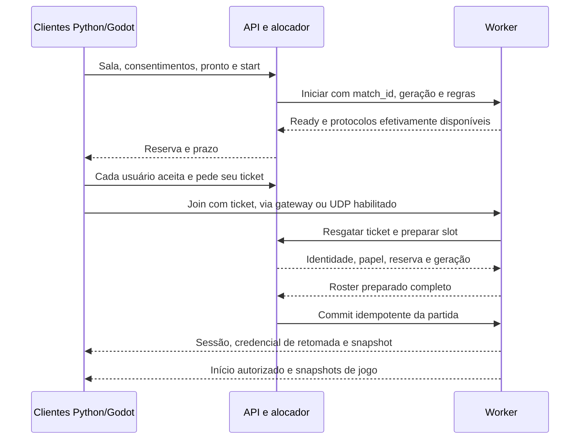

# Contratos do serviço externo

**Especificação alvo, versão 1.0, 26/09/2026.** Uma API funcional já existe, mas este documento também contém convenções e protocolos futuros. Não presuma que cada rota, código de erro ou garantia abaixo esteja ativa. Para o contrato **executável**, consulte `/docs` e `/openapi.json` no serviço iniciado e os testes em [`tests/`](tests/). A arquitetura e os limites desejados estão em [PROJETO.md](PROJETO.md).

> **Diferença importante de versão:** o contrato alvo propõe jogo gerenciado WebSocket 3 e UDP 2. O worker empacotado atual usa o gateway WebSocket 2 e o protocolo UDP legado; tickets de ingresso do serviço não transformam esses protocolos em versões novas. Publicação externa e segurança de transporte exigem validação específica.

## 1. Convenções comuns

Base de controle: `/api/v1`. JSON UTF-8; datas em UTC/RFC 3339; durações em segundos com sufixo `_seconds`; contagens e versões inteiras; flags booleanas. IDs opacos estáveis com prefixos de entidade; nomes nunca são chaves de autorização. Exemplos usam domínio reservado `.example` e valores fictícios, não credenciais válidas.

- Autenticação REST: `Authorization: Bearer <access_token>`. Segredos não entram em query string. Credenciais de operador, servidor e jogador têm escopos diferentes.
- Recursos públicos permitem leitura anônima limitada. Demais rotas exigem sessão e autorização no recurso, salvo indicação explícita na tabela.
- Listagens: `limit` padrão 25, máximo 100; `cursor` opaco; resposta `items`, `next_cursor`. Cursor inválido retorna 400. Ordenação estável inclui ID como desempate.
- Escritas em recurso versionado usam `If-Match` com seu ETag, correspondente a `revision`; ausente: 428; desatualizado: 412. Mudança incrementa revisão uma vez. Heartbeats, chat e consulta de segredo não incrementam revisão de regras/roster.
- `Idempotency-Key` obrigatório em POST/PATCH de negócio, inclusive criação, busca, operações administrativas e start; exceções: login, refresh, recuperação, heartbeat e emissão de tickets efêmeros. Chave é vinculada a principal, rota e hash do corpo, com retenção de 24 h; conteúdo diferente com a mesma chave retorna 409. Respostas com segredos não ficam em cache de idempotência em texto puro.
- DELETE repetido de recurso autorizado já removido retorna 204; não revela recursos de outros usuários. PUT de favorito/estado desejado é idempotente. POST de criação responde 201; trabalho assíncrono responde 202 com ID consultável; atualização responde 200 ou 204.
- Sucesso com JSON usa `data` e `request_id`. Listagens usam `data.items`/`data.next_cursor`. Erros usam `error` e `request_id`. Endpoints legados, OpenAPI, métricas e sondas preservam seus formatos específicos.
- Resposta de erro contém `code`, mensagem exibível, `retryable` e `details` sem segredos. Cliente decide pelo código, não pelo texto traduzido. 429/503 temporários incluem `Retry-After` quando houver prazo conhecido.
- Cache: dados públicos com ETag; identidade, tickets, salas privadas e dados pessoais com `Cache-Control: no-store`. Configuração de CORS autoriza somente origins explícitas, métodos e headers necessários; expõe ETag, request ID e Retry-After.

Exemplo de conflito de capacidade:

```json
{
  "error": {
    "code": "server_full",
    "message": "Não há vagas suficientes para o grupo.",
    "retryable": true,
    "details": {"required_slots": 3, "available_slots": 2}
  },
  "request_id": "req_example"
}
```

Toda rota de escrita deverá constar em OpenAPI com corpo, resposta, autorização, limites e erros. O catálogo abaixo orienta essa implementação; não substitui schemas executáveis, que serão entregues em E02.

## 2. Descoberta de recursos e versões

| Rota | Acesso e contrato |
|---|---|
| `GET /healthz` | Público; 200 se processo está vivo, sem detalhes internos. |
| `GET /readyz` | Público; 200 se controle está apto a servir, 503 durante startup/drain/falha de storage. Saturação de workers aparece em capabilities, sem derrubar identidade/diretório. |
| `GET /api/v1/capabilities` | Público; versão do serviço, protocolos, recursos, limites, regiões, mapas/regras e transports suportados. |
| `GET /api/v1/sync` | Sessão; snapshot autorizado de usuário, amigos/presença visível, grupo, sala, busca/reserva e cursor de eventos consistente com esse snapshot. |
| `GET /api/v1/openapi.json` | Schemas publicados, sem configuração/segredos da instalação. |

Capabilities deve conter ao menos:

```json
{
  "data": {
    "service_version": "1.0.0",
    "api_versions": [1],
    "social_ws_versions": [1],
    "managed_game_protocols": {"websocket": [3], "udp": [2]},
    "legacy_game_protocols": {"websocket": [1, 2], "udp": [1]},
    "enabled_transports": ["wss"],
    "features": {
      "accounts": true,
      "guests": true,
      "friends": true,
      "parties": true,
      "hosted_lobbies": true,
      "matchmaking": true,
      "spectators": true,
      "join_in_progress": false
    },
    "limits": {
      "party_members": 8,
      "match_players_min": 2,
      "match_players_max": 8,
      "match_spectators": 8,
      "rounds_min": 5,
      "rounds_max": 50
    },
    "timers_seconds": {
      "presence_heartbeat": 20,
      "presence_ttl": 60,
      "reservation_ttl": 30,
      "reconnect_window": 60
    },
    "capacity": {"accepting_allocations": true},
    "maps": [
      {"id": "classic", "default_seed": 1},
      {"id": "basin", "default_seed": 7},
      {"id": "ridge", "default_seed": 11},
      {"id": "crater", "default_seed": 17},
      {"id": "mesa", "default_seed": 23}
    ]
  },
  "request_id": "req_example"
}
```

Valores são exemplos de uma implantação completa, não anúncio de recursos prontos. `enabled_transports` restringe os protocolos compilados. Cada servidor publica capacidades próprias; a UI usa a interseção cliente/serviço/servidor. Ausência de capacidade desabilita ação com motivo; versão maior desconhecida nunca é interpretada como versão anterior.

## 3. Identidade e sessão

| Método/rota relativa a `/api/v1` | Entrada e resultado obrigatório |
|---|---|
| `POST /auth/guest` | Público; `display_name`, `device_name`; cria ID convidado e sessão. Limite por origem. |
| `POST /auth/register` | Público; `handle`, `display_name`, `password`; cria conta/sessão. Nunca associa por apelido. |
| `POST /auth/upgrade` | Convidado autenticado; `handle`, `password`; converte o mesmo ID em conta, preserva vínculos e rotaciona sessão. |
| `POST /auth/login` | Público; `handle`, `password`, `device_name`; retorna sessão ou erro genérico `invalid_credentials`. |
| `POST /auth/refresh` | Credencial refresh no corpo; rotação atômica; reutilização fora de retry autorizado revoga a família. |
| `POST /auth/logout` | Revoga sessão/dispositivo atual e desconecta seus canais. |
| `POST /auth/logout-all` | Conta e autenticação recente; revoga todas as sessões e ingressos pendentes do usuário. |
| `POST /auth/recovery-codes` | Conta e senha recente; gera novo conjunto de códigos de uso único, mostrados uma vez, invalida o anterior. |
| `POST /auth/recover` | Público; `handle`, `recovery_code`, `new_password`; consumo atômico e revogação de sessões. Não informa se handle existe. |
| `GET /me` | ID, handle, nome, tipo, preferências, revisão; nunca hashes/segredos. |
| `PATCH /me` | Nome, idioma e política de visibilidade; If-Match. Handle estável na primeira versão. |
| `POST /me/password` | Senha atual/nova; revoga outras sessões, rotaciona a atual. |
| `GET /me/sessions` | Dispositivos e datas, sem tokens. |
| `DELETE /me/sessions/{session_id}` | Revoga sessão do próprio usuário. |
| `DELETE /me` | Conta e senha recente; revoga acesso, cancela pendências e aplica remoção/anonimização configurada. |

Sessão retorna `user`, `access_token`, `access_expires_at`, `refresh_token`, `refresh_expires_at`. Access dura 900 s e refresh 30 dias por padrão. Refresh é específico por dispositivo e só trafega por HTTPS, exceto loopback/perfil LAN explicitamente autorizado. Retentativa de refresh usa `refresh_request_id`: o mesmo ID pode recuperar o mesmo resultado durante 30 s, guardado cifrado com chave local; outro ID reutilizando o token consumido é tratado como replay. A implementação deve testar perda da resposta sem forçar logout indevido.

Idempotência de criação anônima usa namespace de operação pública, identificador aleatório de requisição e hash dos campos normalizados; resposta recuperável com segredo fica cifrada, expira em 30 s e é excluída do log. Depois desse prazo, repetição reconhecida pede login e não cria outra identidade. Recuperação/login têm rate limit e respostas uniformes. Convidados não podem criar amizades persistentes, provisionar servidores ou administrar o serviço. Autenticação recente significa login com senha há no máximo 5 min; refresh não renova essa comprovação.

Armazenamento cliente: desktop usa cofre do sistema quando disponível, persistência opt-in; sem cofre, manter sessão em memória. Godot web mantém access e refresh em memória na primeira versão, encerrando sessão ao recarregar se não houver fluxo posterior de cookie seguro. Não gravar refresh silenciosamente em arquivo de configuração/localStorage. Perder credencial de convidado pode tornar esse ID irrecuperável; oferecer conversão em conta na UI.

## 4. Diretório, favoritos e publicação

| Método/rota | Contrato |
|---|---|
| `GET /servers` | Público; filtros `region`, `map_id`, `transport`, `protocol_version`, `passworded`, `include_full`, `include_empty`, `name`; listagem tipada, paginada e somente de servidores alcançáveis/compatíveis. |
| `GET /servers/{server_id}` | Detalhes públicos, contagens, regras, versão, endpoints e instante da observação. Privados exigem vínculo/convite. |
| `GET /servers/{server_id}/players` | Roster permitido pela política, papel e placar público; sem IP, conta privada ou token. |
| `GET /me/favorites` | Favoritos sincronizados da conta; servidor indisponível permanece favorito com estado correspondente. |
| `PUT /me/favorites/{server_id}` | Salva favorito por ID; não cria servidor. |
| `DELETE /me/favorites/{server_id}` | Remove favorito remoto; sincronização local usa tombstone/revisão. |
| `GET /me/match-history` | Participações confirmadas pelo worker; cliente não cria vitória/histórico de partida hospedada. |
| `POST /server-nodes/{node_id}/heartbeat` | Credencial do próprio nó; geração, status, roster agregado e capacidade verificados; renova lease. |
| `DELETE /server-nodes/{node_id}/lease` | Credencial do nó; despublica somente a sua geração. |

Rotas desta seção, salvo `/healthz`, são relativas a `/api/v1`. Servidores externos são provisionados por operador; heartbeat não aceita trocar executable, nó proprietário, runtime autorizado ou endpoint livremente. Alteração de endpoint passa por validação de alcance e política de destinos antes de publicar. Lease de 45 s expira com heartbeat esperado a cada 15 s. Endpoint privado/loopback de worker hospedado não é exposto no diretório.

Modelo mínimo de servidor:

```json
{
  "server_id": "srv_example",
  "name": "Groundfire Brasil",
  "managed": true,
  "status": "available",
  "region": "br",
  "map_id": "classic",
  "rules": {"rounds": 10, "max_players": 8},
  "occupancy": {"players": 2, "bots": 1, "reserved": 1, "spectators": 0},
  "passworded": false,
  "runtime_version": "groundfire-example",
  "join_in_progress": false,
  "transports": [
    {"kind": "wss", "protocol_version": 3, "tls": true, "admission_required": true}
  ],
  "observed_at": "2026-09-26T15:00:00Z",
  "revision": 12
}
```

Endereço específico de partida gerenciada vem após reserva, na emissão de ticket; servidores legados podem publicar seu endpoint direto. Ping não é um campo universal calculado pelo backend: clientes medem RTT por eco limitado no canal de jogo, sem precisar obter vaga; medição inclui tempo da amostra. Heartbeat/idade do anúncio não vira latência. `max_ping_ms` no matchmaking usa amostras recentes declaradas pelo cliente apenas como preferência, nunca como autoridade sobre capacidade/identidade.

## 5. Amigos, presença, grupo e convites

| Método/rota | Contrato |
|---|---|
| `GET /users?handle=...` | Conta; busca limitada por handle exato, somente perfil público. Bloqueios e política de descoberta aplicados. |
| `GET /friends` | Amizades e presença autorizada, paginação. |
| `GET /friend-requests` | Pedidos recebidos/enviados pelo usuário. |
| `POST /friend-requests` | `target_user_id`; destinatário recebe evento; duplicado é idempotente. |
| `POST /friend-requests/{id}/accept` | Só destinatário; cria amizade bilateral em uma transação. |
| `DELETE /friend-requests/{id}` | Recusar pelo destinatário ou cancelar pelo remetente. |
| `DELETE /friends/{user_id}` | Remove amizade e revoga presença/convites derivados. |
| `GET /blocks` | Lista privada de bloqueios do usuário. |
| `PUT /blocks/{user_id}` / `DELETE /blocks/{user_id}` | Bloqueia/desbloqueia; bloquear cancela amizade/convites e impede novos contatos. |
| `PUT /me/presence` | `availability=online|away|invisible`; heartbeat por dispositivo. `in_match` é derivado pelo servidor. |
| `POST /parties` | Cria grupo com solicitante como líder. Um grupo ativo por usuário. |
| `GET /parties/{id}` | Somente membros; roster, líder, revisão e busca ativa. |
| `POST /parties/{id}/leave` | Remove solicitante; cancela busca pendente e elege líder quando necessário. |
| `DELETE /parties/{id}/members/{user_id}` | Só líder; não remove de partida já iniciada. |
| `POST /parties/{id}/leadership` | Líder transfere a membro presente; If-Match. |
| `POST /invites` | `target_type=party|lobby`, `target_id`, `recipient_user_id` opcional; líder ou membro com permissão; cria convite nominal ou código limitado. |
| `GET /invites` | Convites do próprio usuário, sem enumerar códigos de terceiros. |
| `POST /invites/accept` | `invite_id` ou `code` no corpo, senha se exigida; valida destinatário, TTL, uso, bloqueio e capacidade de forma atômica. |
| `DELETE /invites/{id}` | Remetente revoga ou destinatário recusa. |

Convidar para grupo não implica reserva de vaga na partida. Aceitar convite de sala aplica entrada no roster; ingresso do grupo inteiro usa operação explícita descrita abaixo. Código é aleatório, armazenado por hash, expira em 10 min e tem limite de uso; não oferece bypass de senha. Não incluir código em logs ou URL. Presença expirada/invisível aparece offline para amigos; operador tem somente diagnósticos necessários, auditados.

## 6. Salas, busca e admissão

| Método/rota | Contrato |
|---|---|
| `GET /lobbies` | Lista pública de salas abertas e compatíveis; privadas não aparecem. |
| `POST /lobbies` | Nome, visibilidade, regras, senha opcional; `party_id`/revisão opcionais para entrada atômica do grupo que consentiu. |
| `GET /lobbies/{id}` | Regras, membros/papéis, líder, estado, revision, busca/partida associada. Privada só com autorização. |
| `PATCH /lobbies/{id}` | Só líder; regras/visibilidade/senha; If-Match; regras limitadas por capabilities; limpa pronto. |
| `POST /lobbies/{id}/join` | Papel e senha/convite; jogador individual ou grupo com revisão/consentimento; toda capacidade cabe ou nenhum entra. |
| `POST /lobbies/{id}/leave` | Saída do solicitante; efeito explícito sobre busca/preparação ou desconexão em jogo. |
| `POST /lobbies/{id}/leadership` | Transfere liderança a jogador elegível; If-Match. |
| `DELETE /lobbies/{id}/members/{user_id}` | Só líder antes de iniciar; durante partida, expulsão exige permissão administrativa da sala e comando auditado ao worker. |
| `PUT /lobbies/{id}/members/me/ready` | `ready`, revisão de regras/roster; jogador humano; espectador não marca pronto. |
| `POST /lobbies/{id}/bots` | Líder; quantidade/dificuldade válida; ocupa capacidade, invalida pronto humano. |
| `DELETE /lobbies/{id}/bots/{bot_id}` | Líder; pré-partida, limpa pronto humano. |
| `POST /lobbies/{id}/start` | Líder e If-Match; todos humanos prontos, mínimo de participantes e recursos; 202 com match/job. |
| `POST /lobbies/{id}/rematch-votes` | Jogador participante, em results; voto individual; acordo dos humanos elegíveis inicia nova preparação. |
| `POST /matchmaking/queue` | Individual ou líder do grupo; revisão/consentimento, região, mapa/regras, transports/protocolos e `target_server_id` opcional para esperar vaga. |
| `GET /matchmaking/queue/{id}` | Somente membros; estado, tempo, critérios e reservation_id quando alocado. Sem posição fictícia garantida. |
| `DELETE /matchmaking/queue/{id}` | Líder ou membro pode cancelar busca/preparação do grupo; disputa transacional com commit. |
| `POST /servers/{id}/reservations` | Ingresso direto; senha, role e dados de compatibilidade; reserva individual ou grupo indivisível. |
| `GET /reservations/{id}` | Somente participantes; destino, roster esperado, aceite/admissão por membro e prazo. |
| `POST /reservations/{id}/accept` | Consentimento do membro autenticado para o destino; não aceita em nome de outros. |
| `DELETE /reservations/{id}` | Cancela reserva ainda não confirmada e libera todas as vagas da preparação. |
| `POST /matches/{id}/admission-tickets` | Usuário elegível com reserva aceita; transporte, protocolo e papel; retorna ticket de uso único e endpoint. |
| `GET /matches/{id}` | Participante/espectador autorizado; estado, regras e vínculo com sala; sem segredo de reconexão. |
| `GET /matches/{id}/result` | Resultado autoritativo publicado; 409 `result_pending` enquanto não finalizado. |

Entrar em grupo autoriza o líder a propor sala/busca; cada membro confirma consentimento por revisão via `PUT /parties/{id}/members/me/ready`, com `ready` e `revision`. Mudança no grupo limpa consentimentos. Isso não substitui o pronto de sala nem o aceite da reserva. A UI pode apresentar a sequência como proposta única, mas o serviço registra cada decisão e não aceita que um líder falsifique o aceite alheio.

Estados previstos:

| Recurso | Fluxo normal e saídas |
|---|---|
| Sala | `open → allocating → preparing → in_match → results → open`; falha de preparação volta a open com motivo; vazia expira; encerramento administrativo produz closed. |
| Busca | `searching → reserved → preparing → matched`; antes de matched pode cancelled/expired/failed. Busca sem oferta continua searching, não cria reserva fictícia. |
| Reserva | `held → accepted → preparing → committed`; cancelled/expired/rejected são terminais. Accepted exige aceite de todos. |
| Partida | `allocating → preparing → running → finished`; falha/encerramento sem resultado válido produz aborted. |
| Worker | `starting → ready → busy → draining → stopped`; crash produz lost e exige reconciliação de geração. |

Pronto referencia revisão de regras/roster, não um contador incrementado a cada pronto. Alteração de nome/visibilidade que não afete elegibilidade não precisa limpar pronto; mudança de capacidade, senha/política, participantes, bots, mapa ou regras limpa. Slots de jogador e espectador são separados. Banimento/revogação durante preparação invalida tickets e desfaz a preparação.

Busca expira após 300 s sem destino, com estado expired e motivo `search_timeout`; cliente pode solicitar nova busca, sem reinício silencioso. Timeout da reserva começa quando worker e destino estão prontos, padrão 30 s. Startup tem timeout próprio de 15 s. Ticket de ingresso expira no menor prazo entre 30 s e o restante da reserva; reemitir invalida ticket anterior do mesmo ingresso. Nenhum retry renova reserva indefinidamente. Capacidade retida inclui jogadores em janela de retomada.

Depois do aceite, todos conectam em estado preparado sem iniciar simulação competitiva. Worker confirma roster completo; controle confirma commit; somente então worker inicia. Ingresso tardio só é anunciado se o runtime tiver suporte testado. Para uma partida em andamento, cancelamento do grupo libera apenas ingressos ainda preparados; não remove jogadores já participantes de outro grupo. Partida nova de matchmaking precisa chegar ao mínimo de jogadores exigido; espera continua até conseguir outros jogadores ou bots expressamente permitidos pelos critérios.

Resposta de admissão:

```json
{
  "data": {
    "match_id": "mat_example",
    "generation": 1,
    "runtime_version": "groundfire-example",
    "reservation_id": "res_example",
    "role": "player",
    "transport": "wss",
    "protocol_version": 3,
    "endpoint": "wss://game.example/play/mat_example",
    "admission_ticket": "example-one-use-ticket",
    "expires_at": "2026-09-26T15:00:30Z"
  },
  "request_id": "req_example"
}
```

Fluxo de início gerenciado:



Gateway e worker não resgatam o mesmo ticket duas vezes: o worker é a autoridade de resgate, gateway encaminha e mantém somente vínculo de transporte. ACK perdido usa mesmo `join_request_id` e mesmo binding de conexão, com resposta recuperável; replay em outra conexão é recusado. Se o controle cair após commit persistido, reconciliação reenvia commit pelo ID; worker não inicia duas partidas.

## 7. Eventos sociais e chat

`POST /api/v1/event-tickets` exige access; retorna segredo de uso único com TTL de 15 s. Conectar `/api/v1/events` por WSS e enviar `auth` em até 5 s; nenhuma inscrição/dado pessoal antes disso. Rotacionar access não encerra automaticamente o canal, mas logout, expiração da sessão sem renovação, bloqueio e alteração de vínculo atualizam sua autorização.

```json
{
  "type": "auth",
  "protocol_version": 1,
  "ticket": "example-social-ticket",
  "resume_cursor": null
}
```

Eventos possuem `event_id`, `sequence`, `cursor`, `type`, `occurred_at`, `resource_id`, `revision` e `data`. Sequência/cursor são por usuário e autorização, não sequência global exposta. Entrega é ao menos uma vez: cliente deduplica por event_id e rejeita revisões antigas. Replay mínimo de 10 min/limite configurado; lacuna retorna `resync_required`, seguido por `/sync` e nova inscrição com cursor. Snapshot e cursor devem representar o mesmo ponto lógico para não perder evento entre leitura e inscrição.

Categorias: `friend_request.created`, `friendship.changed`, `presence.changed`, `party.changed`, `invite.created`, `invite.revoked`, `lobby.changed`, `queue.changed`, `reservation.changed`, `match.changed`, `match.result`, `chat.message`, `session.revoked`, `service.draining`. Entregas só para destinatários/membros/amigos autorizados. Eventos antigos não reaparecem após bloqueio ou saída de sala por meio de replay.

Socket aceita somente auth, ack de cursor e ping/pong. Escritas de negócio são REST; evita dois comandos concorrentes para a mesma sala. Fila de saída é limitada; consumidor lento recebe orientação de resync e desconexão, sem crescimento ilimitado de RAM.

Chat de sala/grupo: `POST /api/v1/{lobbies|parties}/{id}/messages` recebe `client_message_id` e `text`; `GET` na mesma rota lista histórico autorizado. Texto de até 256 caracteres, 5 envios/5 s por usuário, sem HTML/BBCode ativo; normalização Unicode e limite em bytes também aplicados. Bloqueios afetam entrega; autor e ID são definidos pela sessão. Chat de partida continua no protocolo do worker e não é duplicado automaticamente no chat social.

## 8. Transporte de jogo e compatibilidade

| Interface | Situação e destino |
|---|---|
| Master UDP protocolo 1 | Existente; consulta legada, opcional na distribuição. |
| `/servers.json` schema 1 | Existente; projeção de servidores compatíveis com clientes antigos. |
| `/session-token.json` com `gf1` | Existente; apenas pool legado público e isolado, sem identidade de conta. |
| Jogo WS 1/2 | Existente; adapter legado não acessa salas gerenciadas privadas. |
| Jogo UDP 1 | Existente; LAN/conexão legada preservadas. |
| REST v1 e social WS 1 | Novos; identidade/diretório/salas/busca. |
| Jogo WS 3 e UDP 2 | Novos; admissão gerenciada e identidade vinculada, com novos adapters em ambos os jogos. |

Não presumir que aumentar um número habilita os recursos: codecs, schemas, fixtures e negociação de erro são entregas obrigatórias. Em todos os protocolos, nome exibido é obtido da admissão autenticada; cliente não se apropria do nome/ID de outro usuário.

### 8.1 Novo jogo gerenciado

WS 3 usa `/play/{match_id}`. `hello` anuncia versão, runtime e capacidades sem expor roster privado. `join` contém `protocol_version=3`, `admission_ticket`, `join_request_id` e capacidades do cliente; senha/access token não seguem para o worker. O envelope mantém a família de comandos já existente (`hello`, `join`, `input`, `ping`, `disconnect`, `session_resume`, `chat_send`, `command_result`) e o schema atual de snapshot/evento onde compatível. Campos adicionais devem ter schemas explícitos em E02.

UDP 2 acrescenta admissão equivalente no codec nativo: JoinTicketRequest inclui versão 2, match_id, generation, join_request_id e admission_ticket. JoinAccept retorna sessão/slot/papel e token de retomada vinculado; mensagens posteriores preservam autenticação e sequência. Não reutilizar JoinRequest UDP 1 como se já tivesse esses campos. Datagrama inválido/maior que o limite é descartado e contado; não fragmentar snapshots sem protocolo documentado e testes de reassembly.

Worker consulta admissão pelo canal interno e não confia só no gateway. Ticket exige correspondência de usuário, reserva, match, geração, papel e transporte. Quando válido, slot muda de reservado para preparado/conectado na mesma autoridade de capacidade. Espectador nunca recebe slot de jogador nem pode enviar input/ready/rematch. Ao retomar, token fica vinculado a usuário/sessão/geração, roda para novo valor e invalida conexão anterior; slot é mantido por 60 s após queda. Reconexão com ACK perdido é idempotente pelo request_id e não consome segunda vaga.

`lobby_set_ready`/`match_rematch` recebidos em modo gerenciado são adaptados ao domínio de sala com principal/revision, ou recusados com `use_control_api` quando faltarem campos. Não operar um segundo estado paralelo no gateway. Física, compras, tiro, impacto, dano, rodadas e placar continuam decididos pelo runtime. API de controle não altera inventário para fabricar resultado.

### 8.2 Projeções legadas

Master aceita query com envelope atual `message_type`, `payload`, `protocol_version=1`. Retorna query_response e `payload.entries` no modelo ServerListEntry existente. Registro/desregistro UDP não autenticado fica desligado por padrão; quando explicitamente permitido, só altera namespace legado autorizado, com TTL/rate limit. Não anuncia managed UDP 2 a cliente que só fala UDP 1.

`GET /servers.json` e alias `/` mantêm schema 1, campos obrigatórios `name`, `game`, `players`, `map`, `latency`, `source`, `endpoint`, `passworded`; opcionais compatíveis conforme o código atual. Schema exato será extraído em fixture, sem redesenhar silenciosamente a leitura legada. Suporta HEAD/ETag/304. Não inclui endpoints de salas gerenciadas protegidas ou auth_token reutilizável; somente entradas legacy compatíveis.

`GET /session-token.json?player_name=...` mantém token gf1 apenas para o pool legado configurado. Resposta no-store, nome validado, emissão limitada. Token desse endpoint não é válido em WS 3/UDP 2, REST/social ou sala privada. Se pool legado estiver desligado: 410 `legacy_disabled`. `/schema.json`, `/health`, `/diagnostics.json` recebem adapters compatíveis; diagnósticos sensíveis ficam autenticados e não revelam segredos.

## 9. Canal interno e administração

Canal interno é listener próprio em loopback, autenticado por segredo individual de worker/nó. Não é acessível pelos endpoints públicos nem usa access de jogador. Cada comando leva `job_id`, `match_id`, `generation` e nonce da execução. Credencial de geração antiga não renova lease nem publica resultado de nova execução.

| Operação interna | Garantia |
|---|---|
| `POST /internal/v1/workers/register` | Confere processo previamente alocado, runtime/hash, geração, portas e capacidades; só então marca ready. |
| `POST /internal/v1/workers/{id}/heartbeat` | Renova lease, relata roster/tick; não altera regras autorizadas ou aumenta capacidade. |
| `POST /internal/v1/admissions/redeem` | Resgate atômico de ticket/slot; retry do mesmo request_id/binding é idempotente. |
| `POST /internal/v1/matches/{id}/prepared` | Worker confirma roster e revisão preparados; controle persiste decisão de commit ou cancelamento. |
| `GET /internal/v1/workers/{id}/commands` | Canal autenticado de comandos pendentes: commit/start/kick/drain/stop; somente para o próprio worker. |
| `POST /internal/v1/workers/{id}/command-acks` | ACK idempotente por job/geração; comandos repetidos não iniciam nem encerram duas vezes. |
| `POST /internal/v1/matches/{id}/events` | Conexão, desconexão, slot liberado, fase e incidentes; sequência por geração. |
| `POST /internal/v1/matches/{id}/result` | Resultado final autoritativo; repetido idêntico aceito; divergente gera conflito/auditoria. |

Workers externos não usam listener loopback remotamente: uma futura instalação distribuída exige canal privado autenticado específico. A primeira versão hospeda workers localmente e permite apenas cadastro/publicação de servidores externos compatíveis; não executa processos remotos arbitrários.

Controle e worker têm fases explícitas para evitar contagem dupla. Reserva no banco segura capacidade antes da admissão; worker só prepara slot autorizado. Confirmação promove esse mesmo slot, não cria outro. Queda entre as fases mantém lease/reserva até reconciliação ou prazo; incerteza reduz disponibilidade, jamais excede capacidade. Atualização usa comparação de generation/revision para rejeitar mensagens atrasadas.

Administração REST em `/api/v1/admin`: `GET /status`, `GET /metrics`, `GET /audit`, `GET /server-nodes`, `POST /server-nodes`, `PATCH /server-nodes/{id}`, `POST /server-nodes/{id}/rotate-credential`, `DELETE /server-nodes/{id}`, `POST /users/{id}/ban`, `DELETE /users/{id}/ban`, `POST /matches/{id}/drain`, `POST /matches/{id}/stop` e `POST /drain`. Autorização de operador, escopos e auditoria obrigatórios. Ban exige motivo/prazo; stop registra aborted quando não há resultado válido. Bootstrap usa token local de uso único em `POST /admin/bootstrap`, somente em loopback e somente enquanto não há administrador. Backup/restore/reset local seguem o launcher, sem upload público de banco ou shell remoto.

## 10. Erros obrigatórios e comportamento cliente

| HTTP/código | Tratamento esperado |
|---|---|
| 400 `invalid_request`, 422 `invalid_rules` | Mostrar campo inválido; não repetir sem mudança. |
| 401 `invalid_credentials`, `session_expired` | Login/refresh uma vez; não entrar em loop de requisições. |
| 403 `forbidden`, `banned`, `guest_restricted` | Mostrar motivo público apropriado; não tentar outro transporte como bypass. |
| 404 `not_found` | Recurso inexistente ou privado sem permissão, sem enumeração. |
| 409 `server_full`, `party_changed`, `not_ready`, `already_queued` | Atualizar recurso e permitir ação apropriada; nunca descartar grupo silenciosamente. |
| 409 `reservation_expired`, `ticket_used`, `generation_mismatch` | Refazer fluxo autorizado; não reutilizar segredo. |
| 409 `allocation_failed`, `result_pending` | Estado persistido e consultável; retry orientado por estado. |
| 410 `legacy_disabled`, `resource_expired` | Encerrar tentativa antiga e explicar incompatibilidade. |
| 412 `revision_conflict`, 428 `revision_required` | Buscar estado atual antes de editar/iniciar novamente. |
| 426 `protocol_unsupported` | Exibir versões compatíveis; nunca downgrade automático para pool inseguro/privado. |
| 429 `rate_limited` | Respeitar Retry-After com jitter e cancelamento pelo usuário. |
| 503 `service_draining`, `capacity_unavailable` | Manter LAN/local acessíveis; não afirmar que a partida foi criada. |

Falha REST usa códigos acima; eventos/comandos WS usam os mesmos códigos sem inventar HTTP dentro de snapshot. Timeout de rede não prova falha de uma escrita: consultar pelo recurso/idempotency key antes de repetir criação ou start. Clientes exibem estado desconectado/expirado de forma explícita e preservam seleção/filtros quando possível.
