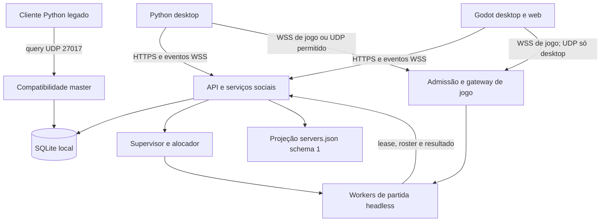

# Projeto do serviço externo Groundfire

**Versão do projeto:** 1.0, 26/09/2026. **Estado:** especificação de produto e critérios de aceite. Há uma implementação funcional inicial descrita no [README](README.md); os requisitos SE01–SE12 continuam como contrato alvo, não como declaração de que todos foram concluídos.

> **Leitura do documento:** a seção “Auditoria da situação atual” registra o ponto de partida anterior ao serviço. Frases no futuro descrevem a meta. Para comandos e capacidades executáveis, consulte o [README](README.md), o código em [`src/gf_service/`](src/gf_service/) e o [registro de implementação](../docs/godot_migration_strategy.md#projeto-encerramento-pendencias).

## 1. Resultado esperado e escopo

Entregar um sistema independente, integralmente contido em `groundfire-online-service/`, iniciado por `sh groundfire-online-service.sh`. Python desktop, Godot desktop e Godot web acessarão o mesmo serviço, com as mesmas identidades, salas, convites e regras de autorização. A aparência dos menus permanece responsabilidade dos jogos; o serviço entrega dados e ações verificáveis.

Requisitos obrigatórios:

| ID | Requisito |
|---|---|
| SE01 | Copiar somente `groundfire-online-service/` para outra máquina deve permitir instalar e executar a distribuição. |
| SE02 | Todo código, configuração, migração, dependência empacotada, ferramenta administrativa e runtime de partidas deve estar na pasta. |
| SE03 | Uma inicialização sobe API, eventos sociais, diretório, compatibilidade master e gerenciador de partidas; não exige vários terminais. |
| SE04 | Cadastro/login próprios e modo convidado; Steam, GitHub, e-mail e autenticação de terceiros não serão dependências obrigatórias. |
| SE05 | Diretório confiável com disponibilidade, capacidade, versões, regiões, detalhes e entradas por transporte. |
| SE06 | Amigos, presença, bloqueios, convites, grupos e chat de grupo/sala funcionais. |
| SE07 | Criar sala pública/privada, regras, bots, liderança, pronto, início e entrada por código. |
| SE08 | Buscar partida individual/em grupo, cancelar e reservar todas as vagas de forma atômica. |
| SE09 | Partida mista Python/Godot, espectador, queda/retomada, resultado e revanche. |
| SE10 | Administração autenticada, observabilidade, limites, backup/restauração e encerramento previsível. |
| SE11 | Preservar LAN e conexão direta existentes; compatibilidade legada explícita. |
| SE12 | Aceite executável de isolamento, contratos, simulação de jogo, falhas e distribuição. |

Voz, integração Steam, VAC, ranking competitivo, monetização e mecânicas FPS não fazem parte deste serviço. O papel de Friends será atendido pelo sistema próprio de amizade/presença. Resultados serão registrados para histórico e diagnóstico; não constituem ranking competitivo.

## 2. Auditoria da situação atual

Os caminhos abaixo são relativos à raiz atual do repositório e foram inspecionados diretamente. A referência mais ampla continua em `docs/godot_migration_strategy.md`; este documento é a especificação do novo produto independente autorizada pelo usuário.

| Componente existente | Evidência | Consequência para o projeto |
|---|---|---|
| Master UDP | `groundfire_net/master.py`: porta 27017, protocolo 1, register/unregister/query, TTL padrão 90 s. | Aproveitar contrato de consulta; registro público autenticado precisa de novo canal. |
| Diretório HTTP | `groundfire_net/directory_service.py`: `/servers.json`, `/session-token.json`, ETag/304, porta 27880. | Preservar projeção schema 1; trocar arquivo estático por registros e leases reais. |
| Acoplamento do diretório | Caminho padrão busca `versao-godot/godot/data/server_directory.json`; lê `ServerBook`. | Diretório independente terá banco e configuração internos. |
| Gateway de jogo | `groundfire_net/websocket_gateway.py`: porta 27080, WS versões 1–2, encaminhamento para um backend UDP. | Preservar formatos em adapter; adicionar roteamento por partida e admissão gerenciada. |
| Acoplamento do gateway | Importa `src.groundfire.network.codec` e `src.groundfire.network.messages`. | Copiar apenas a pasta atual `groundfire_net` não produz um serviço independente. Extrair contratos e runtime headless. |
| Autenticação atual | Token `gf1` HMAC com nome e expiração; emissor também tem opção GitHub OAuth. | Nome não identifica conta. Criar identidade própria e ticket vinculado a usuário/partida/reserva. OAuth será opcional. |
| Servidor autoritativo | `versao-python/src/groundfire/app/server.py`, `gameplay/match_controller.py`, `sim/`, `core/`. | Empacotar o núcleo headless com suas configurações; física continua no worker. |
| Protocolos nativos | `versao-python/src/groundfire/network/messages.py` e Godot `udp_client.gd`: versão UDP 1, 60 Hz de simulação e 20 Hz de snapshots. | A versão WS 2 não significa UDP 2. Negociar cada família separadamente. |
| Python desktop | Scanner usa `GROUNDFIRE_MASTER_SERVERS`; jogo conectado usa UDP. | API social, tickets gerenciados e transporte WSS de jogo ainda precisam de adapters Python. |
| Godot | `server_directory.gd` aceita schema 1 e `application/config/server_directory_url`; `online_match.gd` pede token por GET com nome. | Acrescentar URL base do serviço, conta, REST/social e nova admissão; fluxo atual não autentica uma conta. |
| Plataformas Godot | `platform_capabilities.gd` oculta LAN/UDP/processos na web. | Web recebe somente endpoints WSS e operações hospedadas. |
| Persistência local | Python tem favoritos/histórico em SQLite; Godot tem `browser_store.gd`. | Permanecem disponíveis offline; sincronização de conta será adicional e explícita. |
| Testes atuais | `test_master_server_integration.py`, `test_online_match_simulation.py`, `test_groundfire_net_module.py`, `validate_godot_udp_integration.py`. | São referências a transportar/adaptar; não provam funcionamento do futuro serviço isolado. |

Lacunas que a implementação deve fechar: identidade global, presença real, diretório unificado, publicação autenticada, salas persistentes, grupos, convites, alocação de workers, reservas compartilhadas entre UDP/WS, administração e recuperação após falhas.

## 3. Arquitetura escolhida

Primeira versão: aplicação modular Python 3.13, banco SQLite local e um processo de controle. Workers de jogo serão processos headless separados, iniciados sob demanda. Não haverá Redis, PostgreSQL, Kubernetes ou serviços de nuvem obrigatórios. Esses são possíveis caminhos posteriores de escala, sujeitos a outro aceite.

A camada HTTP/WebSocket será FastAPI com Uvicorn e suporte WebSocket empacotado. Essa combinação evita manter um parser próprio de frames HTTP/WS; FastAPI documenta [WebSockets](https://fastapi.tiangolo.com/advanced/websockets/) e a execução com [servidor ASGI](https://fastapi.tiangolo.com/deployment/manually/). As versões exatas e hashes serão congelados no lote E01 após testes na matriz suportada; não usar dependências `latest` na inicialização.

Senhas de conta/sala terão hash Argon2id usando biblioteca mantida, com custo calibrado na máquina alvo e rehash quando necessário; referência: [argon2-cffi](https://argon2-cffi.readthedocs.io/en/stable/howto.html). Os tokens próprios serão opacos, aleatórios, revogáveis e armazenados por hash. Não é necessário implementar JWT para esta arquitetura de uma instância.



### 3.1 Responsabilidades

| Módulo | Responsabilidade e autoridade |
|---|---|
| `identity` | Conta, convidado, login, refresh, revogação, recuperação local e nome público. |
| `social` | Amizades consentidas, bloqueios, presença, grupos e convites. |
| `directory` | Cadastro de servidores, lease/heartbeat, projeções por plataforma e detalhes públicos. |
| `lobbies` | Participantes, líder, regras, pronto e permissão de iniciar. |
| `matchmaking` | Busca, cancelamento, elegibilidade e reservas para o grupo inteiro. |
| `admission` | Tickets de entrada de uso único e vínculo usuário → slot → partida; mesma capacidade para UDP/WS. |
| `allocator` | Recursos/portas, jobs duráveis, início/verificação/parada dos workers. |
| `gateway` | Enquadramento WS, tradução legada e conexão com o worker correto. Não concede vaga por contador próprio. |
| `game_runtime` | Simulação, dano, munição, compras, relógio, snapshots, resultado e retomada da partida. |
| `admin` | Operação, banimento por ID, auditoria, drenagem e limites. |
| `storage` | Transações, migrações, idempotência, outbox de eventos e backup. |

`lobby_id` é a sala social durável; `match_id` é uma execução de partida; `session_id` continua sendo a sessão do runtime; `player_number` é apenas o slot nessa sessão. Nenhum desses IDs substitui `user_id`. Uma revanche cria novo `match_id`, preservando a sala e seu roster; o histórico não mistura os resultados.

Sala gerenciada usa início explícito pelo líder com todos prontos. O runtime deverá receber um modo `managed_lobby` que impeça auto-start independente. Servidores LAN/legados mantêm seu fluxo atual. Pronto, saída e revanche enviados pelo canal de jogo em sala gerenciada devem ser roteados ao mesmo domínio de lobby; dois estados de prontidão independentes são proibidos.

### 3.2 Perfis de execução e portas

| Perfil/porta | Uso |
|---|---|
| `local`, TCP 27880, bind `127.0.0.1` | API, eventos e WSS/WS de jogo no mesmo listener; HTTP/WS permitido em loopback. |
| `lan-service`, TCP 27880, bind configurável | Serviço social opcional para uma rede privada; todos apontam ao IP do serviço. Exposição sem TLS exige configuração explícita. |
| `internet`, TCP 443 público | HTTPS/WSS com certificado válido; TLS nativo ou proxy configurado pelo operador. |
| UDP 27017, opcional | Compatibilidade de consulta master para desktop legado. |
| UDP 28000–28031, configurável | Pool de workers; inicialmente loopback atrás do gateway. Abertura externa só se o transporte UDP tiver sido habilitado. |
| TCP 27900 loopback | Canal interno de worker autenticado; nunca anunciado aos jogadores. |
| UDP 27015/27016 | Continuam sendo jogo/descoberta LAN existentes; não ocupados pelo serviço no perfil padrão. |
| TCP 27080 legado, opcional | Alias para um servidor público legado configurado; não representa todas as salas. |

WSS será o transporte padrão para partidas gerenciadas públicas, inclusive para o novo adapter Python. UDP atual transmite JSON sem criptografia: `secure=true` não prova criptografia, identidade ou anticheat. UDP permanece para LAN e para ambientes em que o operador habilitar conscientemente o perfil correspondente; não anunciar a segurança de WSS para esse transporte.

O serviço central não atravessa NAT/CGNAT automaticamente. Um servidor externo somente entra no diretório público se houver endpoint acessível verificado. Sem essa condição, oferecer worker hospedado pelo serviço ou manter o servidor como LAN. STUN/TURN e perfuração NAT não integram a primeira versão.

## 4. Independência e distribuição

Estrutura projetada; a implementação atual mantém os mesmos limites, com módulos compactados sob `src/gf_service/` e o núcleo headless versionado em `src/groundfire*`:

```text
groundfire-online-service/
  README.md
  PROJETO.md
  CONTRATOS.md
  IMPLEMENTACAO-E-TESTES.md
  groundfire-online-service.sh
  pyproject.toml
  requirements.lock
  config.example.toml
  config.toml                    # instalação, fora do versionamento
  src/gf_service/
    __main__.py
    bootstrap.py
    api/                         # HTTP e autenticação
    identity/ social/ directory/ lobbies/ matchmaking/
    admission/ allocator/ gateway/ admin/ storage/
    protocols/                   # codecs independentes e versões
    game_runtime/                # servidor/simulação/configuração headless
  migrations/
  contracts/                     # OpenAPI, schemas WS/UDP, fixtures
  tests/                         # unit, contract, integration, simulation, package
  sdk/python/                    # contratos/adapters distribuíveis ao cliente
  sdk/godot/                     # contratos/adapters distribuíveis ao cliente
  scripts/                       # build, verificação e administração locais
  licenses/
  vendor/wheels/                 # distribuição offline, por SO/arquitetura
  runtime/                       # Python portátil, quando incluído no pacote
  .venv/                         # ambiente da instalação
  data/                          # banco, segredos, locks e leases de processos
  logs/
  backups/
```

Regras de implementação:

1. Extrair o fechamento real de dependências de `ServerApp`, `MatchController`, snapshots, codec, configurações e transporte. O pacote deve incluir todos os recursos lidos em runtime, preservar licença/proveniência e registrar versão de origem.
2. Proibir imports de `src.groundfire`, `groundfire_net` externo, caminhos `../versao-*`, symlinks para o repositório, `PYTHONPATH` apontando aos jogos ou instalação editável da raiz. O namespace de runtime será `gf_service`.
3. O runtime de jogo empacotado continua implementando o protocolo do jogo. Congelar fixtures para garantir que extração não mude física, economia ou snapshots. Não confundir independência de instalação com protocolo incompatível.
4. Desenvolvimento poderá sincronizar/exportar esse núcleo durante o build. A distribuição resultante conterá uma versão fixa, com hash; não copiar código automaticamente ao iniciar nem editar a outra edição silenciosamente.
5. Frontends não serão dependências de produção: sem Pygame, editor Godot, assets gráficos ou áudio. Se um import exigir frontend, remover o acoplamento antes de aceitar E01.
6. SDKs serão gerados e copiados para cada cliente na implementação. Um jogo instalado comunica-se por rede, sem importar arquivos da máquina do serviço.
7. Pacote fonte exige Python compatível e `sh`. Pacote de distribuição incluirá wheels locais; pacote portátil incluirá runtime por plataforma. Inicialização offline não dependerá de downloads. Um pacote Linux não será anunciado como binário portátil para Windows.
8. Banco/segredos/logs permanecem em `groundfire-online-service/` por padrão. Instalação deve ter permissão de escrita; suporte futuro a volume montado não introduz dependência do repositório.

## 5. Contrato do launcher `sh groundfire-online-service.sh`

Será um script POSIX sh, com finais de linha LF. A distribuição será certificada em Linux, Windows com WSL e Windows com Git Bash + Python Windows. Git Bash requer teste específico de sinais/processos, sem presumir equivalência ao Linux. `sh` não é um comando nativo garantido do PowerShell.

O launcher localizará seu próprio diretório, preservará caminhos com espaços e invocará o módulo de bootstrap com argumentos separados. Configuração TOML será lida pelo Python, nunca executada como shell. Não requer `sudo`, não altera firewall, não instala pacotes globais e não lê configurações de jogos vizinhos.

Sem argumentos, comportamento será equivalente a `start` em primeiro plano:

1. Validar runtime/plataforma e conteúdo do pacote; adquirir lock da instalação.
2. Preparar `.venv` com dependências travadas, preferindo wheels locais. Ausência de dependência encerra com instrução clara; download será opção explícita de instalação.
3. Na primeira execução, criar `config.toml` local, diretórios e segredos aleatórios com permissões restritas. Cadastro inicial de administrador usa token de bootstrap local, de uso único, gravado em arquivo protegido, sem senha fixa.
4. Validar perfil, certificados, endereços e portas; detectar colisão sem encerrar processos de terceiros.
5. Aplicar migrações compatíveis com backup anterior; migração destrutiva exige comando administrativo próprio.
6. Subir banco, tarefas de manutenção, API/WS, listener interno e master opcional; reconciliar jobs/leases e expirar estado volátil antigo.
7. Verificar prontidão e exibir endereços utilizáveis sem senhas/tokens. Só publicar capacidade que realmente subiu.
8. Ctrl+C/SIGTERM inicia drenagem: rejeitar novas buscas/criações, cancelar reservas pendentes, avisar clientes, encerrar workers e liberar portas/lock. Timeout padrão 30 s para parada imediata; manutenção pode aguardar partidas terminarem.

Comandos previstos:

| Comando | Resultado |
|---|---|
| `sh groundfire-online-service.sh` | Preparação local e execução em primeiro plano. |
| `sh groundfire-online-service.sh start --config config.toml` | Inicialização com configuração explícita. |
| `sh groundfire-online-service.sh check` | Validação sem subir listeners ou alterar dados de negócio. |
| `sh groundfire-online-service.sh status` | Estado/versão/prontidão da própria instalação. |
| `sh groundfire-online-service.sh stop` | Pedido autenticado local de drenagem e parada. |
| `sh groundfire-online-service.sh backup` | Backup consistente com versão de schema e checksum. |
| `sh groundfire-online-service.sh restore --file backups/arquivo` | Restauração com instância parada, validação e rollback. |
| `sh groundfire-online-service.sh admin reset-password --user ID` | Recuperação local auditada, segredo lido sem ficar no histórico do shell. |
| `sh groundfire-online-service.sh test --suite standalone` | Testes do pacote instalado; nunca usar o banco de produção. |

Códigos de saída: 0 conclusão normal; 2 argumento/configuração; 3 runtime/dependência; 4 lock/porta em uso; 5 banco/migração; 6 componente sem prontidão. O supervisor controla somente processos que criou, identificados por PID, horário de criação e nonce; não matar processos por nome ou PID reaproveitado.

### 5.1 Configuração prevista

| Grupo | Chaves e valores iniciais |
|---|---|
| `service` | `profile=local`, `bind=127.0.0.1`, `port=27880`, `public_base_url=http://127.0.0.1:27880`. |
| `tls` | `certificate_file`, `private_key_file`, `trusted_proxy_addresses`; obrigatórios conforme perfil Internet. |
| `storage` | `database=data/service.sqlite3`, `backup_dir=backups`, retenção configurável. |
| `identity` | `allow_guests=true`, `registration=open`, access 900 s, refresh 30 dias, tentativas limitadas. |
| `social` | presença a cada 20 s/expiração 60 s, grupo máximo 8, convite 10 min. |
| `matches` | `max_workers=8` como limite inicial configurável, UDP 28000–28031, startup 15 s, reserva 30 s. |
| `matchmaking` | timeout de busca 300 s; revisão/consentimento do grupo obrigatórios; reinício da busca é explícito. |
| `directory` | heartbeat 15 s, lease 45 s, cache público 5 s; master legado ativo apenas no loopback por padrão e desativável na configuração. |
| `compatibility` | WS jogo 1/2 para pool legado; WS 3 e UDP 2 para gerenciados; UDP 1 para LAN/legado. |
| `security` | origins permitidas, quotas por usuário/IP, tamanho máximo de mensagem, segredos em arquivo interno. |
| `observability` | logs JSON, rotação por tamanho/dias, métricas administrativas locais. |

Variáveis opcionais `GF_SERVICE_CONFIG` e `GF_SERVICE_PROFILE` selecionam configuração/perfil. Segredos não entram em flags de processo. O valor `max_workers=8` é uma configuração proposta, não um benchmark nem garantia de capacidade.

## 6. Modelo de dados e consistência

SQLite em WAL, chaves estrangeiras habilitadas e migrations versionadas. Transações curtas; hash de senha e I/O de rede fora das transações. A primeira versão terá uma instância de controle por banco; iniciar várias instâncias com o mesmo arquivo será rejeitado.

| Entidade | Campos relevantes/invariantes |
|---|---|
| `users`, `credentials` | ID estável, handle normalizado único, nome de exibição, tipo guest/account, status; hash de senha separado. |
| `sessions` | Usuário/dispositivo, hashes de access/refresh, expiração, família de rotação, revogação. |
| `friend_requests`, `friendships`, `blocks` | Pares únicos; aceitar pedido só pelo destinatário; bloqueio encerra amizade/convite e oculta presença. |
| `presence_leases` | Usuário/dispositivo, estado e expiração; servidor de jogo confirma `in_match`, cliente não o inventa. |
| `parties`, `party_members` | Líder, revisão, até 8 membros; um grupo ativo por usuário. |
| `lobbies`, `lobby_members`, `invites` | Visibilidade, regras, senha em hash, revisão, prontidão, papel player/spectator, convite com hash/TTL/uso. |
| `server_nodes`, `server_leases` | Credencial de publicação, endpoints autorizados, capacidades, instante do heartbeat e alcance verificado. |
| `matches`, `allocations` | Worker/geração, versão do runtime, seed/regras, status, PID/nonce, portas e resultado. |
| `queue_tickets`, `reservations`, `reservation_members` | Grupo/revisão congelados, estado, TTL, capacidade retida e binding de destino. |
| `admission_tickets` | Hash de segredo de uso único, usuário, papel, partida/geração, reserva, transporte e expiração. |
| `results`, `result_players` | Resultado autoritativo por partida/geração, snapshot final e IDs de jogadores. |
| `chat_messages` | Sala/grupo, autor, sequência, client_message_id, texto limitado e retenção. |
| `idempotency`, `outbox`, `audit_log` | Repetição segura, entrega recuperável de eventos e operações administrativas. |
| `profile_preferences` | Favoritos por server_id e preferências de conta; histórico confirmado é registro separado. |

Capacidade: `humanos conectados + bots + vagas reservadas válidas <= máximo de jogadores`. Vagas reservadas incluem ingressos em preparação e slots de desconectados dentro da janela de retomada, sem contar o mesmo slot duas vezes. Espectadores usam quota própria. Retomada ocupa o mesmo slot; não cria nova vaga. Gateway e UDP não mantêm contadores concorrentes de lotação.

Reservas, ticket e evento na outbox entram na mesma transação. Jobs de iniciar/parar worker são duráveis e têm IDs idempotentes. Nunca segurar uma transação SQLite esperando processo, socket ou partida.

## 7. Jornadas e regras de negócio

### 7.1 Conta, amigos e presença

Usuário pode entrar como convidado e jogar salas públicas; convidado recebe ID próprio, não os privilégios de um handle semelhante. Criação de amigos persistentes e recuperação entre dispositivos exigem conta. Converter convidado autenticado em conta preserva o ID e o histórico, sem mesclar duas contas por apelido.

Recuperação inicial funciona por código de recuperação fornecido uma vez ou administração local; e-mail é integração futura opcional. Nome de exibição pode repetir, handle não. Limitar nomes/texto, remover controles e renderizar como texto nos clientes.

Amizade precisa de aceite. Presença só é enviada a amigos autorizados; offline/invisível oculta sala e endpoint. Heartbeat por dispositivo e TTL eliminam fantasmas. Convite não contorna bloqueio, banimento, senha/política ou capacidade. Remoção/bloqueio invalida assinaturas de presença e convites pendentes imediatamente.

### 7.2 Criar sala e iniciar jogo

Líder define nome, pública/privada, capacidade de 2–8, número de rodadas 5–50, mapa/seed, bots/dificuldade e senha opcional. São limites iniciais do serviço; o CLI antigo aceita outras capacidades. Uma capacidade maior só será anunciada após certificação das duas UIs.

Sala permite bots administrados pelo worker, sem abrir clientes extras. Bots ocupam vagas e estão prontos por definição. Remover/adicionar bot é operação do líder. Entrada em partida em andamento só se runtime anunciar `join_in_progress`; do contrário há espectador ou próxima partida.

Mudar regras/roster incrementa revisão, limpa prontidão humana e cancela contagem regressiva. `start` exige revisão atual, participantes válidos e capacidade. Líder sai: novo líder é o membro elegível presente há mais tempo, desempate por ID. Sala vazia expira em 10 min, cancelando convites/jobs pendentes.

Ao iniciar: reservar worker/portas → subir processo → validar protocolo/health → registrar roster e reservas → marcar `allocated` → disponibilizar ticket individual → esperar admissões → comandar início. Falha devolve erro recuperável e libera recursos; nunca listar um processo somente porque um PID foi criado.

### 7.3 Busca, grupo e espera por vaga

Jogar agora filtra versão, plataforma/transporte, região, regras e capacidade; senha só para sala previamente autorizada. Mede latência do cliente separada do heartbeat; não usar idade do anúncio como ping. Priorizar regiões compatíveis, latência conhecida e ocupação, com desempate estável.

Um ticket representa o grupo completo e sua revisão. Durante a busca, saída/entrada de membro cancela a busca; líder confirma nova busca com novo roster. Reserva só ocorre se todas as vagas couberem. Commit de cancelamento versus alocação é serializado; somente um vence.

Reserva de grupo prepara todos os membros antes de liberar o início. Se alguém não entrar no prazo, cancelar preparação de todos e devolver o grupo à sala com motivo. Falhas após início seguem política de reconexão, sem prometer que uma rede não pode cair.

`Random Server` atual continua uma seleção local, sem reserva garantida. A nova busca gerenciada é um recurso separado anunciado em capabilities. `Join when a slot opens` pode usar fila do serviço; retry antigo continua apenas em servidores legados. Atualização de capacidade sempre é confirmada pelo worker.

### 7.4 Partida, espectador, resultado e retomada

Física/economia são decididas pelo worker a 60 Hz; snapshots atuais saem a 20 Hz. API social não recebe comando de tiro por REST. Sala/grupo têm chat próprio; chat de partida é autorizado pelo worker com o mesmo ID autenticado.

Espectador não ocupa vaga de jogador, não envia comandos de jogo/pronto/revanche, respeita limite próprio e política da sala. O projeto prevê troca do jogador observado nos clientes e roster público; câmeras de jogo dependem da UI, não de uma API que invente física.

Access token, ticket de entrada e token de retomada são credenciais diferentes. Ticket entra uma vez; token de retomada pertence ao worker, à sessão, ao usuário e à geração, com janela inicial de 60 s após queda. Nova conexão invalida a antiga e recebe snapshot completo. Senha da sala não vira token de retomada.

Resultado é enviado pelo worker autenticado, idempotente por `match_id`/geração. Cliente não registra vitória por conta própria. Partida termina → salva resultado → sala volta a `results` → confirmação dos jogadores → nova alocação de revanche. Worker que morreu sem estado recuperável produz `aborted`, não um vencedor estimado.

## 8. Segurança e operação necessárias ao fluxo

O perfil público exige HTTPS/WSS, origins explícitas e verificação de permissões por recurso. Senhas/tokens não aparecem em URL, diretório, logs, histórico ou métricas. Token de ingresso via GET legado será limitado a pools públicos legados; não concede amizade, conta ou acesso a sala privada.

Cliente web autentica o socket social na primeira mensagem em até 5 s, usando ticket curto obtido por HTTPS. Isso evita depender de um header customizado no handshake do navegador. CORS permite apenas métodos/headers definidos e expõe ETag e revisão de diretório. Endpoint administrativo usa sessão com papel operador e confirmação recente para destruição/restauração; não usa senha de jogador.

Servidor externo recebe credencial própria provisionada pelo administrador. `register`/`unregister` UDP sem autenticação só serão aceitos em redes/perfis explicitamente permitidos e para registros legados controlados; não podem remover servidores gerenciados. Verificação de endpoint usa allowlist, bloqueio de destinos internos no perfil público e proteção contra DNS rebinding/SSRF.

Entrada gerenciada verifica versão do runtime, conta/banimento, sala, papel, reserva e geração. Worker valida a admissão também em UDP, para não permitir contornar o gateway. Processo executável e argumentos vêm de templates locais, nunca de comando enviado por cliente.

Limites iniciais propostos: corpo REST 64 KiB, frame social 16 KiB, texto de chat 256 caracteres, 5 mensagens de chat/5 s/usuário, 10 tentativas de login/minuto por origem/conta e 1 busca ativa por grupo. Ajustar por teste; respostas 429 informam `Retry-After`. UDP tem orçamento de datagrama e limitação de resposta para evitar amplificação. Snapshots de jogo têm limite próprio medido no E07, separado do frame social.

Operação: `/healthz` comprova processo vivo; `/readyz` comprova dependências e aceitação de comandos. Sem capacidade de worker, diretório/contas continuam acessíveis e criação retorna `capacity_unavailable`. Métricas: latência HTTP, sockets, tempo de alocação, filas, leases vencidos, falhas/restarts de worker, ocupação, tick atrasado, tickets rejeitados e eventos pendentes. Logs correlacionam request_id/user_id/lobby_id/match_id sem credenciais.

Backup usa snapshot consistente da base e manifesto de schema; incluir segredos em arquivo protegido separado. Retenção padrão proposta: chat 7 dias, histórico de partidas 90 dias, auditoria 90 dias, idempotência 24 h; configuração e limpeza testadas. Usuário pode apagar conta; revogar sessões e remover/anonimizar dados pessoais conforme política publicada do operador.

Após crash do controle: reconciliar worker/nonce/lease, marcar presença velha offline, expirar convites/reservas e reenviar outbox. Enquanto o controle está fora, worker existente pode continuar jogo já admitido; novos ingressos são bloqueados. WSS cai se o gateway cair e requer retomada; UDP pode continuar conforme conectividade. Não prometer retomada da física após crash do worker sem checkpoint, recurso fora da primeira versão.

## 9. Integração necessária em cada jogo

Os adapters HTTP e a jornada principal Godot já foram implementados; a tabela continua sendo o contrato para as telas e recursos ainda parciais.

| Área | Python | Godot |
|---|---|---|
| Configuração | Nova `GROUNDFIRE_SERVICE_URL`/opção persistida; preservar `GROUNDFIRE_MASTER_SERVERS`. | Nova `application/config/service_base_url`; preservar URL de diretório como override legado. |
| API de controle | Adapter HTTP com timeout/cancelamento e trabalho fora do loop Pygame. | `HTTPRequest` com máquina de estados e cancelamento da tentativa anterior. |
| Eventos | Cliente WebSocket social em tarefa/thread própria, entrega à UI por fila. | `WebSocketPeer` social próprio; separado do socket de partida. |
| Identidade | Conta/convidado, sessão e apelido autenticado; armazenamento seguro opt-in. | Mesmo fluxo; web mantém token de acesso em memória, política de refresh explícita. |
| Navegador | Consumir servidor tipado por ID; manter bridge master e LAN. | Consumir `/api/v1/servers`; manter schema 1 para versão legada. |
| Menus sociais | Friends, grupo, convite/código, criar sala, pronto, buscar/cancelar. | Mesmas telas/ações, com capability por plataforma. |
| Jogo | Novo transporte WSS gerenciado e extensão UDP 2; continuar UDP 1 LAN. | Extensão WS 3/UDP 2; WS 1/2 e UDP 1 mantidos em adapters legados. |
| Segurança da sessão | Access não vai em comandos UDP; ticket/retomada têm papéis próprios. | Remover dependência do nome fixo no fluxo autenticado; ticket individual por partida. |
| Offline | Jogo local, LAN e favoritos locais funcionam sem API. | Desktop idem; web mantém jogo local e explica indisponibilidade do serviço. |
| Retorno | Resultado confirmado e convite de revanche preservam lobby/roster. | Idem, com restauração da seleção e filtros. |

Ter endpoint no serviço não entrega botão funcional sozinho. Cada operação só estará concluída quando serviço e ambas as UIs passarem na jornada correspondente. Para Godot web, build público deve fornecer base HTTPS/WSS válida; não usar endereços `.local` ou dados de demonstração como evidência de produção.

## 10. Aceite de independência

Em uma máquina limpa, copiar somente a distribuição `groundfire-online-service/`, remover acesso ao repositório original e iniciar por `sh groundfire-online-service.sh`. Criar duas contas, estabelecer amizade, entrar na mesma sala com Python/Godot instalados separadamente, iniciar partida, reconectar, finalizar e pedir revanche. Reiniciar serviço, verificar persistência, executar backup/restauração e encerrar sem processos órfãos.

Também executar o serviço sem nenhum cliente/editor instalado. Falha de Internet não pode impedir cadastro local, diretório local, sala e partida entre máquinas que conseguem acessar o serviço. Os cenários e a sequência de implementação estão em [IMPLEMENTACAO-E-TESTES.md](IMPLEMENTACAO-E-TESTES.md); contratos detalhados em [CONTRATOS.md](CONTRATOS.md).
